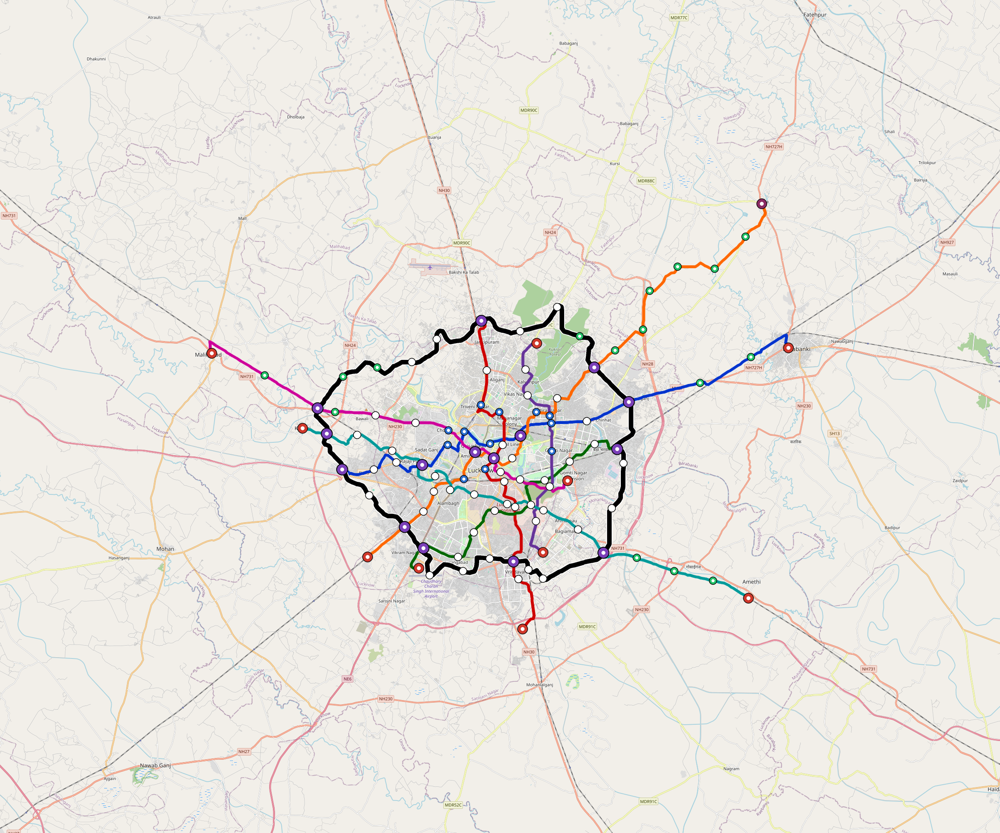

# Lucknow — Urban Rail Network

**Country:** IN · **Population:** 3,500,000 · [National brief](../NATIONAL-BRIEF.md)

This page contains only Lucknow-specific results. Shared routing, service, energy, civil, cost, finance, QA and validation methods are defined once in the [deployment planning reference](../../../../../docs/deployment-planning-reference.md).

> [!IMPORTANT]
> **Foreign-capital advantage:** against the default equivalent foreign-turnkey sensitivity, this local plan avoids **$5.51 bn (85.4%) of external capital** and **$6.78 bn of external interest**. Capital plus saved interest totals **$12.29 bn**. See the common reference for interpretation and limitations.

Auto-planned by the OpenSourceRail design pipeline from the controlled city catalogue, source-locked geospatial inputs and shared templates.

## Network



| Local measure | Value |
|---|---:|
| Lines / unique stations / interchanges | 8 / 117 / 15 |
| Route length | 367.8 km double track |
| Coverage / transfer reachability | 51.2% / 39% |
| Estimated station catchment | 1,792,000 residents |
| Service span / peak headway | 05:30–02:00 / 3 min |
| Fleet | 556 × 6-car `metro-6car` trainsets (502 peak revenue) |
| Peak network throughput | 230,400 passengers/hour |
| Practical service capacity | 2,008,800 passenger-trips/day |
| Annual paid-trip planning range | 366.6–586.6 M |

### Lines

| Line | Length | Stations | Trainsets | Termini |
|---|---:|---:|---:|---|
| line-1 | 48.7 km | 14 | 90 | W Mid ↔ E Outer |
| line-2 | 35.4 km | 12 | 62 | S Mid ↔ N Mid |
| line-3 | 27.1 km | 10 | 50 | SW Mid ↔ E Inner |
| line-4 | 21.9 km | 8 | 40 | S Inner ↔ N Inner |
| line-5 | 54.4 km | 19 | 104 | SW Mid ↔ NE Outer |
| line-6 | 48.4 km | 16 | 94 | SE Outer ↔ W Mid |
| line-7 | 37.6 km | 12 | 73 | SE Inner ↔ W Outer |
| line-8 | 94.2 km | 26 | 43 | NW Mid ↔ W Mid |
| **Total** | **367.8 km** | **117 unique** | **556** | |

## Energy

| Local measure | Value |
|---|---:|
| Scheduled service | 3,488 one-way journeys / 149,129 train-km/day |
| Annual traction demand | 1,410.9 GWh |
| Station/depot PV / storage | 35.0 MW / 240.0 MWh |
| Aggregate charging power | 202.0 MW |
| Dedicated solar plant | 700.6 MW |
| Residual grid/PPA import | 0.0 GWh/yr |
| Worst powered-stop gap | line-5: 23.9 km / 385 kWh |
| Lowest traversal charging margin | line-4: 199 kWh |

## Capital And Funding

| Local CAPEX bucket | Planning value |
|---|---:|
| Civil works | $1.25 bn |
| Stations | $573 M |
| Depots | $8.0 M |
| Rolling stock | $934 M |
| Dedicated solar plant | $560 M |
| Residual train control | $18 M |
| Charging microgrids | $44 M |
| EPC / project services | $198 M |
| **Total city programme** | **$3.58 bn** |

| Local funding measure | Planning value |
|---|---:|
| Imported / external capital | $939 M (26.2%) |
| Domestic / local capital | $2.65 bn (73.8%) |
| Annual public construction commitment | $300 M / yr for 5 years |
| Annual post-grace debt service | $221 M / yr |
| External capital saved vs default turnkey sensitivity | $5.51 bn |
| Capital + lifetime external interest saved | $12.29 bn |
| Annual OPEX | $90 M / yr |

## Local Evidence

| Package | Current status | Evidence |
|---|---|---|
| Finance | pass | [`summary.json`](engineering/finance/summary.json) |
| Native simulation + degraded cases | pass | [`validation-summary.json`](engineering/simulation/validation-summary.json) |
| SUMO timetable | pass | [`summary.json`](engineering/sumo/summary.json) |
| GIS package | pass | [`summary.json`](engineering/gis/summary.json) |
| Grid/charging/solar | pass | [`summary.json`](engineering/energy/summary.json) |
| Operations, QA and maintenance | 1,224 assets / 5,672 tasks | [`lucknow-operations-manifest.json`](operations/lucknow-operations-manifest.json) |

## Local Files And Regeneration

| File | Local role |
|---|---|
| [`design.toml`](design.toml) | Authoritative generated city design |
| [`lucknow.toml`](lucknow.toml) | Expanded simulator scenario |
| [`lucknow.corridor.geojson`](lucknow.corridor.geojson) | GIS corridor and stations |
| [`lucknow.design-quality.yaml`](lucknow.design-quality.yaml) | Coverage, source and civil-quality gates |

```bash
tools/automation/regenerate-city.sh lucknow
```
