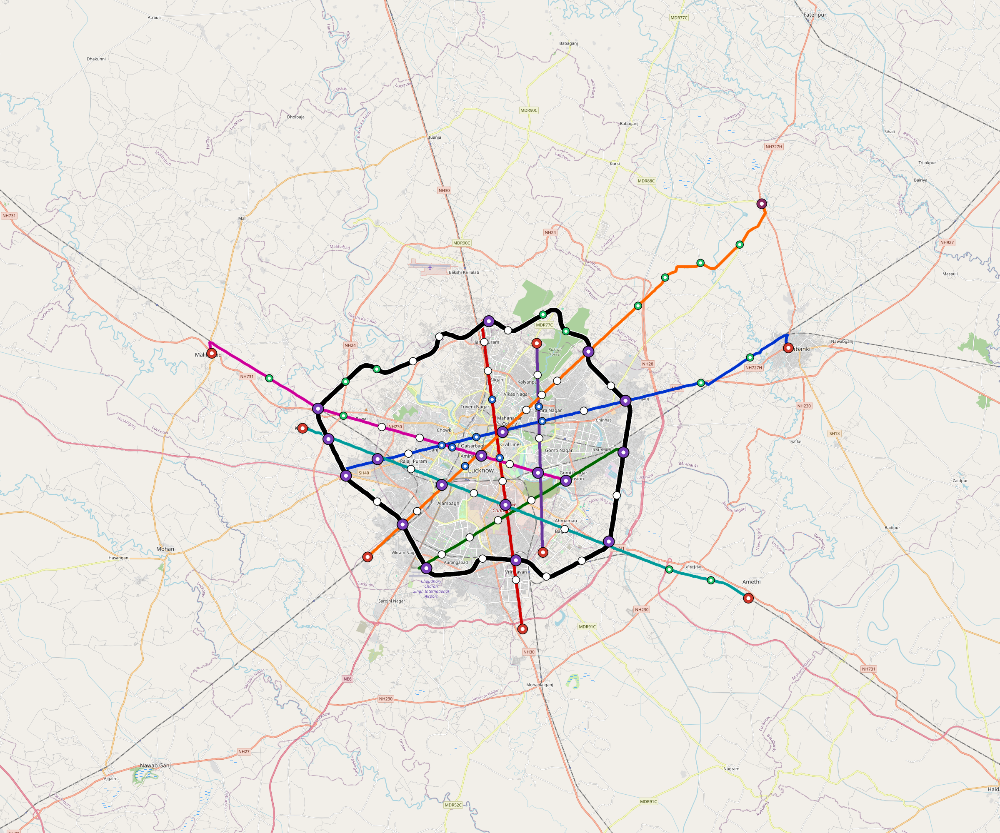

# Lucknow — Urban Rail Network

**Country:** IN · **Population:** 3,500,000 · [National brief](../NATIONAL-BRIEF.md)

This page contains only Lucknow-specific results. Shared routing, service, energy, civil, cost, finance, QA and validation methods are defined once in the [deployment planning reference](../../../../../docs/deployment-planning-reference.md).

> [!IMPORTANT]
> **Foreign-capital advantage:** against the default equivalent foreign-turnkey sensitivity, this local plan avoids **$8.90 bn (87.9%) of external capital** and **$10.94 bn of external interest**. Capital plus saved interest totals **$19.84 bn**. See the common reference for interpretation and limitations.

**Population-led network revision (2026-10-09).** The controlled planning inventory contains **8 lines**, including **0 additional residential lines**. Native population-count evidence is unavailable; resident coverage and population-led additional lines are not invented. These are distance screens, not current census, surveyed walksheds or fare demand. New common corridor cells have identified junction/structure and access design requirements; no track switch or site approval is inferred. Country fleet, depot, civil, energy, staffing and financing models use the regenerated inventory, with installed quotations and operating acceptance still open. [Line additions and priorities](engineering/alignment/residential-line-expansion.json) · [Actual station coverage and source receipts](engineering/alignment/residential-expansion-evaluation.json).

**Current alignment, depot and production basis.** Core corridors change from **304.094 km to 275.616 km**, with elevated land sections, water-aware radial routes and separately engineered bridge candidates at short water crossings. 0 core fragments retain raster geometry for further curve review. The centre is a design-centroid screen; survey, property, obstacles, foundations and geometry releases remain open. All **114 platform points** pass the retained water-mask screen; footprints, bank stability and access remain open. [Alignment controls](engineering/alignment/core-realignment.json) · [Before/after map](engineering/alignment/core-alignment-comparison.png) · [Water screen](engineering/alignment/station-water-screen.json).

**8 line-local depots** provide **508 full-fleet storage slots**, separate from workshop bays. Fleet length and workload set quantities; PV/storage is included once in depot capital. Site acceptance and installed/land/utility quotations remain open. [Depot costs](engineering/line-depots/README.md). The factory requires **508 metro-6car trainsets / 3048 cars**, with **18-month facility readiness**, then qualification and manufacture. Integrated openings wait for fleet readiness where production or test paths constrain them. Shared factory capital is counted once; concurrent national loading and supplier commitments remain open. [Factory and dates](engineering/factory/README.md).

Station staffing uses two posts, two normal eight-hour shifts, plus service-window, leave and training cover. Basic wages start at 1.5 times the retained country income proxy, with higher technical/management grades and employer allowances. [Staff](engineering/delivery/README.md) · [Finance](engineering/finance/summary.json). Finance retains country-specific fixed-price, steady-state assumptions; Baghdad’s indexed cashflows are separate.

Auto-planned by the OpenSourceRail design pipeline from the controlled city catalogue, source-locked geospatial inputs and shared templates. Population is counted once within the union of station circles; this is potential radial access, not a verified walkshed or fare-demand estimate. Reachable line pairs include transfers through intermediate lines. [Population radii, denominator and transfer paths](engineering/access/README.md) · [Viaduct beam, foundation and terrain checks](engineering/clearance/README.md). Capital figures are base planning allowances: route-search scores are excluded from money, while special structures and installed-price gaps remain open. [Cost boundary](../../../../../docs/finance/civil-allowance-boundary.md).

## Network



| Local measure | Value |
|---|---:|
| Lines / unique stations / interchanges | 8 / 114 / 27 |
| Route length | 328.7 km double track |
| Direct transfers / reachable line pairs | 82.1% / 100.0% |
| Residents within 800 m radial station catchments | unavailable — native population evidence required |
| Service span / peak headway | 05:30–02:00 / 3 min |
| Fleet | 508 × 6-car `metro-6car` trainsets (458 peak revenue) |
| Peak network throughput | 230,400 passengers/hour |
| Practical service capacity | 2,008,800 passenger-trips/day |
| Annual paid-trip planning range | 366.6–586.6 M |

### Lines

| Line | Length | Stations | Trainsets | Termini |
|---|---:|---:|---:|---|
| line-1 | 44.4 km | 14 | 80 | W Mid ↔ E Outer |
| line-2 | 26.9 km | 14 | 60 | S Mid ↔ N Mid |
| line-3 | 22.2 km | 9 | 43 | SW Mid ↔ E Mid |
| line-4 | 17.3 km | 8 | 37 | S Inner ↔ N Inner |
| line-5 | 51.2 km | 16 | 94 | SW Mid ↔ NE Outer |
| line-6 | 43.4 km | 15 | 80 | SE Outer ↔ W Mid |
| line-7 | 37.2 km | 13 | 74 | SE Inner ↔ W Outer |
| line-8 | 86.2 km | 25 | 40 | NW Mid ↔ W Mid |
| **Total** | **328.7 km** | **114 unique** | **508** | |

## Energy

| Local measure | Value |
|---|---:|
| Scheduled service | 3,488 one-way journeys / 132,792 train-km/day |
| Annual traction demand | 1,256.3 GWh |
| Station/depot PV / storage | 67.3 MW / 502.0 MWh |
| Aggregate charging power | 196.0 MW |
| Dedicated solar plant | 582.3 MW |
| Residual grid/PPA import | 0.0 GWh/yr |
| Worst powered-stop gap | line-5: 23.6 km / 381 kWh |
| Lowest traversal charging margin | line-1: 226 kWh |

## Capital And Funding

| Local CAPEX bucket | Planning value |
|---|---:|
| Civil works | $3.09 bn |
| Stations | $597 M |
| Depots | $224 M |
| Rolling stock | $853 M |
| Dedicated solar plant | $466 M |
| Residual train control | $16 M |
| Charging microgrids | $40 M |
| EPC / project services | $337 M |
| **Total city programme** | **$5.62 bn** |

| Local funding measure | Planning value |
|---|---:|
| Imported / external capital | $1.22 bn (21.7%) |
| Domestic / local capital | $4.40 bn (78.3%) |
| Annual public construction commitment | $485 M / yr for 5 years |
| Annual post-grace debt service | $348 M / yr |
| External capital saved vs default turnkey sensitivity | $8.90 bn |
| Capital + lifetime external interest saved | $19.84 bn |
| Annual OPEX | $136 M / yr |

## Local Evidence

| Package | Current status | Evidence |
|---|---|---|
| Finance | pass | [`summary.json`](engineering/finance/summary.json) |
| Native simulation + degraded cases | pass | [`validation-summary.json`](engineering/simulation/validation-summary.json) |
| SUMO timetable | pass | [`summary.json`](engineering/sumo/summary.json) |
| Independent OSR/SUMO running-time cross-check | pass; junction/authority gate open | [`operations-crosscheck.md`](engineering/simulation/operations-crosscheck.md) |
| GIS package | pass | [`summary.json`](engineering/gis/summary.json) |
| Solar/storage snapshot (operating duty unverified) | pass; 0 findings; 25 grid-only diagnostics | [`summary.json`](engineering/energy/summary.json) |
| Operations, QA and maintenance | 1,155 assets / 6,615 tasks | [`lucknow-operations-manifest.json`](operations/lucknow-operations-manifest.json) |

## Local Files And Regeneration

| File | Local role |
|---|---|
| [`design.toml`](design.toml) | Authoritative generated city design |
| [`lucknow.toml`](lucknow.toml) | Expanded simulator scenario |
| [`lucknow.corridor.geojson`](lucknow.corridor.geojson) | GIS corridor and stations |
| [`lucknow.design-quality.yaml`](lucknow.design-quality.yaml) | Coverage, source and civil-quality gates |

```bash
tools/automation/regenerate-city.sh lucknow
```
