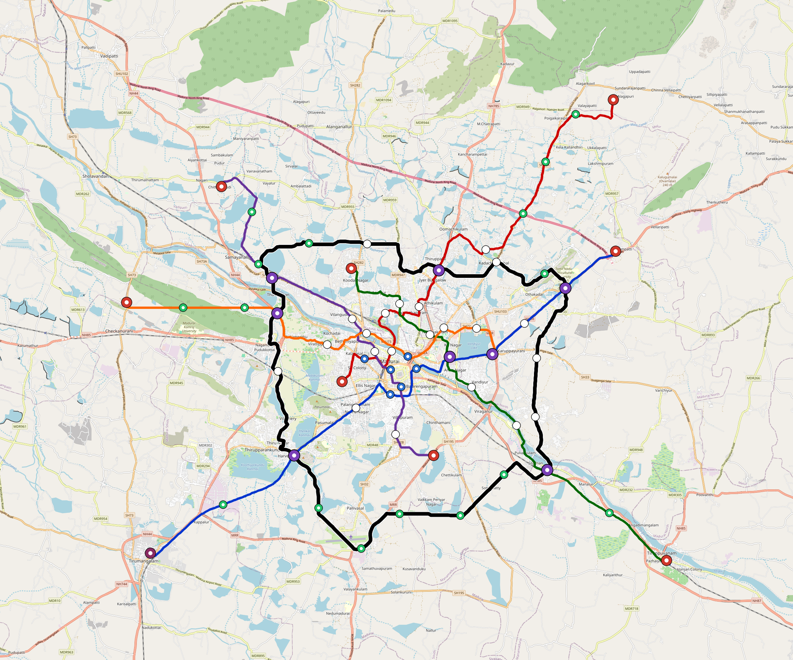

# Madurai — Urban Rail Network

**Country:** IN · **Population:** 1,600,000 · [National brief](../NATIONAL-BRIEF.md)

This page contains only Madurai-specific results. Shared routing, service, energy, civil, cost, finance, QA and validation methods are defined once in the [deployment planning reference](../../../../../docs/deployment-planning-reference.md).

> [!IMPORTANT]
> **Foreign-capital advantage:** against the default equivalent foreign-turnkey sensitivity, this local plan avoids **$2.65 bn (86.3%) of external capital** and **$3.26 bn of external interest**. Capital plus saved interest totals **$5.92 bn**. See the common reference for interpretation and limitations.

Auto-planned by the OpenSourceRail design pipeline from the controlled city catalogue, source-locked geospatial inputs and shared templates.

## Network



| Local measure | Value |
|---|---:|
| Lines / unique stations / interchanges | 6 / 69 / 8 |
| Route length | 224.3 km double track |
| Coverage / transfer reachability | 73.1% / 47% |
| Estimated station catchment | 1,169,600 residents |
| Service span / peak headway | 05:30–02:00 / 3 min |
| Fleet | 268 × 4-car `metro-4car` trainsets (240 peak revenue) |
| Peak network throughput | 115,200 passengers/hour |
| Practical service capacity | 982,080 passenger-trips/day |
| Annual paid-trip planning range | 179.2–286.8 M |

### Lines

| Line | Length | Stations | Trainsets | Termini |
|---|---:|---:|---:|---|
| line-1 | 36.8 km | 11 | 57 | NE Outer ↔ SW Outer |
| line-2 | 33.1 km | 11 | 51 | NE Outer ↔ SW Inner |
| line-3 | 29.6 km | 9 | 46 | NW Inner ↔ SE Outer |
| line-4 | 26.5 km | 10 | 41 | S Mid ↔ NW Outer |
| line-5 | 26.8 km | 10 | 45 | W Outer ↔ E Inner |
| line-6 | 71.4 km | 18 | 28 | NW Mid ↔ NW Mid |
| **Total** | **224.3 km** | **69 unique** | **268** | |

## Energy

| Local measure | Value |
|---|---:|
| Scheduled service | 2,558 one-way journeys / 87,685 train-km/day |
| Annual traction demand | 553.0 GWh |
| Station/depot PV / storage | 20.6 MW / 118.0 MWh |
| Aggregate charging power | 79.5 MW |
| Dedicated solar plant | 339.3 MW |
| Residual grid/PPA import | 0.0 GWh/yr |
| Worst powered-stop gap | line-6: 21.3 km / 213 kWh |
| Lowest traversal charging margin | line-4: 150 kWh |

## Capital And Funding

| Local CAPEX bucket | Planning value |
|---|---:|
| Civil works | $690 M |
| Stations | $317 M |
| Depots | $8.0 M |
| Rolling stock | $300 M |
| Dedicated solar plant | $271 M |
| Residual train control | $11 M |
| Charging microgrids | $17 M |
| EPC / project services | $94 M |
| **Total city programme** | **$1.71 bn** |

| Local funding measure | Planning value |
|---|---:|
| Imported / external capital | $423 M (24.7%) |
| Domestic / local capital | $1.29 bn (75.3%) |
| Annual public construction commitment | $145 M / yr for 5 years |
| Annual post-grace debt service | $105 M / yr |
| External capital saved vs default turnkey sensitivity | $2.65 bn |
| Capital + lifetime external interest saved | $5.92 bn |
| Annual OPEX | $40 M / yr |

## Local Evidence

**Evidence refresh required.** Retained passing results below are unverified.
The strict README generator rejected the evidence: engineering/simulation/validation-summary.json describes scenario SHA-256 b0f221bad610406813b5324d8ec9d91e1207150cb42ae4578c01a5ac8c98bcf7, but madurai.toml is 0ceaf255e3f6fb2d7c1921302df0ab10da031eac05f1afcc9b51eecb810fc99b; rerun and update the validation evidence. This audit view does not accept or replace the retained solver results.

| Package | Current status | Evidence |
|---|---|---|
| Finance | unverified | [`summary.json`](engineering/finance/summary.json) |
| Native simulation + degraded cases | unverified | [`validation-summary.json`](engineering/simulation/validation-summary.json) |
| SUMO timetable | unverified | [`summary.json`](engineering/sumo/summary.json) |
| Independent OSR/SUMO running-time cross-check | unverified; junction/authority gate open | [`operations-crosscheck.md`](engineering/simulation/operations-crosscheck.md) |
| GIS package | unverified | [`summary.json`](engineering/gis/summary.json) |
| Solar/storage snapshot (operating duty unverified) | unverified; 0 findings; 22 grid-only diagnostics | [`summary.json`](engineering/energy/summary.json) |
| Operations, QA and maintenance | 647 assets / 2,893 tasks | [`madurai-operations-manifest.json`](operations/madurai-operations-manifest.json) |

## Local Files And Regeneration

| File | Local role |
|---|---|
| [`design.toml`](design.toml) | Authoritative generated city design |
| [`madurai.toml`](madurai.toml) | Expanded simulator scenario |
| [`madurai.corridor.geojson`](madurai.corridor.geojson) | GIS corridor and stations |
| [`madurai.design-quality.yaml`](madurai.design-quality.yaml) | Coverage, source and civil-quality gates |

```bash
tools/automation/regenerate-city.sh madurai
```
