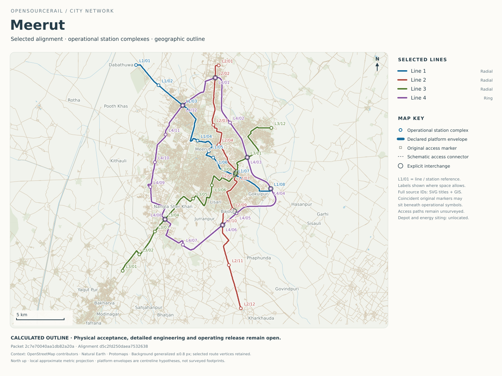

# Meerut — railway design and city programme

**IN · Calculated outline complete · Class C estimates · Physical verification pending**

[City index](../../../README.md) · [National programme](../NATIONAL-BRIEF.md) · [Interactive map](../../../../../docs/workbench/current/index.html?outlineCity=meerut) · [Planning workspace](../../../../../docs/workbench/planning/index.html?city=meerut) · [Methods and assumptions](../../../../../docs/design-engine/city-dossiers/README.md)



[Open full-size map](engineering/outline/network.svg) · [Download GIS bundle](engineering/outline/gis.zip) · [Complete dossier data](engineering/outline/summary.json)

## City and network

This city programme uses its exact selected mapped alignment, vehicle reference, service calculation and cost ledger. Demand, site and unit-rate assumptions support a complete outline for comparison; they do not substitute for surveys, detailed engineering or operational approval.

| Network measure | Current outline |
|---|---|
| Population context | 1,600,000 — retained planning input; not a demand survey |
| Selected alignment | Original |
| Route length / trackways | 149.63 km / 2 trackways |
| Lines / operational platform groups | 4 / 44 |
| Original access markers / separately costed access sites | 50 / 29 |
| Explicit interchange references | 8 |
| Fleet including reserve | 162 six-car trainsets |
| Train distance | 96,958 train-km/day; 35,389,728 /year |
| Service span | 18 h/day, 365 days/year; clock timetable not yet assigned |
| Peak demand brief | 4,000 passengers/h/direction per line — assumed, not additive network ridership |
| Planning occupancy / availability | 85% / 99% — assumptions |

Operational platform groups are counted per line. Interchange access sites and original markers are separate quantities; none is silently treated as a unique city-wide station count. Catchment and access scenarios are described below; authenticated population coverage and demand forecasts remain open.

### Lines, service and fleet

| Line | Route km | Platform groups | Headway s | One-way / circuit min | Active + reserve | Usable pphpd | Mapped termini |
|---|---|---|---|---|---|---|---|
| line-1 | 27.38 | 8 | 200 | 36.2 | 24 + 4 | 4,181 | NW terminal ↔ SE terminal |
| line-2 | 32.10 | 12 | 200 | 63.4 | 40 + 6 | 4,181 | N terminal ↔ S terminal |
| line-3 | 33.05 | 12 | 200 | 46.6 | 30 + 5 | 4,181 | SW terminal ↔ E terminal |
| line-4 | 57.11 | 12 | 200 | 74.5 | 46 + 7 | 4,181 | Ring / closed circuit |

Compass termini describe mapped endpoint positions relative to the network centre; official station names require local planning. The six-car reference provides 276 normal passenger places, including wheelchair places, with no planned standing. Headway is a calculated service choice. Journey times are conditional calculations; protected signalling timetables and actual available thrust remain separate work.

[Line details and energy](engineering/outline/lines.csv) · [Station and access register](engineering/outline/stations.csv)

### Connections and access

Declared transfer graph: 1 connected line group(s): line-1, line-2, line-3, line-4. These are explicit planned connections; walking paths and accessible interchange layouts are not yet surveyed.

<details><summary>Access and catchment assumptions</summary>

Geometric access scenarios are separate from measured population coverage. Full assumptions and outputs are in the dossier data.

| Radius m | Straight line walk minutes | Station circle area sum km2 | Overlaps removed | Population coverage |
|---|---|---|---|---|
| 400.00 | 6.67 | 22.12 | False | Unestablished |
| 800.00 | 13.33 | 88.47 | False | Unestablished |

</details>

## Energy and propulsion

| Energy measure | Daily | Annual |
|---|---|---|
| Mechanical traction work | 343,418 kWh mechanical | 125.35 GWh mechanical |
| Nominal auxiliary load | 529,200 kWh | 193.16 GWh |
| Auxiliary supply including scenario charging losses | 557,053 kWh | 203.32 GWh |
| Reserve-fleet auxiliary supply scenario | See annual budget | 3.20 GWh |
| Total priced grid-supply scenario | See annual budget | 363.88 GWh |
| Physically supported total grid demand | Unestablished | Unestablished |

| Annual electricity budget | Low | Base | High |
|---|---|---|---|
| Priced supply/efficiency scenario | $23.33m | $60.25m | $180.68m |

Mechanical work is distinct from electricity purchased. The monetary electricity scenarios include declared efficiency and site-load assumptions; they do not establish a measured motor map, solar plant, storage installation or self-sufficient energy supply. Each line retains its candidate-specific launch, braking and recovery requirements in the complete record.

| Line | Propulsion research concept | Additional traction mass / car | Additional reserve / car |
|---|---|---|---|
| line-1 | Powered axle continuous research | 1,000 kg | 250 kg |
| line-2 | Station launch reference | 0 kg | 250 kg |
| line-3 | Powered axle continuous research | 1,000 kg | 250 kg |
| line-4 | Powered axle continuous research | 1,000 kg | 250 kg |

The city research configuration is separate from the selected passive reference vehicle. Onboard-traction comparisons carry their own additional mass and cost assumptions; they do not silently change that reference or establish complete installed equipment.

| Line | Motors/car / rated kW per car | Continuous feed | Required train force | Required mechanical peak | Station-fin comparison envelope | Actual force map |
|---|---|---|---|---|---|---|
| line-1 | 4 / 749.2 kW | 27.38 km | 162.9 kN | 3.26 MW | Other interface | Unestablished |
| line-2 | 0 / 0.0 kW | 0.00 km | 156.1 kN | 3.12 MW | 316.5 m | Unestablished |
| line-3 | 4 / 749.2 kW | 33.05 km | 162.9 kN | 3.26 MW | Other interface | Unestablished |
| line-4 | 4 / 749.2 kW | 57.11 km | 162.9 kN | 3.26 MW | Other interface | Unestablished |

These are declared requirements and equipment hypotheses, not measured motor capability. A station-launch row retains an unselected wayside mechanism and priced equipment provision. The station-fin comparison envelope does not prescribe installed motor length or apply to an onboard-traction interface. Independent friction braking, collector/electrical protection and protected recovery remain required for every concept.

### Why some lines use a research alternative

The table retains the rejected station-only reference screen. An alternative is selected for conditional outline calculation where that reference cannot meet the declared leg; this does not prove every station-powered design impossible or qualify the replacement hardware.

| Line | Affected reference legs | Necessary-bound failure | Longest affected leg | Reference flat coast reach |
|---|---|---|---|---|
| line-1 | 1 | Coast stops before receiving zone | 6,351.0 m | 5,554.5 m |
| line-3 | 1 | Coast stops before receiving zone | 6,847.3 m | 5,554.5 m |
| line-4 | 4 | Coast stops before receiving zone | 6,391.4 m | 5,554.5 m |

## Civil works, depot and manufacture

| Quantity / resource | Calculated requirement |
|---|---|
| At grade route | 10.34 km |
| Bridge route | 3.83 km |
| Elevated route | 135.46 km |
| Tunnel route | 0.00 km |
| Precast span stock | 14,248 spans |
| Independent supports | 14,428 |
| Running rail | 609.07 rail-km / 36,672 t |
| Complete fastening sets | 1,065,868 |
| Protected at-grade crossing packages | 43 |
| Bridge runs / tunnel portals | 20 / 0 |
| Additional station track | 5,280 m |
| Access connector allowance | 433.2 m; actual accessible paths require survey |
| Pooled depot area | 113,880 m²; location and line connections require a site plan |
| Factory / civil working pattern | 2 / 2 shifts/day |

Civil classes and quantities follow the mapped scenario. Foundation capacities, bearings, erection stability, river crossings, utilities and ground conditions require site-specific design. The depot allowance includes pooled storage/workshop scope and budgeted connections; it does not identify an acquired or physically connected depot site.

### Factory capacity and make/buy

| Factory investment | Low | Base | High |
|---|---|---|---|
| Vehicle equipment, tooling and premises | $791,298 | $3.06m | $17.06m |
| Civil production campaign | $4.38m | $21.00m | $124.09m |

Factory capital is already included in the city capital ledger. It must not be added a second time. Make/buy comparisons use committed city volume, equipment/tooling, material, labour, yield and productive capacity; no speculative future-city discount is assumed.

| Component / process | Provisional route |
|---|---|
| located-stock/passive-bogie-pair/steel | buy |
| located-stock/passive-secondary/aluminium | buy |
| located-stock/retained-comfort/body/composite | buy |
| located-stock/retained-comfort/body/generic | make |
| located-stock/retained-comfort/doors/generic | Unestablished |
| located-stock/retained-comfort/glazing/generic | Unestablished |
| located-stock/retained-comfort/seating/generic | Unestablished |
| located-stock/wheel-underframe/aluminium | make |
| unlocated-account/attachments | Unestablished |
| unlocated-account/passive-bogie-pair | Unestablished |
| unlocated-account/retained-comfort/HVAC | Unestablished |
| unlocated-account/retained-comfort/body | buy |
| unlocated-account/retained-comfort/doors | Unestablished |
| unlocated-account/retained-comfort/frame-joints | Unestablished |
| unlocated-account/retained-comfort/glazing | Unestablished |
| unlocated-account/retained-comfort/seating | Unestablished |
| unlocated-account/roof-thermal | Unestablished |
| unlocated-account/services | Unestablished |
| six-car-final-vehicle-assembly | Unestablished |
| reference-factory-to-assembly-delivery | Unestablished |

| Precast case | Selected route | Parallel cells | Required cell-hours | Productive person-hours | Paid person-hours |
|---|---|---|---|---|---|
| low | make | 6 | 49,868 | 370,448 | 493,931 |
| base | make | 14 | 121,108 | 968,864 | 1,291,819 |
| high | make | 37 | 327,704 | 2,678,624 | 3,571,499 |

[Complete manufacturing routes and comparisons](engineering/outline/make_buy.csv) · [Quantities and delivery requirements](engineering/outline/delivery_requirements.csv) · [Vehicle, station and civil 3D models](../../../../../docs/engineering-models/README.md)

## Workforce and construction programme

Production and civil works use two shifts. The operating case uses 18 service hours/day and a 2-shift planning convention; named-worker rosters, shift lengths, relief and local employment requirements need an approved calendar. Extended operation can require three shifts.

| Domain / case | Covered positions per shift | Two-shift people floor | Paid person-hours | Paid FTE equivalent |
|---|---|---|---|---|
| Control room and access-site coverage / low | 31 | Unestablished | 224,037 | 112.0 |
| Vehicle production / low | 23 | 46 | Unestablished | Unestablished |
| Civil field / low | 52 | 104 | 533,845 | Unestablished |
| Civil other installation / low | 320 | 640 | 3,318,412 | Unestablished |
| Civil precast / low | 48 | 96 | 493,931 | Unestablished |
| Control room and access-site coverage / base | 62 | Unestablished | 509,175 | 254.6 |
| Vehicle production / base | 65 | 130 | Unestablished | Unestablished |
| Civil field / base | 191 | 382 | 1,677,525 | Unestablished |
| Civil other installation / base | 2,119 | 4,238 | 18,640,391 | Unestablished |
| Civil precast / base | 112 | 224 | 1,291,819 | Unestablished |
| Control room and access-site coverage / high | 124 | Unestablished | 1,222,020 | 611.0 |
| Vehicle production / high | 178 | 356 | Unestablished | Unestablished |
| Civil field / high | 831 | 1,662 | 4,650,709 | Unestablished |
| Civil other installation / high | 20,083 | 40,166 | 112,462,725 | Unestablished |
| Civil precast / high | 296 | 592 | 3,571,499 | Unestablished |

Paid FTE is a budgeting convention, distinct from simultaneous posts and named employees. Source labour and relief are already in the priced model; this staffing view does not add another payroll charge.

| Function / skills | Base coverage posts | Paid FTE | Authority / staffing boundary |
|---|---|---|---|
| Control room / dispatch / response | 4 | 16.4 | Source control/access coverage; operations authority requires separate assurance |
| Station and access-site service | 58 | 238.2 | Source access coverage; accessible assistance and local duties require roster design |
| Vehicle workshop / electrical / brakes | Unestablished | Unestablished | Maintenance budget envelope exists; detailed roles, competence and productive hours require routing |
| Civil infrastructure / track / inspections | Unestablished | Unestablished | Maintenance scope exists; inspection tasks and geographic workload require a site plan |
| Station power / propulsion / controls | Unestablished | Unestablished | Qualified equipment-specific maintenance and protection work |
| Cleaning / security / passenger emergencies | Unestablished | Unestablished | Site/service responsibilities and employee/contractor allocation remain to be sized |
| Programme management / procurement / finance / HR | Unestablished | Unestablished | Business entity, reporting lines and operating overhead allocation require review |
| Training / competence / independent assurance | Unestablished | Unestablished | Independent release authority and competence records remain mandatory |

**Staffing boundary:** the operations rows size control-room and access-site coverage only. They are not the complete operating company. Unallocated maintenance/support functions have budget envelopes or open allocation; their unknown FTE is not zero. No recruitment or complete-organisation claim follows from this table.

The provisional delivery sequence is: Survey and site investigation → Detailed design and independent review → Factory setup and procurement → Foundation and civil production → Transport and installation → Power controls and access installation → Integration testing and release. Factories, field crews and access must be checked together. Aggregate resource envelopes are distinct from resource-levelled, site-approved construction schedules.

[Workforce cases](engineering/outline/workforce.csv) · [Production and construction requirements](engineering/outline/delivery_requirements.csv)

## Capital, operating costs and whole-life economics

| Programme estimate | Low | Base | High |
|---|---|---|---|
| Installed capital | $667.90m | $2.307bn | $13.564bn |
| Installed capital / route-km | $4.46m | $15.42m | $90.65m |
| 30-year whole-life NPV | $1.344bn | $4.666bn | $26.372bn |
| Annual operating provision | $31.83m | $105.38m | $537.97m |

US dollars, 4% real discount rate, 30-year horizon. Low/base/high are assumption cases, not statistical confidence intervals. Transferred sourcing and construction rates require local calibration.

| Scope | Installed capital · base | Whole-life NPV · base |
|---|---|---|
| Rolling stock | $500.89m | $500.89m |
| Guideway | $214.33m | $214.33m |
| Stations power | $386.34m | $386.34m |
| Factory tooling | $24.06m | $24.06m |
| Construction | $979.80m | $979.80m |
| Land utilities depot | $139.30m | $139.30m |
| Fleet | $46.15m | $46.15m |
| Energy | $0 | $1.042bn |
| Operations | $0 | $68.88m |
| Maintenance | $0 | $643.71m |
| Renewals | $0 | $514.78m |
| Recovery | $16.56m | $33.73m |
| Reliability | $0 | $50.66m |
| Disposal | $0 | $21.34m |

[Full capital and lifecycle ledger](engineering/outline/costs.csv)

### Price inputs and confidence

These are calculated v0.6-derived outline prices. Country-specific demand, ground conditions, local contracts and supplier quotations are not established by this calculation. The price includes the declared mixed propulsion research configurations shown above; it is not a quotation for an already proven station-powered railway.

| Operating input | Low | Base | High |
|---|---|---|---|
| Electricity · US$/kWh | 0.066 | 0.166 | 0.464 |
| Loaded operating wage · US$/paid hour | 6.21 | 7.82 | 10.93 |

Input status: transferred-reference-estimates. Scoped local tariff/wage overrides can replace those accounts; they do not apply a blanket discount to imported equipment or civil quantities. Reserve-fleet auxiliary consumption and charging losses are included in the electricity budget.

| Largest capital allowance | Base estimate | Share of capital |
|---|---|---|
| City project risk contingency | $461.48m | 20.0% |
| Network delivered assembled fleet | $394.71m | 17.1% |
| Design prototypes independent review | $136.38m | 5.9% |
| Bridge special foundations deck temporary | $111.75m | 4.8% |
| Repeat box beams | $104.85m | 4.5% |

[Annual energy budget](engineering/outline/energy_budget.csv) · [Local operating inputs](engineering/outline/local_cost_inputs.csv)

### Civil classification comparison

The headline retains the mapped civil allowances. A separate alternative uses the retained WorldCover/OSM water evidence to distinguish water crossings from other bridge allowances. Dry land does not establish that a bridge is unnecessary: roads, utilities, clearances and ground conditions remain unsurveyed.

| Same-route, same-service estimate | Low | Base | High |
|---|---|---|---|
| Headline installed capital | $667.90m | $2.307bn | $13.564bn |
| Water-evidence alternative capital | $648.39m | $2.194bn | $12.641bn |
| Alternative capital / route-km | $4.33m | $14.66m | $84.49m |
| Alternative whole-life NPV | $1.325bn | $4.551bn | $25.427bn |
| Included non-water obstruction reserve | $256,237 | $1.71m | $11.96m |

3.42 km of legacy bridge allowance is represented as elevated construction plus an explicit obstruction reserve in this alternative. 1 water/civil interface holds require investigation. The reserve is a provisional estimate, not evidence that the crossing work is fully sized. Historical evidence revision: `a0389044828f`. This comparison does not select a new alignment, civil design or physical baseline.

### Passenger receipts and funding scenarios

The following sensitivities use explicitly assumed daily demand profiles, average trip length, transfers, paid-trip collection and fares. They are calculated planning scenarios, not surveyed ridership or an approved financing plan. Import origin and financing source are distinct: no local/import share or foreign-turnkey saving is asserted without an evidenced procurement allocation.

| Demand sensitivity | Assumed annual paid trips | Fare US$ | Annual receipts | Operating balance | 30-year receipts less costs NPV | Post-grace DSCR |
|---|---|---|---|---|---|---|
| 50% | 43.12m | 0.25 | $10.78m | $-94.60m | $-4.479bn | -0.63 |
| 50% | 43.12m | 0.50 | $21.56m | $-83.82m | $-4.293bn | -0.56 |
| 50% | 43.12m | 1.00 | $43.12m | $-62.26m | $-3.920bn | -0.42 |
| 75% | 64.67m | 0.25 | $16.17m | $-89.21m | $-4.386bn | -0.60 |
| 75% | 64.67m | 0.50 | $32.34m | $-73.04m | $-4.107bn | -0.49 |
| 75% | 64.67m | 1.00 | $64.67m | $-40.70m | $-3.547bn | -0.27 |
| 100% | 86.23m | 0.25 | $21.56m | $-83.82m | $-4.293bn | -0.56 |
| 100% | 86.23m | 0.50 | $43.12m | $-62.26m | $-3.920bn | -0.42 |
| 100% | 86.23m | 1.00 | $86.23m | $-19.15m | $-3.175bn | -0.13 |

This table holds the engineering cost case at **base** and varies demand and fare. A negative balance is retained as a financing/design warning. Operating balance excludes scheduled renewal capital and debt service; the whole-life NPV column uses the complete unfinanced cost.

| Demand hypothesis | Value |
|---|---|
| Counter-direction peak fraction | 60% |
| Mean section / peak section loading | 50% |
| Average trip / line length | 35% |
| Boardings per linked trip | 1.25 |
| Paid collection fraction | 95% |
| Daily profile | 22.2% of hours at 100% peak flow; 44.4% of hours at 45% peak flow; 33.3% of hours at 15% peak flow |

**Illustrative funding overlay:** 70% financed, 4% real annual interest, 20 years including 3 years without payments and with capitalised interest. The model draws the entire loan at year zero; a real construction draw schedule requires its own dated plan. DSCR compares annual receipts less operating provision with level post-grace debt service; no lender acceptance is implied.

| Cost case | Illustrative loan principal | Equity / grant requirement | Post-grace annual debt service |
|---|---|---|---|
| low | $467.53m | $200.37m | $43.23m |
| base | $1.615bn | $692.22m | $149.34m |
| high | $9.495bn | $4.069bn | $877.93m |

[All demand, fare and funding sensitivities](engineering/outline/finance.csv). Assumptions, cost-covering fares and financing treatment are in [the complete dossier](engineering/outline/summary.json). Funding charges are separate from the canonical unfinanced engineering cost; a loan scenario does not change the railway capital ledger.

## Site, engineering and delivery evidence

| Work package | Current basis | Next evidence / action |
|---|---|---|
| Network and alignment | Mapped selected proposal and explicit interchange references | Survey alignment, land/access, gradients, clearances and crossing interfaces |
| Demand and accessibility | Declared peak-flow brief and outline passenger configuration | Local OD/demand validation, station naming, accessible walking and evacuation layouts |
| Ground, flood and utilities | Mapped civil classes and bounded site allowances | Survey control, utility records, geotechnical investigation, flood/drainage and foundation design |
| Vehicle and civil structure | Identified reference parts, mass allowances and priced quantities | Installed mass/CG, joints, fatigue, stability, bearings, moving loads and erection checks |
| Propulsion, energy and braking | Conditional force/energy/service model | Achievable force/thermal maps, independent braking, protected recovery and degraded journeys |
| Manufacturing and workforce | Calculated make/buy, tooling, shifts and resource envelopes | Detailed routing, QA, crew/workstation calendar, supplier confirmation and trial production |
| Business execution | Candidate-bound disabled procurement/BOM/HR drafts | Target-system schema validation, reviewed masters, permissions and approved release |

Outline completion is recorded positively. Physical engineering, prototype validation, procurement approval, manufacturing release and movement authority remain separate. [Candidate-bound physical evidence record](engineering/current/README.md).

## Files and reproduction

| File | Contents |
|---|---|
| [Summary](engineering/outline/summary.json) | Complete calculation-linked dossier and scenario policy |
| [Map](engineering/outline/network.svg) | Selected network over verified geographic context |
| [Lines](engineering/outline/lines.csv) / [stations](engineering/outline/stations.csv) | Service, fleet, section/stop/access references |
| [GIS bundle](engineering/outline/gis.zip) | Eight GeoJSON layers: routes, platforms, stations, original markers, interchanges, connectors, civil classes and unlocated requirements |
| [Costs](engineering/outline/costs.csv) / [finance](engineering/outline/finance.csv) | Canonical budgets and separate passenger/funding sensitivities |
| [Workforce](engineering/outline/workforce.csv) / [make-buy](engineering/outline/make_buy.csv) | Shift, resource and production comparisons |
| [Delivery requirements](engineering/outline/delivery_requirements.csv) | Provisional phase/resource and site tasks |
| [Delivery and business drafts](engineering/outline/delivery-draft.json.gz) | Source-bound procurement packages, provisional BOM/routing and disabled ERPNext/Frappe HR records |
| [Source identities](engineering/outline/manifest.json) | Presentation, atlas, outline, physical candidate and output hashes |
| [Current outline record](../../../../../docs/design-engine/city-atlas/cities/meerut.json.gz) | Same-candidate service, costs and selected geometry |
| [Geographic source](city.json) / [context](map-context.json.gz) | Planning inputs and attribution |

```sh
python -m engineering.city_reports.publication publish
python -m engineering.city_reports.publication verify
```

A recalculated local study can be opened, edited and exported in the Workbench. The published city page remains bound to the selected published outline until regenerated.

[Earlier city source dossier](https://github.com/modernecotech/OpenSourceRail/tree/205e8dc158c83fcdc2dca9ceb8bad0a7e8b3f61e/cities/catalogue/south-asia/India/Meerut) preserves the former reports and downloads under their own vehicle, energy and finance assumptions. Those results are not used as current evidence.

<details><summary>Candidate and calculation identities</summary>

| Identity | Value |
|---|---|
| city_input_id | `e97aa9aba46e05f8815c12206222489e0f2a8da1f92a90a142322e513a1eee67` |
| cost_evaluation_id | `d47735ab03e810fc8abdf7f85c89d29ef30538f56fd779240c189580f30e1e5d` |
| outline_evaluation_id | `8f488b8512be970934853b1c6dcdb523bac65f176d961f84b0fe5b7034982be9` |
| research_configuration_id | `dcee26dcba8819a10d63d94e4133d3bf35fd3d6a14fa5ce15506ec6b2d3e4477` |
| seed_id | `22934a56be7a403bd9aba20dbd47b6d52da44c9272f95c01024792bd839404b8` |
| selected_alignment_id | `d5c2fd250daea75326384d88628b124006740c7b6eabdac3c320b3ea89244cba` |
| selected_alignment_kind | `original` |
| selection_id | `e56fd43277b64a1c40a30bc2f6c04b74498263b6e3945a6889b01af6f4394803` |
| service_evaluation_id | `25741104088c1f90ac49659ae74aff989c3ab4ba9100f27265fbed003889ca0a` |
| source_result_sha256 | `6de3d300ba959c660a3d12e68c8f2906302dca07681e265b9bc38e945c5301de` |

Atlas packet `d949264776ac59285ddc8393965d4f1290927fffa3d55b8e8027a5d60b4c8e8c`. Physical reference `756a68870162f7559b052b05c9b201728c9f448e3bb61114f287848c02f2d3a3`.

</details>

[Project introduction](../../../../../README.md) · [Current engineering](../../../../../docs/design-engine/current/README.md)
