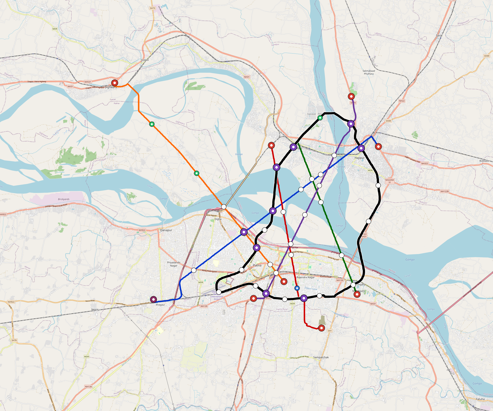

# Patna — Urban Rail Network

**Country:** IN · **Population:** 2,520,000 · [National brief](../NATIONAL-BRIEF.md)

This page contains only Patna-specific results. Shared routing, service, energy, civil, cost, finance, QA and validation methods are defined once in the [deployment planning reference](../../../../../docs/deployment-planning-reference.md).

> [!IMPORTANT]
> **Foreign-capital advantage:** against the default equivalent foreign-turnkey sensitivity, this local plan avoids **$11.52 bn (88.8%) of external capital** and **$14.16 bn of external interest**. Capital plus saved interest totals **$25.68 bn**. See the common reference for interpretation and limitations.

**Current alignment, depot and production basis.** Core corridors change from **133.021 km to 291.054 km**, with elevated land sections, water-aware radial routes and separately engineered bridge candidates at short water crossings. 0 core fragments retain raster geometry for further curve review. The centre is a design-centroid screen; survey, property, obstacles, foundations and geometry releases remain open. All **242 platform points** pass the retained water-mask screen; footprints, bank stability and access remain open. [Alignment controls](engineering/alignment/core-realignment.json) · [Before/after map](engineering/alignment/core-alignment-comparison.png) · [Water screen](engineering/alignment/station-water-screen.json).

**6 line-local depots** provide **618 full-fleet storage slots**, separate from workshop bays. Fleet length and workload set quantities; PV/storage is included once in depot capital. Site acceptance and installed/land/utility quotations remain open. [Depot costs](engineering/line-depots/README.md). The factory requires **618 metro-4car trainsets / 2472 cars**, with **18-month facility readiness**, then qualification and manufacture. Integrated openings wait for fleet readiness where production or test paths constrain them. Shared factory capital is counted once; concurrent national loading and supplier commitments remain open. [Factory and dates](engineering/factory/README.md).

Station staffing uses two posts, two normal eight-hour shifts, plus service-window, leave and training cover. Basic wages start at 1.5 times the retained country income proxy, with higher technical/management grades and employer allowances. [Staff](engineering/delivery/README.md) · [Finance](engineering/finance/summary.json). Finance retains country-specific fixed-price, steady-state assumptions; Baghdad’s indexed cashflows are separate.

Auto-planned by the OpenSourceRail design pipeline from the controlled city catalogue, source-locked geospatial inputs and shared templates. Population is counted once within the union of station circles; this is potential radial access, not a verified walkshed or fare-demand estimate. Reachable line pairs include transfers through intermediate lines. [Population radii, denominator and transfer paths](engineering/access/README.md) · [Viaduct beam, foundation and terrain checks](engineering/clearance/README.md). Capital figures are base planning allowances: route-search scores are excluded from money, while special structures and installed-price gaps remain open. [Cost boundary](../../../../../docs/finance/civil-allowance-boundary.md).

## Network



| Local measure | Value |
|---|---:|
| Lines / unique stations / interchanges | 6 / 242 / 17 |
| Route length | 332.9 km double track |
| Direct transfers / reachable line pairs | 100.0% / 100.0% |
| Residents within 800 m radial station catchments | unavailable — native population evidence required |
| Service span / peak headway | 05:30–02:00 / 3 min |
| Fleet | 618 × 4-car `metro-4car` trainsets (559 peak revenue) |
| Peak network throughput | 115,200 passengers/hour |
| Practical service capacity | 982,080 passenger-trips/day |
| Annual paid-trip planning range | 179.2–286.8 M |

### Lines

| Line | Length | Stations | Trainsets | Termini |
|---|---:|---:|---:|---|
| line-1 | 57.6 km | 49 | 153 | NE Mid ↔ SW Outer |
| line-2 | 40.7 km | 42 | 126 | S Mid ↔ N Inner |
| line-3 | 39.4 km | 28 | 94 | N Mid ↔ SE Mid |
| line-4 | 52.9 km | 39 | 128 | NE Mid ↔ S Mid |
| line-5 | 29.2 km | 15 | 56 | S Mid ↔ NW Outer |
| line-6 | 113.2 km | 69 | 61 | NE Mid ↔ NE Mid |
| **Total** | **332.9 km** | **242 unique** | **618** | |

## Energy

| Local measure | Value |
|---|---:|
| Scheduled service | 2,558 one-way journeys / 128,501 train-km/day |
| Annual traction demand | 810.5 GWh |
| Station/depot PV / storage | 99.6 MW / 588.0 MWh |
| Aggregate charging power | 357.0 MW |
| Dedicated solar plant | 417.5 MW |
| Residual grid/PPA import | 0.0 GWh/yr |
| Worst powered-stop gap | line-5: 13.6 km / 136 kWh |
| Lowest traversal charging margin | line-5: 365 kWh |

## Capital And Funding

| Local CAPEX bucket | Planning value |
|---|---:|
| Civil works | $3.60 bn |
| Stations | $1.85 bn |
| Depots | $190 M |
| Rolling stock | $692 M |
| Dedicated solar plant | $334 M |
| Residual train control | $17 M |
| Charging microgrids | $73 M |
| EPC / project services | $450 M |
| **Total city programme** | **$7.21 bn** |

| Local funding measure | Planning value |
|---|---:|
| Imported / external capital | $1.46 bn (20.2%) |
| Domestic / local capital | $5.75 bn (79.8%) |
| Annual public construction commitment | $627 M / yr for 5 years |
| Annual post-grace debt service | $447 M / yr |
| External capital saved vs default turnkey sensitivity | $11.52 bn |
| Capital + lifetime external interest saved | $25.68 bn |
| Annual OPEX | $170 M / yr |

## Local Evidence

| Package | Current status | Evidence |
|---|---|---|
| Finance | pass | [`summary.json`](engineering/finance/summary.json) |
| Native simulation + degraded cases | pass | [`validation-summary.json`](engineering/simulation/validation-summary.json) |
| SUMO timetable | pass | [`summary.json`](engineering/sumo/summary.json) |
| Independent OSR/SUMO running-time cross-check | pass; junction/authority gate open | [`operations-crosscheck.md`](engineering/simulation/operations-crosscheck.md) |
| GIS package | pass | [`summary.json`](engineering/gis/summary.json) |
| Solar/storage snapshot (operating duty unverified) | pass; 0 findings; 11 grid-only diagnostics | [`summary.json`](engineering/energy/summary.json) |
| Operations, QA and maintenance | 1,928 assets / 9,975 tasks | [`patna-operations-manifest.json`](operations/patna-operations-manifest.json) |

## Local Files And Regeneration

| File | Local role |
|---|---|
| [`design.toml`](design.toml) | Authoritative generated city design |
| [`patna.toml`](patna.toml) | Expanded simulator scenario |
| [`patna.corridor.geojson`](patna.corridor.geojson) | GIS corridor and stations |
| [`patna.design-quality.yaml`](patna.design-quality.yaml) | Coverage, source and civil-quality gates |

```bash
tools/automation/regenerate-city.sh patna
```
