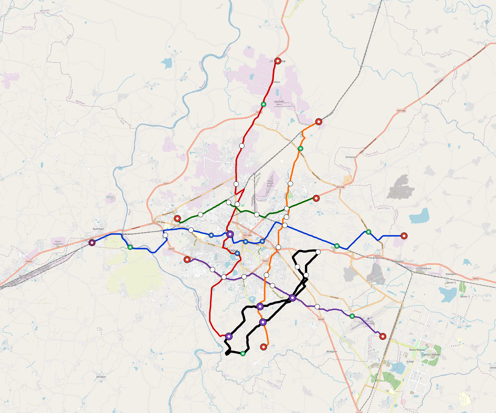

# Raipur — Urban Rail Network

**Country:** IN · **Population:** 1,500,000 · [National brief](../NATIONAL-BRIEF.md)

This page contains only Raipur-specific results. Shared routing, service, energy, civil, cost, finance, QA and validation methods are defined once in the [deployment planning reference](../../../../../docs/deployment-planning-reference.md).

> [!IMPORTANT]
> **Foreign-capital advantage:** against the default equivalent foreign-turnkey sensitivity, this local plan avoids **$1.96 bn (86.1%) of external capital** and **$2.42 bn of external interest**. Capital plus saved interest totals **$4.38 bn**. See the common reference for interpretation and limitations.

Auto-planned by the OpenSourceRail design pipeline from the controlled city catalogue, source-locked geospatial inputs and shared templates.

## Network



| Local measure | Value |
|---|---:|
| Lines / unique stations / interchanges | 6 / 53 / 5 |
| Route length | 155.7 km double track |
| Coverage / transfer reachability | 52.3% / 27% |
| Estimated station catchment | 784,500 residents |
| Service span / peak headway | 05:30–02:00 / 3 min |
| Fleet | 212 × 4-car `metro-4car` trainsets (189 peak revenue) |
| Peak network throughput | 115,200 passengers/hour |
| Practical service capacity | 982,080 passenger-trips/day |
| Annual paid-trip planning range | 179.2–286.8 M |

### Lines

| Line | Length | Stations | Trainsets | Termini |
|---|---:|---:|---:|---|
| line-1 | 34.5 km | 12 | 54 | E Outer ↔ W Outer |
| line-2 | 31.7 km | 9 | 48 | S Mid ↔ N Outer |
| line-3 | 14.6 km | 6 | 25 | NE Mid ↔ W Mid |
| line-4 | 20.6 km | 8 | 34 | SE Outer ↔ W Mid |
| line-5 | 23.7 km | 9 | 38 | NE Outer ↔ S Mid |
| line-6 | 30.5 km | 9 | 13 | E Inner ↔ SE Inner |
| **Total** | **155.7 km** | **53 unique** | **212** | |

## Energy

| Local measure | Value |
|---|---:|
| Scheduled service | 2,558 one-way journeys / 65,301 train-km/day |
| Annual traction demand | 411.9 GWh |
| Station/depot PV / storage | 18.5 MW / 107.5 MWh |
| Aggregate charging power | 69.0 MW |
| Dedicated solar plant | 249.1 MW |
| Residual grid/PPA import | 0.0 GWh/yr |
| Worst powered-stop gap | line-1: 12.2 km / 122 kWh |
| Lowest traversal charging margin | line-6: 155 kWh |

## Capital And Funding

| Local CAPEX bucket | Planning value |
|---|---:|
| Civil works | $487 M |
| Stations | $243 M |
| Depots | $8.0 M |
| Rolling stock | $237 M |
| Dedicated solar plant | $199 M |
| Residual train control | $7.8 M |
| Charging microgrids | $15 M |
| EPC / project services | $70 M |
| **Total city programme** | **$1.27 bn** |

| Local funding measure | Planning value |
|---|---:|
| Imported / external capital | $317 M (25.0%) |
| Domestic / local capital | $951 M (75.0%) |
| Annual public construction commitment | $107 M / yr for 5 years |
| Annual post-grace debt service | $78 M / yr |
| External capital saved vs default turnkey sensitivity | $1.96 bn |
| Capital + lifetime external interest saved | $4.38 bn |
| Annual OPEX | $30 M / yr |

## Local Evidence

| Package | Current status | Evidence |
|---|---|---|
| Finance | pass | [`summary.json`](engineering/finance/summary.json) |
| Native simulation + degraded cases | pass | [`validation-summary.json`](engineering/simulation/validation-summary.json) |
| SUMO timetable | pass | [`summary.json`](engineering/sumo/summary.json) |
| GIS package | pass | [`summary.json`](engineering/gis/summary.json) |
| Grid/charging/solar | pass | [`summary.json`](engineering/energy/summary.json) |
| Operations, QA and maintenance | 508 assets / 2,276 tasks | [`raipur-operations-manifest.json`](operations/raipur-operations-manifest.json) |

## Local Files And Regeneration

| File | Local role |
|---|---|
| [`design.toml`](design.toml) | Authoritative generated city design |
| [`raipur.toml`](raipur.toml) | Expanded simulator scenario |
| [`raipur.corridor.geojson`](raipur.corridor.geojson) | GIS corridor and stations |
| [`raipur.design-quality.yaml`](raipur.design-quality.yaml) | Coverage, source and civil-quality gates |

```bash
tools/automation/regenerate-city.sh raipur
```
