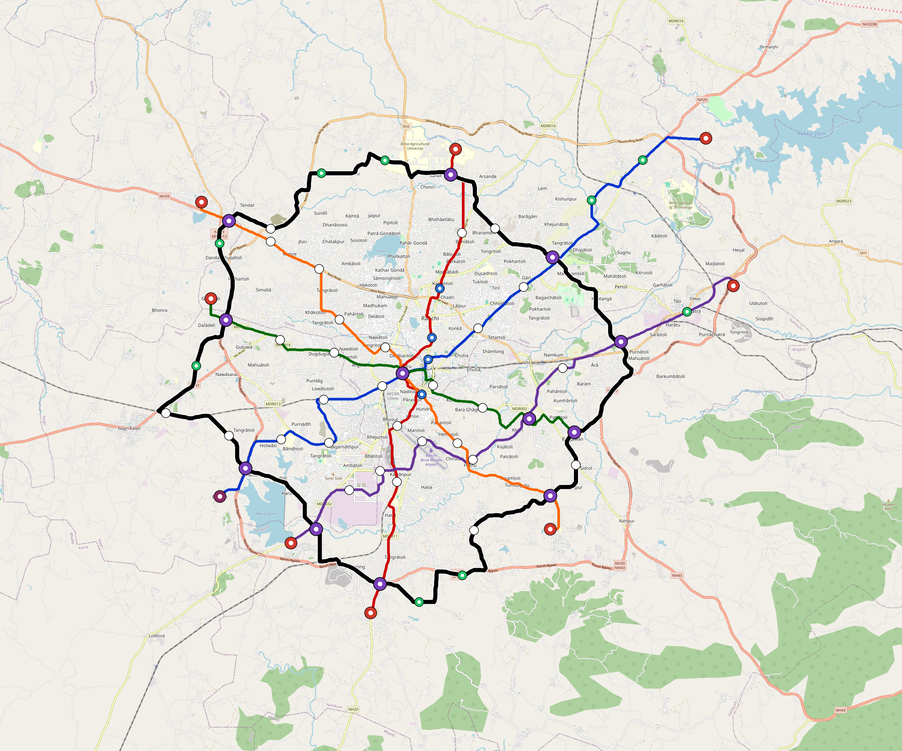

# Ranchi — Urban Rail Network

**Country:** IN · **Population:** 1,400,000 · [National brief](../NATIONAL-BRIEF.md)

This page contains only Ranchi-specific results. Shared routing, service, energy, civil, cost, finance, QA and validation methods are defined once in the [deployment planning reference](../../../../../docs/deployment-planning-reference.md).

> [!IMPORTANT]
> **Foreign-capital advantage:** against the default equivalent foreign-turnkey sensitivity, this local plan avoids **$2.91 bn (86.7%) of external capital** and **$3.58 bn of external interest**. Capital plus saved interest totals **$6.49 bn**. See the common reference for interpretation and limitations.

Auto-planned by the OpenSourceRail design pipeline from the controlled city catalogue, source-locked geospatial inputs and shared templates.

## Network



| Local measure | Value |
|---|---:|
| Lines / unique stations / interchanges | 6 / 77 / 12 |
| Route length | 221.5 km double track |
| Coverage / transfer reachability | 49.2% / 80% |
| Estimated station catchment | 688,800 residents |
| Service span / peak headway | 05:30–02:00 / 3 min |
| Fleet | 260 × 4-car `metro-4car` trainsets (233 peak revenue) |
| Peak network throughput | 115,200 passengers/hour |
| Practical service capacity | 982,080 passenger-trips/day |
| Annual paid-trip planning range | 179.2–286.8 M |

### Lines

| Line | Length | Stations | Trainsets | Termini |
|---|---:|---:|---:|---|
| line-1 | 35.6 km | 14 | 57 | NE Outer ↔ SW Mid |
| line-2 | 26.6 km | 10 | 42 | N Mid ↔ S Mid |
| line-3 | 22.9 km | 9 | 38 | E Mid ↔ W Mid |
| line-4 | 30.2 km | 11 | 47 | E Outer ↔ SW Mid |
| line-5 | 27.1 km | 11 | 46 | NW Outer ↔ SE Mid |
| line-6 | 79.2 km | 22 | 30 | NW Mid ↔ NW Mid |
| **Total** | **221.5 km** | **77 unique** | **260** | |

## Energy

| Local measure | Value |
|---|---:|
| Scheduled service | 2,558 one-way journeys / 84,584 train-km/day |
| Annual traction demand | 533.5 GWh |
| Station/depot PV / storage | 25.1 MW / 140.5 MWh |
| Aggregate charging power | 102.0 MW |
| Dedicated solar plant | 321.3 MW |
| Residual grid/PPA import | 0.0 GWh/yr |
| Worst powered-stop gap | line-6: 12.5 km / 125 kWh |
| Lowest traversal charging margin | line-4: 207 kWh |

## Capital And Funding

| Local CAPEX bucket | Planning value |
|---|---:|
| Civil works | $733 M |
| Stations | $437 M |
| Depots | $8.0 M |
| Rolling stock | $291 M |
| Dedicated solar plant | $257 M |
| Residual train control | $11 M |
| Charging microgrids | $23 M |
| EPC / project services | $105 M |
| **Total city programme** | **$1.87 bn** |

| Local funding measure | Planning value |
|---|---:|
| Imported / external capital | $447 M (24.0%) |
| Domestic / local capital | $1.42 bn (76.0%) |
| Annual public construction commitment | $159 M / yr for 5 years |
| Annual post-grace debt service | $115 M / yr |
| External capital saved vs default turnkey sensitivity | $2.91 bn |
| Capital + lifetime external interest saved | $6.49 bn |
| Annual OPEX | $43 M / yr |

## Local Evidence

**Evidence refresh required.** Retained passing results below are unverified.
The strict README generator rejected the evidence: engineering/simulation/validation-summary.json describes scenario SHA-256 09c42f1dc68d270492661f58630e856e3016a40b2f099de215dc6e263f3efeed, but ranchi.toml is 47daf7b7f2f3cf62457ff0dba0f1a2eba155ed08803f4cae05ba1ac757ddb270; rerun and update the validation evidence. This audit view does not accept or replace the retained solver results.

| Package | Current status | Evidence |
|---|---|---|
| Finance | unverified | [`summary.json`](engineering/finance/summary.json) |
| Native simulation + degraded cases | unverified | [`validation-summary.json`](engineering/simulation/validation-summary.json) |
| SUMO timetable | unverified | [`summary.json`](engineering/sumo/summary.json) |
| Independent OSR/SUMO running-time cross-check | missing/fail; junction/authority gate open | not generated |
| GIS package | unverified | [`summary.json`](engineering/gis/summary.json) |
| Grid/charging/solar | missing/fail; 29 findings | [`summary.json`](engineering/energy/summary.json) |
| Operations, QA and maintenance | 687 assets / 2,979 tasks | [`ranchi-operations-manifest.json`](operations/ranchi-operations-manifest.json) |

## Local Files And Regeneration

| File | Local role |
|---|---|
| [`design.toml`](design.toml) | Authoritative generated city design |
| [`ranchi.toml`](ranchi.toml) | Expanded simulator scenario |
| [`ranchi.corridor.geojson`](ranchi.corridor.geojson) | GIS corridor and stations |
| [`ranchi.design-quality.yaml`](ranchi.design-quality.yaml) | Coverage, source and civil-quality gates |

```bash
tools/automation/regenerate-city.sh ranchi
```
