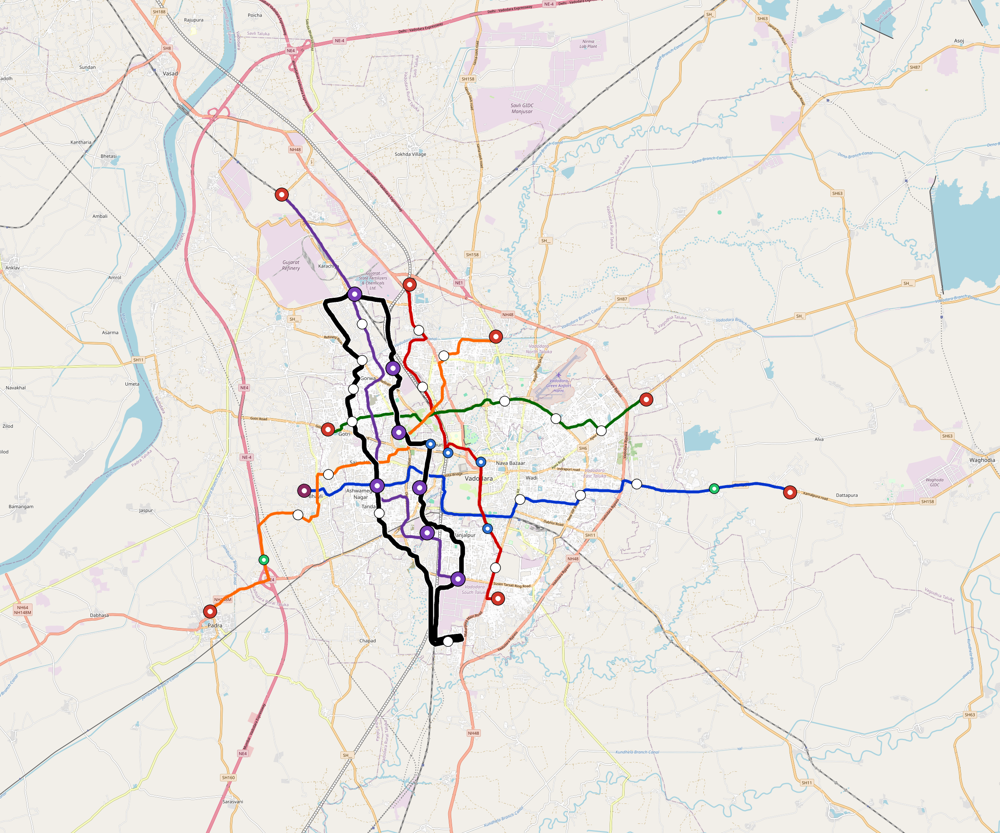

# Vadodara — Urban Rail Network

**Country:** IN · **Population:** 2,200,000 · [National brief](../NATIONAL-BRIEF.md)

This page contains only Vadodara-specific results. Shared routing, service, energy, civil, cost, finance, QA and validation methods are defined once in the [deployment planning reference](../../../../../docs/deployment-planning-reference.md).

> [!IMPORTANT]
> **Foreign-capital advantage:** against the default equivalent foreign-turnkey sensitivity, this local plan avoids **$2.19 bn (87.0%) of external capital** and **$2.70 bn of external interest**. Capital plus saved interest totals **$4.89 bn**. See the common reference for interpretation and limitations.

Auto-planned by the OpenSourceRail design pipeline from the controlled city catalogue, source-locked geospatial inputs and shared templates.

## Network



| Local measure | Value |
|---|---:|
| Lines / unique stations / interchanges | 6 / 61 / 7 |
| Route length | 150.2 km double track |
| Coverage / transfer reachability | 65.7% / 67% |
| Estimated station catchment | 1,445,400 residents |
| Service span / peak headway | 05:30–02:00 / 3 min |
| Fleet | 207 × 4-car `metro-4car` trainsets (186 peak revenue) |
| Peak network throughput | 115,200 passengers/hour |
| Practical service capacity | 982,080 passenger-trips/day |
| Annual paid-trip planning range | 179.2–286.8 M |

### Lines

| Line | Length | Stations | Trainsets | Termini |
|---|---:|---:|---:|---|
| line-1 | 25.8 km | 9 | 41 | E Outer ↔ W Mid |
| line-2 | 18.8 km | 9 | 36 | N Mid ↔ SE Mid |
| line-3 | 16.7 km | 8 | 32 | W Inner ↔ E Mid |
| line-4 | 22.9 km | 10 | 41 | NW Outer ↔ S Mid |
| line-5 | 23.2 km | 9 | 39 | NE Mid ↔ SW Outer |
| line-6 | 42.9 km | 16 | 18 | NW Mid ↔ NW Inner |
| **Total** | **150.2 km** | **61 unique** | **207** | |

## Energy

| Local measure | Value |
|---|---:|
| Scheduled service | 2,558 one-way journeys / 59,883 train-km/day |
| Annual traction demand | 377.7 GWh |
| Station/depot PV / storage | 22.4 MW / 127.0 MWh |
| Aggregate charging power | 88.5 MW |
| Dedicated solar plant | 172.6 MW |
| Residual grid/PPA import | 0.0 GWh/yr |
| Worst powered-stop gap | line-5: 7.6 km / 82 kWh |
| Lowest traversal charging margin | line-1: 161 kWh |

## Capital And Funding

| Local CAPEX bucket | Planning value |
|---|---:|
| Civil works | $479 M |
| Stations | $434 M |
| Depots | $8.0 M |
| Rolling stock | $232 M |
| Dedicated solar plant | $138 M |
| Residual train control | $7.5 M |
| Charging microgrids | $20 M |
| EPC / project services | $83 M |
| **Total city programme** | **$1.40 bn** |

| Local funding measure | Planning value |
|---|---:|
| Imported / external capital | $328 M (23.4%) |
| Domestic / local capital | $1.07 bn (76.6%) |
| Annual public construction commitment | $119 M / yr for 5 years |
| Annual post-grace debt service | $87 M / yr |
| External capital saved vs default turnkey sensitivity | $2.19 bn |
| Capital + lifetime external interest saved | $4.89 bn |
| Annual OPEX | $33 M / yr |

## Local Evidence

| Package | Current status | Evidence |
|---|---|---|
| Finance | pass | [`summary.json`](engineering/finance/summary.json) |
| Native simulation + degraded cases | pass | [`validation-summary.json`](engineering/simulation/validation-summary.json) |
| SUMO timetable | pass | [`summary.json`](engineering/sumo/summary.json) |
| GIS package | pass | [`summary.json`](engineering/gis/summary.json) |
| Grid/charging/solar | pass | [`summary.json`](engineering/energy/summary.json) |
| Operations, QA and maintenance | 550 assets / 2,378 tasks | [`vadodara-operations-manifest.json`](operations/vadodara-operations-manifest.json) |

## Local Files And Regeneration

| File | Local role |
|---|---|
| [`design.toml`](design.toml) | Authoritative generated city design |
| [`vadodara.toml`](vadodara.toml) | Expanded simulator scenario |
| [`vadodara.corridor.geojson`](vadodara.corridor.geojson) | GIS corridor and stations |
| [`vadodara.design-quality.yaml`](vadodara.design-quality.yaml) | Coverage, source and civil-quality gates |

```bash
tools/automation/regenerate-city.sh vadodara
```
