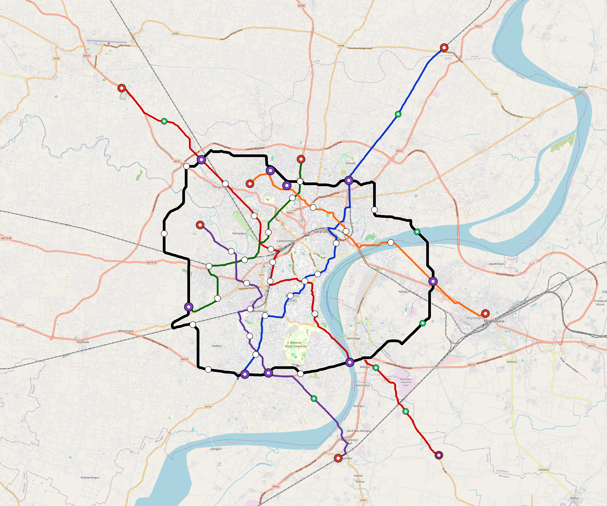

# Varanasi — Urban Rail Network

**Country:** IN · **Population:** 1,500,000 · [National brief](../NATIONAL-BRIEF.md)

This page contains only Varanasi-specific results. Shared routing, service, energy, civil, cost, finance, QA and validation methods are defined once in the [deployment planning reference](../../../../../docs/deployment-planning-reference.md).

> [!IMPORTANT]
> **Foreign-capital advantage:** against the default equivalent foreign-turnkey sensitivity, this local plan avoids **$2.70 bn (87.3%) of external capital** and **$3.33 bn of external interest**. Capital plus saved interest totals **$6.03 bn**. See the common reference for interpretation and limitations.

Auto-planned by the OpenSourceRail design pipeline from the controlled city catalogue, source-locked geospatial inputs and shared templates.

## Network



| Local measure | Value |
|---|---:|
| Lines / unique stations / interchanges | 6 / 64 / 9 |
| Route length | 201.4 km double track |
| Coverage / transfer reachability | 49.1% / 33% |
| Estimated station catchment | 736,500 residents |
| Service span / peak headway | 05:30–02:00 / 3 min |
| Fleet | 243 × 4-car `metro-4car` trainsets (218 peak revenue) |
| Peak network throughput | 115,200 passengers/hour |
| Practical service capacity | 982,080 passenger-trips/day |
| Annual paid-trip planning range | 179.2–286.8 M |

### Lines

| Line | Length | Stations | Trainsets | Termini |
|---|---:|---:|---:|---|
| line-1 | 32.7 km | 9 | 48 | SW Mid ↔ NE Outer |
| line-2 | 40.6 km | 14 | 64 | NW Outer ↔ SE Outer |
| line-3 | 17.0 km | 8 | 31 | N Mid ↔ SW Mid |
| line-4 | 24.7 km | 8 | 39 | NW Mid ↔ S Outer |
| line-5 | 21.8 km | 8 | 35 | NW Mid ↔ E Outer |
| line-6 | 64.5 km | 17 | 26 | NW Mid ↔ W Mid |
| **Total** | **201.4 km** | **64 unique** | **243** | |

## Energy

| Local measure | Value |
|---|---:|
| Scheduled service | 2,558 one-way journeys / 78,642 train-km/day |
| Annual traction demand | 496.0 GWh |
| Station/depot PV / storage | 21.8 MW / 124.0 MWh |
| Aggregate charging power | 85.5 MW |
| Dedicated solar plant | 235.4 MW |
| Residual grid/PPA import | 0.0 GWh/yr |
| Worst powered-stop gap | line-1: 11.8 km / 127 kWh |
| Lowest traversal charging margin | line-1: 127 kWh |

## Capital And Funding

| Local CAPEX bucket | Planning value |
|---|---:|
| Civil works | $821 M |
| Stations | $303 M |
| Depots | $8.0 M |
| Rolling stock | $272 M |
| Dedicated solar plant | $188 M |
| Residual train control | $10 M |
| Charging microgrids | $18 M |
| EPC / project services | $100 M |
| **Total city programme** | **$1.72 bn** |

| Local funding measure | Planning value |
|---|---:|
| Imported / external capital | $393 M (22.8%) |
| Domestic / local capital | $1.33 bn (77.2%) |
| Annual public construction commitment | $147 M / yr for 5 years |
| Annual post-grace debt service | $106 M / yr |
| External capital saved vs default turnkey sensitivity | $2.70 bn |
| Capital + lifetime external interest saved | $6.03 bn |
| Annual OPEX | $40 M / yr |

## Local Evidence

**Evidence refresh required.** Retained passing results below are unverified.
The strict README generator rejected the evidence: engineering/simulation/validation-summary.json describes scenario SHA-256 ef15319e7ce5d70c93a0f584fabf7daad53ae359d086c912505ab7d0cb1a0240, but varanasi.toml is d6945af9f96827361878840590a1283610b682a2596f83eb8edb869bbafffba6; rerun and update the validation evidence. This audit view does not accept or replace the retained solver results.

| Package | Current status | Evidence |
|---|---|---|
| Finance | unverified | [`summary.json`](engineering/finance/summary.json) |
| Native simulation + degraded cases | unverified | [`validation-summary.json`](engineering/simulation/validation-summary.json) |
| SUMO timetable | unverified | [`summary.json`](engineering/sumo/summary.json) |
| Independent OSR/SUMO running-time cross-check | missing/fail; junction/authority gate open | not generated |
| GIS package | unverified | [`summary.json`](engineering/gis/summary.json) |
| Solar/storage snapshot (operating duty unverified) | unverified; 0 findings; 31 grid-only diagnostics | [`summary.json`](engineering/energy/summary.json) |
| Operations, QA and maintenance | 601 assets / 2,665 tasks | [`varanasi-operations-manifest.json`](operations/varanasi-operations-manifest.json) |

## Local Files And Regeneration

| File | Local role |
|---|---|
| [`design.toml`](design.toml) | Authoritative generated city design |
| [`varanasi.toml`](varanasi.toml) | Expanded simulator scenario |
| [`varanasi.corridor.geojson`](varanasi.corridor.geojson) | GIS corridor and stations |
| [`varanasi.design-quality.yaml`](varanasi.design-quality.yaml) | Coverage, source and civil-quality gates |

```bash
tools/automation/regenerate-city.sh varanasi
```
