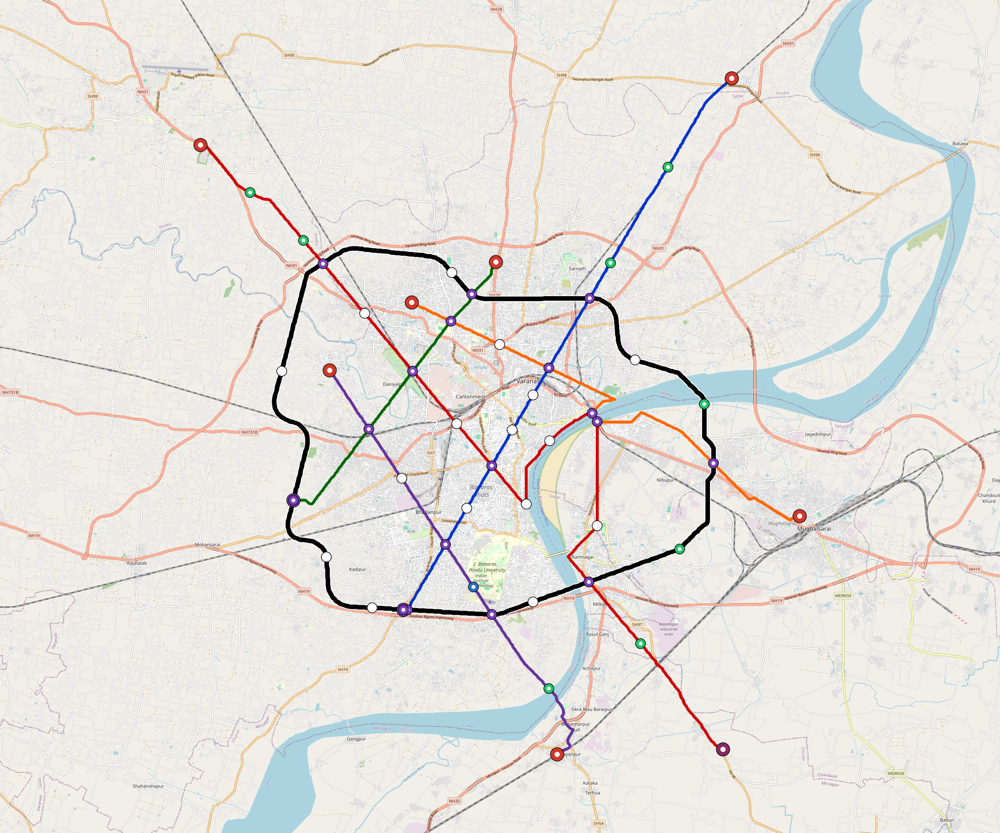

# Varanasi — Urban Rail Network

**Country:** IN · **Population:** 1,500,000 · [National brief](../NATIONAL-BRIEF.md)

This page contains only Varanasi-specific results. Shared routing, service, energy, civil, cost, finance, QA and validation methods are defined once in the [deployment planning reference](../../../../../docs/deployment-planning-reference.md).

> [!IMPORTANT]
> **Foreign-capital advantage:** against the default equivalent foreign-turnkey sensitivity, this local plan avoids **$4.85 bn (89.3%) of external capital** and **$5.96 bn of external interest**. Capital plus saved interest totals **$10.81 bn**. See the common reference for interpretation and limitations.

**Current alignment, depot and production basis.** Core corridors change from **160.199 km to 132.974 km**, with elevated land sections, straight radial tangents and bridges at water crossings. 0 core fragments retain raster geometry for further curve review. The centre is a design-centroid screen; survey, property, obstacles, foundations and geometry releases remain open. All **58 platform points** pass the retained water-mask screen; footprints, bank stability and access remain open. [Alignment controls](engineering/alignment/core-realignment.json) · [Before/after map](engineering/alignment/core-alignment-comparison.png) · [Water screen](engineering/alignment/station-water-screen.json).

**6 line-local depots** provide **225 full-fleet storage slots**, separate from workshop bays. Fleet length and workload set quantities; PV/storage is included once in depot capital. Site acceptance and installed/land/utility quotations remain open. [Depot costs](engineering/line-depots/README.md). The factory requires **225 metro-4car trainsets / 900 cars**, with **18-month facility readiness**, then qualification and manufacture. Integrated openings wait for fleet readiness where production or test paths constrain them. Shared factory capital is counted once; concurrent national loading and supplier commitments remain open. [Factory and dates](engineering/factory/README.md).

Station staffing uses two posts, two normal eight-hour shifts, plus service-window, leave and training cover. Basic wages start at 1.5 times the retained country income proxy, with higher technical/management grades and employer allowances. [Staff](engineering/delivery/README.md) · [Finance](engineering/finance/summary.json). Finance retains country-specific fixed-price, steady-state assumptions; Baghdad’s indexed cashflows are separate.

Auto-planned by the OpenSourceRail design pipeline from the controlled city catalogue, source-locked geospatial inputs and shared templates.

## Network



| Local measure | Value |
|---|---:|
| Lines / unique stations / interchanges | 6 / 58 / 11 |
| Route length | 182.2 km double track |
| Coverage / transfer reachability | 40.1% / 53% |
| Estimated station catchment | 601,500 residents |
| Service span / peak headway | 05:30–02:00 / 3 min |
| Fleet | 225 × 4-car `metro-4car` trainsets (201 peak revenue) |
| Peak network throughput | 115,200 passengers/hour |
| Practical service capacity | 982,080 passenger-trips/day |
| Annual paid-trip planning range | 179.2–286.8 M |

### Lines

| Line | Length | Stations | Trainsets | Termini |
|---|---:|---:|---:|---|
| line-1 | 29.1 km | 9 | 47 | SW Mid ↔ NE Outer |
| line-2 | 36.4 km | 11 | 57 | NW Outer ↔ SE Outer |
| line-3 | 15.0 km | 7 | 29 | N Mid ↔ W Mid |
| line-4 | 21.4 km | 8 | 35 | W Mid ↔ S Outer |
| line-5 | 20.2 km | 7 | 32 | NW Mid ↔ E Outer |
| line-6 | 60.2 km | 16 | 25 | NW Mid ↔ W Mid |
| **Total** | **182.2 km** | **58 unique** | **225** | |

## Energy

| Local measure | Value |
|---|---:|
| Scheduled service | 2,558 one-way journeys / 70,743 train-km/day |
| Annual traction demand | 446.2 GWh |
| Station/depot PV / storage | 43.8 MW / 309.0 MWh |
| Aggregate charging power | 78.0 MW |
| Dedicated solar plant | 183.9 MW |
| Residual grid/PPA import | 0.0 GWh/yr |
| Worst powered-stop gap | line-1: 10.1 km / 108 kWh |
| Lowest traversal charging margin | line-4: 139 kWh |

## Capital And Funding

| Local CAPEX bucket | Planning value |
|---|---:|
| Civil works | $2.02 bn |
| Stations | $266 M |
| Depots | $112 M |
| Rolling stock | $252 M |
| Dedicated solar plant | $147 M |
| Residual train control | $9.1 M |
| Charging microgrids | $16 M |
| EPC / project services | $188 M |
| **Total city programme** | **$3.01 bn** |

| Local funding measure | Planning value |
|---|---:|
| Imported / external capital | $579 M (19.2%) |
| Domestic / local capital | $2.44 bn (80.8%) |
| Annual public construction commitment | $264 M / yr for 5 years |
| Annual post-grace debt service | $187 M / yr |
| External capital saved vs default turnkey sensitivity | $4.85 bn |
| Capital + lifetime external interest saved | $10.81 bn |
| Annual OPEX | $69 M / yr |

## Local Evidence

| Package | Current status | Evidence |
|---|---|---|
| Finance | pass | [`summary.json`](engineering/finance/summary.json) |
| Native simulation + degraded cases | pass | [`validation-summary.json`](engineering/simulation/validation-summary.json) |
| SUMO timetable | pass | [`summary.json`](engineering/sumo/summary.json) |
| Independent OSR/SUMO running-time cross-check | pass; junction/authority gate open | [`operations-crosscheck.md`](engineering/simulation/operations-crosscheck.md) |
| GIS package | pass | [`summary.json`](engineering/gis/summary.json) |
| Solar/storage snapshot (operating duty unverified) | pass; 0 findings; 21 grid-only diagnostics | [`summary.json`](engineering/energy/summary.json) |
| Operations, QA and maintenance | 554 assets / 3,059 tasks | [`varanasi-operations-manifest.json`](operations/varanasi-operations-manifest.json) |

## Local Files And Regeneration

| File | Local role |
|---|---|
| [`design.toml`](design.toml) | Authoritative generated city design |
| [`varanasi.toml`](varanasi.toml) | Expanded simulator scenario |
| [`varanasi.corridor.geojson`](varanasi.corridor.geojson) | GIS corridor and stations |
| [`varanasi.design-quality.yaml`](varanasi.design-quality.yaml) | Coverage, source and civil-quality gates |

```bash
tools/automation/regenerate-city.sh varanasi
```
