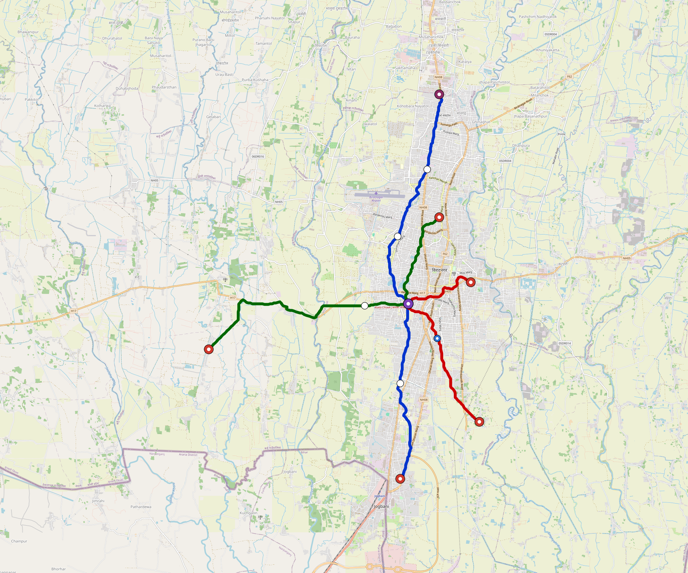

# Biratnagar — Urban Rail Network

**Country:** NP · **Population:** 300,000 · [National brief](../NATIONAL-BRIEF.md)

This page contains only Biratnagar-specific results. Shared routing, service, energy, civil, cost, finance, QA and validation methods are defined once in the [deployment planning reference](../../../../../docs/deployment-planning-reference.md).

> [!IMPORTANT]
> **Foreign-capital advantage:** against the default equivalent foreign-turnkey sensitivity, this local plan avoids **$697 M (89.4%) of external capital** and **$874 M of external interest**. Capital plus saved interest totals **$1.57 bn**. See the common reference for interpretation and limitations.

Auto-planned by the OpenSourceRail design pipeline from the controlled city catalogue, source-locked geospatial inputs and shared templates.

## Network



| Local measure | Value |
|---|---:|
| Lines / unique stations / interchanges | 3 / 14 / 1 |
| Route length | 31.8 km double track |
| Coverage / transfer reachability | 74.7% / 100% |
| Estimated station catchment | 224,100 residents |
| Service span / peak headway | 05:30–02:00 / 3 min |
| Fleet | 67 × 2-car `tram-2car` trainsets (60 peak revenue) |
| Peak network throughput | 28,800 passengers/hour |
| Practical service capacity | 267,840 passenger-trips/day |
| Annual paid-trip planning range | 48.9–78.2 M |

### Lines

| Line | Length | Stations | Trainsets | Termini |
|---|---:|---:|---:|---|
| line-1 | 13.4 km | 6 | 29 | S Outer ↔ N Outer |
| line-2 |  7.5 km | 4 | 17 | SE Outer ↔ E Inner |
| line-3 | 11.0 km | 4 | 21 | W Outer ↔ N Mid |
| **Total** | **31.8 km** | **14 unique** | **67** | |

## Energy

| Local measure | Value |
|---|---:|
| Scheduled service | 1,395 one-way journeys / 14,801 train-km/day |
| Annual traction demand | 46.7 GWh |
| Station/depot PV / storage | 8.9 MW / 46.5 MWh |
| Aggregate charging power | 7.0 MW |
| Dedicated solar plant | 20.4 MW |
| Residual grid/PPA import | 0.0 GWh/yr |
| Worst powered-stop gap | line-3: 6.2 km / 31 kWh |
| Lowest traversal charging margin | line-3: 30 kWh |

## Capital And Funding

| Local CAPEX bucket | Planning value |
|---|---:|
| Civil works | $275 M |
| Stations | $66 M |
| Depots | $8.0 M |
| Rolling stock | $38 M |
| Dedicated solar plant | $16 M |
| Residual train control | $1.6 M |
| Charging microgrids | $1.6 M |
| EPC / project services | $27 M |
| **Total city programme** | **$433 M** |

| Local funding measure | Planning value |
|---|---:|
| Imported / external capital | $82 M (19.0%) |
| Domestic / local capital | $351 M (81.0%) |
| Annual public construction commitment | $35 M / yr for 7 years |
| Annual post-grace debt service | $28 M / yr |
| External capital saved vs default turnkey sensitivity | $697 M |
| Capital + lifetime external interest saved | $1.57 bn |
| Annual OPEX | $9.4 M / yr |

## Local Evidence

| Package | Current status | Evidence |
|---|---|---|
| Finance | pass | [`summary.json`](engineering/finance/summary.json) |
| Native simulation + degraded cases | pass | [`validation-summary.json`](engineering/simulation/validation-summary.json) |
| SUMO timetable | pass | [`summary.json`](engineering/sumo/summary.json) |
| GIS package | pass | [`summary.json`](engineering/gis/summary.json) |
| Grid/charging/solar | pass | [`summary.json`](engineering/energy/summary.json) |
| Operations, QA and maintenance | 151 assets / 682 tasks | [`biratnagar-operations-manifest.json`](operations/biratnagar-operations-manifest.json) |

## Local Files And Regeneration

| File | Local role |
|---|---|
| [`design.toml`](design.toml) | Authoritative generated city design |
| [`biratnagar.toml`](biratnagar.toml) | Expanded simulator scenario |
| [`biratnagar.corridor.geojson`](biratnagar.corridor.geojson) | GIS corridor and stations |
| [`biratnagar.design-quality.yaml`](biratnagar.design-quality.yaml) | Coverage, source and civil-quality gates |

```bash
tools/automation/regenerate-city.sh biratnagar
```
