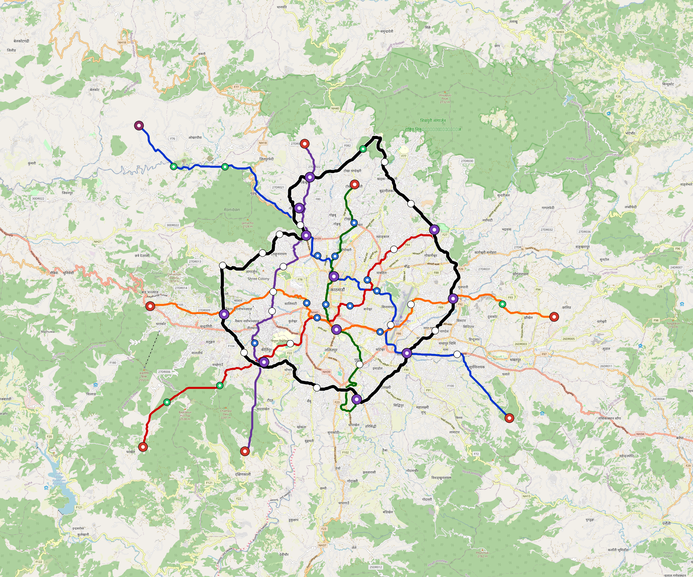

# Kathmandu — Urban Rail Network

**Country:** NP · **Population:** 1,442,000 · [National brief](../NATIONAL-BRIEF.md)

This page contains only Kathmandu-specific results. Shared routing, service, energy, civil, cost, finance, QA and validation methods are defined once in the [deployment planning reference](../../../../../docs/deployment-planning-reference.md).

> [!IMPORTANT]
> **Foreign-capital advantage:** against the default equivalent foreign-turnkey sensitivity, this local plan avoids **$2.90 bn (86.6%) of external capital** and **$3.63 bn of external interest**. Capital plus saved interest totals **$6.53 bn**. See the common reference for interpretation and limitations.

Auto-planned by the OpenSourceRail design pipeline from the controlled city catalogue, source-locked geospatial inputs and shared templates.

## Network



| Local measure | Value |
|---|---:|
| Lines / unique stations / interchanges | 6 / 68 / 11 |
| Route length | 197.3 km double track |
| Coverage / transfer reachability | 54.3% / 53% |
| Estimated station catchment | 783,006 residents |
| Service span / peak headway | 05:30–02:00 / 3 min |
| Fleet | 244 × 4-car `metro-4car` trainsets (218 peak revenue) |
| Peak network throughput | 115,200 passengers/hour |
| Practical service capacity | 982,080 passenger-trips/day |
| Annual paid-trip planning range | 179.2–286.8 M |

### Lines

| Line | Length | Stations | Trainsets | Termini |
|---|---:|---:|---:|---|
| line-1 | 37.4 km | 11 | 56 | SE Outer ↔ NW Outer |
| line-2 | 28.9 km | 11 | 45 | SW Outer ↔ NE Mid |
| line-3 | 20.2 km | 8 | 34 | N Mid ↔ S Mid |
| line-4 | 23.3 km | 9 | 38 | N Mid ↔ SW Outer |
| line-5 | 31.4 km | 10 | 50 | E Outer ↔ W Outer |
| line-6 | 55.9 km | 19 | 21 | W Mid ↔ W Mid |
| **Total** | **197.3 km** | **68 unique** | **244** | |

## Energy

| Local measure | Value |
|---|---:|
| Scheduled service | 2,558 one-way journeys / 78,724 train-km/day |
| Annual traction demand | 496.5 GWh |
| Station/depot PV / storage | 23.3 MW / 131.5 MWh |
| Aggregate charging power | 93.0 MW |
| Dedicated solar plant | 345.7 MW |
| Residual grid/PPA import | 0.0 GWh/yr |
| Worst powered-stop gap | line-1: 14.1 km / 135 kWh |
| Lowest traversal charging margin | line-2: 185 kWh |

## Capital And Funding

| Local CAPEX bucket | Planning value |
|---|---:|
| Civil works | $747 M |
| Stations | $420 M |
| Depots | $8.0 M |
| Rolling stock | $273 M |
| Dedicated solar plant | $277 M |
| Residual train control | $9.9 M |
| Charging microgrids | $21 M |
| EPC / project services | $103 M |
| **Total city programme** | **$1.86 bn** |

| Local funding measure | Planning value |
|---|---:|
| Imported / external capital | $447 M (24.0%) |
| Domestic / local capital | $1.41 bn (76.0%) |
| Annual public construction commitment | $145 M / yr for 7 years |
| Annual post-grace debt service | $120 M / yr |
| External capital saved vs default turnkey sensitivity | $2.90 bn |
| Capital + lifetime external interest saved | $6.53 bn |
| Annual OPEX | $41 M / yr |

## Local Evidence

| Package | Current status | Evidence |
|---|---|---|
| Finance | pass | [`summary.json`](engineering/finance/summary.json) |
| Native simulation + degraded cases | pass | [`validation-summary.json`](engineering/simulation/validation-summary.json) |
| SUMO timetable | pass | [`summary.json`](engineering/sumo/summary.json) |
| GIS package | pass | [`summary.json`](engineering/gis/summary.json) |
| Grid/charging/solar | pass | [`summary.json`](engineering/energy/summary.json) |
| Operations, QA and maintenance | 627 assets / 2,739 tasks | [`kathmandu-operations-manifest.json`](operations/kathmandu-operations-manifest.json) |

## Local Files And Regeneration

| File | Local role |
|---|---|
| [`design.toml`](design.toml) | Authoritative generated city design |
| [`kathmandu.toml`](kathmandu.toml) | Expanded simulator scenario |
| [`kathmandu.corridor.geojson`](kathmandu.corridor.geojson) | GIS corridor and stations |
| [`kathmandu.design-quality.yaml`](kathmandu.design-quality.yaml) | Coverage, source and civil-quality gates |

```bash
tools/automation/regenerate-city.sh kathmandu
```
