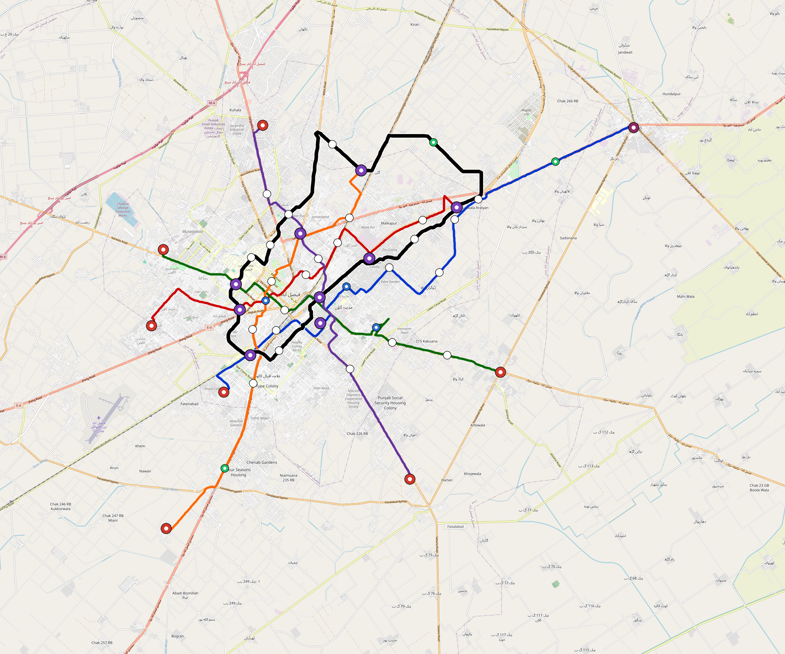

# Faisalabad — Urban Rail Network

**Country:** PK · **Population:** 3,556,000 · [National brief](../NATIONAL-BRIEF.md)

This page contains only Faisalabad-specific results. Shared routing, service, energy, civil, cost, finance, QA and validation methods are defined once in the [deployment planning reference](../../../../../docs/deployment-planning-reference.md).

> [!IMPORTANT]
> **Foreign-capital advantage:** against the default equivalent foreign-turnkey sensitivity, this local plan avoids **$2.74 bn (85.9%) of external capital** and **$3.43 bn of external interest**. Capital plus saved interest totals **$6.17 bn**. See the common reference for interpretation and limitations.

Auto-planned by the OpenSourceRail design pipeline from the controlled city catalogue, source-locked geospatial inputs and shared templates.

## Network



| Local measure | Value |
|---|---:|
| Lines / unique stations / interchanges | 6 / 60 / 9 |
| Route length | 169.7 km double track |
| Coverage / transfer reachability | 79.8% / 67% |
| Estimated station catchment | 2,837,688 residents |
| Service span / peak headway | 05:30–02:00 / 3 min |
| Fleet | 252 × 6-car `metro-6car` trainsets (227 peak revenue) |
| Peak network throughput | 172,800 passengers/hour |
| Practical service capacity | 1,473,120 passenger-trips/day |
| Annual paid-trip planning range | 268.8–430.2 M |

### Lines

| Line | Length | Stations | Trainsets | Termini |
|---|---:|---:|---:|---|
| line-1 | 32.3 km | 12 | 59 | SW Mid ↔ NE Outer |
| line-2 | 22.9 km | 8 | 41 | NE Mid ↔ W Mid |
| line-3 | 23.1 km | 8 | 41 | SE Mid ↔ W Mid |
| line-4 | 22.8 km | 8 | 41 | NW Mid ↔ S Mid |
| line-5 | 24.7 km | 9 | 49 | N Mid ↔ SW Outer |
| line-6 | 43.9 km | 15 | 21 | W Inner ↔ W Inner |
| **Total** | **169.7 km** | **60 unique** | **252** | |

## Energy

| Local measure | Value |
|---|---:|
| Scheduled service | 2,558 one-way journeys / 68,703 train-km/day |
| Annual traction demand | 650.0 GWh |
| Station/depot PV / storage | 21.8 MW / 152.0 MWh |
| Aggregate charging power | 114.0 MW |
| Dedicated solar plant | 290.0 MW |
| Residual grid/PPA import | 0.0 GWh/yr |
| Worst powered-stop gap | line-6: 10.6 km / 178 kWh |
| Lowest traversal charging margin | line-3: 164 kWh |

## Capital And Funding

| Local CAPEX bucket | Planning value |
|---|---:|
| Civil works | $612 M |
| Stations | $361 M |
| Depots | $8.0 M |
| Rolling stock | $423 M |
| Dedicated solar plant | $232 M |
| Residual train control | $8.5 M |
| Charging microgrids | $25 M |
| EPC / project services | $101 M |
| **Total city programme** | **$1.77 bn** |

| Local funding measure | Planning value |
|---|---:|
| Imported / external capital | $448 M (25.3%) |
| Domestic / local capital | $1.32 bn (74.7%) |
| Annual public construction commitment | $233 M / yr for 7 years |
| Annual post-grace debt service | $202 M / yr |
| External capital saved vs default turnkey sensitivity | $2.74 bn |
| Capital + lifetime external interest saved | $6.17 bn |
| Annual OPEX | $43 M / yr |

## Local Evidence

| Package | Current status | Evidence |
|---|---|---|
| Finance | pass | [`summary.json`](engineering/finance/summary.json) |
| Native simulation + degraded cases | pass | [`validation-summary.json`](engineering/simulation/validation-summary.json) |
| SUMO timetable | pass | [`summary.json`](engineering/sumo/summary.json) |
| GIS package | pass | [`summary.json`](engineering/gis/summary.json) |
| Grid/charging/solar | pass | [`summary.json`](engineering/energy/summary.json) |
| Operations, QA and maintenance | 597 assets / 2,683 tasks | [`faisalabad-operations-manifest.json`](operations/faisalabad-operations-manifest.json) |

## Local Files And Regeneration

| File | Local role |
|---|---|
| [`design.toml`](design.toml) | Authoritative generated city design |
| [`faisalabad.toml`](faisalabad.toml) | Expanded simulator scenario |
| [`faisalabad.corridor.geojson`](faisalabad.corridor.geojson) | GIS corridor and stations |
| [`faisalabad.design-quality.yaml`](faisalabad.design-quality.yaml) | Coverage, source and civil-quality gates |

```bash
tools/automation/regenerate-city.sh faisalabad
```
