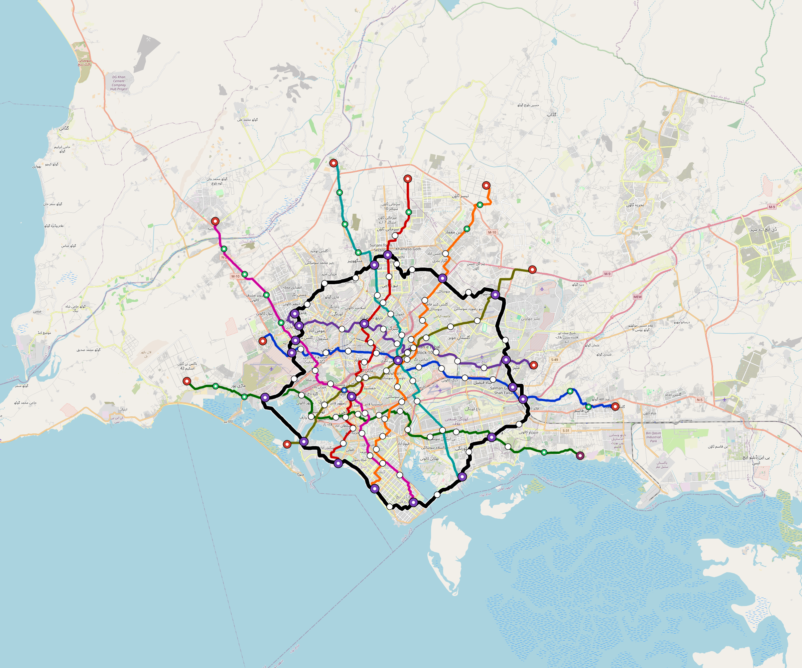

# Karachi — Urban Rail Network

**Country:** PK · **Population:** 20,300,000 · [National brief](../NATIONAL-BRIEF.md)

This page contains only Karachi-specific results. Shared routing, service, energy, civil, cost, finance, QA and validation methods are defined once in the [deployment planning reference](../../../../../docs/deployment-planning-reference.md).

> [!IMPORTANT]
> **Foreign-capital advantage:** against the default equivalent foreign-turnkey sensitivity, this local plan avoids **$6.78 bn (85.5%) of external capital** and **$8.49 bn of external interest**. Capital plus saved interest totals **$15.27 bn**. See the common reference for interpretation and limitations.

Auto-planned by the OpenSourceRail design pipeline from the controlled city catalogue, source-locked geospatial inputs and shared templates.

## Network



| Local measure | Value |
|---|---:|
| Lines / unique stations / interchanges | 9 / 145 / 21 |
| Route length | 459.6 km double track |
| Coverage / transfer reachability | 64.5% / 31% |
| Estimated station catchment | 13,093,500 residents |
| Service span / peak headway | 05:30–02:00 / 3 min |
| Fleet | 707 × 6-car `metro-6car` trainsets (638 peak revenue) |
| Peak network throughput | 259,200 passengers/hour |
| Practical service capacity | 2,276,640 passenger-trips/day |
| Annual paid-trip planning range | 415.5–664.8 M |

### Lines

| Line | Length | Stations | Trainsets | Termini |
|---|---:|---:|---:|---|
| line-1 | 48.4 km | 16 | 89 | E Outer ↔ W Mid |
| line-2 | 40.9 km | 15 | 73 | N Outer ↔ SW Mid |
| line-3 | 54.4 km | 17 | 103 | W Outer ↔ SE Outer |
| line-4 | 37.8 km | 12 | 71 | E Mid ↔ NW Mid |
| line-5 | 47.1 km | 16 | 87 | NE Outer ↔ S Mid |
| line-6 | 42.5 km | 13 | 79 | N Outer ↔ SE Mid |
| line-7 | 45.5 km | 14 | 87 | NW Outer ↔ S Mid |
| line-8 | 38.3 km | 12 | 71 | NE Outer ↔ SW Mid |
| line-9 | 104.8 km | 30 | 47 | NW Mid ↔ NW Mid |
| **Total** | **459.6 km** | **145 unique** | **707** | |

## Energy

| Local measure | Value |
|---|---:|
| Scheduled service | 3,952 one-way journeys / 189,378 train-km/day |
| Annual traction demand | 1,791.7 GWh |
| Station/depot PV / storage | 43.7 MW / 298.0 MWh |
| Aggregate charging power | 260.0 MW |
| Dedicated solar plant | 818.2 MW |
| Residual grid/PPA import | 0.0 GWh/yr |
| Worst powered-stop gap | line-7: 17.1 km / 285 kWh |
| Lowest traversal charging margin | line-6: 199 kWh |

## Capital And Funding

| Local CAPEX bucket | Planning value |
|---|---:|
| Civil works | $1.51 bn |
| Stations | $720 M |
| Depots | $8.0 M |
| Rolling stock | $1.19 bn |
| Dedicated solar plant | $655 M |
| Residual train control | $23 M |
| Charging microgrids | $56 M |
| EPC / project services | $245 M |
| **Total city programme** | **$4.41 bn** |

| Local funding measure | Planning value |
|---|---:|
| Imported / external capital | $1.15 bn (26.2%) |
| Domestic / local capital | $3.25 bn (73.8%) |
| Annual public construction commitment | $574 M / yr for 7 years |
| Annual post-grace debt service | $500 M / yr |
| External capital saved vs default turnkey sensitivity | $6.78 bn |
| Capital + lifetime external interest saved | $15.27 bn |
| Annual OPEX | $109 M / yr |

## Local Evidence

| Package | Current status | Evidence |
|---|---|---|
| Finance | pass | [`summary.json`](engineering/finance/summary.json) |
| Native simulation + degraded cases | pass | [`validation-summary.json`](engineering/simulation/validation-summary.json) |
| SUMO timetable | pass | [`summary.json`](engineering/sumo/summary.json) |
| GIS package | pass | [`summary.json`](engineering/gis/summary.json) |
| Grid/charging/solar | pass | [`summary.json`](engineering/energy/summary.json) |
| Operations, QA and maintenance | 1,546 assets / 7,179 tasks | [`karachi-operations-manifest.json`](operations/karachi-operations-manifest.json) |

## Local Files And Regeneration

| File | Local role |
|---|---|
| [`design.toml`](design.toml) | Authoritative generated city design |
| [`karachi.toml`](karachi.toml) | Expanded simulator scenario |
| [`karachi.corridor.geojson`](karachi.corridor.geojson) | GIS corridor and stations |
| [`karachi.design-quality.yaml`](karachi.design-quality.yaml) | Coverage, source and civil-quality gates |

```bash
tools/automation/regenerate-city.sh karachi
```
