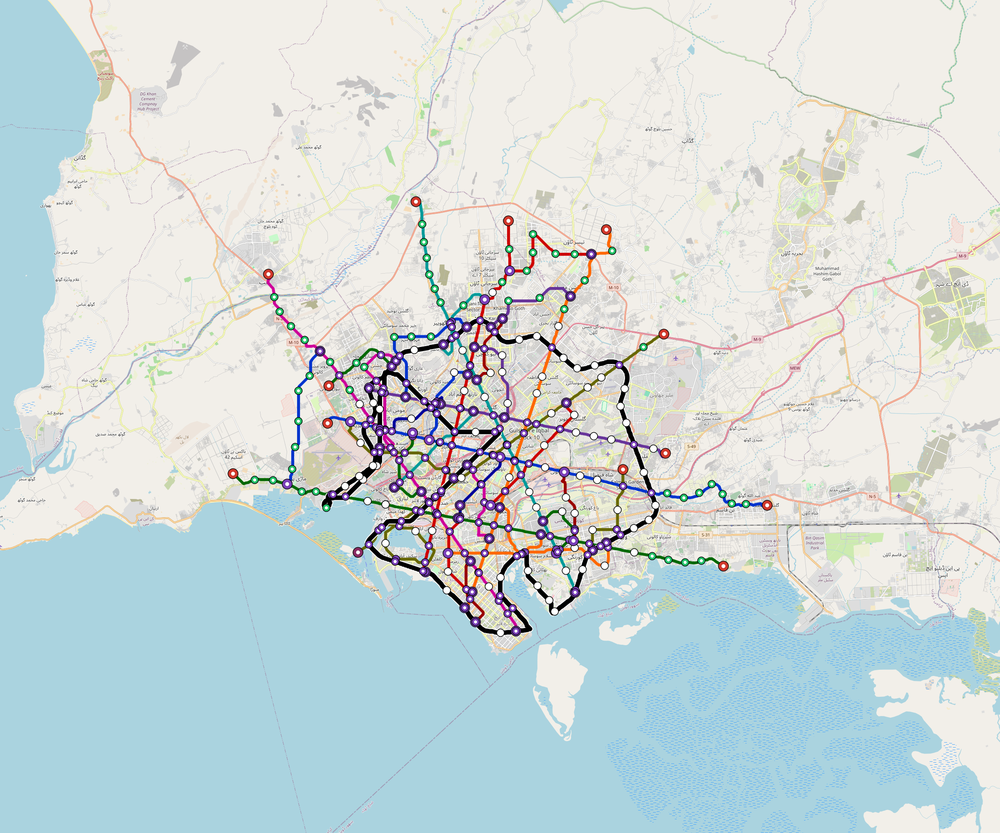

# Karachi — Urban Rail Network

**Country:** PK · **Population:** 20,300,000 · [National brief](../NATIONAL-BRIEF.md)

This page contains only Karachi-specific results. Shared routing, service, energy, civil, cost, finance, QA and validation methods are defined once in the [deployment planning reference](../../../../../docs/deployment-planning-reference.md).

> [!IMPORTANT]
> **Foreign-capital advantage:** against the default equivalent foreign-turnkey sensitivity, this local plan avoids **$9.85 bn (87.8%) of external capital** and **$12.35 bn of external interest**. Capital plus saved interest totals **$22.20 bn**. See the common reference for interpretation and limitations.

**Current alignment, depot and production basis.** Core corridors change from **366.727 km to 299.127 km**, with elevated land sections, straight radial tangents and bridges at water crossings. 0 core fragments retain raster geometry for further curve review. The centre is a design-centroid screen; survey, property, obstacles, foundations and geometry releases remain open. All **121 platform points** pass the retained water-mask screen; footprints, bank stability and access remain open. [Alignment controls](engineering/alignment/core-realignment.json) · [Before/after map](engineering/alignment/core-alignment-comparison.png) · [Water screen](engineering/alignment/station-water-screen.json).

**9 line-local depots** provide **603 full-fleet storage slots**, separate from workshop bays. Fleet length and workload set quantities; PV/storage is included once in depot capital. Site acceptance and installed/land/utility quotations remain open. [Depot costs](engineering/line-depots/README.md). The factory requires **603 metro-6car trainsets / 3618 cars**, with **18-month facility readiness**, then qualification and manufacture. Integrated openings wait for fleet readiness where production or test paths constrain them. Shared factory capital is counted once; concurrent national loading and supplier commitments remain open. [Factory and dates](engineering/factory/README.md).

Station staffing uses two posts, two normal eight-hour shifts, plus service-window, leave and training cover. Basic wages start at 1.5 times the retained country income proxy, with higher technical/management grades and employer allowances. [Staff](engineering/delivery/README.md) · [Finance](engineering/finance/summary.json). Finance retains country-specific fixed-price, steady-state assumptions; Baghdad’s indexed cashflows are separate.

Auto-planned by the OpenSourceRail design pipeline from the controlled city catalogue, source-locked geospatial inputs and shared templates.

## Network



| Local measure | Value |
|---|---:|
| Lines / unique stations / interchanges | 9 / 121 / 19 |
| Route length | 396.6 km double track |
| Coverage / transfer reachability | 52.5% / 42% |
| Estimated station catchment | 10,657,500 residents |
| Service span / peak headway | 05:30–02:00 / 3 min |
| Fleet | 603 × 6-car `metro-6car` trainsets (545 peak revenue) |
| Peak network throughput | 259,200 passengers/hour |
| Practical service capacity | 2,276,640 passenger-trips/day |
| Annual paid-trip planning range | 415.5–664.8 M |

### Lines

| Line | Length | Stations | Trainsets | Termini |
|---|---:|---:|---:|---|
| line-1 | 42.1 km | 14 | 78 | E Outer ↔ W Mid |
| line-2 | 34.0 km | 11 | 63 | N Outer ↔ SW Mid |
| line-3 | 44.3 km | 14 | 83 | W Outer ↔ SE Outer |
| line-4 | 28.3 km | 9 | 53 | E Mid ↔ NW Mid |
| line-5 | 38.5 km | 11 | 70 | NE Outer ↔ S Mid |
| line-6 | 39.2 km | 12 | 74 | N Outer ↔ SE Mid |
| line-7 | 40.5 km | 12 | 75 | NW Outer ↔ S Mid |
| line-8 | 35.0 km | 13 | 64 | NE Outer ↔ SW Mid |
| line-9 | 94.6 km | 25 | 43 | NW Mid ↔ NW Mid |
| **Total** | **396.6 km** | **121 unique** | **603** | |

## Energy

| Local measure | Value |
|---|---:|
| Scheduled service | 3,952 one-way journeys / 162,434 train-km/day |
| Annual traction demand | 1,536.8 GWh |
| Station/depot PV / storage | 74.1 MW / 554.0 MWh |
| Aggregate charging power | 212.0 MW |
| Dedicated solar plant | 659.7 MW |
| Residual grid/PPA import | 0.0 GWh/yr |
| Worst powered-stop gap | line-7: 16.4 km / 274 kWh |
| Lowest traversal charging margin | line-7: 170 kWh |

## Capital And Funding

| Local CAPEX bucket | Planning value |
|---|---:|
| Civil works | $3.49 bn |
| Stations | $507 M |
| Depots | $261 M |
| Rolling stock | $1.01 bn |
| Dedicated solar plant | $528 M |
| Residual train control | $20 M |
| Charging microgrids | $43 M |
| EPC / project services | $373 M |
| **Total city programme** | **$6.23 bn** |

| Local funding measure | Planning value |
|---|---:|
| Imported / external capital | $1.36 bn (21.9%) |
| Domestic / local capital | $4.87 bn (78.1%) |
| Annual public construction commitment | $843 M / yr for 7 years |
| Annual post-grace debt service | $727 M / yr |
| External capital saved vs default turnkey sensitivity | $9.85 bn |
| Capital + lifetime external interest saved | $22.20 bn |
| Annual OPEX | $147 M / yr |

## Local Evidence

| Package | Current status | Evidence |
|---|---|---|
| Finance | pass | [`summary.json`](engineering/finance/summary.json) |
| Native simulation + degraded cases | pass | [`validation-summary.json`](engineering/simulation/validation-summary.json) |
| SUMO timetable | pass | [`summary.json`](engineering/sumo/summary.json) |
| Independent OSR/SUMO running-time cross-check | pass; junction/authority gate open | [`operations-crosscheck.md`](engineering/simulation/operations-crosscheck.md) |
| GIS package | pass | [`summary.json`](engineering/gis/summary.json) |
| Solar/storage snapshot (operating duty unverified) | pass; 0 findings; 50 grid-only diagnostics | [`summary.json`](engineering/energy/summary.json) |
| Operations, QA and maintenance | 1,301 assets / 7,607 tasks | [`karachi-operations-manifest.json`](operations/karachi-operations-manifest.json) |

## Local Files And Regeneration

| File | Local role |
|---|---|
| [`design.toml`](design.toml) | Authoritative generated city design |
| [`karachi.toml`](karachi.toml) | Expanded simulator scenario |
| [`karachi.corridor.geojson`](karachi.corridor.geojson) | GIS corridor and stations |
| [`karachi.design-quality.yaml`](karachi.design-quality.yaml) | Coverage, source and civil-quality gates |

```bash
tools/automation/regenerate-city.sh karachi
```
