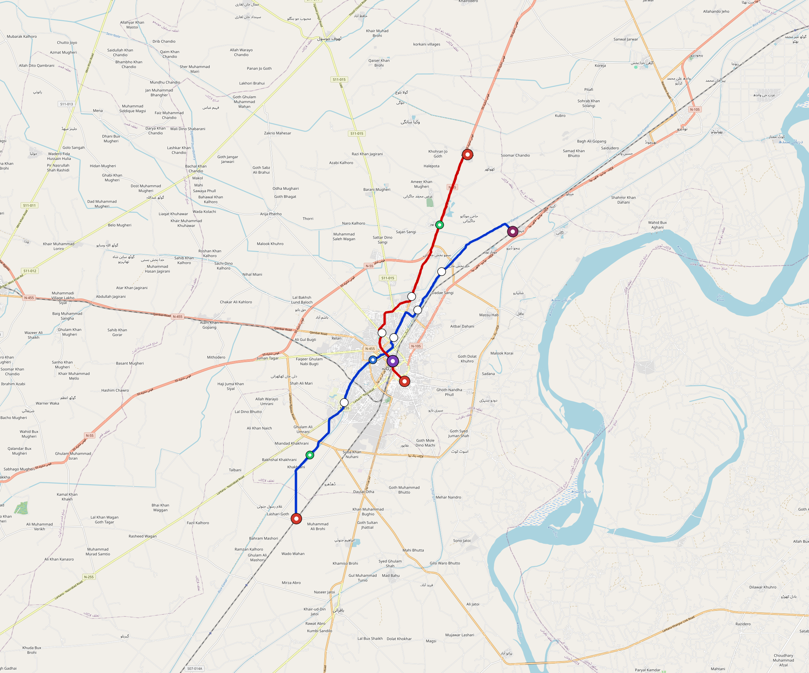

# Larkana — Urban Rail Network

**Country:** PK · **Population:** 500,000 · [National brief](../NATIONAL-BRIEF.md)

This page contains only Larkana-specific results. Shared routing, service, energy, civil, cost, finance, QA and validation methods are defined once in the [deployment planning reference](../../../../../docs/deployment-planning-reference.md).

> [!IMPORTANT]
> **Foreign-capital advantage:** against the default equivalent foreign-turnkey sensitivity, this local plan avoids **$524 M (87.2%) of external capital** and **$656 M of external interest**. Capital plus saved interest totals **$1.18 bn**. See the common reference for interpretation and limitations.

Auto-planned by the OpenSourceRail design pipeline from the controlled city catalogue, source-locked geospatial inputs and shared templates.

## Network



| Local measure | Value |
|---|---:|
| Lines / unique stations / interchanges | 2 / 15 / 1 |
| Route length | 37.0 km double track |
| Coverage / transfer reachability | 48.9% / 100% |
| Estimated station catchment | 244,500 residents |
| Service span / peak headway | 05:30–02:00 / 3 min |
| Fleet | 79 × 3-car `light-metro-3car` trainsets (71 peak revenue) |
| Peak network throughput | 28,800 passengers/hour |
| Practical service capacity | 267,840 passenger-trips/day |
| Annual paid-trip planning range | 48.9–78.2 M |

### Lines

| Line | Length | Stations | Trainsets | Termini |
|---|---:|---:|---:|---|
| line-1 | 22.5 km | 9 | 48 | SW Outer ↔ NE Outer |
| line-2 | 14.4 km | 6 | 31 | S Inner ↔ N Outer |
| **Total** | **37.0 km** | **15 unique** | **79** | |

## Energy

| Local measure | Value |
|---|---:|
| Scheduled service | 930 one-way journeys / 17,189 train-km/day |
| Annual traction demand | 81.3 GWh |
| Station/depot PV / storage | 8.6 MW / 46.0 MWh |
| Aggregate charging power | 6.5 MW |
| Dedicated solar plant | 32.8 MW |
| Residual grid/PPA import | 0.0 GWh/yr |
| Worst powered-stop gap | line-2: 8.4 km / 68 kWh |
| Lowest traversal charging margin | line-2: 35 kWh |

## Capital And Funding

| Local CAPEX bucket | Planning value |
|---|---:|
| Civil works | $150 M |
| Stations | $55 M |
| Depots | $8.0 M |
| Rolling stock | $71 M |
| Dedicated solar plant | $26 M |
| Residual train control | $1.8 M |
| Charging microgrids | $1.4 M |
| EPC / project services | $20 M |
| **Total city programme** | **$334 M** |

| Local funding measure | Planning value |
|---|---:|
| Imported / external capital | $77 M (23.0%) |
| Domestic / local capital | $257 M (77.0%) |
| Annual public construction commitment | $45 M / yr for 7 years |
| Annual post-grace debt service | $39 M / yr |
| External capital saved vs default turnkey sensitivity | $524 M |
| Capital + lifetime external interest saved | $1.18 bn |
| Annual OPEX | $8.2 M / yr |

## Local Evidence

| Package | Current status | Evidence |
|---|---|---|
| Finance | pass | [`summary.json`](engineering/finance/summary.json) |
| Native simulation + degraded cases | pass | [`validation-summary.json`](engineering/simulation/validation-summary.json) |
| SUMO timetable | pass | [`summary.json`](engineering/sumo/summary.json) |
| GIS package | pass | [`summary.json`](engineering/gis/summary.json) |
| Grid/charging/solar | pass | [`summary.json`](engineering/energy/summary.json) |
| Operations, QA and maintenance | 167 assets / 779 tasks | [`larkana-operations-manifest.json`](operations/larkana-operations-manifest.json) |

## Local Files And Regeneration

| File | Local role |
|---|---|
| [`design.toml`](design.toml) | Authoritative generated city design |
| [`larkana.toml`](larkana.toml) | Expanded simulator scenario |
| [`larkana.corridor.geojson`](larkana.corridor.geojson) | GIS corridor and stations |
| [`larkana.design-quality.yaml`](larkana.design-quality.yaml) | Coverage, source and civil-quality gates |

```bash
tools/automation/regenerate-city.sh larkana
```
