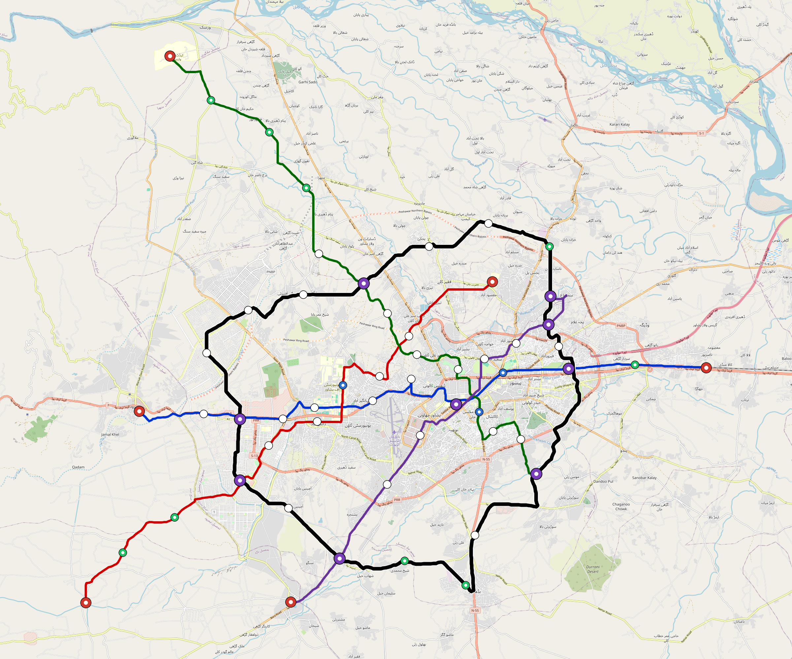

# Peshawar — Urban Rail Network

**Country:** PK · **Population:** 2,300,000 · [National brief](../NATIONAL-BRIEF.md)

This page contains only Peshawar-specific results. Shared routing, service, energy, civil, cost, finance, QA and validation methods are defined once in the [deployment planning reference](../../../../../docs/deployment-planning-reference.md).

> [!IMPORTANT]
> **Foreign-capital advantage:** against the default equivalent foreign-turnkey sensitivity, this local plan avoids **$2.45 bn (87.2%) of external capital** and **$3.07 bn of external interest**. Capital plus saved interest totals **$5.52 bn**. See the common reference for interpretation and limitations.

Auto-planned by the OpenSourceRail design pipeline from the controlled city catalogue, source-locked geospatial inputs and shared templates.

## Network



| Local measure | Value |
|---|---:|
| Lines / unique stations / interchanges | 5 / 63 / 9 |
| Route length | 186.7 km double track |
| Coverage / transfer reachability | 64.1% / 50% |
| Estimated station catchment | 1,474,300 residents |
| Service span / peak headway | 05:30–02:00 / 3 min |
| Fleet | 221 × 4-car `metro-4car` trainsets (198 peak revenue) |
| Peak network throughput | 96,000 passengers/hour |
| Practical service capacity | 803,520 passenger-trips/day |
| Annual paid-trip planning range | 146.6–234.6 M |

### Lines

| Line | Length | Stations | Trainsets | Termini |
|---|---:|---:|---:|---|
| line-1 | 31.8 km | 12 | 50 | W Mid ↔ E Outer |
| line-2 | 31.5 km | 10 | 49 | SW Outer ↔ NE Mid |
| line-3 | 34.9 km | 13 | 58 | NW Outer ↔ SE Mid |
| line-4 | 23.7 km | 9 | 39 | NE Mid ↔ SW Mid |
| line-5 | 64.8 km | 19 | 25 | W Mid ↔ W Mid |
| **Total** | **186.7 km** | **63 unique** | **221** | |

## Energy

| Local measure | Value |
|---|---:|
| Scheduled service | 2,092 one-way journeys / 71,739 train-km/day |
| Annual traction demand | 452.5 GWh |
| Station/depot PV / storage | 20.9 MW / 119.5 MWh |
| Aggregate charging power | 81.0 MW |
| Dedicated solar plant | 213.6 MW |
| Residual grid/PPA import | 0.0 GWh/yr |
| Worst powered-stop gap | line-3: 14.0 km / 151 kWh |
| Lowest traversal charging margin | line-2: 141 kWh |

## Capital And Funding

| Local CAPEX bucket | Planning value |
|---|---:|
| Civil works | $702 M |
| Stations | $315 M |
| Depots | $8.0 M |
| Rolling stock | $248 M |
| Dedicated solar plant | $171 M |
| Residual train control | $9.3 M |
| Charging microgrids | $18 M |
| EPC / project services | $91 M |
| **Total city programme** | **$1.56 bn** |

| Local funding measure | Planning value |
|---|---:|
| Imported / external capital | $359 M (23.0%) |
| Domestic / local capital | $1.20 bn (77.0%) |
| Annual public construction commitment | $209 M / yr for 7 years |
| Annual post-grace debt service | $181 M / yr |
| External capital saved vs default turnkey sensitivity | $2.45 bn |
| Capital + lifetime external interest saved | $5.52 bn |
| Annual OPEX | $36 M / yr |

## Local Evidence

| Package | Current status | Evidence |
|---|---|---|
| Finance | pass | [`summary.json`](engineering/finance/summary.json) |
| Native simulation + degraded cases | pass | [`validation-summary.json`](engineering/simulation/validation-summary.json) |
| SUMO timetable | pass | [`summary.json`](engineering/sumo/summary.json) |
| GIS package | pass | [`summary.json`](engineering/gis/summary.json) |
| Grid/charging/solar | pass | [`summary.json`](engineering/energy/summary.json) |
| Operations, QA and maintenance | 571 assets / 2,492 tasks | [`peshawar-operations-manifest.json`](operations/peshawar-operations-manifest.json) |

## Local Files And Regeneration

| File | Local role |
|---|---|
| [`design.toml`](design.toml) | Authoritative generated city design |
| [`peshawar.toml`](peshawar.toml) | Expanded simulator scenario |
| [`peshawar.corridor.geojson`](peshawar.corridor.geojson) | GIS corridor and stations |
| [`peshawar.design-quality.yaml`](peshawar.design-quality.yaml) | Coverage, source and civil-quality gates |

```bash
tools/automation/regenerate-city.sh peshawar
```
