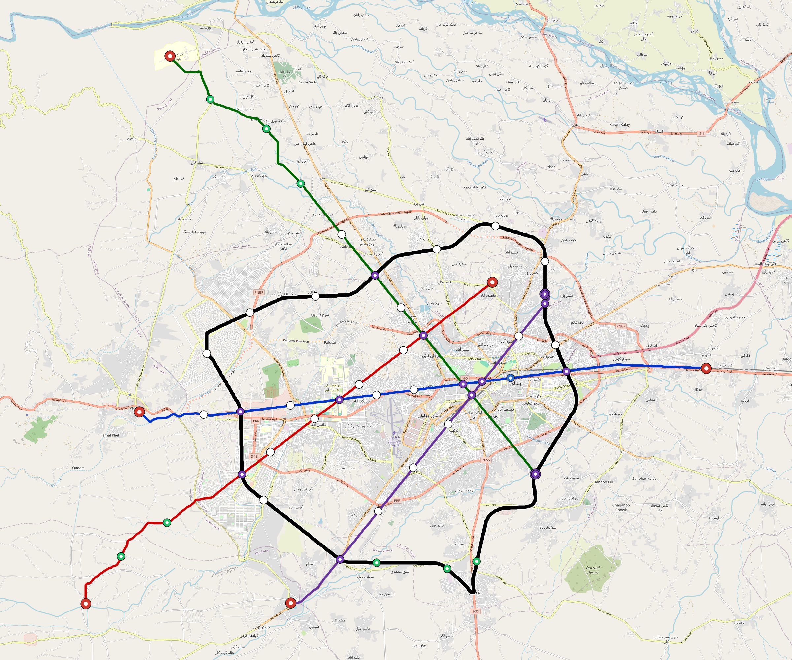

# Peshawar — Urban Rail Network

**Country:** PK · **Population:** 2,300,000 · [National brief](../NATIONAL-BRIEF.md)

This page contains only Peshawar-specific results. Shared routing, service, energy, civil, cost, finance, QA and validation methods are defined once in the [deployment planning reference](../../../../../docs/deployment-planning-reference.md).

> [!IMPORTANT]
> **Foreign-capital advantage:** against the default equivalent foreign-turnkey sensitivity, this local plan avoids **$9.91 bn (88.6%) of external capital** and **$12.42 bn of external interest**. Capital plus saved interest totals **$22.32 bn**. See the common reference for interpretation and limitations.

**Population-led network revision (2026-10-09).** The controlled planning inventory contains **31 lines**, including **26 additional residential lines**. **69.2%** of retained 2020 bbox residents are within a 1 km circle of the actual emitted station coordinates. The working target is 80%; remaining areas and station/access alternatives remain in the review. These are distance screens, not current census, surveyed walksheds or fare demand. New common corridor cells have identified junction/structure and access design requirements; no track switch or site approval is inferred. Country fleet, depot, civil, energy, staffing and financing models use the regenerated inventory, with installed quotations and operating acceptance still open. [Line additions and priorities](engineering/alignment/residential-line-expansion.json) · [Actual station coverage and source receipts](engineering/alignment/residential-expansion-evaluation.json).

**Current alignment, depot and production basis.** Core corridors change from **147.594 km to 206.453 km**, with elevated land sections, water-aware radial routes and separately engineered bridge candidates at short water crossings. 0 core fragments retain raster geometry for further curve review. The centre is a design-centroid screen; survey, property, obstacles, foundations and geometry releases remain open. All **225 platform points** pass the retained water-mask screen; footprints, bank stability and access remain open. [Alignment controls](engineering/alignment/core-realignment.json) · [Before/after map](engineering/alignment/core-alignment-comparison.png) · [Water screen](engineering/alignment/station-water-screen.json).

**31 line-local depots** provide **688 full-fleet storage slots**, separate from workshop bays. Fleet length and workload set quantities; PV/storage is included once in depot capital. Site acceptance and installed/land/utility quotations remain open. [Depot costs](engineering/line-depots/README.md). The factory requires **688 metro-4car trainsets / 2752 cars**, with **18-month facility readiness**, then qualification and manufacture. Integrated openings wait for fleet readiness where production or test paths constrain them. Shared factory capital is counted once; concurrent national loading and supplier commitments remain open. [Factory and dates](engineering/factory/README.md).

Station staffing uses two posts, two normal eight-hour shifts, plus service-window, leave and training cover. Basic wages start at 1.5 times the retained country income proxy, with higher technical/management grades and employer allowances. [Staff](engineering/delivery/README.md) · [Finance](engineering/finance/summary.json). Finance retains country-specific fixed-price, steady-state assumptions; Baghdad’s indexed cashflows are separate.

Auto-planned by the OpenSourceRail design pipeline from the controlled city catalogue, source-locked geospatial inputs and shared templates. Population is counted once within the union of station circles; this is potential radial access, not a verified walkshed or fare-demand estimate. Reachable line pairs include transfers through intermediate lines. [Population radii, denominator and transfer paths](engineering/access/README.md) · [Viaduct beam, foundation and terrain checks](engineering/clearance/README.md). Capital figures are base planning allowances: route-search scores are excluded from money, while special structures and installed-price gaps remain open. [Cost boundary](../../../../../docs/finance/civil-allowance-boundary.md).

## Network



| Local measure | Value |
|---|---:|
| Lines / unique stations / interchanges | 31 / 225 / 50 |
| Route length | 344.3 km double track |
| Direct transfers / reachable line pairs | 11.4% / 100.0% |
| Residents within 800 m radial station catchments | 1,984,381 (2020 raster; 52.6% of bbox) |
| Service span / peak headway | 05:30–02:00 / 3 min |
| Fleet | 688 × 4-car `metro-4car` trainsets (607 peak revenue) |
| Peak network throughput | 595,200 passengers/hour |
| Practical service capacity | 5,446,080 passenger-trips/day |
| Annual paid-trip planning range | 993.9–1590.3 M |

### Lines

| Line | Length | Stations | Trainsets | Termini |
|---|---:|---:|---:|---|
| line-1 | 29.0 km | 19 | 65 | W Mid ↔ E Outer |
| line-2 | 29.0 km | 16 | 56 | SW Outer ↔ NE Mid |
| line-3 | 30.7 km | 20 | 65 | NW Outer ↔ SE Mid |
| line-4 | 22.1 km | 14 | 50 | NE Mid ↔ SW Mid |
| line-5 | 61.8 km | 35 | 31 | W Mid ↔ W Mid |
| line-6 |  5.5 km | 5 | 17 | SW Mid ↔ SW Outer |
| line-7 |  3.6 km | 4 | 13 | SE Inner ↔ E Mid |
| line-8 |  4.6 km | 4 | 14 | SW Inner ↔ SW Inner |
| line-9 |  3.6 km | 3 | 11 | E Mid ↔ NE Mid |
| line-10 |  4.2 km | 4 | 14 | W Mid ↔ SW Mid |
| line-11 |  3.5 km | 3 | 11 | E Inner ↔ NE Inner |
| line-12 |  7.1 km | 4 | 16 | W Inner ↔ NW Mid |
| line-13 |  9.5 km | 6 | 19 | E Mid ↔ NE Mid |
| line-14 |  4.5 km | 3 | 12 | SE Mid ↔ SE Inner |
| line-15 | 10.0 km | 6 | 21 | S Mid ↔ S Mid |
| line-16 |  3.8 km | 3 | 12 | N Inner ↔ NE Inner |
| line-17 |  7.0 km | 5 | 16 | NW Outer ↔ NW Mid |
| line-18 |  6.6 km | 4 | 14 | E Mid ↔ E Mid |
| line-19 |  5.4 km | 5 | 17 | E Mid ↔ SE Inner |
| line-20 |  4.8 km | 3 | 12 | E Mid ↔ E Mid |
| line-21 |  7.9 km | 5 | 17 | E Mid ↔ NE Mid |
| line-22 | 12.6 km | 9 | 30 | SW Mid ↔ SW Outer |
| line-23 |  7.0 km | 5 | 16 | W Mid ↔ NW Mid |
| line-24 |  7.3 km | 4 | 15 | NE Mid ↔ NE Mid |
| line-25 |  5.3 km | 4 | 15 | W Inner ↔ NW Inner |
| line-26 | 12.4 km | 7 | 26 | NE Mid ↔ NE Outer |
| line-27 |  5.0 km | 4 | 13 | NW Mid ↔ N Outer |
| line-28 | 13.2 km | 9 | 29 | E Outer ↔ SE Mid |
| line-29 |  6.4 km | 4 | 14 | NW Outer ↔ NW Outer |
| line-30 |  3.6 km | 3 | 11 | SW Outer ↔ SW Outer |
| line-31 |  7.0 km | 5 | 16 | SW Outer ↔ SW Outer |
| **Total** | **344.3 km** | **225 unique** | **688** | |

## Energy

| Local measure | Value |
|---|---:|
| Scheduled service | 14,182 one-way journeys / 145,719 train-km/day |
| Annual traction demand | 919.1 GWh |
| Station/depot PV / storage | 197.0 MW / 1,450.0 MWh |
| Aggregate charging power | 256.5 MW |
| Dedicated solar plant | 256.1 MW |
| Residual grid/PPA import | 0.0 GWh/yr |
| Worst powered-stop gap | line-26: 12.4 km / 134 kWh |
| Lowest traversal charging margin | line-26: 49 kWh |

## Capital And Funding

| Local CAPEX bucket | Planning value |
|---|---:|
| Civil works | $3.21 bn |
| Stations | $1.07 bn |
| Depots | $491 M |
| Rolling stock | $771 M |
| Dedicated solar plant | $205 M |
| Residual train control | $17 M |
| Charging microgrids | $53 M |
| EPC / project services | $393 M |
| **Total city programme** | **$6.21 bn** |

| Local funding measure | Planning value |
|---|---:|
| Imported / external capital | $1.27 bn (20.4%) |
| Domestic / local capital | $4.94 bn (79.6%) |
| Annual public construction commitment | $850 M / yr for 7 years |
| Annual post-grace debt service | $731 M / yr |
| External capital saved vs default turnkey sensitivity | $9.91 bn |
| Capital + lifetime external interest saved | $22.32 bn |
| Annual OPEX | $151 M / yr |

## Local Evidence

| Package | Current status | Evidence |
|---|---|---|
| Finance | pass | [`summary.json`](engineering/finance/summary.json) |
| Native simulation + degraded cases | pass | [`validation-summary.json`](engineering/simulation/validation-summary.json) |
| SUMO timetable | pass | [`summary.json`](engineering/sumo/summary.json) |
| Independent OSR/SUMO running-time cross-check | pass; junction/authority gate open | [`operations-crosscheck.md`](engineering/simulation/operations-crosscheck.md) |
| GIS package | pass | [`summary.json`](engineering/gis/summary.json) |
| Solar/storage snapshot (operating duty unverified) | pass; 0 findings; 36 grid-only diagnostics | [`summary.json`](engineering/energy/summary.json) |
| Operations, QA and maintenance | 1,924 assets / 10,035 tasks | [`peshawar-operations-manifest.json`](operations/peshawar-operations-manifest.json) |

## Local Files And Regeneration

| File | Local role |
|---|---|
| [`design.toml`](design.toml) | Authoritative generated city design |
| [`peshawar.toml`](peshawar.toml) | Expanded simulator scenario |
| [`peshawar.corridor.geojson`](peshawar.corridor.geojson) | GIS corridor and stations |
| [`peshawar.design-quality.yaml`](peshawar.design-quality.yaml) | Coverage, source and civil-quality gates |

```bash
tools/automation/regenerate-city.sh peshawar
```
