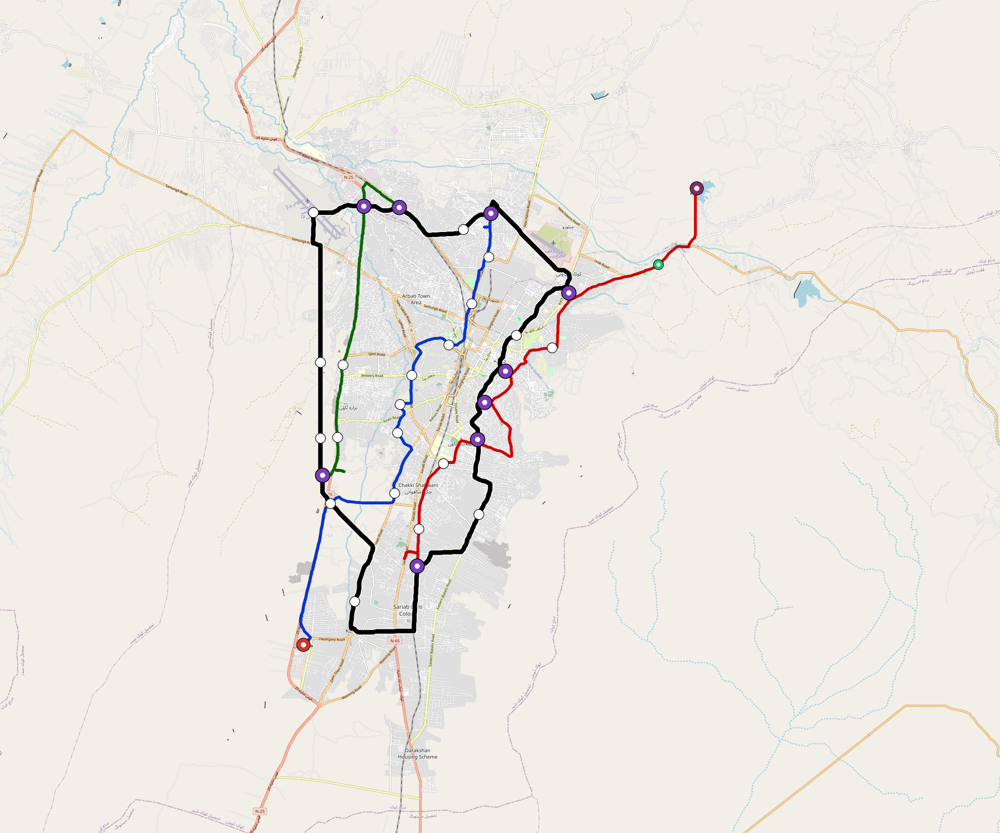

# Quetta — Urban Rail Network

**Country:** PK · **Population:** 1,200,000 · [National brief](../NATIONAL-BRIEF.md)

This page contains only Quetta-specific results. Shared routing, service, energy, civil, cost, finance, QA and validation methods are defined once in the [deployment planning reference](../../../../../docs/deployment-planning-reference.md).

> [!IMPORTANT]
> **Foreign-capital advantage:** against the default equivalent foreign-turnkey sensitivity, this local plan avoids **$1.58 bn (87.4%) of external capital** and **$1.98 bn of external interest**. Capital plus saved interest totals **$3.55 bn**. See the common reference for interpretation and limitations.

Auto-planned by the OpenSourceRail design pipeline from the controlled city catalogue, source-locked geospatial inputs and shared templates.

## Network



| Local measure | Value |
|---|---:|
| Lines / unique stations / interchanges | 4 / 41 / 9 |
| Route length | 120.7 km double track |
| Coverage / transfer reachability | 49.8% / 50% |
| Estimated station catchment | 597,600 residents |
| Service span / peak headway | 05:30–02:00 / 3 min |
| Fleet | 127 × 4-car `metro-4car` trainsets (114 peak revenue) |
| Peak network throughput | 76,800 passengers/hour |
| Practical service capacity | 624,960 passenger-trips/day |
| Annual paid-trip planning range | 114.1–182.5 M |

### Lines

| Line | Length | Stations | Trainsets | Termini |
|---|---:|---:|---:|---|
| line-1 | 25.4 km | 10 | 42 | SW Outer ↔ N Mid |
| line-2 | 26.7 km | 10 | 42 | S Mid ↔ NE Outer |
| line-3 | 15.4 km | 5 | 24 | SW Mid ↔ N Mid |
| line-4 | 53.1 km | 16 | 19 | NW Mid ↔ W Mid |
| **Total** | **120.7 km** | **41 unique** | **127** | |

## Energy

| Local measure | Value |
|---|---:|
| Scheduled service | 1,628 one-way journeys / 43,764 train-km/day |
| Annual traction demand | 276.0 GWh |
| Station/depot PV / storage | 16.7 MW / 98.5 MWh |
| Aggregate charging power | 60.0 MW |
| Dedicated solar plant | 121.1 MW |
| Residual grid/PPA import | 0.0 GWh/yr |
| Worst powered-stop gap | line-2: 8.0 km / 77 kWh |
| Lowest traversal charging margin | line-3: 132 kWh |

## Capital And Funding

| Local CAPEX bucket | Planning value |
|---|---:|
| Civil works | $429 M |
| Stations | $246 M |
| Depots | $8.0 M |
| Rolling stock | $142 M |
| Dedicated solar plant | $97 M |
| Residual train control | $6.0 M |
| Charging microgrids | $14 M |
| EPC / project services | $59 M |
| **Total city programme** | **$1.00 bn** |

| Local funding measure | Planning value |
|---|---:|
| Imported / external capital | $226 M (22.6%) |
| Domestic / local capital | $775 M (77.4%) |
| Annual public construction commitment | $135 M / yr for 7 years |
| Annual post-grace debt service | $116 M / yr |
| External capital saved vs default turnkey sensitivity | $1.58 bn |
| Capital + lifetime external interest saved | $3.55 bn |
| Annual OPEX | $23 M / yr |

## Local Evidence

**Evidence refresh required.** Retained passing results below are unverified.
The strict README generator rejected the evidence: engineering/simulation/validation-summary.json describes scenario SHA-256 7ea889056c3afa3cdc30596cd3b893baaf2a8f4f1550f7ebeb64ed6a2e933bd4, but quetta.toml is bb9df89596d9b845f634c92d956fdd6f9201616ec5fa275f54e371b9d95b9001; rerun and update the validation evidence. This audit view does not accept or replace the retained solver results.

| Package | Current status | Evidence |
|---|---|---|
| Finance | unverified | [`summary.json`](engineering/finance/summary.json) |
| Native simulation + degraded cases | unverified | [`validation-summary.json`](engineering/simulation/validation-summary.json) |
| SUMO timetable | unverified | [`summary.json`](engineering/sumo/summary.json) |
| Independent OSR/SUMO running-time cross-check | missing/fail; junction/authority gate open | not generated |
| GIS package | unverified | [`summary.json`](engineering/gis/summary.json) |
| Solar/storage snapshot (operating duty unverified) | unverified; 0 findings; 20 grid-only diagnostics | [`summary.json`](engineering/energy/summary.json) |
| Operations, QA and maintenance | 361 assets / 1,517 tasks | [`quetta-operations-manifest.json`](operations/quetta-operations-manifest.json) |

## Local Files And Regeneration

| File | Local role |
|---|---|
| [`design.toml`](design.toml) | Authoritative generated city design |
| [`quetta.toml`](quetta.toml) | Expanded simulator scenario |
| [`quetta.corridor.geojson`](quetta.corridor.geojson) | GIS corridor and stations |
| [`quetta.design-quality.yaml`](quetta.design-quality.yaml) | Coverage, source and civil-quality gates |

```bash
tools/automation/regenerate-city.sh quetta
```
