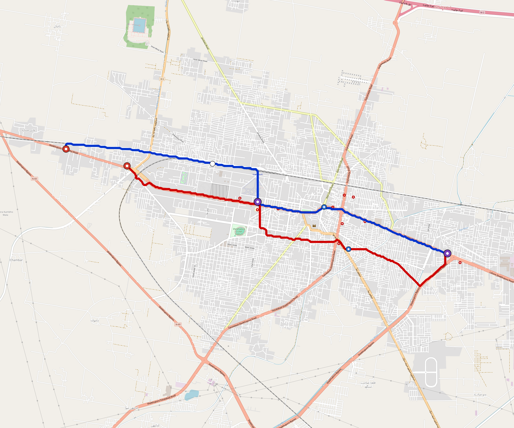

# Sheikhupura — Urban Rail Network

**Country:** PK · **Population:** 600,000 · [National brief](../NATIONAL-BRIEF.md)

This page contains only Sheikhupura-specific results. Shared routing, service, energy, civil, cost, finance, QA and validation methods are defined once in the [deployment planning reference](../../../../../docs/deployment-planning-reference.md).

> [!IMPORTANT]
> **Foreign-capital advantage:** against the default equivalent foreign-turnkey sensitivity, this local plan avoids **$285 M (87.6%) of external capital** and **$357 M of external interest**. Capital plus saved interest totals **$643 M**. See the common reference for interpretation and limitations.

Auto-planned by the OpenSourceRail design pipeline from the controlled city catalogue, source-locked geospatial inputs and shared templates.

## Network



| Local measure | Value |
|---|---:|
| Lines / unique stations / interchanges | 2 / 9 / 2 |
| Route length | 16.6 km double track |
| Coverage / transfer reachability | 77.3% / 100% |
| Estimated station catchment | 463,800 residents |
| Service span / peak headway | 05:30–02:00 / 3 min |
| Fleet | 37 × 3-car `light-metro-3car` trainsets (33 peak revenue) |
| Peak network throughput | 28,800 passengers/hour |
| Practical service capacity | 267,840 passenger-trips/day |
| Annual paid-trip planning range | 48.9–78.2 M |

### Lines

| Line | Length | Stations | Trainsets | Termini |
|---|---:|---:|---:|---|
| line-1 |  8.7 km | 5 | 19 | W Outer ↔ E Outer |
| line-2 |  7.9 km | 4 | 18 | W Outer ↔ E Outer |
| **Total** | **16.6 km** | **9 unique** | **37** | |

## Energy

| Local measure | Value |
|---|---:|
| Scheduled service | 930 one-way journeys / 7,697 train-km/day |
| Annual traction demand | 36.4 GWh |
| Station/depot PV / storage | 7.4 MW / 44.0 MWh |
| Aggregate charging power | 4.5 MW |
| Dedicated solar plant | 10.6 MW |
| Residual grid/PPA import | 0.0 GWh/yr |
| Worst powered-stop gap | line-1: 3.0 km / 24 kWh |
| Lowest traversal charging margin | line-2: 28 kWh |

## Capital And Funding

| Local CAPEX bucket | Planning value |
|---|---:|
| Civil works | $64 M |
| Stations | $54 M |
| Depots | $8.0 M |
| Rolling stock | $33 M |
| Dedicated solar plant | $8.5 M |
| Residual train control | $828 k |
| Charging microgrids | $1.1 M |
| EPC / project services | $11 M |
| **Total city programme** | **$181 M** |

| Local funding measure | Planning value |
|---|---:|
| Imported / external capital | $40 M (22.3%) |
| Domestic / local capital | $140 M (77.7%) |
| Annual public construction commitment | $24 M / yr for 7 years |
| Annual post-grace debt service | $21 M / yr |
| External capital saved vs default turnkey sensitivity | $285 M |
| Capital + lifetime external interest saved | $643 M |
| Annual OPEX | $4.5 M / yr |

## Local Evidence

| Package | Current status | Evidence |
|---|---|---|
| Finance | pass | [`summary.json`](engineering/finance/summary.json) |
| Native simulation + degraded cases | pass | [`validation-summary.json`](engineering/simulation/validation-summary.json) |
| SUMO timetable | pass | [`summary.json`](engineering/sumo/summary.json) |
| GIS package | pass | [`summary.json`](engineering/gis/summary.json) |
| Grid/charging/solar | pass | [`summary.json`](engineering/energy/summary.json) |
| Operations, QA and maintenance | 93 assets / 397 tasks | [`sheikhupura-operations-manifest.json`](operations/sheikhupura-operations-manifest.json) |

## Local Files And Regeneration

| File | Local role |
|---|---|
| [`design.toml`](design.toml) | Authoritative generated city design |
| [`sheikhupura.toml`](sheikhupura.toml) | Expanded simulator scenario |
| [`sheikhupura.corridor.geojson`](sheikhupura.corridor.geojson) | GIS corridor and stations |
| [`sheikhupura.design-quality.yaml`](sheikhupura.design-quality.yaml) | Coverage, source and civil-quality gates |

```bash
tools/automation/regenerate-city.sh sheikhupura
```
