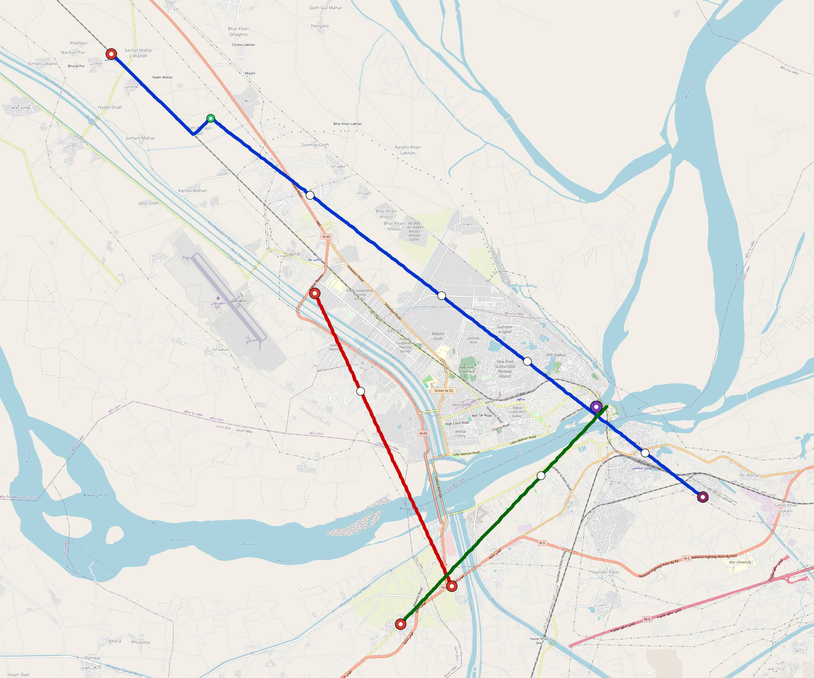

# Sukkur — Urban Rail Network

**Country:** PK · **Population:** 600,000 · [National brief](../NATIONAL-BRIEF.md)

This page contains only Sukkur-specific results. Shared routing, service, energy, civil, cost, finance, QA and validation methods are defined once in the [deployment planning reference](../../../../../docs/deployment-planning-reference.md).

> [!IMPORTANT]
> **Foreign-capital advantage:** against the default equivalent foreign-turnkey sensitivity, this local plan avoids **$1.51 bn (89.3%) of external capital** and **$1.89 bn of external interest**. Capital plus saved interest totals **$3.40 bn**. See the common reference for interpretation and limitations.

**Current alignment, depot and production basis.** Core corridors change from **40.006 km to 35.092 km**, with elevated land sections, water-aware radial routes and separately engineered bridge candidates at short water crossings. 0 core fragments retain raster geometry for further curve review. The centre is a design-centroid screen; survey, property, obstacles, foundations and geometry releases remain open. All **20 platform points** pass the retained water-mask screen; footprints, bank stability and access remain open. [Alignment controls](engineering/alignment/core-realignment.json) · [Before/after map](engineering/alignment/core-alignment-comparison.png) · [Water screen](engineering/alignment/station-water-screen.json).

**3 line-local depots** provide **130 full-fleet storage slots**, separate from workshop bays. Fleet length and workload set quantities; PV/storage is included once in depot capital. Site acceptance and installed/land/utility quotations remain open. [Depot costs](engineering/line-depots/README.md). The factory requires **130 light-metro-3car trainsets / 390 cars**, with **18-month facility readiness**, then qualification and manufacture. Integrated openings wait for fleet readiness where production or test paths constrain them. Shared factory capital is counted once; concurrent national loading and supplier commitments remain open. [Factory and dates](engineering/factory/README.md).

Station staffing uses two posts, two normal eight-hour shifts, plus service-window, leave and training cover. Basic wages start at 1.5 times the retained country income proxy, with higher technical/management grades and employer allowances. [Staff](engineering/delivery/README.md) · [Finance](engineering/finance/summary.json). Finance retains country-specific fixed-price, steady-state assumptions; Baghdad’s indexed cashflows are separate.

Auto-planned by the OpenSourceRail design pipeline from the controlled city catalogue, source-locked geospatial inputs and shared templates. Population is counted once within the union of station circles; this is potential radial access, not a verified walkshed or fare-demand estimate. Reachable line pairs include transfers through intermediate lines. [Population radii, denominator and transfer paths](engineering/access/README.md) · [Viaduct beam, foundation and terrain checks](engineering/clearance/README.md). Capital figures are base planning allowances: route-search scores are excluded from money, while special structures and installed-price gaps remain open. [Cost boundary](../../../../../docs/finance/civil-allowance-boundary.md).

## Network



| Local measure | Value |
|---|---:|
| Lines / unique stations / interchanges | 3 / 20 / 2 |
| Route length | 38.8 km double track |
| Direct transfers / reachable line pairs | 66.7% / 100.0% |
| Residents within 800 m radial station catchments | 178,973 (2020 raster; 18.6% of bbox) |
| Service span / peak headway | 05:30–02:00 / 3 min |
| Fleet | 130 × 3-car `light-metro-3car` trainsets (117 peak revenue) |
| Peak network throughput | 43,200 passengers/hour |
| Practical service capacity | 401,760 passenger-trips/day |
| Annual paid-trip planning range | 73.3–117.3 M |

### Lines

| Line | Length | Stations | Trainsets | Termini |
|---|---:|---:|---:|---|
| line-1 | 20.8 km | 9 | 69 | NW Outer ↔ SE Mid |
| line-2 |  8.9 km | 4 | 30 | NW Mid ↔ S Mid |
| line-3 |  9.1 km | 7 | 31 | S Mid ↔ E Inner |
| **Total** | **38.8 km** | **20 unique** | **130** | |

## Energy

| Local measure | Value |
|---|---:|
| Scheduled service | 1,395 one-way journeys / 18,033 train-km/day |
| Annual traction demand | 85.3 GWh |
| Station/depot PV / storage | 19.8 MW / 128.0 MWh |
| Aggregate charging power | 9.5 MW |
| Dedicated solar plant | 22.0 MW |
| Residual grid/PPA import | 0.0 GWh/yr |
| Worst powered-stop gap | line-1: 7.0 km / 56 kWh |
| Lowest traversal charging margin | line-2: 35 kWh |

## Capital And Funding

| Local CAPEX bucket | Planning value |
|---|---:|
| Civil works | $580 M |
| Stations | $105 M |
| Depots | $54 M |
| Rolling stock | $117 M |
| Dedicated solar plant | $18 M |
| Residual train control | $1.9 M |
| Charging microgrids | $2.0 M |
| EPC / project services | $60 M |
| **Total city programme** | **$938 M** |

| Local funding measure | Planning value |
|---|---:|
| Imported / external capital | $181 M (19.3%) |
| Domestic / local capital | $757 M (80.7%) |
| Annual public construction commitment | $130 M / yr for 7 years |
| Annual post-grace debt service | $111 M / yr |
| External capital saved vs default turnkey sensitivity | $1.51 bn |
| Capital + lifetime external interest saved | $3.40 bn |
| Annual OPEX | $22 M / yr |

## Local Evidence

| Package | Current status | Evidence |
|---|---|---|
| Finance | pass | [`summary.json`](engineering/finance/summary.json) |
| Native simulation + degraded cases | pass | [`validation-summary.json`](engineering/simulation/validation-summary.json) |
| SUMO timetable | pass | [`summary.json`](engineering/sumo/summary.json) |
| Independent OSR/SUMO running-time cross-check | pass; junction/authority gate open | [`operations-crosscheck.md`](engineering/simulation/operations-crosscheck.md) |
| GIS package | pass | [`summary.json`](engineering/gis/summary.json) |
| Solar/storage snapshot (operating duty unverified) | pass; 0 findings; 5 grid-only diagnostics | [`summary.json`](engineering/energy/summary.json) |
| Operations, QA and maintenance | 256 assets / 1,537 tasks | [`sukkur-operations-manifest.json`](operations/sukkur-operations-manifest.json) |

## Local Files And Regeneration

| File | Local role |
|---|---|
| [`design.toml`](design.toml) | Authoritative generated city design |
| [`sukkur.toml`](sukkur.toml) | Expanded simulator scenario |
| [`sukkur.corridor.geojson`](sukkur.corridor.geojson) | GIS corridor and stations |
| [`sukkur.design-quality.yaml`](sukkur.design-quality.yaml) | Coverage, source and civil-quality gates |

```bash
tools/automation/regenerate-city.sh sukkur
```
