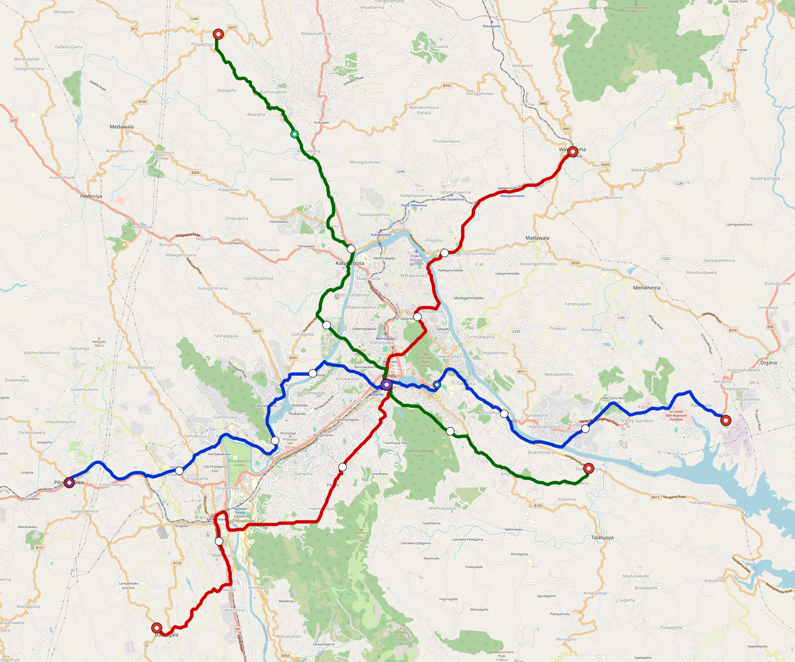

# Kandy — Urban Rail Network

**Country:** LK · **Population:** 650,000 · [National brief](../NATIONAL-BRIEF.md)

This page contains only Kandy-specific results. Shared routing, service, energy, civil, cost, finance, QA and validation methods are defined once in the [deployment planning reference](../../../../../docs/deployment-planning-reference.md).

> [!IMPORTANT]
> **Foreign-capital advantage:** against the default equivalent foreign-turnkey sensitivity, this local plan avoids **$1.01 bn (86.3%) of external capital** and **$1.27 bn of external interest**. Capital plus saved interest totals **$2.28 bn**. See the common reference for interpretation and limitations.

Auto-planned by the OpenSourceRail design pipeline from the controlled city catalogue, source-locked geospatial inputs and shared templates.

## Network



| Local measure | Value |
|---|---:|
| Lines / unique stations / interchanges | 3 / 23 / 1 |
| Route length | 75.4 km double track |
| Coverage / transfer reachability | 57.4% / 100% |
| Estimated station catchment | 373,099 residents |
| Service span / peak headway | 05:30–02:00 / 3 min |
| Fleet | 178 × 3-car `light-metro-3car` trainsets (161 peak revenue) |
| Peak network throughput | 43,200 passengers/hour |
| Practical service capacity | 401,760 passenger-trips/day |
| Annual paid-trip planning range | 73.3–117.3 M |

### Lines

| Line | Length | Stations | Trainsets | Termini |
|---|---:|---:|---:|---|
| line-1 | 27.2 km | 9 | 65 | E Outer ↔ W Outer |
| line-2 | 25.5 km | 7 | 59 | SW Outer ↔ NE Outer |
| line-3 | 22.7 km | 7 | 54 | SE Mid ↔ NW Outer |
| **Total** | **75.4 km** | **23 unique** | **178** | |

## Energy

| Local measure | Value |
|---|---:|
| Scheduled service | 1,395 one-way journeys / 35,050 train-km/day |
| Annual traction demand | 165.8 GWh |
| Station/depot PV / storage | 11.3 MW / 50.5 MWh |
| Aggregate charging power | 11.0 MW |
| Dedicated solar plant | 95.8 MW |
| Residual grid/PPA import | 0.0 GWh/yr |
| Worst powered-stop gap | line-3: 9.0 km / 68 kWh |
| Lowest traversal charging margin | line-2: 76 kWh |

## Capital And Funding

| Local CAPEX bucket | Planning value |
|---|---:|
| Civil works | $265 M |
| Stations | $99 M |
| Depots | $8.0 M |
| Rolling stock | $160 M |
| Dedicated solar plant | $77 M |
| Residual train control | $3.8 M |
| Charging microgrids | $2.4 M |
| EPC / project services | $38 M |
| **Total city programme** | **$652 M** |

| Local funding measure | Planning value |
|---|---:|
| Imported / external capital | $161 M (24.6%) |
| Domestic / local capital | $492 M (75.4%) |
| Annual public construction commitment | $74 M / yr for 7 years |
| Annual post-grace debt service | $63 M / yr |
| External capital saved vs default turnkey sensitivity | $1.01 bn |
| Capital + lifetime external interest saved | $2.28 bn |
| Annual OPEX | $17 M / yr |

## Local Evidence

**Evidence refresh required.** Retained passing results below are unverified.
The strict README generator rejected the evidence: engineering/simulation/validation-summary.json describes scenario SHA-256 588e40b4ffa5a8a958520f19bb4209d698002df8a3c454dc645a21c655c192ba, but kandy.toml is 7259f375bc3fc25f03bd0c7608cd22b3b761529d78554e3f210a67a8c3588f57; rerun and update the validation evidence. This audit view does not accept or replace the retained solver results.

| Package | Current status | Evidence |
|---|---|---|
| Finance | unverified | [`summary.json`](engineering/finance/summary.json) |
| Native simulation + degraded cases | unverified | [`validation-summary.json`](engineering/simulation/validation-summary.json) |
| SUMO timetable | unverified | [`summary.json`](engineering/sumo/summary.json) |
| Independent OSR/SUMO running-time cross-check | missing/fail; junction/authority gate open | not generated |
| GIS package | unverified | [`summary.json`](engineering/gis/summary.json) |
| Grid/charging/solar | missing/fail; 12 findings | [`summary.json`](engineering/energy/summary.json) |
| Operations, QA and maintenance | 323 assets / 1,608 tasks | [`kandy-operations-manifest.json`](operations/kandy-operations-manifest.json) |

## Local Files And Regeneration

| File | Local role |
|---|---|
| [`design.toml`](design.toml) | Authoritative generated city design |
| [`kandy.toml`](kandy.toml) | Expanded simulator scenario |
| [`kandy.corridor.geojson`](kandy.corridor.geojson) | GIS corridor and stations |
| [`kandy.design-quality.yaml`](kandy.design-quality.yaml) | Coverage, source and civil-quality gates |

```bash
tools/automation/regenerate-city.sh kandy
```
