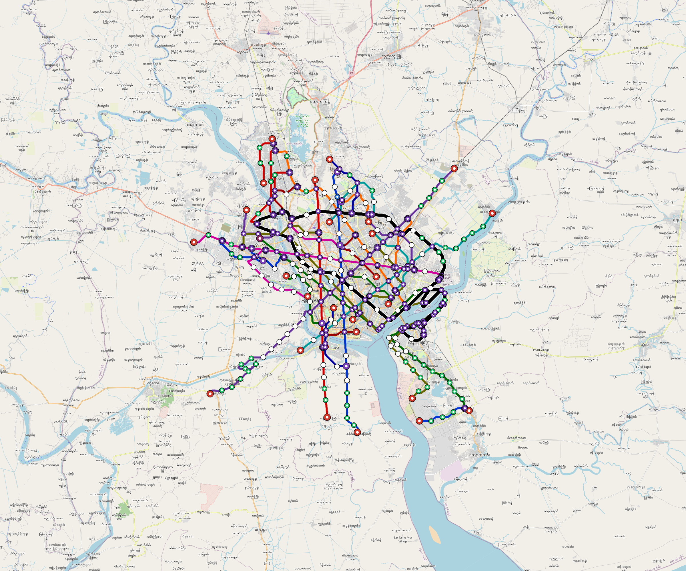

# Yangon — Urban Rail Network

**Country:** MM · **Population:** 5,200,000 · [National brief](../NATIONAL-BRIEF.md)

This page contains only Yangon-specific results. Shared routing, service, energy, civil, cost, finance, QA and validation methods are defined once in the [deployment planning reference](../../../../../docs/deployment-planning-reference.md).

> [!IMPORTANT]
> **Foreign-capital advantage:** against the default equivalent foreign-turnkey sensitivity, this local plan avoids **$43.88 bn (90.3%) of external capital** and **$56.69 bn of external interest**. Capital plus saved interest totals **$100.57 bn**. See the common reference for interpretation and limitations.

**Current alignment, depot and production basis.** Core corridors change from **321.816 km to 338.172 km**, with elevated land sections, water-aware radial routes and separately engineered bridge candidates at short water crossings. 0 core fragments retain raster geometry for further curve review. The centre is a design-centroid screen; survey, property, obstacles, foundations and geometry releases remain open. All **229 platform points** pass the retained water-mask screen; footprints, bank stability and access remain open. [Alignment controls](engineering/alignment/core-realignment.json) · [Before/after map](engineering/alignment/core-alignment-comparison.png) · [Water screen](engineering/alignment/station-water-screen.json).

**9 line-local depots** provide **806 full-fleet storage slots**, separate from workshop bays. Fleet length and workload set quantities; PV/storage is included once in depot capital. Site acceptance and installed/land/utility quotations remain open. [Depot costs](engineering/line-depots/README.md). The factory requires **806 metro-6car trainsets / 4836 cars**, with **18-month facility readiness**, then qualification and manufacture. Integrated openings wait for fleet readiness where production or test paths constrain them. Shared factory capital is counted once; concurrent national loading and supplier commitments remain open. [Factory and dates](engineering/factory/README.md).

Station staffing uses two posts, two normal eight-hour shifts, plus service-window, leave and training cover. Basic wages start at 1.5 times the retained country income proxy, with higher technical/management grades and employer allowances. [Staff](engineering/delivery/README.md) · [Finance](engineering/finance/summary.json). Finance retains country-specific fixed-price, steady-state assumptions; Baghdad’s indexed cashflows are separate.

Auto-planned by the OpenSourceRail design pipeline from the controlled city catalogue, source-locked geospatial inputs and shared templates. Population is counted once within the union of station circles; this is potential radial access, not a verified walkshed or fare-demand estimate. Reachable line pairs include transfers through intermediate lines. [Population radii, denominator and transfer paths](engineering/access/README.md) · [Viaduct beam, foundation and terrain checks](engineering/clearance/README.md).

## Network



| Local measure | Value |
|---|---:|
| Lines / unique stations / interchanges | 9 / 229 / 35 |
| Route length | 447.8 km double track |
| Direct transfers / reachable line pairs | 91.7% / 100.0% |
| Residents within 800 m radial station catchments | 2,053,496 (2020 raster; 33.5% of bbox) |
| Service span / peak headway | 05:30–02:00 / 3 min |
| Fleet | 806 × 6-car `metro-6car` trainsets (730 peak revenue) |
| Peak network throughput | 259,200 passengers/hour |
| Practical service capacity | 2,276,640 passenger-trips/day |
| Annual paid-trip planning range | 415.5–664.8 M |

### Lines

| Line | Length | Stations | Trainsets | Termini |
|---|---:|---:|---:|---|
| line-1 | 35.8 km | 17 | 74 | N Mid ↔ S Outer |
| line-2 | 31.8 km | 14 | 63 | S Outer ↔ NW Mid |
| line-3 | 59.4 km | 33 | 131 | SE Outer ↔ NW Mid |
| line-4 | 54.0 km | 18 | 102 | NE Outer ↔ SW Outer |
| line-5 | 48.5 km | 27 | 108 | SE Mid ↔ NW Outer |
| line-6 | 35.1 km | 14 | 65 | SW Mid ↔ NE Outer |
| line-7 | 36.1 km | 21 | 83 | W Outer ↔ E Mid |
| line-8 | 51.6 km | 33 | 127 | NW Mid ↔ S Mid |
| line-9 | 95.5 km | 52 | 53 | NW Outer ↔ NW Mid |
| **Total** | **447.8 km** | **229 unique** | **806** | |

## Energy

| Local measure | Value |
|---|---:|
| Scheduled service | 3,952 one-way journeys / 186,027 train-km/day |
| Annual traction demand | 1,760.0 GWh |
| Station/depot PV / storage | 105.0 MW / 760.0 MWh |
| Aggregate charging power | 418.0 MW |
| Dedicated solar plant | 1,034.5 MW |
| Residual grid/PPA import | 0.0 GWh/yr |
| Worst powered-stop gap | line-4: 17.9 km / 268 kWh |
| Lowest traversal charging margin | line-6: 336 kWh |

## Capital And Funding

| Local CAPEX bucket | Planning value |
|---|---:|
| Civil works | $21.15 bn |
| Stations | $1.53 bn |
| Depots | $313 M |
| Rolling stock | $1.35 bn |
| Dedicated solar plant | $828 M |
| Residual train control | $22 M |
| Charging microgrids | $86 M |
| EPC / project services | $1.71 bn |
| **Total city programme** | **$26.99 bn** |

| Local funding measure | Planning value |
|---|---:|
| Imported / external capital | $4.71 bn (17.4%) |
| Domestic / local capital | $22.29 bn (82.6%) |
| Annual public construction commitment | $2.98 bn / yr for 10 years |
| Annual post-grace debt service | $2.67 bn / yr |
| External capital saved vs default turnkey sensitivity | $43.88 bn |
| Capital + lifetime external interest saved | $100.57 bn |
| Annual OPEX | $542 M / yr |

## Local Evidence

| Package | Current status | Evidence |
|---|---|---|
| Finance | pass | [`summary.json`](engineering/finance/summary.json) |
| Native simulation + degraded cases | pass | [`validation-summary.json`](engineering/simulation/validation-summary.json) |
| SUMO timetable | pass | [`summary.json`](engineering/sumo/summary.json) |
| Independent OSR/SUMO running-time cross-check | pass; junction/authority gate open | [`operations-crosscheck.md`](engineering/simulation/operations-crosscheck.md) |
| GIS package | pass | [`summary.json`](engineering/gis/summary.json) |
| Solar/storage snapshot (operating duty unverified) | pass; 0 findings; 33 grid-only diagnostics | [`summary.json`](engineering/energy/summary.json) |
| Operations, QA and maintenance | 2,069 assets / 11,388 tasks | [`yangon-operations-manifest.json`](operations/yangon-operations-manifest.json) |

## Local Files And Regeneration

| File | Local role |
|---|---|
| [`design.toml`](design.toml) | Authoritative generated city design |
| [`yangon.toml`](yangon.toml) | Expanded simulator scenario |
| [`yangon.corridor.geojson`](yangon.corridor.geojson) | GIS corridor and stations |
| [`yangon.design-quality.yaml`](yangon.design-quality.yaml) | Coverage, source and civil-quality gates |

```bash
tools/automation/regenerate-city.sh yangon
```
