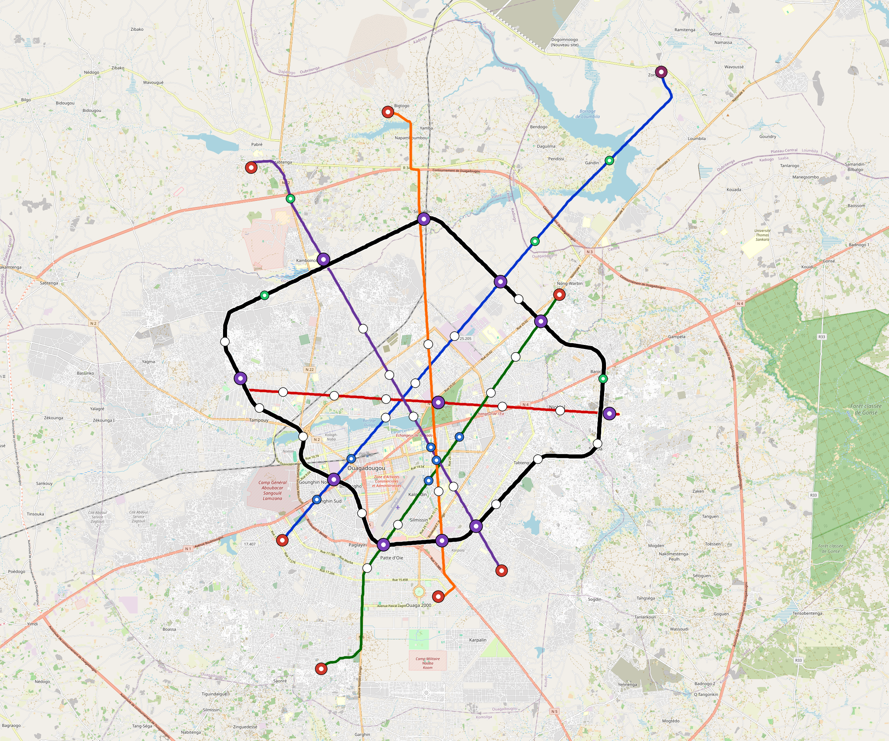

# Ouagadougou — Urban Rail Network

**Country:** BF · **Population:** 2,531,000 · [National brief](../NATIONAL-BRIEF.md)

This page contains only Ouagadougou-specific results. Shared routing, service, energy, civil, cost, finance, QA and validation methods are defined once in the [deployment planning reference](../../../../../docs/deployment-planning-reference.md).

> [!IMPORTANT]
> **Foreign-capital advantage:** against the default equivalent foreign-turnkey sensitivity, this local plan avoids **$10.89 bn (88.4%) of external capital** and **$14.07 bn of external interest**. Capital plus saved interest totals **$24.96 bn**. See the common reference for interpretation and limitations.

**Population-led network revision (2026-10-09).** The controlled planning inventory contains **33 lines**, including **27 additional residential lines**. **75.4%** of retained 2020 bbox residents are within a 1 km circle of the actual emitted station coordinates. The working target is 80%; remaining areas and station/access alternatives remain in the review. These are distance screens, not current census, surveyed walksheds or fare demand. New common corridor cells have identified junction/structure and access design requirements; no track switch or site approval is inferred. Country fleet, depot, civil, energy, staffing and financing models use the regenerated inventory, with installed quotations and operating acceptance still open. [Line additions and priorities](engineering/alignment/residential-line-expansion.json) · [Actual station coverage and source receipts](engineering/alignment/residential-expansion-evaluation.json).

**Current alignment, depot and production basis.** Core corridors change from **184.546 km to 256.430 km**, with elevated land sections, water-aware radial routes and separately engineered bridge candidates at short water crossings. 0 core fragments retain raster geometry for further curve review. The centre is a design-centroid screen; survey, property, obstacles, foundations and geometry releases remain open. All **262 platform points** pass the retained water-mask screen; footprints, bank stability and access remain open. [Alignment controls](engineering/alignment/core-realignment.json) · [Before/after map](engineering/alignment/core-alignment-comparison.png) · [Water screen](engineering/alignment/station-water-screen.json).

**33 line-local depots** provide **813 full-fleet storage slots**, separate from workshop bays. Fleet length and workload set quantities; PV/storage is included once in depot capital. Site acceptance and installed/land/utility quotations remain open. [Depot costs](engineering/line-depots/README.md). The factory requires **813 metro-4car trainsets / 3252 cars**, with **18-month facility readiness**, then qualification and manufacture. Integrated openings wait for fleet readiness where production or test paths constrain them. Shared factory capital is counted once; concurrent national loading and supplier commitments remain open. [Factory and dates](engineering/factory/README.md).

Station staffing uses two posts, two normal eight-hour shifts, plus service-window, leave and training cover. Basic wages start at 1.5 times the retained country income proxy, with higher technical/management grades and employer allowances. [Staff](engineering/delivery/README.md) · [Finance](engineering/finance/summary.json). Finance retains country-specific fixed-price, steady-state assumptions; Baghdad’s indexed cashflows are separate.

Auto-planned by the OpenSourceRail design pipeline from the controlled city catalogue, source-locked geospatial inputs and shared templates. Population is counted once within the union of station circles; this is potential radial access, not a verified walkshed or fare-demand estimate. Reachable line pairs include transfers through intermediate lines. [Population radii, denominator and transfer paths](engineering/access/README.md) · [Viaduct beam, foundation and terrain checks](engineering/clearance/README.md). Capital figures are base planning allowances: route-search scores are excluded from money, while special structures and installed-price gaps remain open. [Cost boundary](../../../../../docs/finance/civil-allowance-boundary.md).

## Network



| Local measure | Value |
|---|---:|
| Lines / unique stations / interchanges | 33 / 262 / 65 |
| Route length | 387.7 km double track |
| Direct transfers / reachable line pairs | 15.0% / 100.0% |
| Residents within 800 m radial station catchments | 2,227,490 (2020 raster; 57.1% of bbox) |
| Service span / peak headway | 05:30–02:00 / 3 min |
| Fleet | 813 × 4-car `metro-4car` trainsets (720 peak revenue) |
| Peak network throughput | 633,600 passengers/hour |
| Practical service capacity | 5,803,200 passenger-trips/day |
| Annual paid-trip planning range | 1059.1–1694.5 M |

### Lines

| Line | Length | Stations | Trainsets | Termini |
|---|---:|---:|---:|---|
| line-1 | 33.9 km | 21 | 69 | SW Inner ↔ NE Outer |
| line-2 | 19.4 km | 15 | 50 | E Mid ↔ NW Inner |
| line-3 | 25.5 km | 15 | 54 | S Mid ↔ NE Mid |
| line-4 | 27.7 km | 19 | 63 | NW Mid ↔ SE Mid |
| line-5 | 27.2 km | 17 | 59 | SE Mid ↔ N Outer |
| line-6 | 60.7 km | 35 | 31 | NW Mid ↔ NW Mid |
| line-7 |  5.6 km | 4 | 15 | W Inner ↔ W Mid |
| line-8 |  5.5 km | 5 | 17 | S Inner ↔ SE Mid |
| line-9 |  4.8 km | 4 | 14 | NW Inner ↔ NW Inner |
| line-10 |  6.3 km | 5 | 16 | SW Inner ↔ SW Mid |
| line-11 |  5.3 km | 5 | 16 | SE Mid ↔ SE Mid |
| line-12 |  8.3 km | 5 | 18 | SE Mid ↔ E Inner |
| line-13 |  8.1 km | 5 | 18 | W Inner ↔ SW Inner |
| line-14 |  5.3 km | 4 | 14 | S Mid ↔ S Inner |
| line-15 |  5.2 km | 4 | 15 | S Inner ↔ NW Inner |
| line-16 |  7.6 km | 7 | 23 | SW Inner ↔ SW Mid |
| line-17 |  4.1 km | 3 | 12 | NW Mid ↔ N Mid |
| line-18 |  4.5 km | 3 | 12 | NE Inner ↔ NE Inner |
| line-19 |  8.0 km | 6 | 21 | W Inner ↔ N Inner |
| line-20 |  5.1 km | 4 | 15 | N Inner ↔ N Mid |
| line-21 |  6.9 km | 4 | 15 | NW Mid ↔ W Mid |
| line-22 |  5.4 km | 5 | 17 | SW Inner ↔ W Mid |
| line-23 |  5.6 km | 4 | 15 | NE Inner ↔ NE Inner |
| line-24 | 11.5 km | 7 | 24 | NW Mid ↔ W Mid |
| line-25 |  5.3 km | 4 | 14 | SW Inner ↔ S Mid |
| line-26 |  7.3 km | 5 | 17 | SE Mid ↔ E Mid |
| line-27 | 15.7 km | 9 | 31 | W Inner ↔ SW Mid |
| line-28 |  9.1 km | 7 | 23 | SE Mid ↔ SE Mid |
| line-29 |  4.5 km | 4 | 14 | NE Mid ↔ E Inner |
| line-30 |  6.8 km | 7 | 23 | SW Inner ↔ SW Mid |
| line-31 |  4.7 km | 3 | 11 | SE Mid ↔ SE Mid |
| line-32 |  9.8 km | 6 | 21 | S Mid ↔ SE Inner |
| line-33 | 17.0 km | 11 | 36 | SW Inner ↔ W Inner |
| **Total** | **387.7 km** | **262 unique** | **813** | |

## Energy

| Local measure | Value |
|---|---:|
| Scheduled service | 15,112 one-way journeys / 166,167 train-km/day |
| Annual traction demand | 1,048.1 GWh |
| Station/depot PV / storage | 222.9 MW / 1,609.5 MWh |
| Aggregate charging power | 339.0 MW |
| Dedicated solar plant | 251.7 MW |
| Residual grid/PPA import | 0.0 GWh/yr |
| Worst powered-stop gap | line-1: 12.3 km / 137 kWh |
| Lowest traversal charging margin | line-24: 68 kWh |

## Capital And Funding

| Local CAPEX bucket | Planning value |
|---|---:|
| Civil works | $3.15 bn |
| Stations | $1.51 bn |
| Depots | $542 M |
| Rolling stock | $911 M |
| Dedicated solar plant | $201 M |
| Residual train control | $19 M |
| Charging microgrids | $71 M |
| EPC / project services | $434 M |
| **Total city programme** | **$6.84 bn** |

| Local funding measure | Planning value |
|---|---:|
| Imported / external capital | $1.42 bn (20.8%) |
| Domestic / local capital | $5.42 bn (79.2%) |
| Annual public construction commitment | $584 M / yr for 10 years |
| Annual post-grace debt service | $528 M / yr |
| External capital saved vs default turnkey sensitivity | $10.89 bn |
| Capital + lifetime external interest saved | $24.96 bn |
| Annual OPEX | $160 M / yr |

## Local Evidence

| Package | Current status | Evidence |
|---|---|---|
| Finance | pass | [`summary.json`](engineering/finance/summary.json) |
| Native simulation + degraded cases | pass | [`validation-summary.json`](engineering/simulation/validation-summary.json) |
| SUMO timetable | pass | [`summary.json`](engineering/sumo/summary.json) |
| Independent OSR/SUMO running-time cross-check | pass; junction/authority gate open | [`operations-crosscheck.md`](engineering/simulation/operations-crosscheck.md) |
| GIS package | pass | [`summary.json`](engineering/gis/summary.json) |
| Solar/storage snapshot (operating duty unverified) | pass; 0 findings; 37 grid-only diagnostics | [`summary.json`](engineering/energy/summary.json) |
| Operations, QA and maintenance | 2,274 assets / 11,910 tasks | [`ouagadougou-operations-manifest.json`](operations/ouagadougou-operations-manifest.json) |

## Local Files And Regeneration

| File | Local role |
|---|---|
| [`design.toml`](design.toml) | Authoritative generated city design |
| [`ouagadougou.toml`](ouagadougou.toml) | Expanded simulator scenario |
| [`ouagadougou.corridor.geojson`](ouagadougou.corridor.geojson) | GIS corridor and stations |
| [`ouagadougou.design-quality.yaml`](ouagadougou.design-quality.yaml) | Coverage, source and civil-quality gates |

```bash
tools/automation/regenerate-city.sh ouagadougou
```
