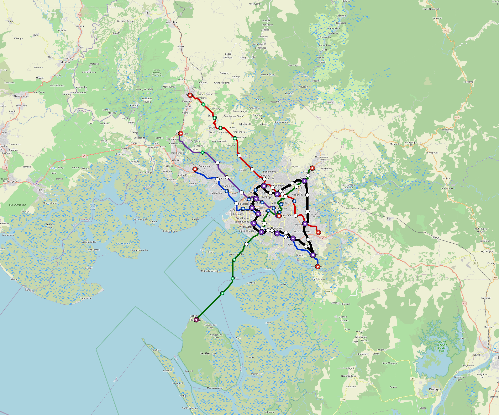

# Douala — Urban Rail Network

**Country:** CM · **Population:** 3,900,000 · [National brief](../NATIONAL-BRIEF.md)

This page contains only Douala-specific results. Shared routing, service, energy, civil, cost, finance, QA and validation methods are defined once in the [deployment planning reference](../../../../../docs/deployment-planning-reference.md).

> [!IMPORTANT]
> **Foreign-capital advantage:** against the default equivalent foreign-turnkey sensitivity, this local plan avoids **$3.67 bn (85.6%) of external capital** and **$4.60 bn of external interest**. Capital plus saved interest totals **$8.27 bn**. See the common reference for interpretation and limitations.

Auto-planned by the OpenSourceRail design pipeline from the controlled city catalogue, source-locked geospatial inputs and shared templates.

## Network



| Local measure | Value |
|---|---:|
| Lines / unique stations / interchanges | 5 / 78 / 12 |
| Route length | 207.5 km double track |
| Coverage / transfer reachability | 55.5% / 40% |
| Estimated station catchment | 2,164,500 residents |
| Service span / peak headway | 05:30–02:00 / 3 min |
| Fleet | 322 × 6-car `metro-6car` trainsets (290 peak revenue) |
| Peak network throughput | 144,000 passengers/hour |
| Practical service capacity | 1,205,280 passenger-trips/day |
| Annual paid-trip planning range | 220.0–351.9 M |

### Lines

| Line | Length | Stations | Trainsets | Termini |
|---|---:|---:|---:|---|
| line-1 | 37.9 km | 15 | 72 | SE Mid ↔ NW Mid |
| line-2 | 42.9 km | 16 | 81 | NW Outer ↔ SE Mid |
| line-3 | 45.0 km | 15 | 87 | NE Mid ↔ SW Outer |
| line-4 | 29.0 km | 10 | 56 | SE Inner ↔ NW Outer |
| line-5 | 52.8 km | 22 | 26 | N Inner ↔ NW Inner |
| **Total** | **207.5 km** | **78 unique** | **322** | |

## Energy

| Local measure | Value |
|---|---:|
| Scheduled service | 2,092 one-way journeys / 84,233 train-km/day |
| Annual traction demand | 796.9 GWh |
| Station/depot PV / storage | 25.7 MW / 178.0 MWh |
| Aggregate charging power | 140.0 MW |
| Dedicated solar plant | 493.5 MW |
| Residual grid/PPA import | 0.0 GWh/yr |
| Worst powered-stop gap | line-3: 17.8 km / 266 kWh |
| Lowest traversal charging margin | line-4: 289 kWh |

## Capital And Funding

| Local CAPEX bucket | Planning value |
|---|---:|
| Civil works | $822 M |
| Stations | $444 M |
| Depots | $8.0 M |
| Rolling stock | $541 M |
| Dedicated solar plant | $395 M |
| Residual train control | $10 M |
| Charging microgrids | $31 M |
| EPC / project services | $130 M |
| **Total city programme** | **$2.38 bn** |

| Local funding measure | Planning value |
|---|---:|
| Imported / external capital | $618 M (26.0%) |
| Domestic / local capital | $1.76 bn (74.0%) |
| Annual public construction commitment | $198 M / yr for 7 years |
| Annual post-grace debt service | $165 M / yr |
| External capital saved vs default turnkey sensitivity | $3.67 bn |
| Capital + lifetime external interest saved | $8.27 bn |
| Annual OPEX | $57 M / yr |

## Local Evidence

| Package | Current status | Evidence |
|---|---|---|
| Finance | pass | [`summary.json`](engineering/finance/summary.json) |
| Native simulation + degraded cases | pass | [`validation-summary.json`](engineering/simulation/validation-summary.json) |
| SUMO timetable | pass | [`summary.json`](engineering/sumo/summary.json) |
| GIS package | pass | [`summary.json`](engineering/gis/summary.json) |
| Grid/charging/solar | pass | [`summary.json`](engineering/energy/summary.json) |
| Operations, QA and maintenance | 766 assets / 3,445 tasks | [`douala-operations-manifest.json`](operations/douala-operations-manifest.json) |

## Local Files And Regeneration

| File | Local role |
|---|---|
| [`design.toml`](design.toml) | Authoritative generated city design |
| [`douala.toml`](douala.toml) | Expanded simulator scenario |
| [`douala.corridor.geojson`](douala.corridor.geojson) | GIS corridor and stations |
| [`douala.design-quality.yaml`](douala.design-quality.yaml) | Coverage, source and civil-quality gates |

```bash
tools/automation/regenerate-city.sh douala
```
