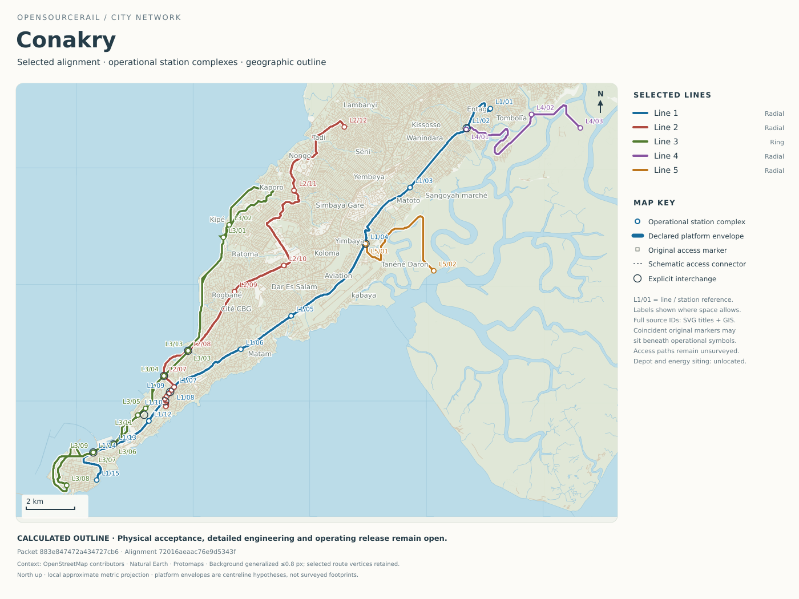

# Conakry — railway design and city programme

**GN · Calculated outline complete · Class C estimates · Physical verification pending**

[City index](../../../README.md) · [National programme](../NATIONAL-BRIEF.md) · [Interactive map](../../../../../docs/workbench/current/index.html?outlineCity=conakry) · [Planning workspace](../../../../../docs/workbench/planning/index.html?city=conakry) · [Methods and assumptions](../../../../../docs/design-engine/city-dossiers/README.md)



[Open full-size map](engineering/outline/network.svg) · [Download GIS bundle](engineering/outline/gis.zip) · [Complete dossier data](engineering/outline/summary.json)

## City and network

This city programme uses its exact selected mapped alignment, vehicle reference, service calculation and cost ledger. Demand, site and unit-rate assumptions support a complete outline for comparison; they do not substitute for surveys, detailed engineering or operational approval.

| Network measure | Current outline |
|---|---|
| Population context | 2,010,000 — retained planning input; not a demand survey |
| Selected alignment | Anchor preserving chord research |
| Route length / trackways | 103.02 km / 2 trackways |
| Lines / operational platform groups | 5 / 45 |
| Original access markers / separately costed access sites | 54 / 24 |
| Explicit interchange references | 9 |
| Fleet including reserve | 126 six-car trainsets |
| Train distance | 66,754 train-km/day; 24,365,375 /year |
| Service span | 18 h/day, 365 days/year; clock timetable not yet assigned |
| Peak demand brief | 4,000 passengers/h/direction per line — assumed, not additive network ridership |
| Planning occupancy / availability | 85% / 99% — assumptions |

Operational platform groups are counted per line. Interchange access sites and original markers are separate quantities; none is silently treated as a unique city-wide station count. Catchment and access scenarios are described below; authenticated population coverage and demand forecasts remain open.

### Lines, service and fleet

| Line | Route km | Platform groups | Headway s | One-way / circuit min | Active + reserve | Usable pphpd | Mapped termini |
|---|---|---|---|---|---|---|---|
| line-1 | 29.42 | 15 | 200 | 56.0 | 36 + 6 | 4,181 | NE terminal ↔ SW terminal |
| line-2 | 21.61 | 12 | 200 | 34.5 | 23 + 4 | 4,181 | SW terminal ↔ N terminal |
| line-3 | 37.12 | 13 | 200 | 54.4 | 34 + 6 | 4,181 | Ring / closed circuit |
| line-4 | 8.41 | 3 | 200 | 10.2 | 8 + 2 | 4,181 | NE terminal ↔ NE terminal |
| line-5 | 6.45 | 2 | 200 | 6.4 | 6 + 1 | 4,181 | E terminal ↔ E terminal |

Compass termini describe mapped endpoint positions relative to the network centre; official station names require local planning. The six-car reference provides 276 normal passenger places, including wheelchair places, with no planned standing. Headway is a calculated service choice. Journey times are conditional calculations; protected signalling timetables and actual available thrust remain separate work.

[Line details and energy](engineering/outline/lines.csv) · [Station and access register](engineering/outline/stations.csv)

### Connections and access

Declared transfer graph: 1 connected line group(s): line-1, line-2, line-3, line-4, line-5. These are explicit planned connections; walking paths and accessible interchange layouts are not yet surveyed.

<details><summary>Access and catchment assumptions</summary>

Geometric access scenarios are separate from measured population coverage. Full assumptions and outputs are in the dossier data.

| Radius m | Straight line walk minutes | Station circle area sum km2 | Overlaps removed | Population coverage |
|---|---|---|---|---|
| 400.00 | 6.67 | 22.62 | False | Unestablished |
| 800.00 | 13.33 | 90.48 | False | Unestablished |

</details>

## Energy and propulsion

| Energy measure | Daily | Annual |
|---|---|---|
| Mechanical traction work | 270,386 kWh mechanical | 98.69 GWh mechanical |
| Nominal auxiliary load | 404,460 kWh | 147.63 GWh |
| Auxiliary supply including scenario charging losses | 425,747 kWh | 155.40 GWh |
| Reserve-fleet auxiliary supply scenario | See annual budget | 2.76 GWh |
| Total priced grid-supply scenario | See annual budget | 283.08 GWh |
| Physically supported total grid demand | Unestablished | Unestablished |

| Annual electricity budget | Low | Base | High |
|---|---|---|---|
| Priced supply/efficiency scenario | $18.16m | $46.87m | $140.37m |

Mechanical work is distinct from electricity purchased. The monetary electricity scenarios include declared efficiency and site-load assumptions; they do not establish a measured motor map, solar plant, storage installation or self-sufficient energy supply. Each line retains its candidate-specific launch, braking and recovery requirements in the complete record.

| Line | Propulsion research concept | Additional traction mass / car | Additional reserve / car |
|---|---|---|---|
| line-1 | Station launch reference | 0 kg | 250 kg |
| line-2 | Powered axle continuous research | 1,000 kg | 250 kg |
| line-3 | Powered axle continuous research | 1,000 kg | 250 kg |
| line-4 | Powered axle continuous research | 1,000 kg | 250 kg |
| line-5 | Powered axle continuous research | 1,000 kg | 250 kg |

The city research configuration is separate from the selected passive reference vehicle. Onboard-traction comparisons carry their own additional mass and cost assumptions; they do not silently change that reference or establish complete installed equipment.

| Line | Motors/car / rated kW per car | Continuous feed | Required train force | Required mechanical peak | Station-fin comparison envelope | Actual force map |
|---|---|---|---|---|---|---|
| line-1 | 0 / 0.0 kW | 0.00 km | 156.1 kN | 3.12 MW | 316.5 m | Unestablished |
| line-2 | 4 / 749.2 kW | 21.61 km | 162.9 kN | 3.26 MW | Other interface | Unestablished |
| line-3 | 4 / 749.2 kW | 37.12 km | 162.9 kN | 3.26 MW | Other interface | Unestablished |
| line-4 | 4 / 749.2 kW | 8.41 km | 162.9 kN | 3.26 MW | Other interface | Unestablished |
| line-5 | 4 / 749.2 kW | 6.45 km | 162.9 kN | 3.26 MW | Other interface | Unestablished |

These are declared requirements and equipment hypotheses, not measured motor capability. A station-launch row retains an unselected wayside mechanism and priced equipment provision. The station-fin comparison envelope does not prescribe installed motor length or apply to an onboard-traction interface. Independent friction braking, collector/electrical protection and protected recovery remain required for every concept.

### Why some lines use a research alternative

The table retains the rejected station-only reference screen. An alternative is selected for conditional outline calculation where that reference cannot meet the declared leg; this does not prove every station-powered design impossible or qualify the replacement hardware.

| Line | Affected reference legs | Necessary-bound failure | Longest affected leg | Reference flat coast reach |
|---|---|---|---|---|
| line-2 | 1 | Coast stops before receiving zone | 5,596.8 m | 5,554.5 m |
| line-3 | 2 | Coast stops before receiving zone | 6,257.8 m | 5,554.5 m |
| line-4 | 1 | Coast stops before receiving zone | 5,658.6 m | 5,554.5 m |
| line-5 | 1 | Coast stops before receiving zone | 6,454.7 m | 5,554.5 m |

## Civil works, depot and manufacture

| Quantity / resource | Calculated requirement |
|---|---|
| At grade route | 12.48 km |
| Bridge route | 4.77 km |
| Elevated route | 85.76 km |
| Tunnel route | 0.00 km |
| Precast span stock | 9,470 spans |
| Independent supports | 9,752 |
| Running rail | 425.26 rail-km / 25,605 t |
| Complete fastening sets | 744,213 |
| Protected at-grade crossing packages | 88 |
| Bridge runs / tunnel portals | 26 / 0 |
| Additional station track | 6,600 m |
| Access connector allowance | 634.7 m; actual accessible paths require survey |
| Pooled depot area | 88,296 m²; location and line connections require a site plan |
| Factory / civil working pattern | 2 / 2 shifts/day |

Civil classes and quantities follow the mapped scenario. Foundation capacities, bearings, erection stability, river crossings, utilities and ground conditions require site-specific design. The depot allowance includes pooled storage/workshop scope and budgeted connections; it does not identify an acquired or physically connected depot site.

### Factory capacity and make/buy

| Factory investment | Low | Base | High |
|---|---|---|---|
| Vehicle equipment, tooling and premises | $781,364 | $2.70m | $14.45m |
| Civil production campaign | $3.11m | $14.62m | $85.53m |

Factory capital is already included in the city capital ledger. It must not be added a second time. Make/buy comparisons use committed city volume, equipment/tooling, material, labour, yield and productive capacity; no speculative future-city discount is assumed.

| Component / process | Provisional route |
|---|---|
| located-stock/passive-bogie-pair/steel | buy |
| located-stock/passive-secondary/aluminium | buy |
| located-stock/retained-comfort/body/composite | buy |
| located-stock/retained-comfort/body/generic | make |
| located-stock/retained-comfort/doors/generic | Unestablished |
| located-stock/retained-comfort/glazing/generic | Unestablished |
| located-stock/retained-comfort/seating/generic | Unestablished |
| located-stock/wheel-underframe/aluminium | make |
| unlocated-account/attachments | Unestablished |
| unlocated-account/passive-bogie-pair | Unestablished |
| unlocated-account/retained-comfort/HVAC | Unestablished |
| unlocated-account/retained-comfort/body | buy |
| unlocated-account/retained-comfort/doors | Unestablished |
| unlocated-account/retained-comfort/frame-joints | Unestablished |
| unlocated-account/retained-comfort/glazing | Unestablished |
| unlocated-account/retained-comfort/seating | Unestablished |
| unlocated-account/roof-thermal | Unestablished |
| unlocated-account/services | Unestablished |
| six-car-final-vehicle-assembly | Unestablished |
| reference-factory-to-assembly-delivery | Unestablished |

| Precast case | Selected route | Parallel cells | Required cell-hours | Productive person-hours | Paid person-hours |
|---|---|---|---|---|---|
| low | make | 4 | 33,145 | 246,220 | 328,293 |
| base | make | 9 | 80,495 | 643,960 | 858,613 |
| high | make | 25 | 217,810 | 1,780,360 | 2,373,813 |

[Complete manufacturing routes and comparisons](engineering/outline/make_buy.csv) · [Quantities and delivery requirements](engineering/outline/delivery_requirements.csv) · [Vehicle, station and civil 3D models](../../../../../docs/engineering-models/README.md)

## Workforce and construction programme

Production and civil works use two shifts. The operating case uses 18 service hours/day and a 2-shift planning convention; named-worker rosters, shift lengths, relief and local employment requirements need an approved calendar. Extended operation can require three shifts.

| Domain / case | Covered positions per shift | Two-shift people floor | Paid person-hours | Paid FTE equivalent |
|---|---|---|---|---|
| Control room and access-site coverage / low | 26 | Unestablished | 187,902 | 94.0 |
| Vehicle production / low | 18 | 36 | Unestablished | Unestablished |
| Civil field / low | 35 | 70 | 356,555 | Unestablished |
| Civil other installation / low | 326 | 652 | 3,386,237 | Unestablished |
| Civil precast / low | 32 | 64 | 328,293 | Unestablished |
| Control room and access-site coverage / base | 52 | Unestablished | 427,050 | 213.5 |
| Vehicle production / base | 51 | 102 | Unestablished | Unestablished |
| Civil field / base | 128 | 256 | 1,120,171 | Unestablished |
| Civil other installation / base | 2,134 | 4,268 | 18,778,209 | Unestablished |
| Civil precast / base | 72 | 144 | 858,613 | Unestablished |
| Control room and access-site coverage / high | 104 | Unestablished | 1,024,920 | 512.5 |
| Vehicle production / high | 139 | 278 | Unestablished | Unestablished |
| Civil field / high | 555 | 1,110 | 3,104,971 | Unestablished |
| Civil other installation / high | 19,852 | 39,704 | 111,165,604 | Unestablished |
| Civil precast / high | 200 | 400 | 2,373,813 | Unestablished |

Paid FTE is a budgeting convention, distinct from simultaneous posts and named employees. Source labour and relief are already in the priced model; this staffing view does not add another payroll charge.

| Function / skills | Base coverage posts | Paid FTE | Authority / staffing boundary |
|---|---|---|---|
| Control room / dispatch / response | 4 | 16.4 | Source control/access coverage; operations authority requires separate assurance |
| Station and access-site service | 48 | 197.1 | Source access coverage; accessible assistance and local duties require roster design |
| Vehicle workshop / electrical / brakes | Unestablished | Unestablished | Maintenance budget envelope exists; detailed roles, competence and productive hours require routing |
| Civil infrastructure / track / inspections | Unestablished | Unestablished | Maintenance scope exists; inspection tasks and geographic workload require a site plan |
| Station power / propulsion / controls | Unestablished | Unestablished | Qualified equipment-specific maintenance and protection work |
| Cleaning / security / passenger emergencies | Unestablished | Unestablished | Site/service responsibilities and employee/contractor allocation remain to be sized |
| Programme management / procurement / finance / HR | Unestablished | Unestablished | Business entity, reporting lines and operating overhead allocation require review |
| Training / competence / independent assurance | Unestablished | Unestablished | Independent release authority and competence records remain mandatory |

**Staffing boundary:** the operations rows size control-room and access-site coverage only. They are not the complete operating company. Unallocated maintenance/support functions have budget envelopes or open allocation; their unknown FTE is not zero. No recruitment or complete-organisation claim follows from this table.

The provisional delivery sequence is: Survey and site investigation → Detailed design and independent review → Factory setup and procurement → Foundation and civil production → Transport and installation → Power controls and access installation → Integration testing and release. Factories, field crews and access must be checked together. Aggregate resource envelopes are distinct from resource-levelled, site-approved construction schedules.

[Workforce cases](engineering/outline/workforce.csv) · [Production and construction requirements](engineering/outline/delivery_requirements.csv)

## Capital, operating costs and whole-life economics

| Programme estimate | Low | Base | High |
|---|---|---|---|
| Installed capital | $557.68m | $1.956bn | $11.475bn |
| Installed capital / route-km | $5.41m | $18.99m | $111.39m |
| 30-year whole-life NPV | $1.099bn | $3.849bn | $21.847bn |
| Annual operating provision | $25.06m | $83.42m | $427.58m |

US dollars, 4% real discount rate, 30-year horizon. Low/base/high are assumption cases, not statistical confidence intervals. Transferred sourcing and construction rates require local calibration.

| Scope | Installed capital · base | Whole-life NPV · base |
|---|---|---|
| Rolling stock | $384.02m | $384.02m |
| Guideway | $144.70m | $144.70m |
| Stations power | $384.82m | $384.82m |
| Factory tooling | $17.32m | $17.32m |
| Construction | $874.85m | $874.85m |
| Land utilities depot | $103.18m | $103.18m |
| Fleet | $35.56m | $35.56m |
| Energy | $0 | $810.43m |
| Operations | $0 | $57.77m |
| Maintenance | $0 | $527.44m |
| Renewals | $0 | $432.75m |
| Recovery | $11.59m | $23.61m |
| Reliability | $0 | $34.88m |
| Disposal | $0 | $18.09m |

[Full capital and lifecycle ledger](engineering/outline/costs.csv)

### Price inputs and confidence

These are calculated v0.6-derived outline prices. Country-specific demand, ground conditions, local contracts and supplier quotations are not established by this calculation. The price includes the declared mixed propulsion research configurations shown above; it is not a quotation for an already proven station-powered railway.

| Operating input | Low | Base | High |
|---|---|---|---|
| Electricity · US$/kWh | 0.066 | 0.166 | 0.464 |
| Loaded operating wage · US$/paid hour | 6.21 | 7.82 | 10.93 |

Input status: transferred-reference-estimates. Scoped local tariff/wage overrides can replace those accounts; they do not apply a blanket discount to imported equipment or civil quantities. Reserve-fleet auxiliary consumption and charging losses are included in the electricity budget.

| Largest capital allowance | Base estimate | Share of capital |
|---|---|---|
| City project risk contingency | $391.21m | 20.0% |
| Network delivered assembled fleet | $307.00m | 15.7% |
| Bridge special foundations deck temporary | $142.76m | 7.3% |
| Design prototypes independent review | $115.56m | 5.9% |
| Shared access and transfer complexes | $74.17m | 3.8% |

[Annual energy budget](engineering/outline/energy_budget.csv) · [Local operating inputs](engineering/outline/local_cost_inputs.csv)

### Civil classification comparison

The headline retains the mapped civil allowances. A separate alternative uses the retained WorldCover/OSM water evidence to distinguish water crossings from other bridge allowances. Dry land does not establish that a bridge is unnecessary: roads, utilities, clearances and ground conditions remain unsurveyed.

| Same-route, same-service estimate | Low | Base | High |
|---|---|---|---|
| Headline installed capital | $557.68m | $1.956bn | $11.475bn |
| Water-evidence alternative capital | $568.40m | $2.017bn | $11.967bn |
| Alternative capital / route-km | $5.52m | $19.58m | $116.16m |
| Alternative whole-life NPV | $1.109bn | $3.912bn | $22.356bn |
| Included non-water obstruction reserve | $55,009 | $366,725 | $2.57m |

0.73 km of legacy bridge allowance is represented as elevated construction plus an explicit obstruction reserve in this alternative. 9 water/civil interface holds require investigation. The reserve is a provisional estimate, not evidence that the crossing work is fully sized. Historical evidence revision: `a0389044828f`. This comparison does not select a new alignment, civil design or physical baseline.

### Passenger receipts and funding scenarios

The following sensitivities use explicitly assumed daily demand profiles, average trip length, transfers, paid-trip collection and fares. They are calculated planning scenarios, not surveyed ridership or an approved financing plan. Import origin and financing source are distinct: no local/import share or foreign-turnkey saving is asserted without an evidenced procurement allocation.

| Demand sensitivity | Assumed annual paid trips | Fare US$ | Annual receipts | Operating balance | 30-year receipts less costs NPV | Post-grace DSCR |
|---|---|---|---|---|---|---|
| 50% | 53.89m | 0.25 | $13.47m | $-69.95m | $-3.616bn | -0.55 |
| 50% | 53.89m | 0.50 | $26.95m | $-56.47m | $-3.383bn | -0.45 |
| 50% | 53.89m | 1.00 | $53.89m | $-29.53m | $-2.917bn | -0.23 |
| 75% | 80.84m | 0.25 | $20.21m | $-63.21m | $-3.500bn | -0.50 |
| 75% | 80.84m | 0.50 | $40.42m | $-43.00m | $-3.150bn | -0.34 |
| 75% | 80.84m | 1.00 | $80.84m | $-2.58m | $-2.451bn | -0.02 |
| 100% | 107.79m | 0.25 | $26.95m | $-56.47m | $-3.383bn | -0.45 |
| 100% | 107.79m | 0.50 | $53.89m | $-29.53m | $-2.917bn | -0.23 |
| 100% | 107.79m | 1.00 | $107.79m | $24.37m | $-1.986bn | 0.19 |

This table holds the engineering cost case at **base** and varies demand and fare. A negative balance is retained as a financing/design warning. Operating balance excludes scheduled renewal capital and debt service; the whole-life NPV column uses the complete unfinanced cost.

| Demand hypothesis | Value |
|---|---|
| Counter-direction peak fraction | 60% |
| Mean section / peak section loading | 50% |
| Average trip / line length | 35% |
| Boardings per linked trip | 1.25 |
| Paid collection fraction | 95% |
| Daily profile | 22.2% of hours at 100% peak flow; 44.4% of hours at 45% peak flow; 33.3% of hours at 15% peak flow |

**Illustrative funding overlay:** 70% financed, 4% real annual interest, 20 years including 3 years without payments and with capitalised interest. The model draws the entire loan at year zero; a real construction draw schedule requires its own dated plan. DSCR compares annual receipts less operating provision with level post-grace debt service; no lender acceptance is implied.

| Cost case | Illustrative loan principal | Equity / grant requirement | Post-grace annual debt service |
|---|---|---|---|
| low | $390.38m | $167.30m | $36.10m |
| base | $1.369bn | $586.81m | $126.60m |
| high | $8.032bn | $3.442bn | $742.70m |

[All demand, fare and funding sensitivities](engineering/outline/finance.csv). Assumptions, cost-covering fares and financing treatment are in [the complete dossier](engineering/outline/summary.json). Funding charges are separate from the canonical unfinanced engineering cost; a loan scenario does not change the railway capital ledger.

## Site, engineering and delivery evidence

| Work package | Current basis | Next evidence / action |
|---|---|---|
| Network and alignment | Mapped selected proposal and explicit interchange references | Survey alignment, land/access, gradients, clearances and crossing interfaces |
| Demand and accessibility | Declared peak-flow brief and outline passenger configuration | Local OD/demand validation, station naming, accessible walking and evacuation layouts |
| Ground, flood and utilities | Mapped civil classes and bounded site allowances | Survey control, utility records, geotechnical investigation, flood/drainage and foundation design |
| Vehicle and civil structure | Identified reference parts, mass allowances and priced quantities | Installed mass/CG, joints, fatigue, stability, bearings, moving loads and erection checks |
| Propulsion, energy and braking | Conditional force/energy/service model | Achievable force/thermal maps, independent braking, protected recovery and degraded journeys |
| Manufacturing and workforce | Calculated make/buy, tooling, shifts and resource envelopes | Detailed routing, QA, crew/workstation calendar, supplier confirmation and trial production |
| Business execution | Candidate-bound disabled procurement/BOM/HR drafts | Target-system schema validation, reviewed masters, permissions and approved release |

Outline completion is recorded positively. Physical engineering, prototype validation, procurement approval, manufacturing release and movement authority remain separate. [Candidate-bound physical evidence record](engineering/current/README.md).

## Files and reproduction

| File | Contents |
|---|---|
| [Summary](engineering/outline/summary.json) | Complete calculation-linked dossier and scenario policy |
| [Map](engineering/outline/network.svg) | Selected network over verified geographic context |
| [Lines](engineering/outline/lines.csv) / [stations](engineering/outline/stations.csv) | Service, fleet, section/stop/access references |
| [GIS bundle](engineering/outline/gis.zip) | Eight GeoJSON layers: routes, platforms, stations, original markers, interchanges, connectors, civil classes and unlocated requirements |
| [Costs](engineering/outline/costs.csv) / [finance](engineering/outline/finance.csv) | Canonical budgets and separate passenger/funding sensitivities |
| [Workforce](engineering/outline/workforce.csv) / [make-buy](engineering/outline/make_buy.csv) | Shift, resource and production comparisons |
| [Delivery requirements](engineering/outline/delivery_requirements.csv) | Provisional phase/resource and site tasks |
| [Delivery and business drafts](engineering/outline/delivery-draft.json.gz) | Source-bound procurement packages, provisional BOM/routing and disabled ERPNext/Frappe HR records |
| [Source identities](engineering/outline/manifest.json) | Presentation, atlas, outline, physical candidate and output hashes |
| [Current outline record](../../../../../docs/design-engine/city-atlas/cities/conakry.json.gz) | Same-candidate service, costs and selected geometry |
| [Geographic source](city.json) / [context](map-context.json.gz) | Planning inputs and attribution |

```sh
python -m engineering.city_reports.publication publish
python -m engineering.city_reports.publication verify
```

A recalculated local study can be opened, edited and exported in the Workbench. The published city page remains bound to the selected published outline until regenerated.

[Earlier city source dossier](https://github.com/modernecotech/OpenSourceRail/tree/205e8dc158c83fcdc2dca9ceb8bad0a7e8b3f61e/cities/catalogue/west-africa/Guinea/Conakry) preserves the former reports and downloads under their own vehicle, energy and finance assumptions. Those results are not used as current evidence.

<details><summary>Candidate and calculation identities</summary>

| Identity | Value |
|---|---|
| city_input_id | `960f07ffc0e091099a892faa9e7f28d38af407c7d8df56d49db5992c4955e3b0` |
| cost_evaluation_id | `ac4296091c218a4e8e53fdcf122e6092a387fd66969a3f3d79bcaa1ea1ee2df2` |
| outline_evaluation_id | `0c0fab612f5634bee3908d6951b067950cc510d7b620ef2a9dc03da0cab3dbcd` |
| research_configuration_id | `93bdfed799b2bba5e18d788410543159f3be69bd98723fbddf6fc863db016a2c` |
| seed_id | `b9d0a7570f08d3887abbb3a27e8376ca2bd55bab47e65c4ce9dc141ad6fd8365` |
| selected_alignment_id | `72016aeaac76e9d5343facf29c911841f0ee065acbf874bd3ec1d88edb1a475c` |
| selected_alignment_kind | `anchor-preserving-chord-research` |
| selection_id | `e56fd43277b64a1c40a30bc2f6c04b74498263b6e3945a6889b01af6f4394803` |
| service_evaluation_id | `3cdde1740d133eeff0112d88efb2bfebb86a996da5fb1134c35763941a6e6a38` |
| source_result_sha256 | `3b269e6ab6e0df86aeaf49b84ab4f8838cce3d0f16d0503a2df3459c8e896768` |

Atlas packet `c351755e9c0b37cee8666e0382bb5866bfd9bb306eb9e7b6f453cb10b713ebc8`. Physical reference `756a68870162f7559b052b05c9b201728c9f448e3bb61114f287848c02f2d3a3`.

</details>

[Project introduction](../../../../../README.md) · [Current engineering](../../../../../docs/design-engine/current/README.md)
