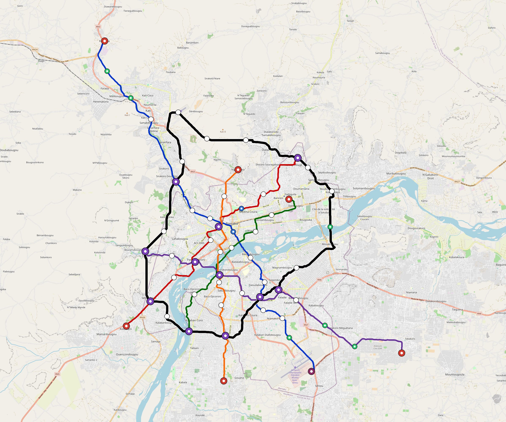

# Bamako — Urban Rail Network

**Country:** ML · **Population:** 2,929,000 · [National brief](../NATIONAL-BRIEF.md)

This page contains only Bamako-specific results. Shared routing, service, energy, civil, cost, finance, QA and validation methods are defined once in the [deployment planning reference](../../../../../docs/deployment-planning-reference.md).

> [!IMPORTANT]
> **Foreign-capital advantage:** against the default equivalent foreign-turnkey sensitivity, this local plan avoids **$3.38 bn (88.1%) of external capital** and **$4.36 bn of external interest**. Capital plus saved interest totals **$7.74 bn**. See the common reference for interpretation and limitations.

Auto-planned by the OpenSourceRail design pipeline from the controlled city catalogue, source-locked geospatial inputs and shared templates.

## Network



| Local measure | Value |
|---|---:|
| Lines / unique stations / interchanges | 6 / 69 / 11 |
| Route length | 212.5 km double track |
| Coverage / transfer reachability | 56.4% / 73% |
| Estimated station catchment | 1,651,955 residents |
| Service span / peak headway | 05:30–02:00 / 3 min |
| Fleet | 255 × 4-car `metro-4car` trainsets (229 peak revenue) |
| Peak network throughput | 115,200 passengers/hour |
| Practical service capacity | 982,080 passenger-trips/day |
| Annual paid-trip planning range | 179.2–286.8 M |

### Lines

| Line | Length | Stations | Trainsets | Termini |
|---|---:|---:|---:|---|
| line-1 | 43.5 km | 16 | 72 | NW Outer ↔ SE Mid |
| line-2 | 27.8 km | 9 | 41 | SW Mid ↔ NE Mid |
| line-3 | 20.0 km | 7 | 31 | SW Mid ↔ NE Inner |
| line-4 | 30.7 km | 11 | 50 | W Mid ↔ SE Outer |
| line-5 | 23.1 km | 8 | 36 | N Inner ↔ S Mid |
| line-6 | 67.3 km | 18 | 25 | N Mid ↔ NW Mid |
| **Total** | **212.5 km** | **69 unique** | **255** | |

## Energy

| Local measure | Value |
|---|---:|
| Scheduled service | 2,558 one-way journeys / 83,159 train-km/day |
| Annual traction demand | 524.5 GWh |
| Station/depot PV / storage | 23.6 MW / 133.0 MWh |
| Aggregate charging power | 94.5 MW |
| Dedicated solar plant | 227.1 MW |
| Residual grid/PPA import | 0.0 GWh/yr |
| Worst powered-stop gap | line-4: 12.7 km / 141 kWh |
| Lowest traversal charging margin | line-3: 147 kWh |

## Capital And Funding

| Local CAPEX bucket | Planning value |
|---|---:|
| Civil works | $1.16 bn |
| Stations | $341 M |
| Depots | $8.0 M |
| Rolling stock | $286 M |
| Dedicated solar plant | $182 M |
| Residual train control | $11 M |
| Charging microgrids | $20 M |
| EPC / project services | $128 M |
| **Total city programme** | **$2.13 bn** |

| Local funding measure | Planning value |
|---|---:|
| Imported / external capital | $458 M (21.5%) |
| Domestic / local capital | $1.67 bn (78.5%) |
| Annual public construction commitment | $181 M / yr for 10 years |
| Annual post-grace debt service | $164 M / yr |
| External capital saved vs default turnkey sensitivity | $3.38 bn |
| Capital + lifetime external interest saved | $7.74 bn |
| Annual OPEX | $46 M / yr |

## Local Evidence

**Evidence refresh required.** Retained passing results below are unverified.
The strict README generator rejected the evidence: engineering/simulation/validation-summary.json describes scenario SHA-256 12a211c4875509a2332f2d7ce5d6f5cd46c683eb1ce16ed3dc6e8cc4ef856036, but bamako.toml is d595286962fb925de416d4bcdea27f7952e7b248d3498ee632eb9e89957c4d68; rerun and update the validation evidence. This audit view does not accept or replace the retained solver results.

| Package | Current status | Evidence |
|---|---|---|
| Finance | unverified | [`summary.json`](engineering/finance/summary.json) |
| Native simulation + degraded cases | unverified | [`validation-summary.json`](engineering/simulation/validation-summary.json) |
| SUMO timetable | unverified | [`summary.json`](engineering/sumo/summary.json) |
| Independent OSR/SUMO running-time cross-check | missing/fail; junction/authority gate open | not generated |
| GIS package | unverified | [`summary.json`](engineering/gis/summary.json) |
| Grid/charging/solar | missing/fail; 30 findings | [`summary.json`](engineering/energy/summary.json) |
| Operations, QA and maintenance | 639 assets / 2,827 tasks | [`bamako-operations-manifest.json`](operations/bamako-operations-manifest.json) |

## Local Files And Regeneration

| File | Local role |
|---|---|
| [`design.toml`](design.toml) | Authoritative generated city design |
| [`bamako.toml`](bamako.toml) | Expanded simulator scenario |
| [`bamako.corridor.geojson`](bamako.corridor.geojson) | GIS corridor and stations |
| [`bamako.design-quality.yaml`](bamako.design-quality.yaml) | Coverage, source and civil-quality gates |

```bash
tools/automation/regenerate-city.sh bamako
```
