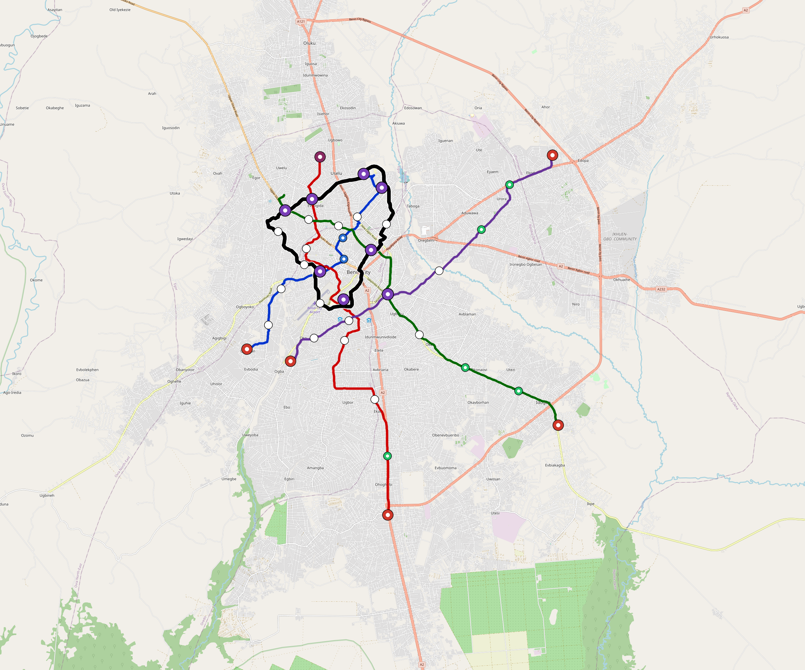

# Benin-City — Urban Rail Network

**Country:** NG · **Population:** 1,800,000 · [National brief](../NATIONAL-BRIEF.md)

This page contains only Benin-City-specific results. Shared routing, service, energy, civil, cost, finance, QA and validation methods are defined once in the [deployment planning reference](../../../../../docs/deployment-planning-reference.md).

> [!IMPORTANT]
> **Foreign-capital advantage:** against the default equivalent foreign-turnkey sensitivity, this local plan avoids **$1.85 bn (86.8%) of external capital** and **$2.32 bn of external interest**. Capital plus saved interest totals **$4.16 bn**. See the common reference for interpretation and limitations.

Auto-planned by the OpenSourceRail design pipeline from the controlled city catalogue, source-locked geospatial inputs and shared templates.

## Network



| Local measure | Value |
|---|---:|
| Lines / unique stations / interchanges | 5 / 49 / 8 |
| Route length | 122.7 km double track |
| Coverage / transfer reachability | 76.9% / 50% |
| Estimated station catchment | 1,384,200 residents |
| Service span / peak headway | 05:30–02:00 / 3 min |
| Fleet | 171 × 4-car `metro-4car` trainsets (153 peak revenue) |
| Peak network throughput | 96,000 passengers/hour |
| Practical service capacity | 803,520 passenger-trips/day |
| Annual paid-trip planning range | 146.6–234.6 M |

### Lines

| Line | Length | Stations | Trainsets | Termini |
|---|---:|---:|---:|---|
| line-1 | 18.4 km | 10 | 37 | N Mid ↔ SW Mid |
| line-2 | 28.4 km | 10 | 43 | S Outer ↔ N Mid |
| line-3 | 26.2 km | 9 | 42 | NW Mid ↔ SE Outer |
| line-4 | 21.9 km | 8 | 36 | NE Outer ↔ SW Mid |
| line-5 | 27.9 km | 12 | 13 | NW Mid ↔ NW Mid |
| **Total** | **122.7 km** | **49 unique** | **171** | |

## Energy

| Local measure | Value |
|---|---:|
| Scheduled service | 2,092 one-way journeys / 50,580 train-km/day |
| Annual traction demand | 319.0 GWh |
| Station/depot PV / storage | 17.9 MW / 104.5 MWh |
| Aggregate charging power | 66.0 MW |
| Dedicated solar plant | 188.8 MW |
| Residual grid/PPA import | 0.0 GWh/yr |
| Worst powered-stop gap | line-3: 10.6 km / 106 kWh |
| Lowest traversal charging margin | line-4: 152 kWh |

## Capital And Funding

| Local CAPEX bucket | Planning value |
|---|---:|
| Civil works | $456 M |
| Stations | $288 M |
| Depots | $8.0 M |
| Rolling stock | $192 M |
| Dedicated solar plant | $151 M |
| Residual train control | $6.1 M |
| Charging microgrids | $15 M |
| EPC / project services | $68 M |
| **Total city programme** | **$1.18 bn** |

| Local funding measure | Planning value |
|---|---:|
| Imported / external capital | $282 M (23.8%) |
| Domestic / local capital | $901 M (76.2%) |
| Annual public construction commitment | $136 M / yr for 7 years |
| Annual post-grace debt service | $115 M / yr |
| External capital saved vs default turnkey sensitivity | $1.85 bn |
| Capital + lifetime external interest saved | $4.16 bn |
| Annual OPEX | $27 M / yr |

## Local Evidence

**Evidence refresh required.** Retained passing results below are unverified.
The strict README generator rejected the evidence: engineering/simulation/validation-summary.json describes scenario SHA-256 56c6bc55500bb1d694be107fb02fb39906866b3240d3add0b20fb195111e2c85, but benin-city.toml is d02a5f54bff8b4deba286ab6560fcd77b4dd4d692709f9426fcbeb7c24525e38; rerun and update the validation evidence. This audit view does not accept or replace the retained solver results.

| Package | Current status | Evidence |
|---|---|---|
| Finance | unverified | [`summary.json`](engineering/finance/summary.json) |
| Native simulation + degraded cases | unverified | [`validation-summary.json`](engineering/simulation/validation-summary.json) |
| SUMO timetable | unverified | [`summary.json`](engineering/sumo/summary.json) |
| Independent OSR/SUMO running-time cross-check | unverified; junction/authority gate open | [`operations-crosscheck.md`](engineering/simulation/operations-crosscheck.md) |
| GIS package | unverified | [`summary.json`](engineering/gis/summary.json) |
| Solar/storage snapshot (operating duty unverified) | unverified; 0 findings; 16 grid-only diagnostics | [`summary.json`](engineering/energy/summary.json) |
| Operations, QA and maintenance | 445 assets / 1,934 tasks | [`benin-city-operations-manifest.json`](operations/benin-city-operations-manifest.json) |

## Local Files And Regeneration

| File | Local role |
|---|---|
| [`design.toml`](design.toml) | Authoritative generated city design |
| [`benin-city.toml`](benin-city.toml) | Expanded simulator scenario |
| [`benin-city.corridor.geojson`](benin-city.corridor.geojson) | GIS corridor and stations |
| [`benin-city.design-quality.yaml`](benin-city.design-quality.yaml) | Coverage, source and civil-quality gates |

```bash
tools/automation/regenerate-city.sh benin-city
```
