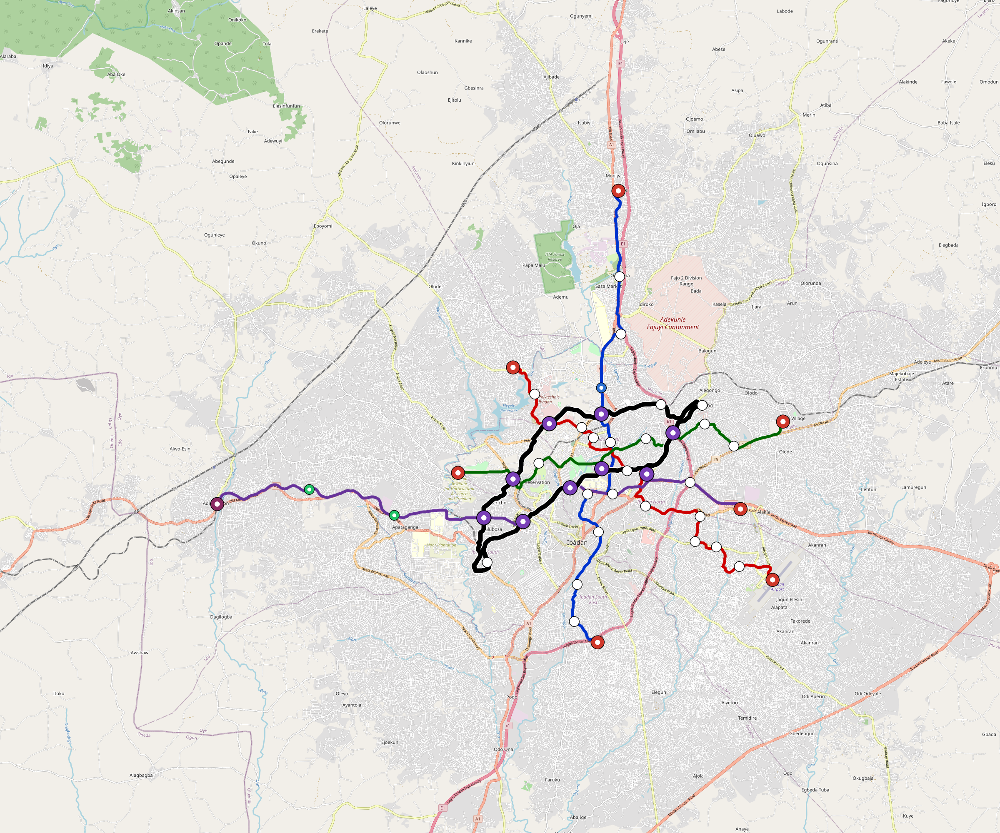

# Ibadan — Urban Rail Network

**Country:** NG · **Population:** 3,900,000 · [National brief](../NATIONAL-BRIEF.md)

This page contains only Ibadan-specific results. Shared routing, service, energy, civil, cost, finance, QA and validation methods are defined once in the [deployment planning reference](../../../../../docs/deployment-planning-reference.md).

> [!IMPORTANT]
> **Foreign-capital advantage:** against the default equivalent foreign-turnkey sensitivity, this local plan avoids **$2.43 bn (85.5%) of external capital** and **$3.05 bn of external interest**. Capital plus saved interest totals **$5.49 bn**. See the common reference for interpretation and limitations.

Auto-planned by the OpenSourceRail design pipeline from the controlled city catalogue, source-locked geospatial inputs and shared templates.

## Network



| Local measure | Value |
|---|---:|
| Lines / unique stations / interchanges | 5 / 55 / 9 |
| Route length | 135.3 km double track |
| Coverage / transfer reachability | 38.5% / 50% |
| Estimated station catchment | 1,501,500 residents |
| Service span / peak headway | 05:30–02:00 / 3 min |
| Fleet | 222 × 6-car `metro-6car` trainsets (200 peak revenue) |
| Peak network throughput | 144,000 passengers/hour |
| Practical service capacity | 1,205,280 passenger-trips/day |
| Annual paid-trip planning range | 220.0–351.9 M |

### Lines

| Line | Length | Stations | Trainsets | Termini |
|---|---:|---:|---:|---|
| line-1 | 26.9 km | 12 | 54 | N Outer ↔ S Mid |
| line-2 | 24.1 km | 12 | 52 | NW Mid ↔ SE Mid |
| line-3 | 20.4 km | 9 | 41 | E Mid ↔ W Mid |
| line-4 | 29.7 km | 10 | 59 | E Mid ↔ W Outer |
| line-5 | 34.2 km | 12 | 16 | W Inner ↔ SW Inner |
| **Total** | **135.3 km** | **55 unique** | **222** | |

## Energy

| Local measure | Value |
|---|---:|
| Scheduled service | 2,092 one-way journeys / 54,971 train-km/day |
| Annual traction demand | 520.1 GWh |
| Station/depot PV / storage | 20.6 MW / 144.0 MWh |
| Aggregate charging power | 106.0 MW |
| Dedicated solar plant | 317.7 MW |
| Residual grid/PPA import | 0.0 GWh/yr |
| Worst powered-stop gap | line-4: 15.4 km / 231 kWh |
| Lowest traversal charging margin | line-5: 221 kWh |

## Capital And Funding

| Local CAPEX bucket | Planning value |
|---|---:|
| Civil works | $497 M |
| Stations | $333 M |
| Depots | $8.0 M |
| Rolling stock | $373 M |
| Dedicated solar plant | $254 M |
| Residual train control | $6.8 M |
| Charging microgrids | $24 M |
| EPC / project services | $87 M |
| **Total city programme** | **$1.58 bn** |

| Local funding measure | Planning value |
|---|---:|
| Imported / external capital | $414 M (26.2%) |
| Domestic / local capital | $1.17 bn (73.8%) |
| Annual public construction commitment | $178 M / yr for 7 years |
| Annual post-grace debt service | $152 M / yr |
| External capital saved vs default turnkey sensitivity | $2.43 bn |
| Capital + lifetime external interest saved | $5.49 bn |
| Annual OPEX | $38 M / yr |

## Local Evidence

| Package | Current status | Evidence |
|---|---|---|
| Finance | pass | [`summary.json`](engineering/finance/summary.json) |
| Native simulation + degraded cases | pass | [`validation-summary.json`](engineering/simulation/validation-summary.json) |
| SUMO timetable | pass | [`summary.json`](engineering/sumo/summary.json) |
| GIS package | pass | [`summary.json`](engineering/gis/summary.json) |
| Grid/charging/solar | pass | [`summary.json`](engineering/energy/summary.json) |
| Operations, QA and maintenance | 539 assets / 2,400 tasks | [`ibadan-operations-manifest.json`](operations/ibadan-operations-manifest.json) |

## Local Files And Regeneration

| File | Local role |
|---|---|
| [`design.toml`](design.toml) | Authoritative generated city design |
| [`ibadan.toml`](ibadan.toml) | Expanded simulator scenario |
| [`ibadan.corridor.geojson`](ibadan.corridor.geojson) | GIS corridor and stations |
| [`ibadan.design-quality.yaml`](ibadan.design-quality.yaml) | Coverage, source and civil-quality gates |

```bash
tools/automation/regenerate-city.sh ibadan
```
