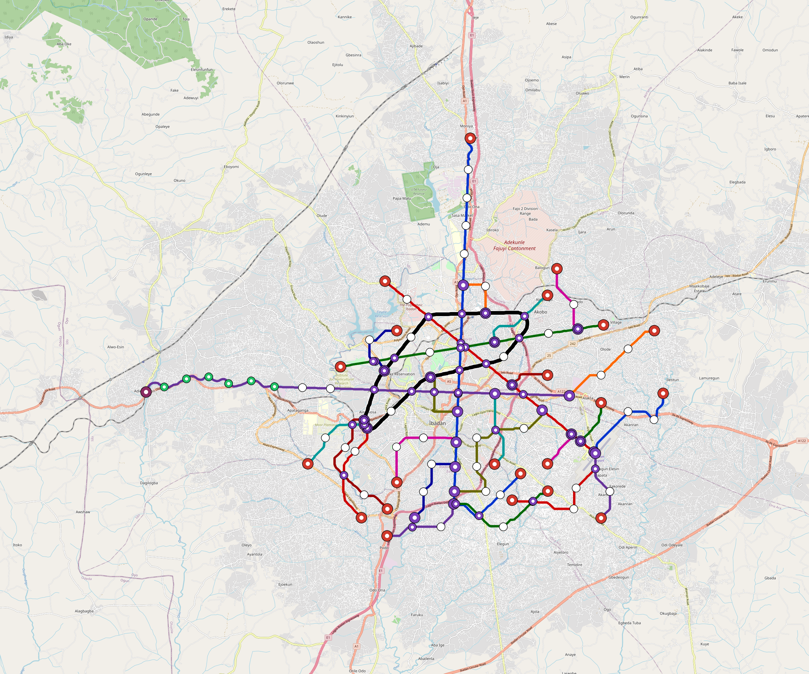

# Ibadan — Urban Rail Network

**Country:** NG · **Population:** 3,900,000 · [National brief](../NATIONAL-BRIEF.md)

This page contains only Ibadan-specific results. Shared routing, service, energy, civil, cost, finance, QA and validation methods are defined once in the [deployment planning reference](../../../../../docs/deployment-planning-reference.md).

> [!IMPORTANT]
> **Foreign-capital advantage:** against the default equivalent foreign-turnkey sensitivity, this local plan avoids **$8.01 bn (87.3%) of external capital** and **$10.04 bn of external interest**. Capital plus saved interest totals **$18.05 bn**. See the common reference for interpretation and limitations.

**Population-led network revision (2026-10-09).** The controlled planning inventory contains **27 lines**, including **22 additional residential lines**. **64.8%** of retained 2020 bbox residents are within a 1 km circle of the actual emitted station coordinates. The working target is 80%; remaining areas and station/access alternatives remain in the review. These are distance screens, not current census, surveyed walksheds or fare demand. New common corridor cells have identified junction/structure and access design requirements; no track switch or site approval is inferred. Country fleet, depot, civil, energy, staffing and financing models use the regenerated inventory, with installed quotations and operating acceptance still open. [Line additions and priorities](engineering/alignment/residential-line-expansion.json) · [Actual station coverage and source receipts](engineering/alignment/residential-expansion-evaluation.json).

**Current alignment, depot and production basis.** Core corridors change from **118.423 km to 203.205 km**, with elevated land sections, water-aware radial routes and separately engineered bridge candidates at short water crossings. 0 core fragments retain raster geometry for further curve review. The centre is a design-centroid screen; survey, property, obstacles, foundations and geometry releases remain open. All **163 platform points** pass the retained water-mask screen; footprints, bank stability and access remain open. [Alignment controls](engineering/alignment/core-realignment.json) · [Before/after map](engineering/alignment/core-alignment-comparison.png) · [Water screen](engineering/alignment/station-water-screen.json).

**27 line-local depots** provide **580 full-fleet storage slots**, separate from workshop bays. Fleet length and workload set quantities; PV/storage is included once in depot capital. Site acceptance and installed/land/utility quotations remain open. [Depot costs](engineering/line-depots/README.md). The factory requires **580 metro-6car trainsets / 3480 cars**, with **18-month facility readiness**, then qualification and manufacture. Integrated openings wait for fleet readiness where production or test paths constrain them. Shared factory capital is counted once; concurrent national loading and supplier commitments remain open. [Factory and dates](engineering/factory/README.md).

Station staffing uses two posts, two normal eight-hour shifts, plus service-window, leave and training cover. Basic wages start at 1.5 times the retained country income proxy, with higher technical/management grades and employer allowances. [Staff](engineering/delivery/README.md) · [Finance](engineering/finance/summary.json). Finance retains country-specific fixed-price, steady-state assumptions; Baghdad’s indexed cashflows are separate.

Auto-planned by the OpenSourceRail design pipeline from the controlled city catalogue, source-locked geospatial inputs and shared templates. Population is counted once within the union of station circles; this is potential radial access, not a verified walkshed or fare-demand estimate. Reachable line pairs include transfers through intermediate lines. [Population radii, denominator and transfer paths](engineering/access/README.md) · [Viaduct beam, foundation and terrain checks](engineering/clearance/README.md). Capital figures are base planning allowances: route-search scores are excluded from money, while special structures and installed-price gaps remain open. [Cost boundary](../../../../../docs/finance/civil-allowance-boundary.md).

## Network



| Local measure | Value |
|---|---:|
| Lines / unique stations / interchanges | 27 / 163 / 40 |
| Route length | 217.0 km double track |
| Direct transfers / reachable line pairs | 14.0% / 100.0% |
| Residents within 800 m radial station catchments | 2,050,608 (2020 raster; 51.9% of bbox) |
| Service span / peak headway | 05:30–02:00 / 3 min |
| Fleet | 580 × 6-car `metro-6car` trainsets (508 peak revenue) |
| Peak network throughput | 777,600 passengers/hour |
| Practical service capacity | 7,097,760 passenger-trips/day |
| Annual paid-trip planning range | 1295.3–2072.5 M |

### Lines

| Line | Length | Stations | Trainsets | Termini |
|---|---:|---:|---:|---|
| line-1 | 21.5 km | 16 | 60 | N Outer ↔ S Inner |
| line-2 | 17.2 km | 13 | 49 | NW Mid ↔ E Mid |
| line-3 | 15.8 km | 12 | 45 | NE Mid ↔ W Mid |
| line-4 | 26.4 km | 16 | 58 | E Mid ↔ W Outer |
| line-5 | 26.8 km | 18 | 18 | NW Inner ↔ W Inner |
| line-6 |  4.4 km | 3 | 13 | E Inner ↔ SE Inner |
| line-7 |  5.7 km | 4 | 16 | S Inner ↔ SW Inner |
| line-8 |  9.5 km | 7 | 27 | E Inner ↔ S Inner |
| line-9 |  4.8 km | 4 | 16 | S Inner ↔ S Mid |
| line-10 |  2.4 km | 2 | 9 | E Inner ↔ E Inner |
| line-11 |  5.1 km | 5 | 18 | S Inner ↔ SE Inner |
| line-12 |  6.0 km | 4 | 17 | W Inner ↔ SW Mid |
| line-13 |  2.6 km | 2 | 9 | E Mid ↔ E Mid |
| line-14 |  4.8 km | 4 | 16 | S Inner ↔ SW Mid |
| line-15 |  6.3 km | 4 | 17 | E Mid ↔ E Mid |
| line-16 |  4.5 km | 3 | 13 | NE Inner ↔ NE Mid |
| line-17 |  2.2 km | 2 | 9 | E Mid ↔ SE Mid |
| line-18 |  3.6 km | 3 | 12 | NW Inner ↔ S Inner |
| line-19 |  4.1 km | 5 | 17 | NW Inner ↔ NW Inner |
| line-20 |  7.7 km | 6 | 23 | W Inner ↔ SW Mid |
| line-21 |  6.4 km | 4 | 17 | E Mid ↔ E Mid |
| line-22 |  7.3 km | 6 | 23 | E Mid ↔ SE Mid |
| line-23 |  6.7 km | 6 | 23 | S Inner ↔ SE Mid |
| line-24 |  4.2 km | 4 | 15 | E Mid ↔ SE Mid |
| line-25 |  2.8 km | 3 | 12 | N Mid ↔ N Inner |
| line-26 |  4.4 km | 4 | 15 | W Inner ↔ W Mid |
| line-27 |  3.9 km | 3 | 13 | NE Mid ↔ NE Mid |
| **Total** | **217.0 km** | **163 unique** | **580** | |

## Energy

| Local measure | Value |
|---|---:|
| Scheduled service | 12,322 one-way journeys / 94,672 train-km/day |
| Annual traction demand | 895.7 GWh |
| Station/depot PV / storage | 174.0 MW / 1,340.0 MWh |
| Aggregate charging power | 314.0 MW |
| Dedicated solar plant | 387.8 MW |
| Residual grid/PPA import | 0.0 GWh/yr |
| Worst powered-stop gap | line-4: 11.2 km / 168 kWh |
| Lowest traversal charging margin | line-13: 153 kWh |

## Capital And Funding

| Local CAPEX bucket | Planning value |
|---|---:|
| Civil works | $2.08 bn |
| Stations | $875 M |
| Depots | $470 M |
| Rolling stock | $974 M |
| Dedicated solar plant | $310 M |
| Residual train control | $11 M |
| Charging microgrids | $63 M |
| EPC / project services | $313 M |
| **Total city programme** | **$5.10 bn** |

| Local funding measure | Planning value |
|---|---:|
| Imported / external capital | $1.16 bn (22.8%) |
| Domestic / local capital | $3.93 bn (77.2%) |
| Annual public construction commitment | $590 M / yr for 7 years |
| Annual post-grace debt service | $500 M / yr |
| External capital saved vs default turnkey sensitivity | $8.01 bn |
| Capital + lifetime external interest saved | $18.05 bn |
| Annual OPEX | $131 M / yr |

## Local Evidence

| Package | Current status | Evidence |
|---|---|---|
| Finance | pass | [`summary.json`](engineering/finance/summary.json) |
| Native simulation + degraded cases | pass | [`validation-summary.json`](engineering/simulation/validation-summary.json) |
| SUMO timetable | pass | [`summary.json`](engineering/sumo/summary.json) |
| Independent OSR/SUMO running-time cross-check | pass; junction/authority gate open | [`operations-crosscheck.md`](engineering/simulation/operations-crosscheck.md) |
| GIS package | pass | [`summary.json`](engineering/gis/summary.json) |
| Solar/storage snapshot (operating duty unverified) | pass; 0 findings; 37 grid-only diagnostics | [`summary.json`](engineering/energy/summary.json) |
| Operations, QA and maintenance | 1,529 assets / 8,134 tasks | [`ibadan-operations-manifest.json`](operations/ibadan-operations-manifest.json) |

## Local Files And Regeneration

| File | Local role |
|---|---|
| [`design.toml`](design.toml) | Authoritative generated city design |
| [`ibadan.toml`](ibadan.toml) | Expanded simulator scenario |
| [`ibadan.corridor.geojson`](ibadan.corridor.geojson) | GIS corridor and stations |
| [`ibadan.design-quality.yaml`](ibadan.design-quality.yaml) | Coverage, source and civil-quality gates |

```bash
tools/automation/regenerate-city.sh ibadan
```
