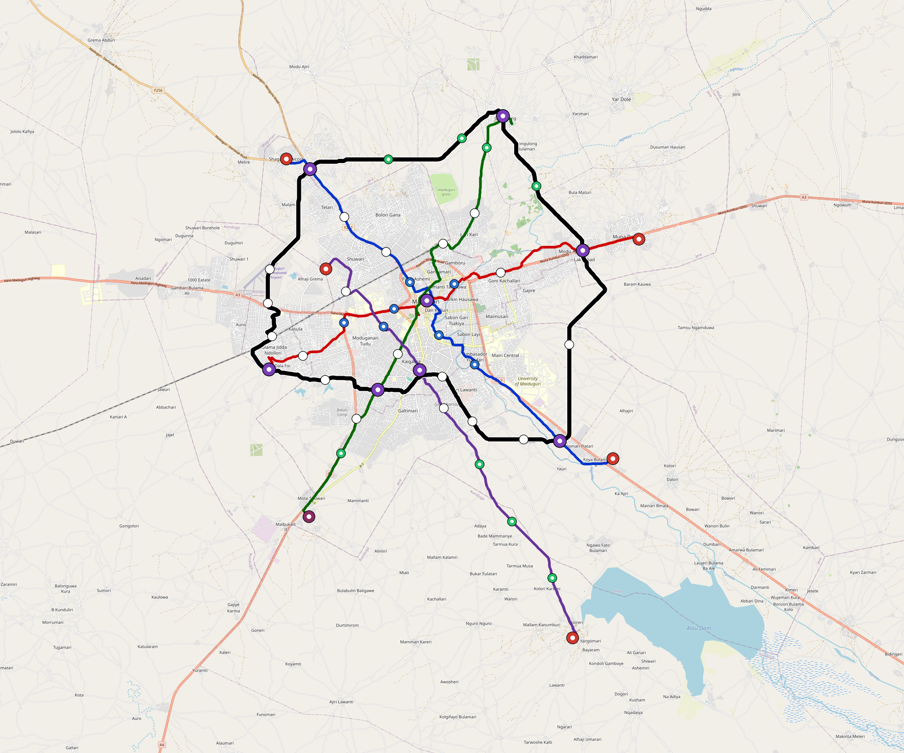

# Maiduguri — Urban Rail Network

**Country:** NG · **Population:** 1,200,000 · [National brief](../NATIONAL-BRIEF.md)

This page contains only Maiduguri-specific results. Shared routing, service, energy, civil, cost, finance, QA and validation methods are defined once in the [deployment planning reference](../../../../../docs/deployment-planning-reference.md).

> [!IMPORTANT]
> **Foreign-capital advantage:** against the default equivalent foreign-turnkey sensitivity, this local plan avoids **$2.36 bn (87.6%) of external capital** and **$2.96 bn of external interest**. Capital plus saved interest totals **$5.31 bn**. See the common reference for interpretation and limitations.

Auto-planned by the OpenSourceRail design pipeline from the controlled city catalogue, source-locked geospatial inputs and shared templates.

## Network



| Local measure | Value |
|---|---:|
| Lines / unique stations / interchanges | 5 / 58 / 8 |
| Route length | 168.4 km double track |
| Coverage / transfer reachability | 49.2% / 70% |
| Estimated station catchment | 590,400 residents |
| Service span / peak headway | 05:30–02:00 / 3 min |
| Fleet | 197 × 4-car `metro-4car` trainsets (177 peak revenue) |
| Peak network throughput | 96,000 passengers/hour |
| Practical service capacity | 803,520 passenger-trips/day |
| Annual paid-trip planning range | 146.6–234.6 M |

### Lines

| Line | Length | Stations | Trainsets | Termini |
|---|---:|---:|---:|---|
| line-1 | 26.7 km | 10 | 43 | NW Mid ↔ SE Mid |
| line-2 | 25.4 km | 10 | 42 | W Mid ↔ E Mid |
| line-3 | 27.9 km | 11 | 45 | N Mid ↔ SW Mid |
| line-4 | 26.3 km | 9 | 43 | NW Inner ↔ SE Outer |
| line-5 | 62.0 km | 18 | 24 | W Mid ↔ W Mid |
| **Total** | **168.4 km** | **58 unique** | **197** | |

## Energy

| Local measure | Value |
|---|---:|
| Scheduled service | 2,092 one-way journeys / 63,862 train-km/day |
| Annual traction demand | 402.8 GWh |
| Station/depot PV / storage | 19.7 MW / 113.5 MWh |
| Aggregate charging power | 75.0 MW |
| Dedicated solar plant | 172.6 MW |
| Residual grid/PPA import | 0.0 GWh/yr |
| Worst powered-stop gap | line-4: 14.2 km / 159 kWh |
| Lowest traversal charging margin | line-4: 119 kWh |

## Capital And Funding

| Local CAPEX bucket | Planning value |
|---|---:|
| Civil works | $701 M |
| Stations | $314 M |
| Depots | $8.0 M |
| Rolling stock | $221 M |
| Dedicated solar plant | $138 M |
| Residual train control | $8.4 M |
| Charging microgrids | $17 M |
| EPC / project services | $89 M |
| **Total city programme** | **$1.50 bn** |

| Local funding measure | Planning value |
|---|---:|
| Imported / external capital | $333 M (22.3%) |
| Domestic / local capital | $1.16 bn (77.7%) |
| Annual public construction commitment | $174 M / yr for 7 years |
| Annual post-grace debt service | $147 M / yr |
| External capital saved vs default turnkey sensitivity | $2.36 bn |
| Capital + lifetime external interest saved | $5.31 bn |
| Annual OPEX | $34 M / yr |

## Local Evidence

| Package | Current status | Evidence |
|---|---|---|
| Finance | pass | [`summary.json`](engineering/finance/summary.json) |
| Native simulation + degraded cases | pass | [`validation-summary.json`](engineering/simulation/validation-summary.json) |
| SUMO timetable | pass | [`summary.json`](engineering/sumo/summary.json) |
| GIS package | pass | [`summary.json`](engineering/gis/summary.json) |
| Grid/charging/solar | pass | [`summary.json`](engineering/energy/summary.json) |
| Operations, QA and maintenance | 517 assets / 2,246 tasks | [`maiduguri-operations-manifest.json`](operations/maiduguri-operations-manifest.json) |

## Local Files And Regeneration

| File | Local role |
|---|---|
| [`design.toml`](design.toml) | Authoritative generated city design |
| [`maiduguri.toml`](maiduguri.toml) | Expanded simulator scenario |
| [`maiduguri.corridor.geojson`](maiduguri.corridor.geojson) | GIS corridor and stations |
| [`maiduguri.design-quality.yaml`](maiduguri.design-quality.yaml) | Coverage, source and civil-quality gates |

```bash
tools/automation/regenerate-city.sh maiduguri
```
