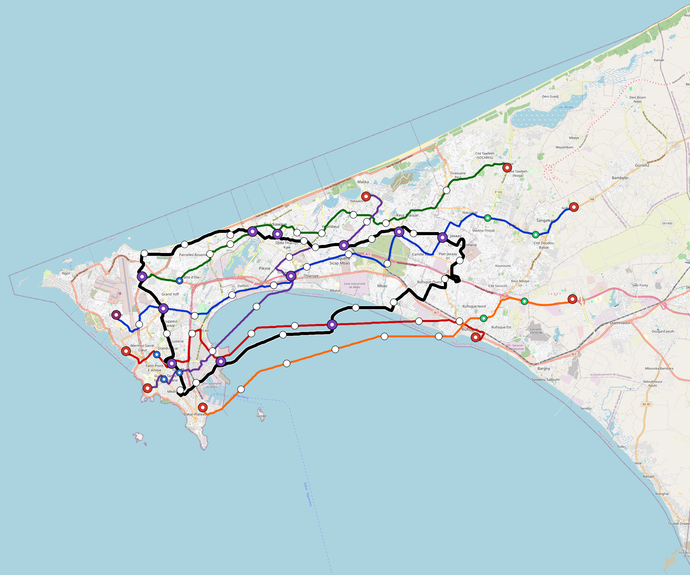

# Dakar — Urban Rail Network

**Country:** SN · **Population:** 4,030,000 · [National brief](../NATIONAL-BRIEF.md)

This page contains only Dakar-specific results. Shared routing, service, energy, civil, cost, finance, QA and validation methods are defined once in the [deployment planning reference](../../../../../docs/deployment-planning-reference.md).

> [!IMPORTANT]
> **Foreign-capital advantage:** against the default equivalent foreign-turnkey sensitivity, this local plan avoids **$3.35 bn (85.7%) of external capital** and **$4.20 bn of external interest**. Capital plus saved interest totals **$7.54 bn**. See the common reference for interpretation and limitations.

Auto-planned by the OpenSourceRail design pipeline from the controlled city catalogue, source-locked geospatial inputs and shared templates.

## Network



| Local measure | Value |
|---|---:|
| Lines / unique stations / interchanges | 6 / 82 / 11 |
| Route length | 222.2 km double track |
| Coverage / transfer reachability | 63.4% / 33% |
| Estimated station catchment | 2,555,020 residents |
| Service span / peak headway | 05:30–02:00 / 3 min |
| Fleet | 330 × 6-car `metro-6car` trainsets (297 peak revenue) |
| Peak network throughput | 172,800 passengers/hour |
| Practical service capacity | 1,473,120 passenger-trips/day |
| Annual paid-trip planning range | 268.8–430.2 M |

### Lines

| Line | Length | Stations | Trainsets | Termini |
|---|---:|---:|---:|---|
| line-1 | 40.3 km | 15 | 79 | E Outer ↔ W Mid |
| line-2 | 30.3 km | 11 | 56 | W Mid ↔ E Mid |
| line-3 | 31.3 km | 12 | 59 | W Mid ↔ NE Outer |
| line-4 | 26.4 km | 11 | 52 | NE Mid ↔ SW Mid |
| line-5 | 28.3 km | 9 | 54 | E Outer ↔ SW Mid |
| line-6 | 65.6 km | 24 | 30 | W Mid ↔ W Mid |
| **Total** | **222.2 km** | **82 unique** | **330** | |

## Energy

| Local measure | Value |
|---|---:|
| Scheduled service | 2,558 one-way journeys / 88,062 train-km/day |
| Annual traction demand | 833.1 GWh |
| Station/depot PV / storage | 28.1 MW / 194.0 MWh |
| Aggregate charging power | 156.0 MW |
| Dedicated solar plant | 371.5 MW |
| Residual grid/PPA import | 0.0 GWh/yr |
| Worst powered-stop gap | line-1: 11.4 km / 190 kWh |
| Lowest traversal charging margin | line-5: 166 kWh |

## Capital And Funding

| Local CAPEX bucket | Planning value |
|---|---:|
| Civil works | $718 M |
| Stations | $425 M |
| Depots | $8.0 M |
| Rolling stock | $554 M |
| Dedicated solar plant | $297 M |
| Residual train control | $11 M |
| Charging microgrids | $34 M |
| EPC / project services | $123 M |
| **Total city programme** | **$2.17 bn** |

| Local funding measure | Planning value |
|---|---:|
| Imported / external capital | $560 M (25.8%) |
| Domestic / local capital | $1.61 bn (74.2%) |
| Annual public construction commitment | $181 M / yr for 7 years |
| Annual post-grace debt service | $150 M / yr |
| External capital saved vs default turnkey sensitivity | $3.35 bn |
| Capital + lifetime external interest saved | $7.54 bn |
| Annual OPEX | $53 M / yr |

## Local Evidence

| Package | Current status | Evidence |
|---|---|---|
| Finance | pass | [`summary.json`](engineering/finance/summary.json) |
| Native simulation + degraded cases | pass | [`validation-summary.json`](engineering/simulation/validation-summary.json) |
| SUMO timetable | pass | [`summary.json`](engineering/sumo/summary.json) |
| GIS package | pass | [`summary.json`](engineering/gis/summary.json) |
| Grid/charging/solar | pass | [`summary.json`](engineering/energy/summary.json) |
| Operations, QA and maintenance | 798 assets / 3,570 tasks | [`dakar-operations-manifest.json`](operations/dakar-operations-manifest.json) |

## Local Files And Regeneration

| File | Local role |
|---|---|
| [`design.toml`](design.toml) | Authoritative generated city design |
| [`dakar.toml`](dakar.toml) | Expanded simulator scenario |
| [`dakar.corridor.geojson`](dakar.corridor.geojson) | GIS corridor and stations |
| [`dakar.design-quality.yaml`](dakar.design-quality.yaml) | Coverage, source and civil-quality gates |

```bash
tools/automation/regenerate-city.sh dakar
```
