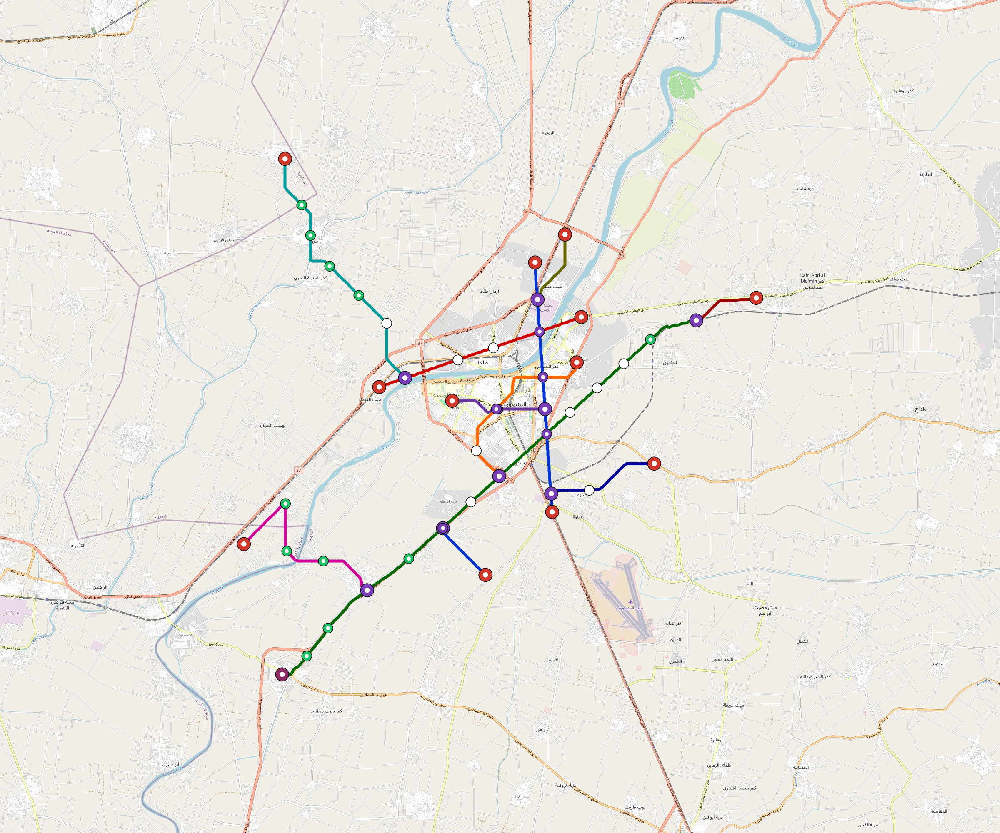

# Mansoura-Eg — Urban Rail Network

**Country:** EG · **Population:** 1,000,000 · [National brief](../NATIONAL-BRIEF.md)

This page contains only Mansoura-Eg-specific results. Shared routing, service, energy, civil, cost, finance, QA and validation methods are defined once in the [deployment planning reference](../../../../../docs/deployment-planning-reference.md).

> [!IMPORTANT]
> **Foreign-capital advantage:** against the default equivalent foreign-turnkey sensitivity, this local plan avoids **$2.60 bn (88.4%) of external capital** and **$3.19 bn of external interest**. Capital plus saved interest totals **$5.79 bn**. See the common reference for interpretation and limitations.

**Population-led network revision (2026-10-09).** The controlled planning inventory contains **11 lines**, including **8 additional residential lines**. **62.1%** of retained 2020 bbox residents are within a 1 km circle of the actual emitted station coordinates. The working target is 80%; remaining areas and station/access alternatives remain in the review. These are distance screens, not current census, surveyed walksheds or fare demand. New common corridor cells have identified junction/structure and access design requirements; no track switch or site approval is inferred. Country fleet, depot, civil, energy, staffing and financing models use the regenerated inventory, with installed quotations and operating acceptance still open. [Line additions and priorities](engineering/alignment/residential-line-expansion.json) · [Actual station coverage and source receipts](engineering/alignment/residential-expansion-evaluation.json).

**Current alignment, depot and production basis.** Core corridors change from **42.709 km to 62.219 km**, with elevated land sections, water-aware radial routes and separately engineered bridge candidates at short water crossings. 0 core fragments retain raster geometry for further curve review. The centre is a design-centroid screen; survey, property, obstacles, foundations and geometry releases remain open. All **58 platform points** pass the retained water-mask screen; footprints, bank stability and access remain open. [Alignment controls](engineering/alignment/core-realignment.json) · [Before/after map](engineering/alignment/core-alignment-comparison.png) · [Water screen](engineering/alignment/station-water-screen.json).

**11 line-local depots** provide **316 full-fleet storage slots**, separate from workshop bays. Fleet length and workload set quantities; PV/storage is included once in depot capital. Site acceptance and installed/land/utility quotations remain open. [Depot costs](engineering/line-depots/README.md). The factory requires **316 light-metro-3car trainsets / 948 cars**, with **18-month facility readiness**, then qualification and manufacture. Integrated openings wait for fleet readiness where production or test paths constrain them. Shared factory capital is counted once; concurrent national loading and supplier commitments remain open. [Factory and dates](engineering/factory/README.md).

Station staffing uses two posts, two normal eight-hour shifts, plus service-window, leave and training cover. Basic wages start at 1.5 times the retained country income proxy, with higher technical/management grades and employer allowances. [Staff](engineering/delivery/README.md) · [Finance](engineering/finance/summary.json). Finance retains country-specific fixed-price, steady-state assumptions; Baghdad’s indexed cashflows are separate.

Auto-planned by the OpenSourceRail design pipeline from the controlled city catalogue, source-locked geospatial inputs and shared templates. Population is counted once within the union of station circles; this is potential radial access, not a verified walkshed or fare-demand estimate. Reachable line pairs include transfers through intermediate lines. [Population radii, denominator and transfer paths](engineering/access/README.md) · [Viaduct beam, foundation and terrain checks](engineering/clearance/README.md). Capital figures are base planning allowances: route-search scores are excluded from money, while special structures and installed-price gaps remain open. [Cost boundary](../../../../../docs/finance/civil-allowance-boundary.md).

## Network



| Local measure | Value |
|---|---:|
| Lines / unique stations / interchanges | 11 / 58 / 12 |
| Route length | 87.7 km double track |
| Direct transfers / reachable line pairs | 21.8% / 100.0% |
| Residents within 800 m radial station catchments | 836,132 (2020 raster; 47.9% of bbox) |
| Service span / peak headway | 05:30–02:00 / 3 min |
| Fleet | 316 × 3-car `light-metro-3car` trainsets (281 peak revenue) |
| Peak network throughput | 158,400 passengers/hour |
| Practical service capacity | 1,473,120 passenger-trips/day |
| Annual paid-trip planning range | 268.8–430.2 M |

### Lines

| Line | Length | Stations | Trainsets | Termini |
|---|---:|---:|---:|---|
| line-1 | 10.1 km | 8 | 36 | SE Mid ↔ N Mid |
| line-2 |  9.2 km | 6 | 32 | NE Mid ↔ W Inner |
| line-3 | 24.9 km | 15 | 86 | NE Outer ↔ SW Outer |
| line-4 |  3.9 km | 3 | 15 | E Inner ↔ NW Inner |
| line-5 |  7.7 km | 5 | 27 | S Inner ↔ NE Mid |
| line-6 | 10.9 km | 7 | 39 | NW Inner ↔ NW Outer |
| line-7 |  8.2 km | 5 | 30 | SW Mid ↔ SW Outer |
| line-8 |  3.0 km | 2 | 12 | NE Mid ↔ NE Mid |
| line-9 |  4.5 km | 3 | 17 | SE Inner ↔ E Mid |
| line-10 |  2.7 km | 2 | 11 | NE Outer ↔ NE Outer |
| line-11 |  2.5 km | 2 | 11 | S Mid ↔ S Mid |
| **Total** | **87.7 km** | **58 unique** | **316** | |

## Energy

| Local measure | Value |
|---|---:|
| Scheduled service | 5,115 one-way journeys / 40,765 train-km/day |
| Annual traction demand | 192.8 GWh |
| Station/depot PV / storage | 65.8 MW / 458.0 MWh |
| Aggregate charging power | 23.5 MW |
| Dedicated solar plant | 25.6 MW |
| Residual grid/PPA import | 0.0 GWh/yr |
| Worst powered-stop gap | line-6: 8.4 km / 68 kWh |
| Lowest traversal charging margin | line-8: 22 kWh |

## Capital And Funding

| Local CAPEX bucket | Planning value |
|---|---:|
| Civil works | $775 M |
| Stations | $265 M |
| Depots | $173 M |
| Rolling stock | $284 M |
| Dedicated solar plant | $20 M |
| Residual train control | $4.4 M |
| Charging microgrids | $4.9 M |
| EPC / project services | $105 M |
| **Total city programme** | **$1.63 bn** |

| Local funding measure | Planning value |
|---|---:|
| Imported / external capital | $341 M (20.9%) |
| Domestic / local capital | $1.29 bn (79.1%) |
| Annual public construction commitment | $175 M / yr for 5 years |
| Annual post-grace debt service | $131 M / yr |
| External capital saved vs default turnkey sensitivity | $2.60 bn |
| Capital + lifetime external interest saved | $5.79 bn |
| Annual OPEX | $47 M / yr |

## Local Evidence

| Package | Current status | Evidence |
|---|---|---|
| Finance | pass | [`summary.json`](engineering/finance/summary.json) |
| Native simulation + degraded cases | pass | [`validation-summary.json`](engineering/simulation/validation-summary.json) |
| SUMO timetable | pass | [`summary.json`](engineering/sumo/summary.json) |
| Independent OSR/SUMO running-time cross-check | pass; junction/authority gate open | [`operations-crosscheck.md`](engineering/simulation/operations-crosscheck.md) |
| GIS package | pass | [`summary.json`](engineering/gis/summary.json) |
| Solar/storage snapshot (operating duty unverified) | pass; 0 findings; 9 grid-only diagnostics | [`summary.json`](engineering/energy/summary.json) |
| Operations, QA and maintenance | 666 assets / 3,859 tasks | [`mansoura-eg-operations-manifest.json`](operations/mansoura-eg-operations-manifest.json) |

## Local Files And Regeneration

| File | Local role |
|---|---|
| [`design.toml`](design.toml) | Authoritative generated city design |
| [`mansoura-eg.toml`](mansoura-eg.toml) | Expanded simulator scenario |
| [`mansoura-eg.corridor.geojson`](mansoura-eg.corridor.geojson) | GIS corridor and stations |
| [`mansoura-eg.design-quality.yaml`](mansoura-eg.design-quality.yaml) | Coverage, source and civil-quality gates |

```bash
tools/automation/regenerate-city.sh mansoura-eg
```
