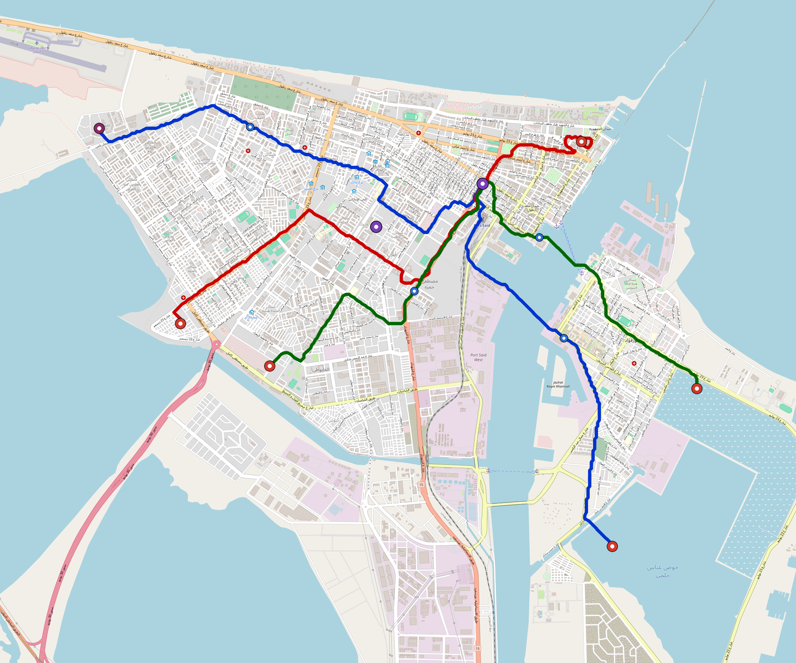

# Port-Said — Urban Rail Network

**Country:** EG · **Population:** 800,000 · [National brief](../NATIONAL-BRIEF.md)

This page contains only Port-Said-specific results. Shared routing, service, energy, civil, cost, finance, QA and validation methods are defined once in the [deployment planning reference](../../../../../docs/deployment-planning-reference.md).

> [!IMPORTANT]
> **Foreign-capital advantage:** against the default equivalent foreign-turnkey sensitivity, this local plan avoids **$500 M (87.4%) of external capital** and **$614 M of external interest**. Capital plus saved interest totals **$1.11 bn**. See the common reference for interpretation and limitations.

Auto-planned by the OpenSourceRail design pipeline from the controlled city catalogue, source-locked geospatial inputs and shared templates.

## Network



| Local measure | Value |
|---|---:|
| Lines / unique stations / interchanges | 3 / 15 / 2 |
| Route length | 29.2 km double track |
| Coverage / transfer reachability | 66.2% / 100% |
| Estimated station catchment | 529,600 residents |
| Service span / peak headway | 05:30–02:00 / 3 min |
| Fleet | 64 × 3-car `light-metro-3car` trainsets (57 peak revenue) |
| Peak network throughput | 43,200 passengers/hour |
| Practical service capacity | 401,760 passenger-trips/day |
| Annual paid-trip planning range | 73.3–117.3 M |

### Lines

| Line | Length | Stations | Trainsets | Termini |
|---|---:|---:|---:|---|
| line-1 | 12.1 km | 6 | 27 | SE Outer ↔ W Outer |
| line-2 |  8.2 km | 4 | 18 | NE Mid ↔ W Outer |
| line-3 |  8.9 km | 5 | 19 | SE Outer ↔ SW Mid |
| **Total** | **29.2 km** | **15 unique** | **64** | |

## Energy

| Local measure | Value |
|---|---:|
| Scheduled service | 1,395 one-way journeys / 13,575 train-km/day |
| Annual traction demand | 64.2 GWh |
| Station/depot PV / storage | 9.2 MW / 47.0 MWh |
| Aggregate charging power | 7.5 MW |
| Dedicated solar plant | 23.1 MW |
| Residual grid/PPA import | 0.0 GWh/yr |
| Worst powered-stop gap | line-2: 3.3 km / 27 kWh |
| Lowest traversal charging margin | line-2: 26 kWh |

## Capital And Funding

| Local CAPEX bucket | Planning value |
|---|---:|
| Civil works | $105 M |
| Stations | $106 M |
| Depots | $8.0 M |
| Rolling stock | $58 M |
| Dedicated solar plant | $19 M |
| Residual train control | $1.5 M |
| Charging microgrids | $1.8 M |
| EPC / project services | $20 M |
| **Total city programme** | **$317 M** |

| Local funding measure | Planning value |
|---|---:|
| Imported / external capital | $72 M (22.6%) |
| Domestic / local capital | $246 M (77.4%) |
| Annual public construction commitment | $34 M / yr for 5 years |
| Annual post-grace debt service | $25 M / yr |
| External capital saved vs default turnkey sensitivity | $500 M |
| Capital + lifetime external interest saved | $1.11 bn |
| Annual OPEX | $8.2 M / yr |

## Local Evidence

**Evidence refresh required.** Retained passing results below are unverified.
The strict README generator rejected the evidence: engineering/simulation/validation-summary.json describes scenario SHA-256 bbdc129dbfa9a2f698dce8832c46e129c10d75a4edbee29375f9591b3a38bca8, but port-said.toml is db834cb09569ac4c99d1517f1e7931f2d5f7ce473d2b890488a3cad5a52dc427; rerun and update the validation evidence. This audit view does not accept or replace the retained solver results.

| Package | Current status | Evidence |
|---|---|---|
| Finance | unverified | [`summary.json`](engineering/finance/summary.json) |
| Native simulation + degraded cases | unverified | [`validation-summary.json`](engineering/simulation/validation-summary.json) |
| SUMO timetable | unverified | [`summary.json`](engineering/sumo/summary.json) |
| Independent OSR/SUMO running-time cross-check | missing/fail; junction/authority gate open | not generated |
| GIS package | unverified | [`summary.json`](engineering/gis/summary.json) |
| Grid/charging/solar | unverified; 0 findings | [`summary.json`](engineering/energy/summary.json) |
| Operations, QA and maintenance | 154 assets / 677 tasks | [`port-said-operations-manifest.json`](operations/port-said-operations-manifest.json) |

## Local Files And Regeneration

| File | Local role |
|---|---|
| [`design.toml`](design.toml) | Authoritative generated city design |
| [`port-said.toml`](port-said.toml) | Expanded simulator scenario |
| [`port-said.corridor.geojson`](port-said.corridor.geojson) | GIS corridor and stations |
| [`port-said.design-quality.yaml`](port-said.design-quality.yaml) | Coverage, source and civil-quality gates |

```bash
tools/automation/regenerate-city.sh port-said
```
