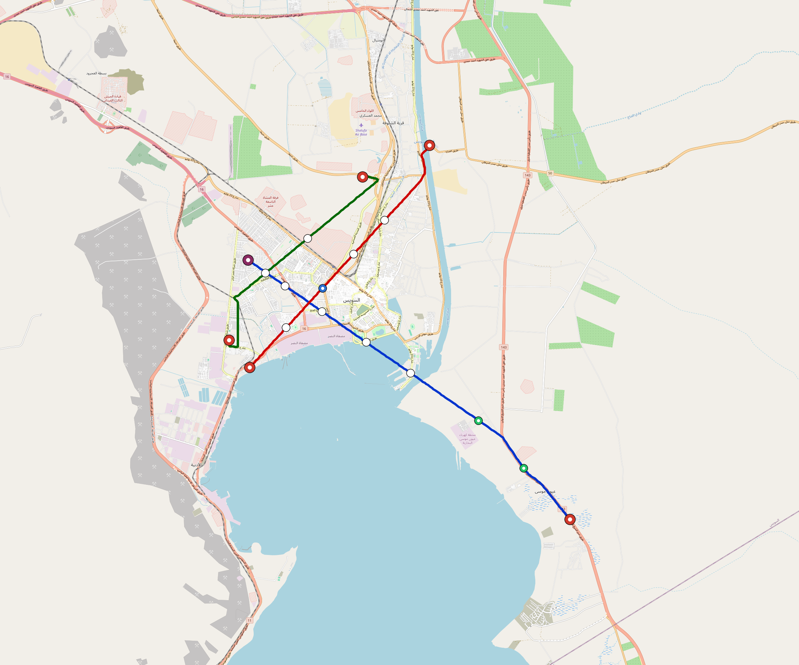

# Suez — Urban Rail Network

**Country:** EG · **Population:** 800,000 · [National brief](../NATIONAL-BRIEF.md)

This page contains only Suez-specific results. Shared routing, service, energy, civil, cost, finance, QA and validation methods are defined once in the [deployment planning reference](../../../../../docs/deployment-planning-reference.md).

> [!IMPORTANT]
> **Foreign-capital advantage:** against the default equivalent foreign-turnkey sensitivity, this local plan avoids **$1.95 bn (88.3%) of external capital** and **$2.40 bn of external interest**. Capital plus saved interest totals **$4.35 bn**. See the common reference for interpretation and limitations.

**Population-led network revision (2026-10-09).** The controlled planning inventory contains **6 lines**, including **3 additional residential lines**. **79.5%** of retained 2020 bbox residents are within a 1 km circle of the actual emitted station coordinates. The working target is 80%; remaining areas and station/access alternatives remain in the review. These are distance screens, not current census, surveyed walksheds or fare demand. New common corridor cells have identified junction/structure and access design requirements; no track switch or site approval is inferred. Country fleet, depot, civil, energy, staffing and financing models use the regenerated inventory, with installed quotations and operating acceptance still open. [Line additions and priorities](engineering/alignment/residential-line-expansion.json) · [Actual station coverage and source receipts](engineering/alignment/residential-expansion-evaluation.json).

**Current alignment, depot and production basis.** Core corridors change from **50.210 km to 58.874 km**, with elevated land sections, water-aware radial routes and separately engineered bridge candidates at short water crossings. 0 core fragments retain raster geometry for further curve review. The centre is a design-centroid screen; survey, property, obstacles, foundations and geometry releases remain open. All **43 platform points** pass the retained water-mask screen; footprints, bank stability and access remain open. [Alignment controls](engineering/alignment/core-realignment.json) · [Before/after map](engineering/alignment/core-alignment-comparison.png) · [Water screen](engineering/alignment/station-water-screen.json).

**6 line-local depots** provide **241 full-fleet storage slots**, separate from workshop bays. Fleet length and workload set quantities; PV/storage is included once in depot capital. Site acceptance and installed/land/utility quotations remain open. [Depot costs](engineering/line-depots/README.md). The factory requires **241 light-metro-3car trainsets / 723 cars**, with **18-month facility readiness**, then qualification and manufacture. Integrated openings wait for fleet readiness where production or test paths constrain them. Shared factory capital is counted once; concurrent national loading and supplier commitments remain open. [Factory and dates](engineering/factory/README.md).

Station staffing uses two posts, two normal eight-hour shifts, plus service-window, leave and training cover. Basic wages start at 1.5 times the retained country income proxy, with higher technical/management grades and employer allowances. [Staff](engineering/delivery/README.md) · [Finance](engineering/finance/summary.json). Finance retains country-specific fixed-price, steady-state assumptions; Baghdad’s indexed cashflows are separate.

Auto-planned by the OpenSourceRail design pipeline from the controlled city catalogue, source-locked geospatial inputs and shared templates. Population is counted once within the union of station circles; this is potential radial access, not a verified walkshed or fare-demand estimate. Reachable line pairs include transfers through intermediate lines. [Population radii, denominator and transfer paths](engineering/access/README.md) · [Viaduct beam, foundation and terrain checks](engineering/clearance/README.md). Capital figures are base planning allowances: route-search scores are excluded from money, while special structures and installed-price gaps remain open. [Cost boundary](../../../../../docs/finance/civil-allowance-boundary.md).

## Network



| Local measure | Value |
|---|---:|
| Lines / unique stations / interchanges | 6 / 43 / 7 |
| Route length | 69.3 km double track |
| Direct transfers / reachable line pairs | 46.7% / 100.0% |
| Residents within 800 m radial station catchments | 350,775 (2020 raster; 62.8% of bbox) |
| Service span / peak headway | 05:30–02:00 / 3 min |
| Fleet | 241 × 3-car `light-metro-3car` trainsets (215 peak revenue) |
| Peak network throughput | 86,400 passengers/hour |
| Practical service capacity | 803,520 passenger-trips/day |
| Annual paid-trip planning range | 146.6–234.6 M |

### Lines

| Line | Length | Stations | Trainsets | Termini |
|---|---:|---:|---:|---|
| line-1 | 25.0 km | 16 | 89 | SE Outer ↔ NW Mid |
| line-2 | 16.2 km | 8 | 53 | SW Mid ↔ NE Mid |
| line-3 | 14.6 km | 9 | 47 | N Mid ↔ W Mid |
| line-4 |  2.4 km | 2 | 10 | NW Inner ↔ NE Inner |
| line-5 |  3.1 km | 3 | 14 | W Inner ↔ NW Mid |
| line-6 |  8.0 km | 5 | 28 | N Inner ↔ SW Inner |
| **Total** | **69.3 km** | **43 unique** | **241** | |

## Energy

| Local measure | Value |
|---|---:|
| Scheduled service | 2,790 one-way journeys / 32,246 train-km/day |
| Annual traction demand | 152.5 GWh |
| Station/depot PV / storage | 39.0 MW / 255.0 MWh |
| Aggregate charging power | 18.0 MW |
| Dedicated solar plant | 35.2 MW |
| Residual grid/PPA import | 0.0 GWh/yr |
| Worst powered-stop gap | line-1: 10.4 km / 84 kWh |
| Lowest traversal charging margin | line-4: 28 kWh |

## Capital And Funding

| Local CAPEX bucket | Planning value |
|---|---:|
| Civil works | $612 M |
| Stations | $179 M |
| Depots | $105 M |
| Rolling stock | $217 M |
| Dedicated solar plant | $28 M |
| Residual train control | $3.5 M |
| Charging microgrids | $3.8 M |
| EPC / project services | $78 M |
| **Total city programme** | **$1.23 bn** |

| Local funding measure | Planning value |
|---|---:|
| Imported / external capital | $258 M (21.0%) |
| Domestic / local capital | $970 M (79.0%) |
| Annual public construction commitment | $132 M / yr for 5 years |
| Annual post-grace debt service | $99 M / yr |
| External capital saved vs default turnkey sensitivity | $1.95 bn |
| Capital + lifetime external interest saved | $4.35 bn |
| Annual OPEX | $35 M / yr |

## Local Evidence

| Package | Current status | Evidence |
|---|---|---|
| Finance | pass | [`summary.json`](engineering/finance/summary.json) |
| Native simulation + degraded cases | pass | [`validation-summary.json`](engineering/simulation/validation-summary.json) |
| SUMO timetable | pass | [`summary.json`](engineering/sumo/summary.json) |
| Independent OSR/SUMO running-time cross-check | pass; junction/authority gate open | [`operations-crosscheck.md`](engineering/simulation/operations-crosscheck.md) |
| GIS package | pass | [`summary.json`](engineering/gis/summary.json) |
| Solar/storage snapshot (operating duty unverified) | pass; 0 findings; 13 grid-only diagnostics | [`summary.json`](engineering/energy/summary.json) |
| Operations, QA and maintenance | 499 assets / 2,934 tasks | [`suez-operations-manifest.json`](operations/suez-operations-manifest.json) |

## Local Files And Regeneration

| File | Local role |
|---|---|
| [`design.toml`](design.toml) | Authoritative generated city design |
| [`suez.toml`](suez.toml) | Expanded simulator scenario |
| [`suez.corridor.geojson`](suez.corridor.geojson) | GIS corridor and stations |
| [`suez.design-quality.yaml`](suez.design-quality.yaml) | Coverage, source and civil-quality gates |

```bash
tools/automation/regenerate-city.sh suez
```
