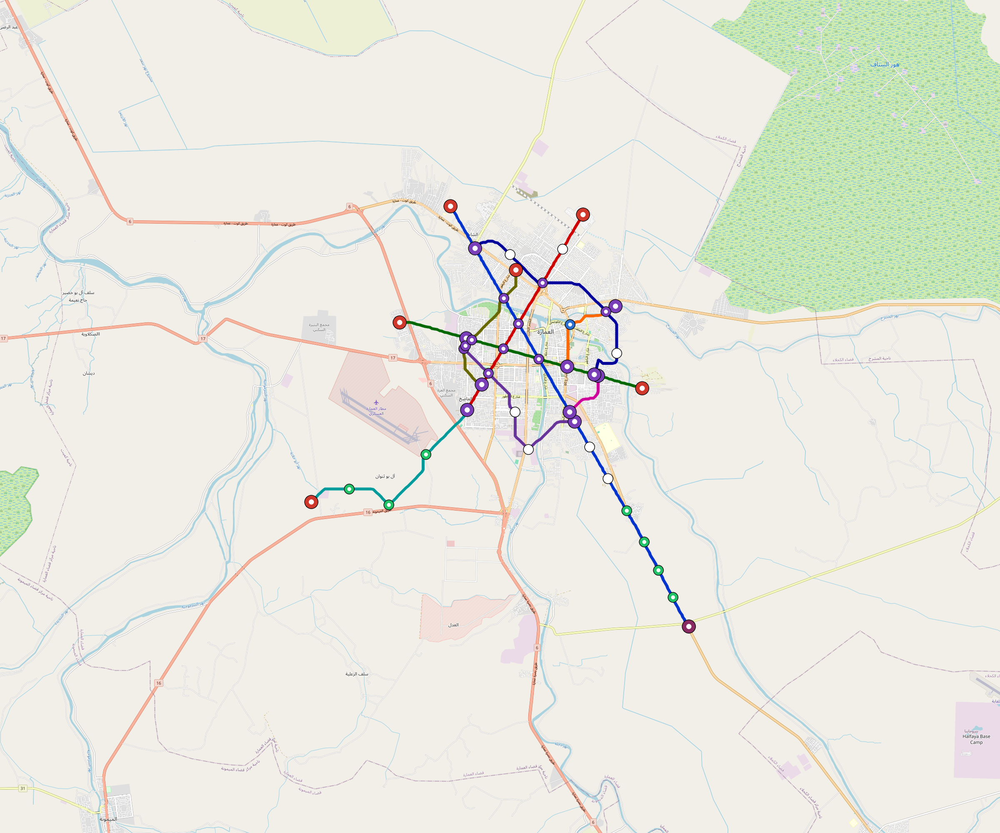

# Amarah — Urban Rail Network

**Country:** IQ · **Population:** 660,000 · [National brief](../NATIONAL-BRIEF.md)

This page contains only Amarah-specific results. Shared routing, service, energy, civil, cost, finance, QA and validation methods are defined once in the [deployment planning reference](../../../../../docs/deployment-planning-reference.md).

> [!IMPORTANT]
> **Foreign-capital advantage:** against the default equivalent foreign-turnkey sensitivity, this local plan avoids **$680 M (87.2%) of external capital** and **$836 M of external interest**. Capital plus saved interest totals **$1.52 bn**. See the common reference for interpretation and limitations.

Auto-planned by the OpenSourceRail design pipeline from the controlled city catalogue, source-locked geospatial inputs and shared templates.

## Network



| Local measure | Value |
|---|---:|
| Lines / unique stations / interchanges | 3 / 18 / 1 |
| Route length | 46.6 km double track |
| Coverage / transfer reachability | 57.5% / 100% |
| Estimated station catchment | 379,499 residents |
| Service span / peak headway | 05:30–02:00 / 3 min |
| Fleet | 101 × 3-car `light-metro-3car` trainsets (90 peak revenue) |
| Peak network throughput | 43,200 passengers/hour |
| Practical service capacity | 401,760 passenger-trips/day |
| Annual paid-trip planning range | 73.3–117.3 M |

### Lines

| Line | Length | Stations | Trainsets | Termini |
|---|---:|---:|---:|---|
| line-1 | 21.6 km | 8 | 47 | NW Mid ↔ SE Outer |
| line-2 | 13.0 km | 6 | 28 | SW Mid ↔ N Mid |
| line-3 | 12.0 km | 4 | 26 | SE Inner ↔ W Mid |
| **Total** | **46.6 km** | **18 unique** | **101** | |

## Energy

| Local measure | Value |
|---|---:|
| Scheduled service | 1,395 one-way journeys / 21,668 train-km/day |
| Annual traction demand | 102.5 GWh |
| Station/depot PV / storage | 9.8 MW / 48.0 MWh |
| Aggregate charging power | 8.5 MW |
| Dedicated solar plant | 42.6 MW |
| Residual grid/PPA import | 0.0 GWh/yr |
| Worst powered-stop gap | line-1: 9.5 km / 77 kWh |
| Lowest traversal charging margin | line-2: 32 kWh |

## Capital And Funding

| Local CAPEX bucket | Planning value |
|---|---:|
| Civil works | $190 M |
| Stations | $80 M |
| Depots | $8.0 M |
| Rolling stock | $91 M |
| Dedicated solar plant | $34 M |
| Residual train control | $2.3 M |
| Charging microgrids | $1.9 M |
| EPC / project services | $26 M |
| **Total city programme** | **$433 M** |

## Iraq funding

Proposed facilities and appropriations remain uncommitted. Government funds eligible-invoice downpayments, its capital share, fees, interest, restricted reserves and cash shortfalls.

| Capital source | Planning USD equivalent |
|---|---:|
| bank credit | $40 M |
| chinese export credit | $36 M |
| domestic bonds | $119 M |
| government | $238 M |

The procurement schedule requires **50 calendar months** of capital cash under an assumed 260-working-day year. The resource-constrained full-network rollout needs review before a construction commitment.

Peak annual government cash: **$216 M**. This includes support required under the low capacity-use case; it is not a funded appropriation.

Chinese export buyer credit is allocated within existing imported budgets for solar equipment, bogies, batteries, windows and doors. Shared national manufacturing tooling is funded once at programme level. IQD bonds assume a proposed Ministry of Finance programme; municipal borrowing authority is pending legal review.

The model includes actual scheduled draws, native-currency principal/interest, fees, revenue ramps, operating/debt support, reserve movements and downside cases. Short bullet bonds have explicit redemptions without assumed refinancing.

See [funding model](engineering/finance/FUNDING-MODEL.md), [monthly cashflow](engineering/finance/funding-monthly-cashflow.csv), [annual cashflow](engineering/finance/funding-annual-cashflow.csv) and [three-city funding programme](../IRAQ-FUNDING-PROGRAMME.md).

Annual operating allowance: $12 M; demand remains capacity-led.

## Local Evidence

**Evidence refresh required.** Retained passing results below are unverified.
The strict README generator rejected the evidence: engineering/simulation/validation-summary.json describes scenario SHA-256 00a57396a5bd0f98fc354b506e6d03f9095130553e1473073c4d50d14b3093e2, but amarah.toml is bb40f4ecaa5e0af9d2ead3fdcb3481237cc9ece5ad7a5e3ac309b3c1bd2836aa; rerun and update the validation evidence. This audit view does not accept or replace the retained solver results.

| Package | Current status | Evidence |
|---|---|---|
| Finance | unverified | [`summary.json`](engineering/finance/summary.json) |
| Native simulation + degraded cases | unverified | [`validation-summary.json`](engineering/simulation/validation-summary.json) |
| SUMO timetable | unverified | [`summary.json`](engineering/sumo/summary.json) |
| Independent OSR/SUMO running-time cross-check | unverified; junction/authority gate open | [`operations-crosscheck.md`](engineering/simulation/operations-crosscheck.md) |
| GIS package | unverified | [`summary.json`](engineering/gis/summary.json) |
| Solar/storage snapshot (operating duty unverified) | unverified; 0 findings; 4 grid-only diagnostics | [`summary.json`](engineering/energy/summary.json) |
| Operations, QA and maintenance | 209 assets / 1,234 tasks | [`amarah-operations-manifest.json`](operations/amarah-operations-manifest.json) |

## Local Files And Regeneration

| File | Local role |
|---|---|
| [`design.toml`](design.toml) | Authoritative generated city design |
| [`amarah.toml`](amarah.toml) | Expanded simulator scenario |
| [`amarah.corridor.geojson`](amarah.corridor.geojson) | GIS corridor and stations |
| [`amarah.design-quality.yaml`](amarah.design-quality.yaml) | Coverage, source and civil-quality gates |

```bash
tools/automation/regenerate-city.sh amarah
```
