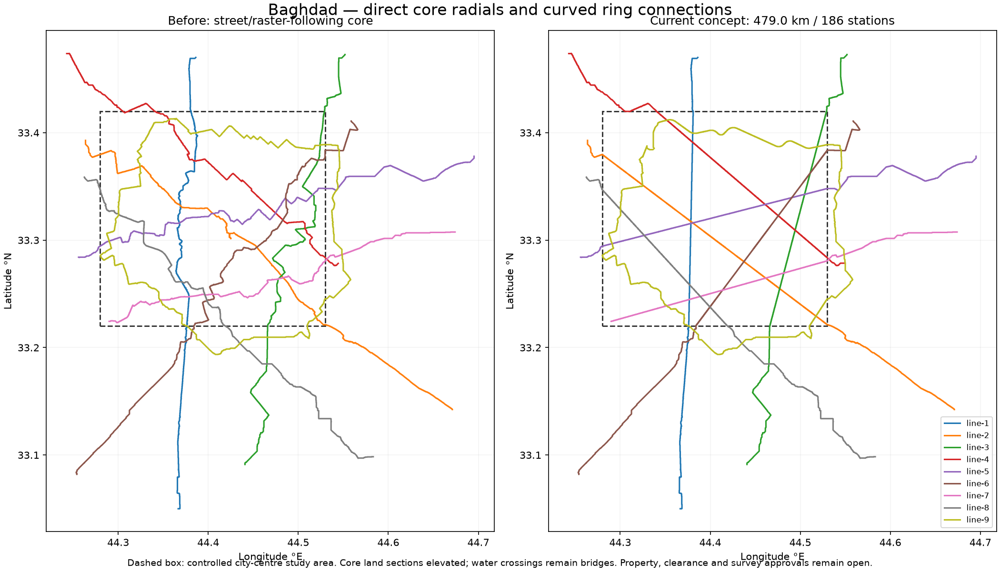
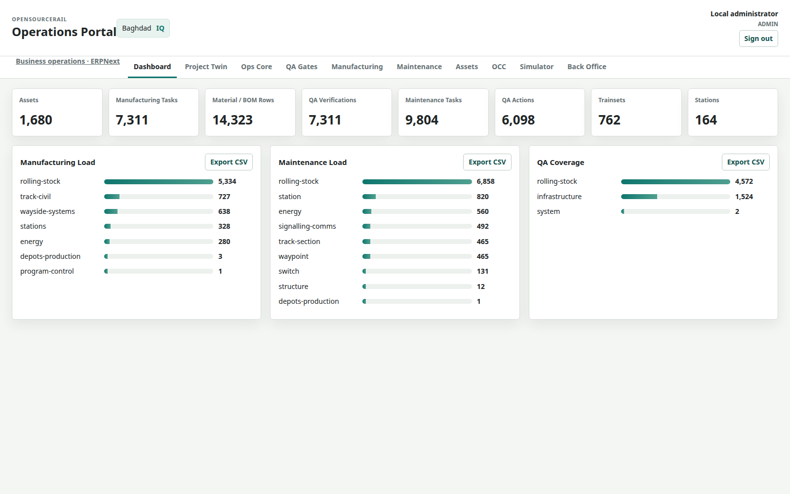
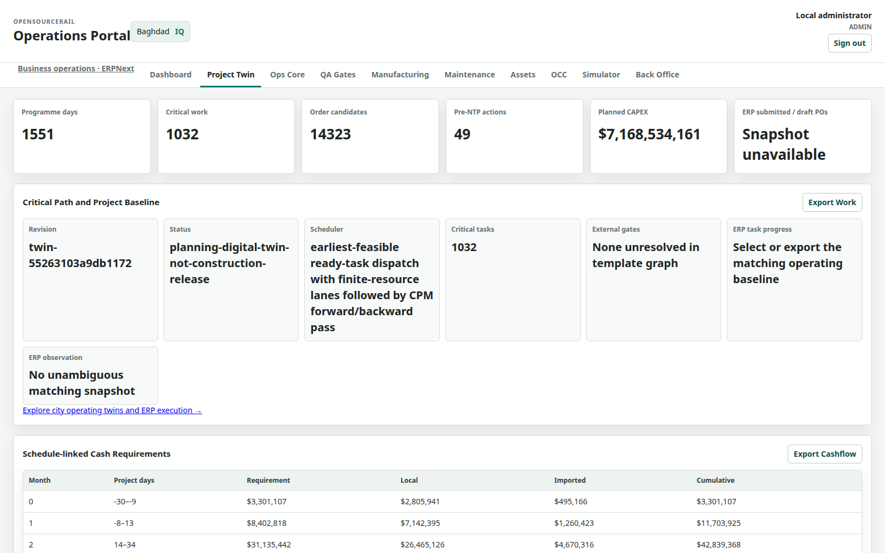

# Baghdad Proposal

OpenSourceRail proposes an owner led feasibility and front end engineering programme for Baghdad, with Iraqi train manufacture and local infrastructure delivery. This proposal brings the Baghdad network, railway systems, operating organisation, delivery evidence and financing together, and sets out a separate path for future national development. It is addressed to the prospective Iraqi public sponsor, Baghdad authorities, operating organisation and financing partners; no appointment or financing commitment is asserted.

The latest [programme recalculation](engineering/programme-recalculation/README.md) sizes **3,716 permanent operating FTE** and **9 line-local depots** for all 772 six-car trainsets. With completed components bought, revised capital is **USD 15.341bn**. The unquoted positive-margin local-production option gives **USD 15.233bn**, imported invoice exposure of **USD 3.021bn** and **19.83% USD capital intensity**. It records **IQD 27.330tn residual unsourced support** after assumed facilities and retains **IQD 13.000tn total debt** at the horizon. Current indexed fares and additional-income assumptions do not repay this scope. Mezzanine defers cash pressure but leaves unpaid balloons; it is a sensitivity, not a recommended solution.

The earlier [delivery-cost continuation](engineering/delivery-closure/README.md) remains a comparator: **USD 14.692bn capital**, before still-unpriced scope, and **IQD 13.000tn unpaid gap debt**. The original financial schedules below likewise remain controlled reference cases. Debt clearance in an older reference is not the current feasibility conclusion; higher fares and conditional additional funding are tested separately, with no adopted tariff or lender commitment.

The current planning network is **9 lines, 479.0 km of double track route, 186 stations and 772 six car trainsets**. Original reference capital, including one final-assembly plant and its EPC, was **USD 14.527 billion equivalent**; it does not include the latest scope replacement. The direct government capital contribution remains **25%** of each revised case. Imports are financed 50% government USD cash and 50% proposed Chinese USD credit; all remaining capital cash, bonds and bank debt are IQD.

The immediate decision proposed is to establish a sponsor, commission survey and demand work, develop the first operable line and plant packages, qualify suppliers and obtain executable financing terms. Construction and operating release require the recorded physical and approval gates. The current resource constrained plan reaches first line revenue in month 40 and full operation in month 77 after financial close. That long schedule is a material design and delivery problem to resolve; this proposal does not substitute a five year promise.

## How to read the proposal

The first part states the integrated proposal and the decisions it needs. The next part prints the detailed network registers and six month financing schedules. The technical appendices reproduce every current Baghdad Markdown report, the national brief and selected shared standards. The supporting ZIP preserves the full controlled Baghdad files, every Baghdad financing spreadsheet, the operations payload, national city design inputs and the cited shared references. The source inventory and manifest identify exact file bytes.

Baghdad is the only financed city. National expansion is a future strategic option with its own budgets and approvals. The national totals and generic city pages retain original catalogue assumptions; the latest Baghdad study does not silently reprice or finance other cities. Procurement origin, loan currency and reporting currency are different measures. USD equivalents use the historical model anchor of IQD 1,300/USD; this is not a current execution quote. All prices, demand, debt terms and rights proceeds remain planning assumptions. Older generic foreign turnkey examples reproduced in source appendices are separate from the historical 148 km comparison and the scheduled Baghdad financing cases.

## Latest scope, local production and matched funding cases

The 186 stations have two concurrent staff during two normal eight-hour shifts, giving 744 daily shift assignments. The retained 20.5-hour railway also funds 4.5 hours of late cover. Weekly/leave/training/sickness cover gives 1840 station FTE, included in the 3716 permanent railway FTE. Loaded annual payroll is IQD 86.303bn before subsequent OPEX inflation. The general pay floor is IQD 1,175,455/month: 1.5 times the 2021 employee median indexed to 2026 at an assumed 5% a year. Technical/supervisor/senior/director grades use 2.25/3/4/5 times the same proxy. This is not a newly observed national median and does not change the fare-income denominator.

Each line has one depot; all spare/reserve trains are included. Storage uses the actual 111 m train plus 10 m clearance; workshop bays follow bay-hour workload separately. The nine sites total USD 253.456m and replace the old USD 8m allowance once. Itemised storage/workshop/access tracks, points, civil shells, process equipment, services, wash plants, wheel lathes, stores, rescue/isolation and retained energy stock are costed. Land/title, utilities, actual foundations and installed charging/grid upgrades remain open; launch/throat conflicts need an operating replay.

The order requires 9,264 bogies, 9,264 motor/inverter sets, 4,632 battery packs (1.042 GWh gross), 18,528 door cassettes and 27,792 window cassettes. Final assembly employs 1294 production and 195 support FTE for 55 scheduled paid months. Upstream facilities are sized to the train factory rate and price imported process machinery, local buildings/materials, residual imported inputs, qualification and their full paid establishment. Selected processes (bogie fabrication, battery-pack assembly, door manufacture) have positive whole-order margins under the unquoted assumptions. The remaining processes (motor assembly, window manufacture) stay bought in this case; their Baghdad-only whole-order margins are shown in the make/buy register. Imported cells/BMS, inverters, wheels/axles/bearings and other safety parts remain; no cell gigafactory or future national sales credit is assumed.

The main design uses the reworked central elevated routes and 55.26% elevated track across Baghdad. Further outer civil alternatives permit up to 65% elevated and screen 7.178 km of additional at-grade conversion around exceptional curves, reaching 56.76% elevated. These outer candidate intervals are not adopted or surveyed. Elevation alone removes no horizontal bend. Added viaduct and hypothetical 0/25/50% routing-penalty removal are priced separately; no hypothetical penalty removal is adopted as a saving.

| Matched case | CAPEX USD bn | USD intensity | Unsourced support IQD tn | Terminal all debt IQD tn | Defaulted junior vintages |
| --- | --- | --- | --- | --- | --- |
| construction_wage_content_stress | 16.499 | 19.44% | 29.555 | 13.000 | 0 |
| grade-separation-penalty-0pct | 15.292 | 19.81% | 27.433 | 13.000 | 0 |
| grade-separation-penalty-25pct | 13.555 | 20.48% | 24.364 | 13.000 | 0 |
| grade-separation-penalty-50pct | 11.818 | 21.29% | 21.267 | 13.000 | 0 |
| local_all | 15.239 | 19.40% | 27.359 | 13.000 | 0 |
| local_positive | 15.233 | 19.83% | 27.330 | 13.000 | 0 |
| local_positive_commercial_gap | 15.233 | 19.83% | 51.331 | 13.000 | 0 |
| local_positive_mezzanine | 15.233 | 19.83% | 25.016 | 29.090 | 79 |
| local_positive_mezzanine_stress | 15.233 | 19.83% | 48.845 | 67.444 | 79 |
| local_positive_raw_price_stress | 15.307 | 20.04% | 27.453 | 13.000 | 0 |
| local_positive_supplier_delay | 15.233 | 19.83% | 27.652 | 13.000 | 0 |
| revised_scope_buy | 15.341 | 21.43% | 27.482 | 13.000 | 0 |

All twelve cases have invoice-level capital registers, monthly native-currency cash/principal ledgers and six-month bond/loan placement schedules in the [latest study](engineering/programme-recalculation/README.md) and supporting archive. Government is 25% of total capital, with USD machinery/input downpayments on actual invoice dates and the balance allocated as local IQD appropriation. Only Chinese credit is USD debt; bonds, senior bank/gap debt and mezzanine are IQD. Six months of senior service are reserved from the first draw, with three months of OPEX and industrial working capital. This reserve policy differs from the older reference; matched cases are the valid comparison.

The following capital-only source table is for the latest positive-margin local-production senior case. Fees, interest, reserve funding and gap facilities are separate cashflows; this table reconciles to capital uses only. Ordinary and green bonds are separate placements within the same total funding requirement.

| Latest capital source | Currency | Native amount | USD equivalent m |
| --- | --- | --- | --- |
| Government import cash | USD | 1,510,440,238 | 1,510.440 |
| Government local cash | IQD | 2,987,175,216,330 | 2,297.827 |
| Chinese capital credit | USD | 1,510,440,238 | 1,510.440 |
| Ordinary capital bonds | IQD | 8,588,305,488,245 | 6,606.389 |
| Green capital bonds | IQD | 1,053,822,212,230 | 810.632 |
| Senior bank capital credit | IQD | 3,214,042,566,825 | 2,472.340 |
| Conditional climate capital grant | IQD | 32,500,000,000 | 25.000 |

The proposed IQD mezzanine replaces 10% of residual domestic capital borrowing, with 6% cash coupon, 4% PIK, 2% fee and a 15-year balloon. Cash coupons require senior DSCR of 1.20, funded reserves and genuine residual cash. Deferred coupons and PIK are debt. Unpaid balloons become overdue balances with separately disclosed simple-interest sensitivity, without automatic refinancing, conversion or interest-on-arrears. The case leaves IQD 29.090tn total debt and 79 defaulted draw vintages. It does not improve the unlevered company NPV of USD -10.591bn at the assumed discount rate. Grants, net development-rights receipts, green terms and concessional gap funding are uncommitted; an 8% gap-rate case exposes this dependency. Fares, fare/OPEX inflation, advertising, kiosk/rental receipts and inherited additional income are already included.

## Baghdad network and population access

The design retains a planning population of 9,780,429. The former 39.4% routing-demand cell fraction is not population coverage and its resident multiplication is retired. Native WorldPop 2020 pixels give a bbox population of **5,985,974**, with residents counted once in the union of station circles:

| Radius (m) | Covered residents (2020) | Share of raster bbox population |
| --- | --- | --- |
| 500 | 716,340 | 12.0% |
| 800 | 1,698,960 | 28.4% |
| 1000 | 2,415,357 | 40.4% |
| 1500 | 3,963,906 | 66.2% |
| 2000 | 4,796,903 | 80.1% |

These are potential radial catchments, not verified walksheds or unique passengers. The 1,500–2,000 m cases require actual walking/feeder provision. Population dates and boundaries differ from the catalogue; no rebasing or extra fare demand is assumed. River crossings, entrances, barriers and topography require validation. **Reachable line pairs are 100.0%** through intermediate lines; direct transfers cover 80.6%. [Source counts, sensitivities and transfer paths](engineering/access/README.md).

**The straight viaduct concept remains obstacle-unreleased.** The [beam/support/terrain register](engineering/clearance/README.md) retains 844 nearby mapped footprints, including 110 with source height tags. It flags 58 provisional roof clashes and 576 unresolved-height checks. Low-roof overflight never clears the pier/foundation below; supports, tall-building clearance, terrain/grades, utilities, property/air rights and construction access require survey and redesign. Raising the deck needs grade-compliant approaches and revised capital; moving piers must use verified spans or an independently checked special crossing. Current financial figures include no unpriced adopted obstacle solution.

| Line | Shape | Route km | Stations | Peak fleet | Total fleet | Opening month |
| --- | --- | --- | --- | --- | --- | --- |
| line-1 | radial | 49.068 | 20 | 85 | 94 | 40 |
| line-2 | radial | 52.851 | 20 | 87 | 96 | 45 |
| line-3 | radial | 49.496 | 20 | 83 | 92 | 50 |
| line-4 | radial | 41.932 | 16 | 75 | 83 | 55 |
| line-5 | radial | 47.345 | 20 | 81 | 90 | 59 |
| line-6 | radial | 52.503 | 21 | 94 | 104 | 65 |
| line-7 | radial | 39.957 | 16 | 67 | 74 | 69 |
| line-8 | radial | 48.137 | 18 | 83 | 92 | 74 |
| line-9 | ring | 97.724 | 35 | 42 | 47 | 77 |

Line names are controlled design identifiers. Public station names, route brands and final termini require owner approval. Chainages, coordinates, interchange platforms and fleet roles are printed in the network registers and regenerated from the adopted core corridor concept.

The service concept operates 05:30 to 02:00 with a three minute protected peak headway. The current scheduled journeys and fleet sizing are capacity led; accepted junction/authority capacity, ridership, a timetable, station crowding and degraded recovery need operating review. The 772 trainsets comprise peak, spare and cold reserve roles documented in the annex.

## City-centre alignment rework

Within the controlled core rectangle (33.22–33.42°N, 44.28–44.53°E), radial corridors use straight tangents and ring connections use broad circular planning fillets where the water constraints permit. Detoured sections require a new curve and structural review. Core land sections are elevated; water crossings retain bridge classification. The final water-constrained core routes change from 301.670 to 264.321 km. This is the main design used by the updated station, fleet, civil, energy, depot, staffing, delivery and financing calculations. The earlier extra-viaduct cost-only case did not change geometry.

These corridors reserve no property or air rights. Obstacles, heritage/security constraints, surveyed clearances, pier access, utilities, transition curves, cant, vertical geometry and foundations require engineering and owner review. Outer approaches retain bends and exceptional elevated products. The coverage proxy must be measured before selecting the faster/straighter layout as an access solution; no old coverage score is carried forward.

## Trains and imported component strategy

The Baghdad profile is metro 6car: 6 cars, 111 m body length, 720 passengers at nominal planning load including 120 seats, and 960 at short duration crush load. Each train has 1,350 kWh nameplate / 1,080 kWh usable LFP battery capacity, 12 traction controllers, 3,600 kW peak traction and a 50 C design ambient. These are reference profiles requiring supplier and physical qualification, not delivered fleet performance.

The original industrial scope is train assembly, body modules, fit out, wiring, coatings, inspection, testing and maintenance, with completed bogies, batteries, windows and doors bought. The latest positive-margin local-production option replaces selected completed imports with Chinese process machinery and residual inputs for Iraqi fabrication/assembly. Solar equipment, glazing and critical component inputs retain imports. Chinese supplier origin and export lender eligibility need evidence for every financed item; the entire imported basket is currently an unqualified scenario. Candidate CRRC equipment remains subject to competitive supplier selection, interface and safety qualification. There is no established CRRC partnership, quotation or endorsement.

Shared LM3 fabrication and first article documentation is reference process evidence for a three car platform. It does not qualify Baghdad's six car consist. The national programme should qualify the shared modules and then validate each consist and its interfaces, rather than treating a shared drawing as an accepted Baghdad train.

## Civil infrastructure and stations

The civil screen contains 1,031 segments: 183.4 km at-grade, 264.7 km elevated, 30.9 km bridge. Route kilometres describe double track corridors; they are not track kilometres or a measurement of all sidings. Station products, 36 interchange complexes and 9 junction records are bound to the generated layout.

The proposed civil programme starts with survey control, utilities, property and access, geotechnical investigation, flood/drainage levels, alignment and station fit. Desktop soil inputs contain 7,287 sample locations and 65 missing profiles; they do not supply foundation bearing capacity, groundwater or deep stratigraphy. Structural calculations, spans, erection, movements and independent checking must follow route specific evidence. Generated alignment exports have unfitted curves, placeholder vertical profiles and undesigned cant.

Stations require accessible approaches, platforms, passenger information, fire and evacuation design, fare equipment, retail and advertising layouts, security, sanitation and maintenance access. Platform and station access standards must be checked against the final six car envelope and passenger demand. Equipment and architecture references do not establish installed compliance.

The original USD 8m depot allowance is replaced by the nine full-fleet line depots in the latest recalculation above. Surveyed land, foundation/electrical interfaces, fire/security release and supplier quotations remain open. Workshop bays cannot be counted as overnight train parking. The earlier reference policy proposed two revenue trains at selected powered stations and line-local storage for remaining fleet; the latest study gives no capacity credit to station parking. Usable tracks, charging, protected morning release, evening repositioning and repeated-day replay still require acceptance. The depot and stabling appendices retain these failures explicitly.

## Manufactured viaduct alternatives and installed cost

The [manufactured-viaduct comparison](engineering/viaduct-comparison/README.md) covers Pi20 and Pi25 with two bearing/connection schemes, plus an OSR-US constrained-access option. Baghdad's infrastructure load seed now explicitly requires the complete 24-axle, 111 m six-car train, with supplier axle positions and loaded distribution still unresolved. A link slab retains independent girder-end bearings; shared bearings require a checked structural continuity connection and staged load path.

Every one of the 492 elevated segments, including 18 exceptional segments, has a comparison record. The original elevated model separates USD 2.580bn standard-rate allowance from USD 6.492bn routing penalties. Penalties discourage difficult routing; they are not supplier-priced structures or savings available merely by deletion. Realignment, station movements, ground/utility investigations and installed whole-life alternatives remain unaccepted.

Retaining simple-span bearings changes the existing periodic cost index from USD 9.748m/km to USD 10.198m/km. The USD 119.124m uniform whole-elevated-network difference is an unadopted rate illustration; Pi bearing quantities are not transferred to OSR-US/special designs. The lower existing rate remains conditional on an unaccepted structural scheme.

The separate financed sensitivity applies only to 195.008 km of standard Pi25, adding USD 87.754m direct and incremental EPC once. It gives USD 14.786bn capital and IQD 13.000tn terminal gap debt, with monthly/six-month financing recalculated under the same 25% government and USD/IQD rules. Existing civil invoice dates and origin proportions are inherited assumptions. Connection, finite end effects, foundations, actual import eligibility and other consequential costs remain unpriced; the original full-fleet case is preserved as a comparator.

Finite supports, unknown foundation lengths, complete member/hook mass gates, configured erection bids, per-item invoice currencies and eight production fronts are included in the supporting data. Installed-price totals remain unknown while scope is unpriced. Accepted complete double-track bays/week, first beam/pier/connection trials and independent design release must precede programme and budget selection. No literature savings or 30 m product is assumed.

## Energy and desert operation

The current duty model schedules 3,952 one way journeys and about 217,090 train km per day, with 2,053.8 GWh annual traction demand. It assigns 52.1 MW station/depot PV, 354.0 MWh site storage, 316.0 MW connected charging and 931.7 MW dedicated solar. The design's zero annual residual grid/PPA import is an energy accounting result; it does not establish uninterrupted operation or installed grid independence.

Storage endurance, adverse weather, PV land, heat/dust derating, losses, supplier fire separation, actual charging duty, protection and backup import need a time resolved operating appraisal. Snapshot solver passes and grid only diagnostics do not close these gates. Battery protection and cabin/battery thermal separation must be qualified at the declared ambient and duty. No claimed unlimited battery autonomy or accepted solar islanding is used to close financing.

## Train control and operational safety

The current architecture reference is RFC 0033, TACS runtime and committed resource control. RFC 0032's separate authority/protection prototype is superseded. The design retains committed resource ownership in the interlocking, ordered consensus decisions, onboard movement authority, automatic train protection, station departure gates and final brake requests. OCC supplies service intentions and observations; ERP and supervision cannot bypass railway authority or clear protection latches.

The reference uses three static consensus voters and two logical protection channels. Hardware placement, independent power/network domains, sensing, brake outputs and common cause analysis need assessment. Two software channels do not establish independent safety hardware. Lost required permissions, stale/invalid evidence and missing physical proving retain restrictive protection. The runtime is a synthetic process reference and not a deployed Baghdad control system or safety certificate. Existing Baghdad timetable simulations do not constitute RFC 0033 physical acceptance.

## Iraqi manufacture and local economic benefit

The Baghdad plant is sized from 4,632 vehicle modules. Its base allowance is USD 326.913m plus USD 22.884m EPC, counted once outside city CAPEX. The current plant construction assumption is 390 working days before train production. Factory siting, freight access, utilities, tooling, staff, production rate, quality capacity and six car qualification require their own approved business and delivery plan.

The original procurement allocation assigns USD 11.772bn equivalent locally. This is potential local expenditure, not payroll, GDP added or a guaranteed Iraqi content ratio. Local train and infrastructure work can retain skills, supplier income, repair capacity and spares knowledge. The latest process appraisal above includes whole-order labour, factory support/maintenance and make/buy margins; manufacturing sales to other customers still need a separate business case. No multiplier, tax recovery or future national plant profit is booked as project cash without evidence. Imported machinery and residual inputs retain foreign exchange and supply-chain exposure.

## Operating organisation and digital management

The latest operating establishment is 3,716 FTE with IQD 86.303bn annual loaded payroll, replacing the original 3,460 FTE / IQD 50.118bn allowance. It includes OCC/remote assistance, fleet maintenance, infrastructure/energy, stations, passenger service, administration and training. It remains a planning workload/roster model; legal duties, appointments and competence require acceptance. Construction and factory populations are priced separately as explained above, with measured work hours, crew mixes and throughput still required.

| Operating role | Required FTE | Wage grade |
| --- | --- | --- |
| occ-lead | 5 | supervisor |
| dispatcher | 45 | technical |
| remote-assist | 437 | technical |
| station-lead | 101 | supervisor |
| platform-assistance | 920 | general |
| customer-service | 920 | general |
| station-cleaning | 139 | general |
| workshop-lead | 27 | supervisor |
| fleet-mechanical | 249 | technical |
| fleet-electrical | 166 | technical |
| fleet-finish-cleaning | 376 | general |
| infrastructure-lead | 18 | supervisor |
| civil-track | 106 | technical |
| solar-storage | 69 | technical |
| wayside-comms | 55 | technical |
| city-director | 1 | director |
| chief-engineer | 1 | senior |
| quality-safety | 23 | senior |
| training | 26 | senior |
| procurement-stores | 19 | technical |
| finance-people | 13 | technical |

The Baghdad operating package contains 1,806 assets, 7,629 manufacturing/verification tasks, 15,543 material/procurement rows, 10,305 maintenance tasks and 6,341 QA actions. These are generated planning records. Actual purchase orders, execution, measurements and accountable release evidence remain distinct. The project twin, ERPNext/Frappe integration, supervision, QR identities, maintenance and advisory AI support business work; they do not issue movement or safety release authority.

## Delivery and commissioning sequence

First obtain survey and demand inputs, freeze a viable first line and plant scope, and reconcile depot and energy duties. Qualify long lead components and the first six car train, then deliver infrastructure, energy, station systems and trained operating staff in accepted phases. Each line needs its own operating and safety acceptance before fare revenue is realised.

The city-sized plant becomes available after **18 months from NTP**, followed by first-article qualification and finite six-car production cells. All 772 trains remain in scope. The calculated full fleet finishes alongside the overall infrastructure programme. Civil work and invoice milestones are rephased within the existing crew lanes and dependency graph. Line 1's infrastructure moves from day 225 to 676, reducing its fleet wait from 541 to 90 working days. Resources, durations and opening dates are preserved. Survey, land, utility, permit and contract approval remain necessary before deferring work. See the [physical factory sizing, crews, test paths and capital reconciliation](engineering/factory/README.md).

Current capital milestones span 78 months, based on 260 working days/year and 30 pre NTP working days. Conditional first/full network opening is month **40/77**, including the separate three-month line commissioning allowance. Opening-weighted demand and the 25% fixed / 75% variable OPEX proxy require a surveyed phase-specific plan. Factory sizing and its explicit capital increase are included in the new monthly and six-month financing schedules; rates, physical qualification and delivery risk remain open.

The factory's final fleet margin is only 3 working days; test-path throughput margin is 47.12%. The [frozen-resource delivery and financing study](engineering/delivery-risk/README.md) separates civil productivity from investment timing: a 1.0 cycle multiplier preserves the complete baseline schedule, faster cycles retain the rephased start floors, and earliest construction is a separate comparison. Removing spending delays at unchanged productivity must not be called a productivity financing penalty.

Recovery options price extra structural/electrical/composite or coordinated production shifts, hiring/training, supplier expediting and testing, with unchanged cell counts and indexed incremental payroll/nonlabour costs. Testing alone does not improve the 75% availability opening dates; upstream production still limits them. A separate temporary first-article facility sensitivity adds USD 37.450m capital plus support staffing and tests first opening in month 36; permanent acceptance paths, first-article qualification and full line fleets remain required. These options are unquoted deterministic comparisons, not adopted delivery commitments.

Shift compression now excludes fixed curing/bonding/inspection holds and the additional 60-day first-article qualification. The [industrial qualification and funding-gate package](engineering/qualification/README.md) adds a metric temporary-site layout, cell tooling/transfer interfaces, quantity-based RFQs reconciled inside the existing USD 35m direct allowance, and ten ERPNext evidence tasks with source-bound measurement templates and authenticated independent result verification. Named owners, measurements, quotations and signatures remain pending.

Funding interruptions halt procurement/construction/production and defer invoices, adding local remobilisation and carrying/prolongation costs. Recovered domestic placement and delayed export credit are conditional on re-placement; permanent refusal has **no opening or debt-clearance date**, and is never filled by an automatic government or gap-loan replacement. The separate first-section study uses 14.034 km and five actual line-1 stations, 16 already-planned six-car trains at six-minute headways, independent turnbacks/charging/maintenance and USD 29.96m extra capital. Conditional section service is month 36, with surveyed demand and physical acceptance still required; the full 772-train baseline remains unchanged. Earlier small-section fares alone do not establish better finance: the study includes advanced invoices, additional support costs, phase demand deducted from later full-line receipts, and native-currency reserves/debt.

Combined delay-cost cases add extended staffing, supervision, carrying, storage/insurance and construction prolongation allowances without buying baseline crew-months twice. The financial downside ladder tests 30% fewer paid trips, 25% lower retail/advertising receipts, 5% annual invoice escalation, 7% rail OPEX growth, no assumed green/grant/rights enhancements, core rates two percentage points higher and an 8% IQD gap facility limited to IQD 4tn. The joint case leaves **IQD 72.651tn cumulative uncovered cash** and **IQD 4.000tn terminal gap debt**. Uncovered cash is a missing funding requirement; it is not an additional government contribution or secured credit. Reported repayment in such a case is conditional on filling that gap. The [physical qualification register](engineering/delivery-risk/qualification-register.csv) remains entirely not demonstrated; no model run supplies measured production/civil evidence or lender commitments.

| Scenario | First/full month | Peak IQD gap tn | Interest/fees USD eq bn | Debt cleared month |
| --- | --- | --- | --- | --- |
| Baseline | 40/77 | 13.000 | 13.526 | Unfunded |
| Faster civil; retained starts | 40/77 | 13.000 | 13.527 | Unfunded |
| Earliest civil; original cycles | 40/77 | 13.000 | 13.590 | Unfunded |
| Earliest civil; faster cycles | 40/76 | 13.000 | 13.639 | Unfunded |
| 75% availability, costed | 42/83 | 13.000 | 13.597 | Unfunded |
| 75% availability + test shift | 42/83 | 13.000 | 13.600 | Unfunded |
| 75% availability + all stages | 40/77 | 13.000 | 13.547 | Unfunded |
| Temporary first-article facility | 36/77 | 13.000 | 13.554 | Unfunded |
| Combined delays, costed | 53/95 | 13.000 | 13.712 | Unfunded |
| Joint downside | 53/95 | 4.000 | 21.050 | Unfunded |

## Original reference capital and procurement origin

| Capital scope | USD eq m | Imported USD m | Local USD eq m |
| --- | --- | --- | --- |
| civil | 10,142.647 | 1,521.397 | 8,621.250 |
| stations | 1,013.200 | 202.640 | 810.560 |
| depots | 8.000 | 2.000 | 6.000 |
| rolling stock | 1,296.960 | 453.936 | 843.024 |
| solar plant | 745.371 | 335.417 | 409.954 |
| signalling | 23.951 | 11.975 | 11.975 |
| charging microgrid | 68.300 | 27.320 | 40.980 |
| epc overhead | 878.714 | 131.807 | 746.907 |
| Baghdad plant | 326.913 | 65.383 | 261.531 |
| Plant EPC | 22.884 | 3.433 | 19.451 |
| Total Baghdad capital | 14,526.940 | 2,755.308 | 11,771.632 |

The city and plant total includes the plant EPC once. Budgets are unquoted planning estimates; land, utilities, taxes/duties, escalation, contingency and accepted depot/site scope require closure. Loan principal repaid later is a financing cashflow, not additional construction CAPEX. Origin shares do not establish citizenship of vendors, employment or lender eligibility.

## Original reference financing in USD and Iraqi dinars

| Capital source | Currency | Native amount | USD equivalent m |
| --- | --- | --- | --- |
| bank credit | IQD | 3,093,204,148,835 | 2,379.388 |
| chinese export credit | USD | 1,377,653,856 | 1,377.654 |
| domestic bonds | IQD | 9,279,612,446,505 | 7,138.163 |
| government import cash | USD | 1,377,653,856 | 1,377.654 |
| government local cash | IQD | 2,930,305,523,302 | 2,254.081 |

Government cash totals USD 3.632bn equivalent, exactly 25% of capital. Its USD 1377.654m import cash is inside that limit. The same amount of Chinese USD debt covers the other half of imports. Remaining capital sources are IQD. Combined USD capital funding is USD 2.755bn (18.97%); IQD is 81.03%. Only Chinese credit is USD debt, while government also needs USD cash for downpayments.

| Facility | Currency | Rate assumption | Grace months per draw | Amortisation months | Arrangement fee |
| --- | --- | --- | --- | --- | --- |
| chinese export credit | USD | 5% | 48 | 180 | 1.0% |
| domestic bonds | IQD | 8% | 24 | 180 | 0.5% |
| bank credit | IQD | 9% | 0 | 84 | 1.0% |

Bond and bank capital split the residual after government and Chinese credit 75:25. Interest, fees and reserve deposits are funded separately in the cash forecast. A direct 25% capital contribution does not cap sovereign bond liabilities, guarantees or all lifetime public risk. Ministry of Finance issuance powers, sponsor structure, investor mandates, IQD placement capacity, draw availability and creditor consent for city/plant pooling need confirmation. Chinese supplier and lender qualification remains pending. Terms are sensitivities, not loan offers or an approved appropriation.

The capital source table above is the reference allocation. The conditional blended/early repayment case below replaces part of those ordinary bonds with green bonds and adds a climate grant that reduces domestic borrowing. It is a separate capital mix with the same total uses, government cash and Chinese credit; the two tables must not be added together.

| Conditional blended capital source | Currency | Native amount | USD equivalent m |
| --- | --- | --- | --- |
| government import cash | USD | 1,377,653,856 | 1,377.654 |
| government local cash | IQD | 2,930,305,523,302 | 2,254.081 |
| Chinese export credit | USD | 1,377,653,856 | 1,377.654 |
| Ordinary IQD bonds | IQD | 8,134,341,565,886 | 6,257.186 |
| Green IQD bonds | IQD | 1,120,895,880,620 | 862.228 |
| Bank capital credit | IQD | 3,085,079,148,835 | 2,373.138 |
| Conditional climate capital grant | IQD | 32,500,000,000 | 25.000 |

The conditional capital grant replaces USD 25m equivalent of domestic borrowing. Additional development rights and new local operating receipts enter later project cash and are not counted as construction capital a second time. Supplemental gap draws pay financing/OPEX/reserve cash needs and are separate from both capital tables.

## Delivery estimate, physical scope and operating establishment

The published original **USD 14.526940bn equivalent** remains a planning base with **12 explicit unpriced scope categories**, not the amount proved sufficient to deliver service. The [delivery reconciliation](engineering/delivery-baseline/README.md) records quantity/rate/source/currency/price-date/inclusions/exclusions/estimator/uncertainty, depot/storage alternatives, six-car BOM/mass/axle/interfaces/labour/qualification, hourly energy, demand-led fleet requirements and workload/competence. Quotations, price dates and actual accountable appointments remain pending. Existing EPC, factory contingency, training/qualification and train QA/labour are not added twice. Uncalibrated correlated cost/delay quantiles remain separate sensitivities, not approved risk budgets.

The original USD 8m depot allowance does not fund the full current fleet, line-local storage and maintenance requirements. Quantity-based alternatives price storage tracks, points, drainage/access, workshop shells/equipment, line-local inspection/rescue/isolation/quarantine and full depot PV/storage. Gross reference budgets are **USD 162.238m** for workload bays and **USD 167.223m** retaining declared bays; land, foundations, utility diversion, installation and overlap with charging/EPC remain open. Their replacement illustrations remove the old allowance once, and neither is adopted into loans or original government funding. The existing failed morning-direction/stabling and conflict-aware access gates remain open.

Annual energy netting supplies no firm hourly charging guarantee. The synthetic hourly owned-solar reference requires **853.2 GWh purchases / USD 85.325m per year**, before separately priced wheeling, balancing and connection. It also exposes **1.088 GWh unmet charging**, so the assumed service is not fully delivered even with aggregate pooling. Weather, charger queues, feeder rights/outages, storage ageing and actual tariffs require measured per-site replay; these are sensitivity values, not a forecast or silently updated finance allowance. Owned, contracted and hybrid options use the same duty and no export income.

Reference workload cover totals **3,030 operating FTE / USD 39.696m loaded annual pay equivalent**, against the original catalogue payroll allowance. Local pay, employer/rest terms and measured task hours remain unaccepted. Recruitment cohorts work backwards through joining, practical assessment/repeats and supervised authorisation; factory production payroll and temporary commissioning are separate. The real pilot roster has zero appointed workers and blocks every slot. Native HR/training/maintenance/manufacturing mappings and the read-only task eligibility preview preserve human work-release authority. Six additional 90-day evidence Tasks carry accountable functions, unquoted closure work budgets and independent exit criteria.

Opening fleet comparisons reduce service supply and require calibrated OD/access/fares and usable corridor/dependency evidence. They do not retain unchanged fares or announce an earlier opening from fewer trains alone. The continuation now reconciles these assumptions into explicit unquoted monthly cash sensitivities. [Current review](../../../../../docs/baghdad-delivery-review-2026-10-04.md) supersedes the historical 347-month figures; [clean-checkout test bootstrap](../../../../../tools/automation/bootstrap_baghdad_tests.py) restores the exact archived operations input.

## Latest per-site energy, funding and fare reconciliation

The [new monthly and six-month funding ledgers](engineering/delivery-closure/FINANCE-RECONCILIATION.md) replace allowances once and preserve the original financing reconstruction exactly. The full-fleet sensitivity has peak supplemental debt **IQD 13.000tn**, company cash NPV before finance **USD -10.197bn**, and no debt-clear month. Government is 25% of scenario capital; a separate case fixes its original absolute contribution. Imports retain 50% government USD / 50% Chinese USD loan, with bonds, bank/gap credit and receipts in IQD. Conditional grants, rights receipts, local income and cheap gap lending remain uncommitted; removing the additional income exposes unfunded cash.

Per-site reference energy requires **859.4 GWh imports**, exposes **2.2 GWh unserved charging**, and prices firm energy services/owned-plant maintenance at **USD 127.820m/year**. Physical grid and charger upgrades remain unpriced. Buying shortage energy in the financial sensitivity does not provide a physical connection or an accepted timetable. Depot layouts label individual tracks/slots; Iraqi yard-slab mould capacity meets cumulative installation dates at assumed cycles, while plant cost and actual curing/qualification remain open. The 23 child part RFQs sit inside the eight parent allocations; all 26 maintenance intervals, practical lesson cards and rest-limited anonymous slots retain their actual evidence gates.

Battery reserve contributions are already in rolling maintenance. Separate monthly restricted-cash ledgers add only inflation shortfalls at replacement, including in the reduced-fleet opening case, and prohibit spending reserve cash on early bond/loan repayment. Reduced fleet procurement also reduces service receipts; contracted solar moves plant capital to a provider whose resource costs remain visible.

[Installed-site shortage diagnostics](engineering/delivery-closure/SITE-ENERGY.md) separate local PV from wheeled generation and trace every constrained hour. The installed energy/charger throughput case reduces fare and commercial receipts; it is an upper bound until actual charging events and timetable feasibility are accepted. [Development and training mobilisation](engineering/delivery-closure/DEVELOPMENT-TRAINING.md) funds interim authorities from NTP, schedules external teachers, assessors and mentors before opening, and retains absent real appointments and equipment as explicit gates. The reduced-fleet factory replay removes deferred orders and rebuilds finite production queues, preserving expansion-capable plant/depot capital. Opening dates use the later of civil readiness and replayed fleet acceptance, with later dates propagated into all operating cashflows. No earlier receipts or cheaper factory are invented. All integrated sensitivities retain zero dividends; terminal project cash is not audited distributable profit.

| Initial base fare IQD | Paid-demand multiplier | 44-trip income share | Debt-clear month | Terminal gap IQD tn | Before-finance cash NPV USD bn |
| --- | --- | --- | --- | --- | --- |
| 1500 | 0.962 | 13.4% | None | 13.000 | -9.899 |
| 1750 | 0.918 | 15.6% | None | 11.223 | -9.507 |
| 2000 | 0.882 | 17.8% | None | 7.066 | -9.131 |
| 2500 | 0.825 | 22.3% | None | 0.000 | -8.417 |
| 3000 | 0.781 | 26.7% | None | 0.000 | -7.744 |

These fare sensitivities retain annual 5% fare/OPEX/income increases and variable pricing, with the existing uncalibrated price elasticity. Debt clearance is conditional on funding placement; a negative company cash NPV persists across these trials. The affordability share uses the historical income proxy, not disposable-income surveys. No higher fare, commercial first-corridor rank, operational release or accepted lease/loan is created by the calculation.

## Early deficits and additional financing

The independent flat price reconstruction requires USD 17.208bn gross early additional cash and retains USD 1.725bn later. Their difference is USD 15483.544m net nominal deficit before pricing gap finance. These figures cannot be added to construction capital as though they were new infrastructure. Later revenue cannot fund an earlier payment without a priced and available facility.

The candidate replaces eligible ordinary capital bonds with IQD green debt at 4% plus arrangement and 0.5% annual guarantee charges; it also tests an uncommitted USD 25m equivalent climate grant, USD 300m equivalent net development rights and USD 25m equivalent annual additional net local receipts. A green label alone changes no coupon. Grants replace eligible domestic capital borrowing; guarantees enhance credit rather than provide cash. Supplemental IQD credit at 2% and a 0.5% draw fee is capped at IQD 13tn outstanding, not treated as proven market capacity. All these conditional sources require legal, donor, investor and valuation evidence.

Additional routes to qualify include climate/renewable energy grants or concessional finance, guaranteed IQD on lending, phased green bonds/sukuk, development rights and station land leases, telecom/fibre leases, naming rights, sponsorship, employer travel contracts and carefully priced concessions. Carbon receipts remain unbooked contingent upside. Upfront lease receipts cannot be added while the same future rents remain in revenue. Keep net proceeds after costs and any transferred liabilities; foreign development finance needs confirmed IQD on lending or a priced hedge to preserve the currency structure.

| Financing and pricing sensitivity | Peak gap IQD tn | Uncovered IQD tn | Terminal gap IQD tn |
| --- | --- | --- | --- |
| blended candidate | 13.000 | 13.171 | 13.000 |
| commercial gap credit | 13.000 | 38.869 | 13.000 |
| concessional gap credit | 13.000 | 14.960 | 13.000 |
| fare 5pct flat costs elastic | 13.000 | 6.416 | 0.000 |
| fare 5pct flat costs fixed demand | 13.000 | 3.752 | 0.000 |
| fare 5pct opex 5pct | 13.000 | 9.875 | 8.432 |
| fare 5pct opex 5pct income 2pct | 13.000 | 15.218 | 13.000 |
| fare 5pct opex 5pct rents indexed | 13.000 | 9.218 | 6.423 |
| fare 5pct opex 7pct | 13.000 | 29.201 | 13.000 |
| fixed fare 5pct opex | 13.000 | 39.254 | 13.000 |
| green concessional only | 13.000 | 14.717 | 13.000 |
| green label only | 0.000 | 22.371 | 0.000 |
| unfunded reference | 0.000 | 22.371 | 0.000 |
| variable fare 5pct opex 5pct | 13.000 | 9.412 | 7.524 |
| zero cost liquidity bound | 13.000 | 9.371 | 10.758 |

## Rail, property, energy and industrial financing redesign

The [twelve-case financing redesign](engineering/financing-redesign/README.md) tests opening-linked principal, longer civil amortisation, a 15-year total insured green tenor and USD 1bn-equivalent **total** station rights replacing USD 300m, plus three retained viaduct-rental variants. Separate rail, solar, factory and developer monthly/native-currency accounts cancel PPA payments, train invoices, plant capacity fees and rights transfers on consolidation. The rental variants add a fifth borrower with zero extra operating-gap cap and no unapproved transfers to rail. Six-month placement envelopes and loan-vintage dates accompany every borrower. Fares/kiosks/advertising remain included; no future national order, surplus-power sale or unawarded climate grant services the integrated case.

The integrated sensitivity leaves peak aggregate IQD liquidity of **IQD 8.524tn**, cumulative missing funding **IQD 26.259tn**, and resource NPV **USD -8.731bn**, or **USD -9.198bn** after unverified public-land opportunity cost. Company cash balances and an assumed credit cap cannot establish bankability. Longer grace still pays interest, and changing finance terms leaves the core unlevered NPV unchanged.

Government remains 25% of the original rail/energy/factory capital. Import cash/Chinese credit still split 50:50 in USD; other credit, equity, fares, rights and payments are IQD. Private property construction is an additional explicitly priced scope, with its own IQD debt and equity. Optional indexed availability payments add public obligations **outside** the 25% capital limit; resource NPV cancels those government transfers. The combined downside retains delayed openings, weaker fare/nonfare demand, inflation and restricted financing, and adds weaker property sales/rights: **IQD 96.092tn** remains missing. Fifteen station candidates and six 90-day evidence workstreams have no invented title, valuation, investor term or named owner.

## Iraqi mixed joint-stock holding and staged ordinary equity

The [eighteen-case ordinary-equity study](engineering/equity/README.md) proposes a holding company with 100%-owned rail, energy, factory and station-development businesses, including retained viaduct premises. It replaces the prior subsidiary private equity rather than adding it twice. Government's original USD 1.970bn-equivalent cash remains 25% of original capital; converting it into shares creates **zero new money**. Same-price private subscriptions of USD 500m/1bn/2bn equivalent leave government ownership of 87.9%/78.4%/64.5%. IQD subscriptions, paid share registers, premium/dilution and fees are explicit. A secondary government share sale gives cash to the seller and zero to the company.

The $1bn primary sensitivity requests six founder calls and a conditional later issue at month 60, with 2% fees. Monthly paid state capital constrains actual settlement; listing at that date is unproven. Against a matched tax-stressed holding reference, peak IQD liquidity falls from **13.000tn to 13.000tn**. Domestic principal waits for full-network opening. Subscription failure cannot silently expand agreed six-month capital-credit placements or draw operating rescue for construction: the next unfunded invoice is withheld and no opening is reported. Whole-programme subscription delay and joint downside have separate cash/debt ledgers. Government's USD cash and Chinese USD credit remain the import split; other money remains IQD.

The $1bn case's illustrative private equity return is **undefined nominal IRR**, compared with an assumed 15% hurdle, with first dividend **not reached in the modelled horizon**. Dividends require profit, cleared debt, intact reserves and no missing cash; shares have no guaranteed redemption. Tax, depreciation, property inventory, factory impairment, retained earnings and internal-charge eliminations reconcile in pro-forma accounts. The base tax sensitivity avoids assumed group loss relief; a separate aggregate-profit proxy is explicitly unqualified. Resource NPV after land remains **USD -9.198bn**; changing financing does not create additional resources or financial feasibility.

Current Iraqi corporate/admission rules require an accepted mandate, legal/capital approvals, eligible audited business/accounts and actual investors. The 2019 liabilities restriction also needs entity-level assessment: the consolidated screening proxy flags **397 months** in the $1bn sensitivity. The structure therefore needs capitalisation/legal resolution before execution. Incorporated status, listing approval, public-land equity valuation and independent audit are all absent. Six additional source-bound ERP evidence packages cover legal/tax, mandate, subscriptions, accounts, governance and admission. Open licences are retained; no exclusive design valuation, national train order or uncontracted export income is assumed.

## Retained premises beneath suitable viaducts

The [commercial-space register, open unit plan, pilot and rental model](engineering/viaduct-rentals/README.md) links **492 elevated segments / 264.7207 km** to civil chainage, planning coordinates and existing track assets. A preliminary 25 m bay screen reserves approaches, support inspection zones and independent access, suggesting **891,450 m²**. Confirmed eligible area remains **zero**: surveyed height/footprint, ownership, street/utility access, fire/flood/impact protection and station-sale overlap are unaccepted. The 200,000 m² illustration has 0 m² unmapped and supplies no integrated lease cash. A 30-unit draft pilot and reusable independent 30 m² enclosure have no invented tenant, permit or live contract.

The medium 100,000 m² scenario adds **USD 88.697m equivalent** of indexed fit-out capital. Leasing follows civil/rail readiness, rent-free periods, occupancy ramp, tenant turnover and arrears. Occupied/vacant maintenance, insurance, 12-year refurbishment, depreciation and tax are visible. Security deposits are liabilities backed by restricted cash; they supply no revenue, capital or dividends. Existing kiosks are unchanged and station buildings assumed sold cannot also generate rent. Additional under-viaduct land/rights cost is unverified; no free land value is asserted.

Before-tax incremental rental resource NPV is **USD 18.694m**, with the lower-rent/prolonged-vacancy case **USD -37.748m**. In the wholly owned $1bn holding case, medium rents give private nominal IRR **undefined**, first dividend **not reached in the modelled horizon** and peak IQD liquidity **13.000tn**. Recurring rent adds value only after its resources/costs; it does not close the multibillion-dollar financial deficit.

The independent lender-policy comparison allows annual dividends with at least 1.30 historical/projected debt coverage, positive profit, completed capital, intact operating/tax/forward-service/renewal reserves and conservative leverage. These terms are unapproved and do not produce earlier distributions under the current tested assumptions: the non-rental first dividend is **not reached in the modelled horizon**. A separately labelled final-cash diagnostic leaves actual accounts unchanged: the original $1bn private IRR from ordinary dividends is undefined; the terminal-cash sensitivity reports **undefined**, with no guaranteed redemption, unvalued asset sale or quoted share-exit price. An undefined IRR establishes no positive investor return; missing funding prevents a completed-horizon cash exit.

Each pilot unit carries lease/meter/inspection/use fields, civil-parent links and five common physical hazard paths. Tenant fire, flooding, impact, blocked bearing/inspection access and utility faults can affect piers, spans and railway operation; controller redundancy provides no mitigation for these hazards. Six additional native ERP evidence drafts require actual site, civil/fire, market, quote, maintenance/lease and finance evidence before occupancy or construction release.

## Passenger fares and other operating income

Base model average paid trip yield is IQD 1,317. At full steady operation, existing fares contribute IQD 547.335bn/year, shops/kiosks IQD 15.865bn and advertising IQD 23.886bn. These already reduce the funding gap. Rental occupancy is 88%, advertising 85%; prices, collection and customer demand are not verified Baghdad lease quotations. Commercial figures are gross receipts, with dedicated concession costs requiring appraisal.

Low capacity use assumes 1,138,320 paid trips/day, not unique travellers or a demand survey. The proposed fare design should evaluate concession funding, student and low income access, commuter caps, transfer integration, peak/off peak tiers and collection costs before adopting a tariff. Neither a fare increase nor future kiosk rent places the early financing by itself.

The base full network operating allowance totals USD 326.085m/year equivalent, before the separate inflation sensitivities. Existing maintenance includes a battery renewal reserve on a 12 year reference cycle and fixed asset renewal allowances; it is not an accepted lifecycle replacement plan. Do not add the same battery reserve as new CAPEX. Condition based renewal quantities, inflation, dedicated concession costs, tax and supplier maintenance terms need qualification.

| Base steady annual OPEX | USD equivalent m |
| --- | --- |
| civil station depot maintenance | 223.277 |
| labour | 38.552 |
| residual grid energy | 0.000 |
| rolling stock maintenance including battery renewal reserve | 51.878 |
| signalling maintenance | 1.198 |
| solar plant maintenance | 11.181 |

## Annual ticket increases and OPEX inflation

The requested paired sensitivity indexes fares, OPEX and income 5% annually from financial close. No tickets are sold before opening. Nominal average fares are IQD 1,525 at first opening and IQD 1,765 at full opening. With 5% income growth, 44 trips remain 11.7% of the income proxy. With only 2% income growth that burden reaches **13.96%** at full opening and the assumed real price elasticity reduces paid trips.

Variable pricing tests 40% of baseline trips at 1.25 times the standard fare and 60% at 0.90 times it, with separate demand response and the same capacity limit. If OPEX grows 7% while fares/income grow 5%, the model leaves **IQD 29.201tn uncovered cash** and **IQD 13.000tn terminal unpaid gap debt**. This sensitivity still needs additional financing before later surpluses; repayment remains conditional on that funding being available. Existing rent is flat unless the rental indexation sensitivity is chosen; new net rights/receipt targets are held nominal.

The paired case's unlevered NPV is USD -9.087bn at 13.4% nominal discount, excluding new grant/rights/net income targets and with un-escalated capital. Paying debt under a nominal model is not evidence of positive discounted project value. CAPEX escalation, renewal inflation, future FX, floating rates and surveyed demand remain material appraisal work.

## Surplus cash and early debt retirement

Surplus first pays OPEX, scheduled principal, interest and fees, then debt service reserves and three months of current OPEX. Voluntary payments cannot be funded by a new gap draw or uncovered cash in the same month. All comparisons below use the same buffers and 5% fare/OPEX/income inputs. Scheduled and voluntary principal are deducted once from native balances.

| Repayment policy | All debt cleared month | Net saving vs buffered gap only USD eq m | Premium USD eq m |
| --- | --- | --- | --- |
| cost priority | None | 28.245 | 3.660 |
| cost priority noncallable bonds | None | 11.932 | 1.070 |
| cost priority zero premium | None | 33.292 | 0.000 |
| gap only buffered | None | 0.000 | 0.000 |
| gap then core | None | 0.000 | 0.000 |
| loans then bonds | None | 11.932 | 1.070 |

Cost priority retires bank credit, ordinary bonds, Chinese credit, green bonds, then cheaper gap credit. Under assumed contractual rights it saves USD 28.245m equivalent after premiums and clears debt in month None versus None for buffered gap only. Loans first saves USD 11.932m. All retain IQD 0.614tn operating buffer at the horizon.

Premiums assume 1% bank/Chinese/green and 2% ordinary bonds, with minimum draw ages 6/12/24 months respectively. Eligible vintages are oldest first, retaining instalments and shortening maturity. Calls, notice, compensation, tax and market buyback prices need actual terms. The noncallable case makes no early bond payments; cost ordering is a heuristic rather than a globally best solution. Savings are nominal finance costs, not principal savings or present value wealth. Month numbers run from financial close, with no calendar commencement date assumed.

## Historical Baghdad metro comparison

| Measure | Latest positive-margin local-production Baghdad study | Historical proposal or requested comparator |
| --- | --- | --- |
| Route km | 479.0 | 148 |
| Lines / stations | 9 / 186 | 7 / 64 |
| Capital USD equivalent bn | 15.233 | 18.000 reported |
| Capital USD equivalent m / route km | 31.80 | 121.62 |
| USD capital funding bn | 3.021 | 18.000 requested all USD scenario |
| Chinese USD debt bn | 1.510 | Final debt and government split unverified |

The July 2024 reported estimate is a historical 148 km, USD 18bn scope. An entirely USD foreign loan/government cash basis is the requested comparator, not a verified financing contract. Under that assumption the latest study's USD capital requirement is 83.2% lower. Distinct scope, price date, tunnelling/structures, land, utilities, qualification and schedule prevent a like for like bid saving claim. Third party fares, actual financing and comparable population access are not established. Its Iraqi labour share cannot be assumed zero. The following retained figure illustrates the original reference allocation; the table above uses the revised study.

## Future national development

Baghdad can establish manufacturing, maintenance, training, procurement and digital delivery capacity that later Iraqi cities can reuse. The existing catalogue contains 18 cities representing 29,491,199 planning residents, 3,836 trainsets and 16,295 vehicle modules across several standard families. These are proposed urban networks; national intercity rail and freight connections are a future feasibility topic, without routes, budgets, revenues or approvals in these totals.

| Future catalogue city | Planning population | Fleet family | Route km | Trainsets | City CAPEX USD eq m |
| --- | --- | --- | --- | --- | --- |
| Baghdad | 9,780,429 | metro-6car | 479.0 | 772 | 14,177.143 |
| Basra | 3,955,000 | metro-6car | 287.4 | 428 | 11,900.470 |
| Sulaymaniyah | 2,150,000 | metro-4car | 106.9 | 121 | 1,672.107 |
| Erbil | 1,952,000 | metro-4car | 123.3 | 216 | 1,809.325 |
| Mosul | 1,940,000 | metro-4car | 191.1 | 256 | 3,309.900 |
| Kirkuk | 1,780,000 | metro-4car | 126.1 | 164 | 2,055.638 |
| Najaf | 1,540,000 | metro-4car | 147.2 | 239 | 7,932.760 |
| Karbala | 1,390,000 | metro-4car | 155.0 | 191 | 3,371.026 |
| Nasiriyah | 705,000 | light-metro-3car | 43.4 | 139 | 869.201 |
| Hillah | 700,000 | light-metro-3car | 53.8 | 168 | 846.952 |
| Amarah | 660,000 | light-metro-3car | 42.1 | 137 | 860.443 |
| Ramadi | 525,000 | light-metro-3car | 37.7 | 118 | 721.187 |
| Baqubah | 470,000 | light-metro-3car | 54.3 | 176 | 926.145 |
| Diwaniyah | 440,000 | light-metro-3car | 39.6 | 128 | 683.361 |
| Kut | 410,000 | light-metro-3car | 46.2 | 142 | 3,414.508 |
| Samawah | 373,770 | light-metro-3car | 42.0 | 132 | 710.577 |
| Duhok | 360,000 | light-metro-3car | 53.1 | 163 | 784.393 |
| Fallujah | 360,000 | light-metro-3car | 44.2 | 146 | 740.673 |

Current catalogue city capital totals sum to USD 56.786bn. Adding one shared factory at USD 794.580m and its EPC at USD 55.621m produces **USD 57.636bn equivalent** nationally on the catalogue basis. The Baghdad funding reference already contains USD 326.913m of plant and USD 22.884m of plant EPC. The national allowance uses the larger city-order envelope or module allowance. Future scope beyond that Baghdad reference totals **USD 43.109bn**, including only USD 500.403m of additional shared-plant/EPC allowance, with no second full plant added. Other cities now use current depot and staffing calculations; Baghdad's optional upstream plants remain separate sensitivities. Imported/local procurement in the generic national origin model is USD 10.698bn / USD 46.938bn; this is procurement composition, not a national loan programme.

The additional national plant allowance is an unquoted planning envelope; the actual expansion, renewal and concurrent production programme remain unpriced. Intercity connections, research/training institutions, shared governance and capital acceleration also require separate budgets. Independent city-order factory plans do not prove simultaneous national throughput. The 18 city aggregate is not a five year delivery commitment. Future orders require a throughput/renewal study, scheduled allocation and separate appropriations; no national revenue or profit services Baghdad debt in this proposal.

### National industrial and institutional programme

Create common interface standards and supplier quality processes; qualify body, interior and infrastructure suppliers in Iraq; develop local module assembly, battery service, tools, spares and repair capability. A shared apprenticeship and technician programme should cover fabrication, concrete/precast, rail installation, power electronics, charging, software, accessibility and accountable inspection. Set competency outcomes and measured hours before assigning job numbers or training budgets.

Establish a national asset and evidence framework with separate city ownership, budgets, installed configuration and operating approval. Shared procurement and maintenance standards may reduce duplicated development, but each city still needs its own survey, demand, fiscal powers, financial close and safety acceptance. National development should coordinate with existing railways, freight access and universities where feasible; institutional appointments and agreements remain proposed.

### Conditional national sequence

| Stage | Proposed work | Decision before investment |
| --- | --- | --- |
| Baghdad foundation | Sponsor, surveyed first line, plant and six car qualification | Accepted scope, executable finance and physical evidence |
| Demonstration and repeatability | Prove operating and industrial outcomes; maintain Mosul and Samawah as planning examples | Evidence of safe service, actual cost, production and affordable demand |
| Next city feasibility | Evaluate regional demand, access, land, energy and local implementation capacity | City specific business case and legal/financial approval |
| Broader urban rollout | Allocate shared factory output by accepted opening dates; qualify family differences | Priced capacity expansion, renewal and approved city finance |
| Intercity and national services | Study railway interfaces, freight/logistics, training and shared standards | New scope, environmental approvals and independently funded appraisal |

Mosul and Samawah are useful reference packages; their inclusion here is not a selected construction order. Basra, Erbil, Sulaymaniyah and the other cities require transparent prioritisation from actual need and readiness. Future national borrowing shares and USD/IQD exposure must be recalculated from each qualified import basket. Baghdad's 25% contribution and 50:50 import split are not silently imposed on future city budgets.

## Ownership and decisions requested

The proposed public sponsor should establish the legal project vehicle and accountable budget authority. The city/operator should own demand, fares, service and operating competence. Manufacturing management should own supplier interfaces, tooling, work hours and first article evidence. Independent survey, civil, energy and safety assessors should control their acceptance evidence. Lenders and placement advisers should validate rights, currency, timing, fees and investor capacity. These are proposed functions, not appointments.

Commission a phased Baghdad feasibility package that closes the route, station, depot and energy scope, independently verifies demand and affordable fares, prices capital and lifecycle obligations, and obtains term sheets for the USD import and IQD domestic funding. Review the long production schedule and fund any acceleration explicitly. Present the accepted first phase to the sponsor and competent authorities before construction. Maintain the national chapter as a separately approved development framework.

## Current Baghdad deployment gates

| Gate | Status | Responsible function | Closure action |
| --- | --- | --- | --- |
| soil-desktop-inputs | closed | civil/geotechnical designer | Sample current station and civil geometry from the pinned soilDB source and retain means, uncertainty and nodata. |
| soil-coverage | open | geotechnical investigator | Fill mapped coverage gaps through local records and targeted sampling; keep estimated and measured records distinct. |
| control-processing | open | survey team | Receive survey control observations; process and check the project CRS, datum and residuals. |
| ground-model | open | survey team | Receive and inspect the terrain, point cloud and ground-model deliveries against independent control. |
| surveyed-alignment | open | alignment designer | Replace or confirm generated geometry with checked survey alignment and platform reconciliation. |
| route-station-fit | open | civil/station designer | Resolve utilities, land/access, flood levels, station access and construction staging against the current route. |
| drainage-ground | open | civil/geotechnical designer | Use the soil investigation plan to collect local geotechnics and groundwater, size foundations/treatment, and check drainage with local rainfall and surveyed levels. |
| structural-release | open | structural designer and checker | Complete route-specific support/span, foundation, movement and erection calculations and close checking comments. |
| model-timing-comparison | closed | simulation engineer | Reconcile current native reference journey times with SUMO using the same scenario dwells and route. |
| full-service-validation | closed | simulation engineer | Run current nominal and degraded full-service cases against the current scenario and simulator; retain failures and exact provenance. |
| operating-release | open | operator | Complete conflict-aware capacity and degraded-operation review and sign the bound operating evidence. |
| morning-fleet-allocation | open | service planner | Reconcile revenue fleet with required morning departures on each line; retain two station berths and same-line overflow storage. |
| continuous-stabling-replay | open | simulation engineer | Run the selected line-local station/depot candidate across consecutive evenings and synchronised morning starts. |
| stabling-physical-fit | open | track/station designer | Locate usable station and line-local depot tracks, shared charging, isolation, inspection access and protected morning release slots. |
| solar-storage-endurance | open | energy designer | Bind declared station/ROW/dedicated PV to site storage and actual charging duty, reconcile conversion losses and prove replenishment across adverse weather; specify residual backup duty explicitly. |
| depot-placement-and-budget | open | depot and cost designer | Place the declared PV/storage inventory within the controlled site layout and reconcile itemised installed costs and renewal scope with existing allowances. |
| workforce-duty-and-workload | open | city operating lead | Reconcile the funded role plan with named shift/leave cover, measured inspection and cleaning workloads, simultaneous service-depot arrivals and actual local employment inputs. |

3 checks are closed and 14 deployment gates remain open. Manufacturing, system certification and donor/lender decisions have additional distinct gates. The Baghdad package is complete as a planning example and has operational release false. Synthetic simulation, generated registers and documentary completeness are not physical acceptance.

## Detailed schedules and source appendices

The [detailed engineering plan](DETAILED-ENGINEERING.md) and [component register](engineering/detail/README.md) expand Baghdad's six-car mechanical interfaces, civil works, Iraqi slab manufacture, missing parts, onboard power/wiring, software host allocation and ERP handover. The register carries 69 reference part rows and all 60 Rust software allocations, with unknown prices and supplier identities left open. It corrects the ST6 seat layout and electronics interface errors; it does not release shop drawings or add unpriced components to the accepted finance totals. Local ERP recovery and planning-contract checks are recorded separately from production readiness.

The following proposal annex prints every station, interchange, fleet role, energy site and the complete cost priority six month draw/repayment schedule. Civil segment chainages and junction details are in the attached registers and design. Full monthly and alternative case ledgers remain in the supporting archive and repository. Technical annexes reproduce the city survey, ground, alignment, depot, stabling, delivery, deployment, finance and acceptance reports, followed by the current shared architecture and engineering references.

[Source inventory](source-inventory.csv) and [publication manifest](manifest.json) identify exact inputs and outputs. [Supporting data archive](Baghdad-Proposal-Supporting-Data.zip) includes the controlled files and complete operations payload. The editable proposal, PDF and appendix source list can be regenerated with the repository's proposal builder.

External instrument and historical sources are retained from the financing baseline. Source retrieval attempts on 3 October 2026 for China Exim, the GCF Iraq page and the NIC notice returned a timeout or access denial; this proposal does not claim a new source verification or a new lending commitment. Detailed financing reports retain the original source URLs and their stated evidence limits.
