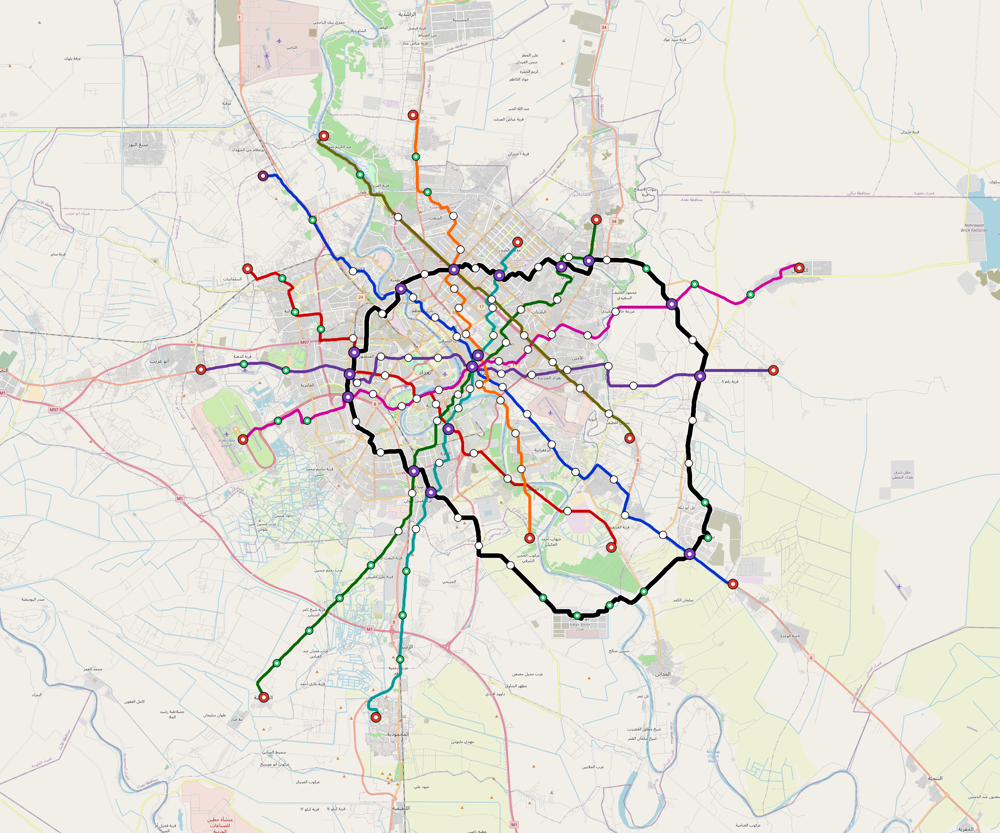

# Baghdad — Urban Rail Network

**Country:** IQ · **Population:** 9,780,429 · [National brief](../NATIONAL-BRIEF.md)

This page contains only Baghdad-specific results. Shared routing, service, energy, civil, cost, finance, QA and validation methods are defined once in the [deployment planning reference](../../../../../docs/deployment-planning-reference.md).

> [!IMPORTANT]
> **Foreign-capital advantage:** against the default equivalent foreign-turnkey sensitivity, this local plan avoids **$7.23 bn (85.1%) of external capital** and **$8.89 bn of external interest**. Capital plus saved interest totals **$16.12 bn**. See the common reference for interpretation and limitations.

Auto-planned by the OpenSourceRail design pipeline from the controlled city catalogue, source-locked geospatial inputs and shared templates.

## Network



| Local measure | Value |
|---|---:|
| Lines / unique stations / interchanges | 9 / 155 / 16 |
| Route length | 501.3 km double track |
| Coverage / transfer reachability | 85.5% / 47% |
| Estimated station catchment | 8,362,266 residents |
| Service span / peak headway | 05:30–02:00 / 3 min |
| Fleet | 784 × 6-car `metro-6car` trainsets (707 peak revenue) |
| Peak network throughput | 259,200 passengers/hour |
| Practical service capacity | 2,276,640 passenger-trips/day |
| Annual paid-trip planning range | 415.5–664.8 M |

### Lines

| Line | Length | Stations | Trainsets | Termini |
|---|---:|---:|---:|---|
| line-1 | 58.1 km | 17 | 102 | SE Outer ↔ NW Outer |
| line-2 | 45.8 km | 14 | 85 | NW Outer ↔ SE Mid |
| line-3 | 55.1 km | 18 | 105 | SW Outer ↔ NE Mid |
| line-4 | 52.9 km | 16 | 101 | W Outer ↔ E Outer |
| line-5 | 43.1 km | 15 | 81 | N Outer ↔ S Mid |
| line-6 | 47.2 km | 15 | 90 | N Mid ↔ S Outer |
| line-7 | 56.9 km | 17 | 103 | W Mid ↔ E Outer |
| line-8 | 36.4 km | 10 | 67 | E Mid ↔ NW Outer |
| line-9 | 105.7 km | 33 | 50 | W Mid ↔ W Mid |
| **Total** | **501.3 km** | **155 unique** | **784** | |

## Energy

| Local measure | Value |
|---|---:|
| Scheduled service | 3,952 one-way journeys / 208,504 train-km/day |
| Annual traction demand | 1,972.6 GWh |
| Station/depot PV / storage | 43.1 MW / 294.0 MWh |
| Aggregate charging power | 256.0 MW |
| Dedicated solar plant | 986.3 MW |
| Residual grid/PPA import | 0.0 GWh/yr |
| Worst powered-stop gap | line-9: 18.7 km / 302 kWh |
| Lowest traversal charging margin | line-8: 237 kWh |

## Capital And Funding

| Local CAPEX bucket | Planning value |
|---|---:|
| Civil works | $1.57 bn |
| Stations | $701 M |
| Depots | $8.0 M |
| Rolling stock | $1.32 bn |
| Dedicated solar plant | $789 M |
| Residual train control | $25 M |
| Charging microgrids | $55 M |
| EPC / project services | $257 M |
| **Total city programme** | **$4.72 bn** |

| Local funding measure | Planning value |
|---|---:|
| Imported / external capital | $1.27 bn (26.8%) |
| Domestic / local capital | $3.45 bn (73.2%) |
| Annual public construction commitment | $430 M / yr for 5 years |
| Annual post-grace debt service | $322 M / yr |
| External capital saved vs default turnkey sensitivity | $7.23 bn |
| Capital + lifetime external interest saved | $16.12 bn |
| Annual OPEX | $125 M / yr |

## Local Evidence

**Evidence refresh required.** Retained passing results below are unverified.
The strict README generator rejected the evidence: engineering/simulation/validation-summary.json describes scenario SHA-256 59cb2c6587cb000fc13c93595e39a581ff0eb7d77b37c1608561254dccb8ffee, but baghdad.toml is 172875747c1e06e462996f3e1a68048f689502d7f2b20a92b912b78811963073; rerun and update the validation evidence. This audit view does not accept or replace the retained solver results.

| Package | Current status | Evidence |
|---|---|---|
| Finance | unverified | [`summary.json`](engineering/finance/summary.json) |
| Native simulation + degraded cases | unverified | [`validation-summary.json`](engineering/simulation/validation-summary.json) |
| SUMO timetable | unverified | [`summary.json`](engineering/sumo/summary.json) |
| Independent OSR/SUMO running-time cross-check | unverified; junction/authority gate open | [`operations-crosscheck.md`](engineering/simulation/operations-crosscheck.md) |
| GIS package | unverified | [`summary.json`](engineering/gis/summary.json) |
| Solar/storage snapshot (operating duty unverified) | unverified; 0 findings; 77 grid-only diagnostics | [`summary.json`](engineering/energy/summary.json) |
| Operations, QA and maintenance | 1,667 assets / 7,838 tasks | [`baghdad-operations-manifest.json`](operations/baghdad-operations-manifest.json) |

## Local Files And Regeneration

| File | Local role |
|---|---|
| [`design.toml`](design.toml) | Authoritative generated city design |
| [`baghdad.toml`](baghdad.toml) | Expanded simulator scenario |
| [`baghdad.corridor.geojson`](baghdad.corridor.geojson) | GIS corridor and stations |
| [`baghdad.design-quality.yaml`](baghdad.design-quality.yaml) | Coverage, source and civil-quality gates |

```bash
tools/automation/regenerate-city.sh baghdad
```
