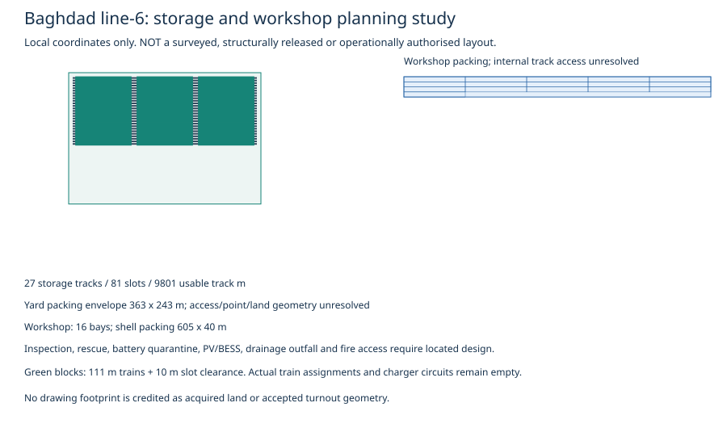

# Nine depot/storage design studies and Iraqi slab manufacture

[Located track and slot register](depot-layouts.json) identifies **497 storage positions**, 169 tracks, 60,137 usable track metres, 120,274 rail metres and 200,464 reference fixation-seat kits. 50,912.0 m³ concrete is a geometric reference for yard slabs, excluding foundations, reinforcement, grout/stray-current systems and point panels. Existing track/package costs are not supplemented by these quantities a second time.

| Line | Slots | Storage tracks | Workshop bays | Layout |
| --- | --- | --- | --- | --- |
| line-1 | 52 | 18 | 12 | [SVG](depot-line-1.svg) |
| line-2 | 67 | 23 | 14 | [SVG](depot-line-2.svg) |
| line-3 | 65 | 22 | 14 | [SVG](depot-line-3.svg) |
| line-4 | 54 | 18 | 11 | [SVG](depot-line-4.svg) |
| line-5 | 60 | 20 | 12 | [SVG](depot-line-5.svg) |
| line-6 | 74 | 25 | 14 | [SVG](depot-line-6.svg) |
| line-7 | 53 | 18 | 11 | [SVG](depot-line-7.svg) |
| line-8 | 68 | 23 | 13 | [SVG](depot-line-8.svg) |
| line-9 | 4 | 2 | 6 | [SVG](depot-line-9.svg) |

Drawings use local planning coordinates and distinguish storage slots from workshop bays. Rectangular packing can include unused end positions; it creates no acquired parcel or released alignment. Throat radii, bypass/escape tracks, drainage/outfalls, road/fire/evacuation access, utilities, lifting/inspection/rescue/quarantine areas and grid connection need actual surveys and supplier footprints. Line 6 requires about 33,333m² PV module area; no 4,000m² canopy is credited as adequate.

The yard-only slab production study requires **12 parallel mould cells** at a one-working-day cycle/75% utilisation, ready month 18 and delivering two months before each opening. Its [prefix-capacity programme](depot-layouts.json) includes cut/end panels and never casts beyond usable lengths. Moulds, curing/QA, batching, reinforcement, transport, lifting and installation require quantities/quotes and measured cycles. Factory CAPEX is null, not free. Main-line slab manufacture is a different existing production requirement; these cells cannot be represented as its total capacity. Iraqi casting/assembly remains a proposed procurement route, not a qualified plant.

[Startup alternatives](startup-policy-alternatives.json) compare the existing revenue fleet with the frozen original dispatch-point set, including 4 missing line-9 directions. Holding that set fixed requires 4 extra revenue trains and 2 extra spares: USD 10.08m vehicle reference, before consequential costs. Adding trains must not silently expand dispatch-point selection. Reserving fewer start points or buying trains requires a separate selected-start, cycle, turnback, depot/charging and funding replay; neither changes the baseline nor closes the existing failed gate.
