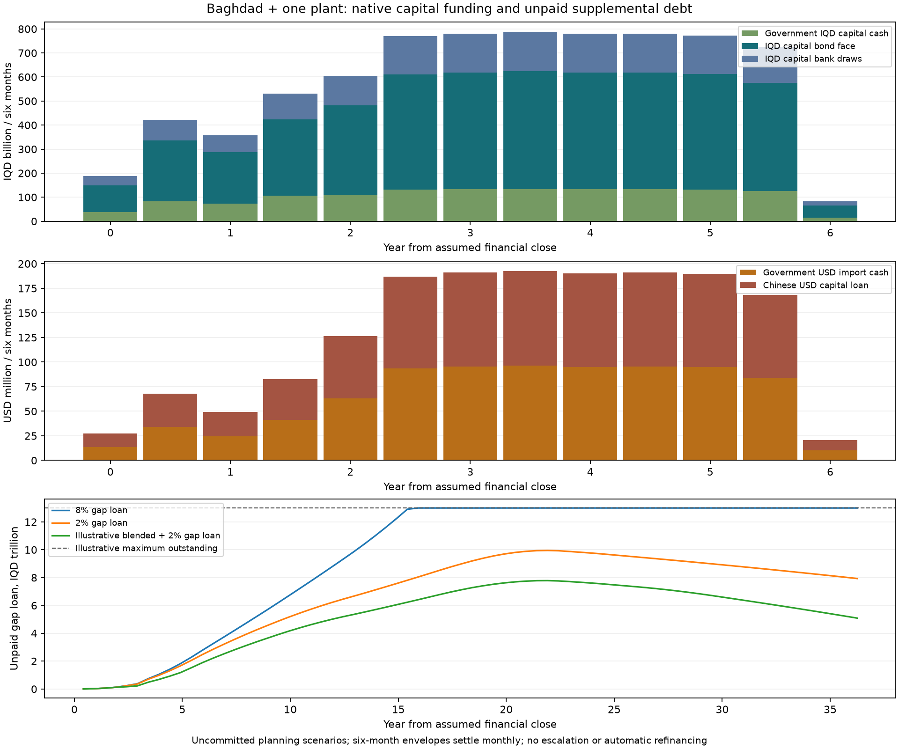

# Baghdad financing reconciliation and six-month placement programme

<!-- OSR CURRENT SCOPE CONTEXT -->
> **Original catalogue or earlier scope reference.** The figures and policies below retain their original assumptions; they are not the latest Baghdad staffing, depot, procurement or funding basis. See the [current Baghdad recalculation](../programme-recalculation/README.md) and [current city summary](../../README.md). National/portfolio totals have not been repriced with that conditional Baghdad option.
<!-- END OSR CURRENT SCOPE CONTEXT -->

Scope: Baghdad city and one Baghdad manufacturing plant. Samawah, Mosul and every other city are excluded. Month zero is an assumed financial close, not an approved date. All financing and additional revenues remain uncommitted.

## The numbers that must add up

The original capital sources and uses reconcile. The confusion was combining upfront capital, repayment of that same capital debt, gross liquidity injections and later retained cash. The revised schedule also spreads city EPC overhead across direct works instead of paying the entire programme allowance against the initial five-day baseline-freeze task. Capital cost is unchanged. An independent implementation rebuilds every debt vintage, interest charge, principal payment and financing fee from native draws; it does not copy the reported support total.

| Capital source | Native currency | Native amount, billion | USD equivalent, million |
|---|---|---:|---:|
| chinese export credit | USD | 0.842170 | 842.170 |
| government import cash | USD | 0.842170 | 842.170 |
| government local cash | IQD | 1,347.579172 | 1,036.599 |
| domestic bonds | IQD | 4,674.285469 | 3,595.604 |
| bank credit | IQD | 1,558.095156 | 1,198.535 |
| **Capital uses / sources** | Mixed | — | **7,515.079** |

Government cash remains 25% of capital, with government USD import cash inside that contribution. Imports are financed 50% government USD cash / 50% Chinese USD loan. Every other loan and bond is IQD. An international green lender must provide confirmed IQD on-lending or a priced currency hedge to preserve that strategy. A green label does not supply additional money.

| Lifetime operating / finance reconciliation | USD equivalent, million |
|---|---:|
| Fare and existing nonfare receipts | 13,644.125 |
| OPEX | 6,138.577 |
| Repayment of originally drawn capital principal | 5,636.309 |
| Interest on original capital financing | 4,129.288 |
| Original financing fees | 40.334 |
| **Net nominal lifetime liquidity deficit** | **2,300.383** |
| Gross extra cash required as bills fall due | 5,962.665 |
| Later unrestricted cash retained if those requirements are met | 3,662.282 |

**USD 5,962.665m gross injections minus USD 3,662.282m retained cash equals USD 2,300.383m net deficit.** Capital purchases are already financed by their capital sources; principal repayments belong to the lifetime cash ledger and must not be added to the construction budget again. Net reserve deposits are zero at the end. This is a nominal identity, not discounted viability, and assumes city/plant cash can legally be pooled

A zero-interest, zero-fee revolving bridge is only a mathematical lower bound. Real gap funding must charge interest and fees on the borrowing needed to carry early deficits, repay itself from later surplus and show any terminal debt. Later surplus cannot be counted both as retained cash and as loan repayment.

## Tickets, kiosk rents and advertising already included

| Full-network steady annual receipts | IQD billion | USD equivalent, million |
|---|---:|---:|
| Passenger tickets | 547.335 | 421.027 |
| Station shops and kiosk leases | 11.542 | 8.878 |
| Advertising space | 17.932 | 13.794 |
| Total existing operating receipts | 576.808 | 443.699 |

Tickets use 415.49m annual paid trips at IQD 1,317 average yield. This is assumed capacity use, not calibrated demand. Shops/kiosks use 27,656 m² at IQD 39,520/m²/month and 88% occupancy; advertising uses 5,084 boards at IQD 345,800/month and 85% occupancy. Rates derive from the retained income proxy, not Baghdad lease quotes. These are gross rental/advertising receipts; dedicated concession costs, tenant demand and collection losses require appraisal.

All three receipts enter the existing operating cashflows and therefore already reduce the financing gap. The phased sensitivity scales the combined receipts by opened-fleet share and the separate 50% / 75% / 100% revenue ramp for each line. Retail and advertising demand may follow different ramps in practice. Proposed naming rights, telecom leases, parking, development proceeds or new commercial receipts must be genuinely additional and net of costs; existing rents cannot be booked again or sold upfront while also retained in future revenue.

## What gap finance actually does

The illustrative maximum outstanding facility is IQD 13.000 trillion (USD 10.000bn equivalent). This is a size assumption, not proof that the Iraqi banking market can place it. All available surplus after core obligations and reserves is swept to its repayment. No refinancing or debt forgiveness is assumed at the final maturity.

| Scenario | Gross new liquidity draws, IQD tn | Peak facility balance, IQD tn | Uncovered cash beyond facility, IQD tn | Terminal unpaid facility, IQD tn |
|---|---:|---:|---:|---:|
| unfunded reference | 0.000 | 0.000 | 7.751 | 0.000 |
| green label only | 0.000 | 0.000 | 7.751 | 0.000 |
| zero cost liquidity bound | 7.751 | 7.751 | 0.000 | 2.990 |
| commercial gap credit | 13.000 | 13.000 | 17.914 | 13.000 |
| concessional gap credit | 9.950 | 9.950 | 0.000 | 7.934 |
| blended candidate | 7.959 | 7.784 | 0.000 | 5.091 |
| green concessional only | 9.085 | 9.085 | 0.000 | 7.363 |

Reference and label-only cases have no gap facility: their uncovered column is the required external cash contribution, not an approved government top-up. With a facility, uncovered cash excludes the separate terminal loan balance; both need a solution. Gross draws can exceed the maximum outstanding commitment when a revolving facility is repaid and redrawn. Conditional ledgers do not establish that an unfunded payment occurred.

Commercial gap credit assumes 8% interest and 1.0% draw fees. Concessional gap credit assumes 2% interest and 0.5% draw fees. Neither is a term sheet or an available GCF line. Funding old debt-service deficits is not automatically eligible green use of proceeds.

## Explicit blended sensitivity

Candidate climate expenditure is USD 2,085.33m of electric rolling stock, solar and charging provision, including USD 1,277.84m assigned locally. Climate benefit, supplier qualification and green eligibility require independent review. Candidate green bonds replace only domestic bonds attributable to those expenditures; civil works and unrelated overhead are not automatically relabelled.

The blended sensitivity replaces that eligible bond portion with proposed IQD green bonds/sukuk at 4%, 48 months' grace and 240 months' amortisation, with 0.75% arrangement fees and 0.5%/year enhancement fees on outstanding principal. The lower rate depends on a concessional or guarantee structure; a green label alone retains the original 8% terms and changes no financial outcome.

Additional targets are a **USD 25m** climate capital grant translated into IQD receipts, replacing domestic borrowing against eligible local capital after month 24; **USD 300m** net development-rights proceeds in 6 six-month instalments from month 24; and **USD 25m/year** genuinely new net local receipts at full opening, scaled with the opened fleet. These are editable targets, not appraisals, GCF approvals, developer contracts or statutory levies. Existing rents, advertising and fares cannot be counted again; transaction/development costs and displaced future rents must be deducted. Public land contribution also needs economic valuation.

Solving the model rather than declaring the targets sufficient requires approximately **USD 113.94m/year additional NET receipts** (IQD 148.13bn/year at full opening) to eliminate both uncovered cash and the terminal facility under the other blended assumptions. This is a break-even funding requirement, not a forecast or a recommended passenger fare increase. Any covenant, inflation, FX or demand change can raise it.

## Variable tickets, annual price changes and OPEX inflation

The following cases retain the same conditional blended capital/grant/rights/2% IQD facility assumptions. They change fares, OPEX and income separately. A 5% tariff increase with flat costs is an optimistic sensitivity; the paired 5% OPEX case is the requested inflation comparison. None is an adopted fare, a lender commitment or an Iraqi inflation forecast.

Indices compound in annual steps from financial close, including the years before first opening. No tickets are sold before service starts; the nominal launch price reflects elapsed inflation. Existing retail/advertising are held flat unless the case explicitly indexes those rents. New net income and rights targets remain fixed nominal amounts. CAPEX escalation and future FX changes still require a separate full nominal appraisal.

Demand responds to fare relative to the indexed income proxy with an illustrative elasticity of -0.30, except the explicitly fixed-demand cases. Income growth is a separate assumption, not evidence that wages will keep pace. Discount-led demand growth is capped at 2.0 times the baseline, within the original practical capacity. There is no calibrated Baghdad peak-switching or household demand model.

Variable tickets assume 40% of baseline trips in a peak tier at 1.25 times the standard fare, and remaining trips at 0.90 times it. Each tier gets its own demand response before revenues are combined. Concessions, commuter caps, integrated transfers and off-peak eligibility require an actual tariff design and funding contract; their costs are not silently waived.

| Pricing sensitivity | Fare / OPEX / income growth | Full-opening average fare, IQD | 44 trips / income at full opening | Peak facility, IQD tn | Uncovered cash, IQD tn | Terminal debt, IQD tn |
|---|---|---:|---:|---:|---:|---:|
| fare 5pct flat costs fixed demand | 5% / 0% / 0% | 1,765 | 15.7% | 3.178 | 0.000 | 0.000 |
| fare 5pct flat costs elastic | 5% / 0% / 0% | 1,765 | 15.7% | 3.837 | 0.000 | 0.000 |
| fixed fare 5pct opex | 0% / 5% / 5% | 1,317 | 8.8% | 13.000 | 9.741 | 13.000 |
| fare 5pct opex 5pct | 5% / 5% / 5% | 1,765 | 11.7% | 4.256 | 0.000 | 0.000 |
| fare 5pct opex 7pct | 5% / 7% / 5% | 1,765 | 11.7% | 5.786 | 0.000 | 0.000 |
| fare 5pct opex 5pct income 2pct | 5% / 5% / 2% | 1,765 | 14.0% | 5.439 | 0.000 | 0.000 |
| variable fare 5pct opex 5pct | 5% / 5% / 5% | 1,822 | 12.1% | 4.028 | 0.000 | 0.000 |
| fare 5pct opex 5pct rents indexed | 5% / 5% / 5% | 1,765 | 11.7% | 4.071 | 0.000 | 0.000 |

In the paired 5% case, the first line's average nominal fare is IQD 1,525 in month 40; at full opening in month 76 it is IQD 1,765. Its maximum supplemental facility is IQD 4.256tn, with IQD 0.000tn uncovered cash and IQD 0.000tn unpaid at the end. Later surplus can repay a priced facility under these assumptions; it does not remove the early borrowing requirement.

At an 5% general-price assumption, the 8% real discount assumption becomes 13.4% nominal. The paired-case unlevered NPV is USD -3.262bn equivalent before grants/new rights/net-income targets and with capital still un-escalated. Large distant nominal balances are not present-value wealth or proof of project viability.

If income rises with fares, the modelled commuting share stays broadly constant. With income rising only 2%, the same ticket policy becomes progressively less affordable and reduces paid trips. If OPEX rises 7% against 5% fares, the tested financing again leaves uncovered requirements and terminal debt. Maintaining an affordable real tariff, collecting revenue and placing the required early IQD facility matter as much as the nominal annual increase.

[Paired 5% six-month funding requirements](../../../finance/baghdad-fare_5pct_opex_5pct-six-month-tranches.csv) · [paired monthly prices and affordability](../../../finance/baghdad-fare_5pct_opex_5pct-monthly-prices.csv) · [variable-ticket funding requirements](../../../finance/baghdad-variable_fare_5pct_opex_5pct-six-month-tranches.csv) · [variable monthly tickets](../../../finance/baghdad-variable_fare_5pct_opex_5pct-monthly-prices.csv)

The initial real-fare multiplier required to remove both terminal debt and uncovered cash under paired 5% indices and the other blended assumptions is approximately 1.000 times the existing baseline. This is a conditional break-even sensitivity, not a tariff recommendation; it does not guarantee the facility can be placed or that households' incomes will grow.

## Surplus cash and early repayment

These cases use identical paired 5% fare/OPEX/income assumptions and the same conditional blended capital sources. Each pays OPEX, scheduled principal, interest and fees, then funds the debt-service reserve and a three-month current-OPEX buffer before voluntary repayment. Borrowed gap proceeds and uncovered external cash cannot fund early payments. The extra buffer remains cash held at the terminal horizon and earns no interest.

Compare strategies against **buffered gap-only**, rather than attributing the buffer change to repayment savings. Loans-first pays bank credit, Chinese credit and gap credit before bonds. Cost priority pays bank (9%), ordinary bonds (8%), Chinese credit (5%), green bonds (4% plus 0.5% annual guarantee), then gap credit (2%). It is an interest-rate heuristic, not a proof of the globally best strategy.

| Surplus strategy | All debt cleared, month from close | Finance cost saving vs buffered gap-only, USD equivalent m | Early-payment premiums, USD equivalent m | Peak gap debt, IQD tn | Terminal unrestricted cash, IQD tn |
|---|---:|---:|---:|---:|---:|
| gap only buffered | 365 | 0.000 | 0.000 | 4.418 | 14.870 |
| gap then core | 306 | 9.839 | 1.572 | 4.418 | 14.883 |
| loans then bonds | 305 | 81.916 | 6.310 | 4.372 | 14.976 |
| cost priority | 303 | 168.132 | 21.169 | 4.371 | 15.088 |
| cost priority zero premium | 303 | 195.771 | 0.000 | 4.368 | 15.124 |
| cost priority noncallable bonds | 365 | 71.442 | 4.683 | 4.372 | 14.963 |

Cost priority clears all debt in month **303**, compared with **365** for buffered gap-only. Net nominal financing savings are **USD 168.132m equivalent**, after USD 21.169m assumed early-payment premiums. Savings include core interest, annual green guarantee charges and supplemental interest/draw fees; they exclude principal, which is returned once. All cases retain IQD 0.362tn operating buffer separately from unrestricted cash. There is no additional government contribution above 25% of CAPEX in these cases.

Assumed premiums are 1% of bank/Chinese/green principal and 2% of ordinary bond principal. A minimum draw age of 6 months (bank), 12 (Chinese) and 24 (both bonds) prevents immediate issue-and-redemption. Eligible vintages are repaid oldest first; contractual instalments are kept and maturity shortens. Notice, issuer call rights, investor consent, buyback price, remaining-maturity compensation, tax and FX require actual agreements. Noncallable-bond sensitivity makes no voluntary bond payments; zero-premium sensitivity removes only the assumed premium, retaining minimum ages.

| Facility | Buffered gap-only final principal payment month | Cost-priority final principal payment month | Early principal, native currency | Premium, native currency |
|---|---:|---:|---:|---:|
| bank credit | 161 | 161 | IQD 179.993bn | IQD 1.800bn |
| domestic bonds | 281 | 230 | IQD 853.131bn | IQD 17.063bn |
| chinese export credit | 305 | 235 | USD 239.631m | USD 2.396m |
| green bonds | 365 | 244 | IQD 554.236bn | IQD 5.542bn |

The gap facility's final principal payment is in month 303. Later surplus remains unrestricted cash after debt retirement. Each month's native debt balance equals prior balance plus draws minus scheduled and early principal. Each six-month closing balance is its final month's balance; payments, premiums, interest and reserve movements are period sums. Contractual repayment windows in tranche files describe the original draw terms; the actual final-payment months above incorporate early repayment.

[Monthly cost-priority repayments](../../../finance/baghdad-early-cost_priority-monthly.csv) · [six-month repayment tranches](../../../finance/baghdad-early-cost_priority-six-month-tranches.csv) · [loans-first tranches](../../../finance/baghdad-early-loans_then_bonds-six-month-tranches.csv) · [all six complete calculations](../../../finance/baghdad-early-repayment.json)

Loan prepayment can carry redeployment/unwind charges: the [World Bank Treasury FAQ](https://treasury.worldbank.org/en/about/unit/treasury/ibrd-financial-products/financial-products-faqs) illustrates the concept, without establishing Chinese or Iraqi loan terms. The [US Treasury buyback FAQ](https://treasurydirect.gov/help-center/faqs/buyback-faqs/) and [published purchase results](https://treasurydirect.gov/auctions/announcements-data-results/buy-backs/) illustrate issuer authority and priced buybacks rather than automatic par redemption; they do not supply an Iraqi legal mandate.

This repayment allocation does not change the unlevered project NPV or validate demand. Nominal savings over several decades are not present-value gains. CAPEX escalation, FX, lifecycle replacement, floating-rate risk and the uncommitted early funding still require appraisal.

## Six-month bond sales and capital loan requirements

Each half-year is a placement/draw envelope, with monthly settlement against capital milestones. Bonds assume par proceeds and an illustrative IQD 1,000,000 denomination. Face-value requirements below use unrounded values; unit counts in CSV round upwards and separately disclose the resulting indicative face amount. Sale discounts, issuance fees and investor capacity need actual bookbuilding. Selling every half-year amount upfront changes interest/carry and grace clocks and is not simulated here.

The government USD cash and Chinese USD loan are separate; government local cash, bonds, bank draws and uncovered liquidity are native IQD. Chinese facility commitment fees retain the existing annual procurement-cohort assumption; six-month envelopes do not assert a new signing schedule. Grace starts on each actual monthly settlement. First/last repayments for a half-year series therefore differ by draw date.

| Tranche | Months from close | Government USD m | Government IQD bn | Chinese loan USD m | Bond face IQD bn | Bank loan IQD bn | Additional cash need IQD bn |
|---|---|---:|---:|---:|---:|---:|---:|
| BGD-H001 | 0–5 | 13.66 | 37.91 | 13.66 | 111.93 | 37.31 | 5.20 |
| BGD-H002 | 6–11 | 33.85 | 83.24 | 33.85 | 253.29 | 84.43 | 18.17 |
| BGD-H003 | 12–17 | 24.72 | 73.41 | 24.72 | 213.37 | 71.12 | 36.96 |
| BGD-H004 | 18–23 | 41.27 | 105.74 | 41.27 | 318.38 | 106.13 | 60.14 |
| BGD-H005 | 24–29 | 63.11 | 110.25 | 63.11 | 371.12 | 123.71 | 104.09 |
| BGD-H006 | 30–35 | 93.45 | 131.93 | 93.45 | 479.07 | 159.69 | 126.01 |
| BGD-H007 | 36–41 | 95.67 | 132.94 | 95.67 | 485.69 | 161.90 | 334.76 |
| BGD-H008 | 42–47 | 96.39 | 134.48 | 96.39 | 490.54 | 163.51 | 275.72 |
| BGD-H009 | 48–53 | 95.10 | 132.99 | 95.10 | 484.68 | 161.56 | 310.25 |
| BGD-H010 | 54–59 | 95.57 | 133.12 | 95.57 | 485.88 | 161.96 | 341.65 |
| BGD-H011 | 60–65 | 94.87 | 131.37 | 94.87 | 480.60 | 160.20 | 368.52 |
| BGD-H012 | 66–71 | 84.17 | 126.31 | 84.17 | 448.33 | 149.44 | 383.60 |
| BGD-H013 | 72–77 | 10.35 | 13.88 | 10.35 | 51.41 | 17.14 | 353.06 |
| **Total capital envelopes** | — | 842.17 | 1347.58 | 842.17 | 4674.29 | 1558.10 | — |

Displayed two-decimal values can differ from full-precision totals by rounding. The six-month CSVs continue through the entire operating/repayment horizon, including periods with no new capital but interest, principal, liquidity draws, reserve movements and cash sweeps. Every tranche independently reconciles its capital sources and uses.

[Reference six-month requirements](../../../finance/baghdad-unfunded_reference-six-month-tranches.csv) · [blended six-month requirements](../../../finance/baghdad-blended_candidate-six-month-tranches.csv) · [commercial gap-credit six-month requirements](../../../finance/baghdad-commercial_gap_credit-six-month-tranches.csv) · [independent machine-readable calculation](../../../finance/baghdad-finance-reconciliation.json)

## Financing routes to investigate in Iraq

| Route | What it can finance | Cashflow treatment and next requirement |
|---|---|---|
| IQD green bonds / green sukuk | Qualified electric transport, solar and charging capital | Replace conventional debt. Define eligible use, segregate proceeds, obtain independent review and report allocation/impact. Sukuk requires an approved asset/usufruct, legal and Sharia structure; the model does not assume a qualified sukuk issue. |
| GCF / GEF preparation and climate capital support | Climate studies, proven incremental mitigation/adaptation expenditure and eligible capital | Grants reduce debt only when approved; concessional debt still repays. Seek an accredited entity and Iraq NDA support with an emissions/resilience baseline. No grant is booked in the reference. |
| CBI renewable-energy initiative | Qualifying solar installations under the latest participating-bank rules | Obtain bank confirmation of borrower/project eligibility, current caps and terms. This existing Iraqi route is not assumed available for the whole metro or booked as a new capital source. |
| MDB / IFC credit enhancement and IQD syndication | Mobilising Iraqi banks and institutional bond investors | Guarantees improve placement or terms, supply no standalone cash, cost fees and may create sovereign contingent liabilities. Confirm IQD availability, hedge pricing and lender limits. |
| Station-area joint development and development rights | A contracted contribution towards stations/access or unrestricted net proceeds | Independently value parcels and rights, confirm title and revenue powers, tender transparently, deduct costs and future rent foregone. Early rights proceeds can reduce peak liquidity more than late rents. |
| Parking/congestion proceeds, employer transport subscriptions and business improvement charges | Incremental local recurring cash after authorised net collection costs | Separate each revenue stream from existing fare/nonfare receipts; validate legal powers, demand, affordability, exemptions and enforcement. No unverified tax power is assumed. |
| Solar/BESS project company, energy-service or availability contracts | Private financing of an accepted energy package | Remove transferred CAPEX and related city debt once; add the PPA/lease/service payments and guarantees. Compare their NPV with existing electricity/OPEX to avoid a free-CAPEX saving. No assumed saving is booked here. |
| Manufacturer / tooling leases and supplier finance | Qualified equipment and assembly capacity | Deferred invoices or leases are debt-like obligations with priced future payments. Do not duplicate Chinese invoice credit. Factory customer receipts and actual margins need a consolidated business case. |
| Diaspora and institutional IQD issues | Local capital subscription within the bond programme | These are purchaser channels for existing bond face, not another capital source. Disclose investor FX risk, maturity and redemption; no automatic rollover or compulsory pension purchase. |
| Carbon / results-based climate receipts | Verified additional emission reductions after delivery | Treat as contingent upside until methodology, monitoring, ownership and an offtake are contracted; no carbon revenue in the reference or blended case. |

Priority: first align civil spending and production with accepted openings, then seek eligible cheaper/longer capital financing and contractual early rights proceeds. Obtain a funded recurring-revenue plan before borrowing a multi-trillion-dinar gap facility. Green finance and creative structures do not cure an unfunded timing mismatch or unsupported demand on their own.

## Primary evidence checked 3 October 2026

The [GCF Iraq country profile](https://www.greenclimate.fund/countries/iraq) lists two projects with USD 49.5m total GCF finance and USD 5.2m approved readiness support when checked; these are existing country programmes, not Baghdad rail allocations. The [Iraq country programme](https://www.greenclimate.fund/document/iraq-country-programme) provides national priorities. An additional USD 25m application target is therefore a sensitivity requiring a new proposal, not money already available.

[GCF investment framework](https://www.greenclimate.fund/access-funding/project-approval-process/investment-framework) and [financial instruments](https://www.greenclimate.fund/partners/investors) support the grant/concessional/guarantee concepts and require viable revenue-generating activities for loans. [ICMA Green Bond Principles](https://www.icmagroup.org/sustainable-finance/the-principles-guidelines-and-handbooks/green-bond-principles-gbp/) require a transparent use-of-proceeds process, allocation controls and impact reporting; they do not promise a reduced coupon.

The [CBI renewable-energy amendment of April 2025](https://cbi.iq/news/view/2845) establishes a local financing route to investigate for eligible energy packages. Its limits and bank eligibility cannot be extrapolated into a multi-trillion-dinar metro facility. [IsDB green/sustainability sukuk guidance](https://www.isdb.org/multimedia/accelerating-climate-finance-through-green-and-sustainability-sukuk-including-launch-of-the-guidance-on-sustainable-sukuk) supplies a structuring reference, not a Baghdad issuance mandate.

[World Bank guarantee programme](https://www.worldbank.org/en/programs/guarantees-program.print) supports foreign/local-currency obligations subject to project and sovereign approvals. [IFC local-currency syndications](https://www.ifc.org/en/what-we-do/sector-expertise/syndicated-loans-and-mobilization/local-currency-syndications) explains domestic parallel loans and hedge structures; it does not establish an IQD loan offer for OSR. [IFC Iraq investment activity](https://www.ifc.org/en/pressroom/2025/ifc-marks-20-years-of-partnerships-for-impact-in-iraq-announces-1bn-in-new-investm) establishes an existing country presence, not project eligibility or earmarked money.

[World Bank land-value-capture guidance](https://ppp.worldbank.org/library/municipal-public-private-partnership-framework-module-16-harnessing-land-value-capture) and [innovative revenues](https://ppp.worldbank.org/maximizing-revenue-funding-infrastructure) provide structuring examples, not Iraq borrowing/tax authority or a Baghdad parcel valuation.

[World Bank integrated-fare guidance](https://blogs.worldbank.org/en/transport/nine-suggestions-designing-and-implementing-integrated-fare-systems) supports examining peak/off-peak, transfer and integrated ticket structures. Its [Bogotá affordability study](https://documents.worldbank.org/en/publication/documents-reports/documentdetail/099422408122455548) illustrates the need for household-specific demand evidence; neither calibrates the -0.30 sensitivity for Baghdad or endorses a 5% annual increase.

## Remaining modelling and term-sheet limits

- Six-month bond placement envelopes settle monthly at par; they are not advance-funded bond sales. Advance issuance changes carry, reserve and interest costs and needs a separate cash forecast.
- Full unrounded placement values reconcile; illustrative IQD 1 million unit counts round upwards and are not executable orders. No auction price, investor demand or mandate is established.
- A green label alone uses unchanged domestic pricing. The lower coupon/longer tenor and 0.5% annual guarantee fee are explicit sensitivities, not donor or lender terms.
- Climate capital grants replace domestic capital borrowing only, against candidate local expenditure. They do not pay old debt interest, imported invoices already funded 50:50, or increase government cash above 25%.
- Incremental land/rights/local receipts are zero in the reference and must be genuinely additional to existing fare, retail, rent and advertising forecasts. Net proceeds after costs, title, statutory powers and independent valuation require qualification.
- The supplemental IQD facility pays its own interest and origination fees. Surplus is swept to repayment; terminal balances are exposed rather than assumed refinanced or forgiven.
- The illustrative IQD facility has a 13 trillion maximum outstanding commitment; residual cash requirements beyond that cap remain explicitly uncovered. No committed lender or future market capacity is assumed.
- Supplemental facilities have no extra DSRA or undrawn commitment fee and no fixed amortisation before the terminal maturity; term sheets can materially increase costs. Long draw availability and the terminal balloon are uncommitted assumptions.
- City/plant cash is pooled subject to legally permitted transfers and creditor consent. Factory income/OPEX remain outside the capital-only plant appraisal; no free factory profit is credited.
- All non-Chinese debt is modelled in IQD. Foreign-funded concessional programmes need confirmed IQD on-lending or a priced hedge; an unhedged USD development loan would change the currency strategy.
- The reference has constant nominal fares, OPEX and FX. Dedicated pricing cases explicitly index fares, OPEX and income independently from financial close. Capital escalation, FX inflation pass-through and separate lifecycle replacement inflation remain outside this sensitivity; full nominal appraisal must include them.
- Pricing cases retain fixed nominal core and gap debt terms; supplier terms, floating rates and imported OPEX exposure need qualification. New net revenue targets are held nominal rather than assumed inflation-protected.
- Price elasticity is an uncalibrated response to fare relative to indexed income; no transfer, peak switching or low-income household demand survey is modelled. Off-peak trip increases are bounded by the same practical capacity, not new physical capacity.
- Early repayment is a contractual sensitivity, not an exercised call right. Bank/Chinese loan eligibility, bond call or voluntary buyback rights, notice, price and premiums require actual terms. The noncallable case forbids all early bond principal. Illustrative minimum draw ages are 6 months for bank credit, 12 for Chinese credit and 24 for bonds; these are not actual covenants.
- Cost priority is a coupon/guarantee-fee heuristic, not a globally optimal treasury strategy. Premiums, tax, remaining maturities, future draws and FX can change the best order; no refinancing or capital-issue cancellation is modelled.
- A three-month OPEX buffer is funded before discretionary repayment in every early-policy comparison. It is retained at the terminal horizon and earns no income. Original baseline cases have no such additional buffer; savings are compared with a buffered gap-only case as well as the original.

[Editable options](../../../../../../../lib/templates/baghdad-finance-options.toml) · [existing capital assumptions](../../../../../../../lib/templates/iraq-funding.toml) · [original city appraisal](FUNDING-MODEL.md) · [Baghdad-only programme](../../../IRAQ-FUNDING-PROGRAMME.md)
