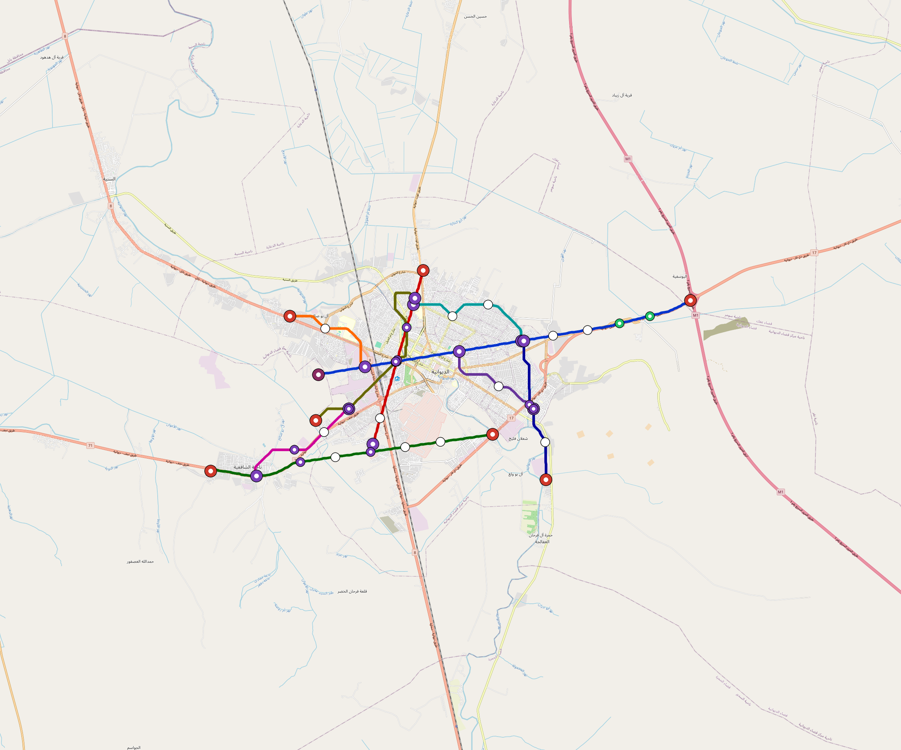

# Diwaniyah — Urban Rail Network

**Country:** IQ · **Population:** 440,000 · [National brief](../NATIONAL-BRIEF.md)

This page contains only Diwaniyah-specific results. Shared routing, service, energy, civil, cost, finance, QA and validation methods are defined once in the [deployment planning reference](../../../../../docs/deployment-planning-reference.md).

> [!IMPORTANT]
> **Foreign-capital advantage:** against the default equivalent foreign-turnkey sensitivity, this local plan avoids **$681 M (87.0%) of external capital** and **$837 M of external interest**. Capital plus saved interest totals **$1.52 bn**. See the common reference for interpretation and limitations.

Auto-planned by the OpenSourceRail design pipeline from the controlled city catalogue, source-locked geospatial inputs and shared templates.

## Network



| Local measure | Value |
|---|---:|
| Lines / unique stations / interchanges | 3 / 19 / 1 |
| Route length | 49.8 km double track |
| Coverage / transfer reachability | 50.5% / 33% |
| Estimated station catchment | 222,200 residents |
| Service span / peak headway | 05:30–02:00 / 3 min |
| Fleet | 106 × 3-car `light-metro-3car` trainsets (95 peak revenue) |
| Peak network throughput | 43,200 passengers/hour |
| Practical service capacity | 401,760 passenger-trips/day |
| Annual paid-trip planning range | 73.3–117.3 M |

### Lines

| Line | Length | Stations | Trainsets | Termini |
|---|---:|---:|---:|---|
| line-1 | 20.7 km | 9 | 43 | E Outer ↔ W Mid |
| line-2 | 12.7 km | 5 | 27 | N Mid ↔ SW Inner |
| line-3 | 16.4 km | 5 | 36 | SE Inner ↔ SW Outer |
| **Total** | **49.8 km** | **19 unique** | **106** | |

## Energy

| Local measure | Value |
|---|---:|
| Scheduled service | 1,395 one-way journeys / 23,180 train-km/day |
| Annual traction demand | 109.6 GWh |
| Station/depot PV / storage | 9.8 MW / 48.0 MWh |
| Aggregate charging power | 8.5 MW |
| Dedicated solar plant | 46.3 MW |
| Residual grid/PPA import | 0.0 GWh/yr |
| Worst powered-stop gap | line-3: 8.5 km / 68 kWh |
| Lowest traversal charging margin | line-2: 30 kWh |

## Capital And Funding

| Local CAPEX bucket | Planning value |
|---|---:|
| Civil works | $184 M |
| Stations | $79 M |
| Depots | $8.0 M |
| Rolling stock | $95 M |
| Dedicated solar plant | $37 M |
| Residual train control | $2.5 M |
| Charging microgrids | $1.9 M |
| EPC / project services | $26 M |
| **Total city programme** | **$435 M** |

## Iraq funding

Proposed facilities and appropriations remain uncommitted. The conditional ledger calculates government capital and the extra support required for fees, interest, reserves and cash shortfalls; additional support is not a funding commitment.

| Capital source | Planning USD equivalent |
|---|---:|
| bank credit | $40 M |
| chinese export credit | $39 M |
| domestic bonds | $119 M |
| government | $237 M |

The procurement schedule requires **52 calendar months** of capital cash under an assumed 260-working-day year. The resource-constrained full-network rollout needs review before a construction commitment.

Peak annual government cash: **$213 M**. This includes support required under the low capacity-use case; it is not a funded appropriation.

Chinese export buyer credit is allocated within existing imported budgets for solar equipment, bogies, batteries, windows and doors. City CAPEX excludes manufacturing tooling; the Baghdad-only programme separately funds one plant for Baghdad. IQD bonds assume a proposed Ministry of Finance programme; municipal borrowing authority is pending legal review.

The model includes actual scheduled draws, native-currency principal/interest, fees, revenue ramps, operating/debt support, reserve movements and downside cases. Short bullet bonds have explicit redemptions without assumed refinancing.

See [funding model](engineering/finance/FUNDING-MODEL.md), [monthly cashflow](engineering/finance/funding-monthly-cashflow.csv), [annual cashflow](engineering/finance/funding-annual-cashflow.csv) . This standalone city appraisal is outside the Baghdad-only funding programme.

Annual operating allowance: $12 M; demand remains capacity-led.

## Local Evidence

**Evidence refresh required.** Retained passing results below are unverified.
The strict README generator rejected the evidence: engineering/simulation/validation-summary.json describes scenario SHA-256 e666e8bcd5603a4bafddae9fbc4e6a19384ff5f1641cfab5bbaa112b3c91740a, but diwaniyah.toml is 79a0dbcc9a08821d97c1a675cfd05420b95813592217a3f10503e00408200cb4; rerun and update the validation evidence. This audit view does not accept or replace the retained solver results.

| Package | Current status | Evidence |
|---|---|---|
| Finance | unverified | [`summary.json`](engineering/finance/summary.json) |
| Native simulation + degraded cases | unverified | [`validation-summary.json`](engineering/simulation/validation-summary.json) |
| SUMO timetable | unverified | [`summary.json`](engineering/sumo/summary.json) |
| Independent OSR/SUMO running-time cross-check | unverified; junction/authority gate open | [`operations-crosscheck.md`](engineering/simulation/operations-crosscheck.md) |
| GIS package | unverified | [`summary.json`](engineering/gis/summary.json) |
| Solar/storage snapshot (operating duty unverified) | unverified; 0 findings; 7 grid-only diagnostics | [`summary.json`](engineering/energy/summary.json) |
| Operations, QA and maintenance | 219 assets / 1,295 tasks | [`diwaniyah-operations-manifest.json`](operations/diwaniyah-operations-manifest.json) |

## Local Files And Regeneration

| File | Local role |
|---|---|
| [`design.toml`](design.toml) | Authoritative generated city design |
| [`diwaniyah.toml`](diwaniyah.toml) | Expanded simulator scenario |
| [`diwaniyah.corridor.geojson`](diwaniyah.corridor.geojson) | GIS corridor and stations |
| [`diwaniyah.design-quality.yaml`](diwaniyah.design-quality.yaml) | Coverage, source and civil-quality gates |

```bash
tools/automation/regenerate-city.sh diwaniyah
```
