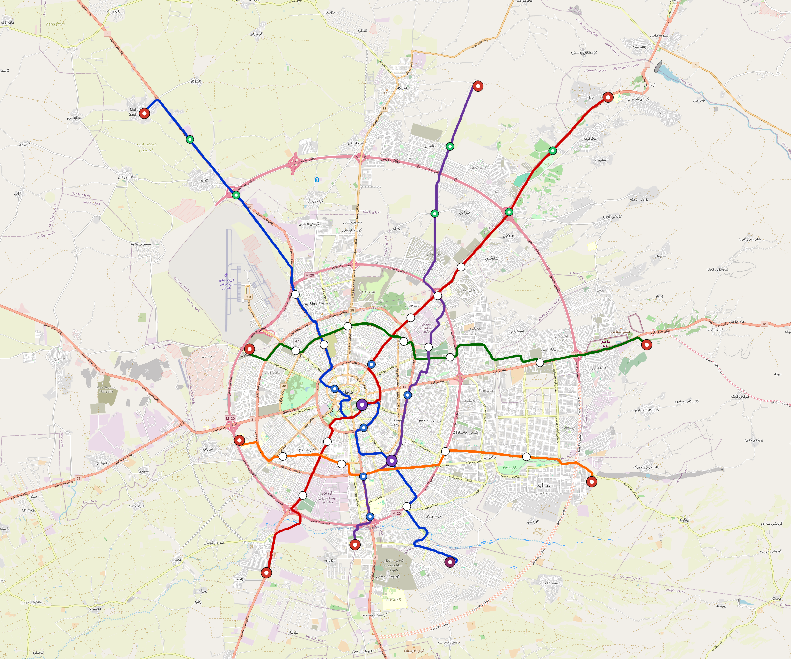

# Erbil — Urban Rail Network

**Country:** IQ · **Population:** 1,952,000 · [National brief](../NATIONAL-BRIEF.md)

This page contains only Erbil-specific results. Shared routing, service, energy, civil, cost, finance, QA and validation methods are defined once in the [deployment planning reference](../../../../../docs/deployment-planning-reference.md).

> [!IMPORTANT]
> **Foreign-capital advantage:** against the default equivalent foreign-turnkey sensitivity, this local plan avoids **$1.57 bn (85.7%) of external capital** and **$1.94 bn of external interest**. Capital plus saved interest totals **$3.51 bn**. See the common reference for interpretation and limitations.

Auto-planned by the OpenSourceRail design pipeline from the controlled city catalogue, source-locked geospatial inputs and shared templates.

## Network



| Local measure | Value |
|---|---:|
| Lines / unique stations / interchanges | 5 / 45 / 2 |
| Route length | 138.1 km double track |
| Coverage / transfer reachability | 62.4% / 40% |
| Estimated station catchment | 1,218,048 residents |
| Service span / peak headway | 05:30–02:00 / 3 min |
| Fleet | 212 × 4-car `metro-4car` trainsets (191 peak revenue) |
| Peak network throughput | 96,000 passengers/hour |
| Practical service capacity | 892,800 passenger-trips/day |
| Annual paid-trip planning range | 162.9–260.7 M |

### Lines

| Line | Length | Stations | Trainsets | Termini |
|---|---:|---:|---:|---|
| line-1 | 36.5 km | 11 | 54 | NW Outer ↔ S Mid |
| line-2 | 31.7 km | 10 | 49 | SW Outer ↔ NE Outer |
| line-3 | 23.4 km | 7 | 37 | W Mid ↔ E Outer |
| line-4 | 26.5 km | 10 | 41 | N Outer ↔ S Mid |
| line-5 | 19.9 km | 7 | 31 | SW Mid ↔ SE Outer |
| **Total** | **138.1 km** | **45 unique** | **212** | |

## Energy

| Local measure | Value |
|---|---:|
| Scheduled service | 2,325 one-way journeys / 64,201 train-km/day |
| Annual traction demand | 404.9 GWh |
| Station/depot PV / storage | 16.4 MW / 97.0 MWh |
| Aggregate charging power | 58.5 MW |
| Dedicated solar plant | 193.8 MW |
| Residual grid/PPA import | 0.0 GWh/yr |
| Worst powered-stop gap | line-1: 12.8 km / 138 kWh |
| Lowest traversal charging margin | line-4: 127 kWh |

## Capital And Funding

| Local CAPEX bucket | Planning value |
|---|---:|
| Civil works | $371 M |
| Stations | $173 M |
| Depots | $8.0 M |
| Rolling stock | $237 M |
| Dedicated solar plant | $155 M |
| Residual train control | $6.9 M |
| Charging microgrids | $12 M |
| EPC / project services | $57 M |
| **Total city programme** | **$1.02 bn** |

| Local funding measure | Planning value |
|---|---:|
| Imported / external capital | $262 M (25.7%) |
| Domestic / local capital | $759 M (74.3%) |
| Annual public construction commitment | $94 M / yr for 5 years |
| Annual post-grace debt service | $70 M / yr |
| External capital saved vs default turnkey sensitivity | $1.57 bn |
| Capital + lifetime external interest saved | $3.51 bn |
| Annual OPEX | $27 M / yr |

## Local Evidence

| Package | Current status | Evidence |
|---|---|---|
| Finance | pass | [`summary.json`](engineering/finance/summary.json) |
| Native simulation + degraded cases | pass | [`validation-summary.json`](engineering/simulation/validation-summary.json) |
| SUMO timetable | pass | [`summary.json`](engineering/sumo/summary.json) |
| GIS package | pass | [`summary.json`](engineering/gis/summary.json) |
| Grid/charging/solar | pass | [`summary.json`](engineering/energy/summary.json) |
| Operations, QA and maintenance | 467 assets / 2,160 tasks | [`erbil-operations-manifest.json`](operations/erbil-operations-manifest.json) |

## Local Files And Regeneration

| File | Local role |
|---|---|
| [`design.toml`](design.toml) | Authoritative generated city design |
| [`erbil.toml`](erbil.toml) | Expanded simulator scenario |
| [`erbil.corridor.geojson`](erbil.corridor.geojson) | GIS corridor and stations |
| [`erbil.design-quality.yaml`](erbil.design-quality.yaml) | Coverage, source and civil-quality gates |

```bash
tools/automation/regenerate-city.sh erbil
```
