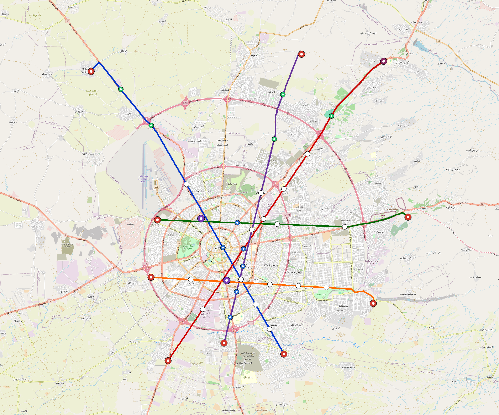

# Erbil — Urban Rail Network

**Country:** IQ · **Population:** 1,952,000 · [National brief](../NATIONAL-BRIEF.md)

This page contains only Erbil-specific results. Shared routing, service, energy, civil, cost, finance, QA and validation methods are defined once in the [deployment planning reference](../../../../../docs/deployment-planning-reference.md).

> [!IMPORTANT]
> **Foreign-capital advantage:** against the default equivalent foreign-turnkey sensitivity, this local plan avoids **$2.64 bn (88.3%) of external capital** and **$3.25 bn of external interest**. Capital plus saved interest totals **$5.89 bn**. See the common reference for interpretation and limitations.

**Current alignment, depot and production basis.** Core corridors change from **103.830 km to 83.930 km**, with elevated land sections, straight radial tangents and bridges at water crossings. 0 core fragments retain raster geometry for further curve review. The centre is a design-centroid screen; survey, property, obstacles, foundations and geometry releases remain open. All **41 platform points** pass the retained water-mask screen; footprints, bank stability and access remain open. [Alignment controls](engineering/alignment/core-realignment.json) · [Before/after map](engineering/alignment/core-alignment-comparison.png) · [Water screen](engineering/alignment/station-water-screen.json).

**5 line-local depots** provide **198 full-fleet storage slots**, separate from workshop bays. Fleet length and workload set quantities; PV/storage is included once in depot capital. Site acceptance and installed/land/utility quotations remain open. [Depot costs](engineering/line-depots/README.md). The factory requires **198 metro-4car trainsets / 792 cars**, with **18-month facility readiness**, then qualification and manufacture. Integrated openings wait for fleet readiness where production or test paths constrain them. Shared factory capital is counted once; concurrent national loading and supplier commitments remain open. [Factory and dates](engineering/factory/README.md).

Station staffing uses two posts, two normal eight-hour shifts, plus service-window, leave and training cover. Basic wages start at 1.5 times the retained country income proxy, with higher technical/management grades and employer allowances. [Staff](engineering/delivery/README.md) · [Finance](engineering/finance/summary.json). Finance retains country-specific fixed-price, steady-state assumptions; Baghdad’s indexed cashflows are separate.

Auto-planned by the OpenSourceRail design pipeline from the controlled city catalogue, source-locked geospatial inputs and shared templates.

## Network



| Local measure | Value |
|---|---:|
| Lines / unique stations / interchanges | 5 / 41 / 2 |
| Route length | 119.2 km double track |
| Coverage / transfer reachability | 49.2% / 20% |
| Estimated station catchment | 960,384 residents |
| Service span / peak headway | 05:30–02:00 / 3 min |
| Fleet | 198 × 4-car `metro-4car` trainsets (178 peak revenue) |
| Peak network throughput | 96,000 passengers/hour |
| Practical service capacity | 892,800 passenger-trips/day |
| Annual paid-trip planning range | 162.9–260.7 M |

### Lines

| Line | Length | Stations | Trainsets | Termini |
|---|---:|---:|---:|---|
| line-1 | 28.7 km | 10 | 48 | NW Outer ↔ S Mid |
| line-2 | 29.9 km | 9 | 48 | SW Outer ↔ NE Outer |
| line-3 | 19.2 km | 6 | 30 | W Mid ↔ E Outer |
| line-4 | 23.7 km | 9 | 41 | N Outer ↔ S Mid |
| line-5 | 17.6 km | 7 | 31 | SW Mid ↔ SE Mid |
| **Total** | **119.2 km** | **41 unique** | **198** | |

## Energy

| Local measure | Value |
|---|---:|
| Scheduled service | 2,325 one-way journeys / 55,417 train-km/day |
| Annual traction demand | 349.5 GWh |
| Station/depot PV / storage | 34.3 MW / 246.5 MWh |
| Aggregate charging power | 54.0 MW |
| Dedicated solar plant | 144.1 MW |
| Residual grid/PPA import | 0.0 GWh/yr |
| Worst powered-stop gap | line-1: 12.6 km / 135 kWh |
| Lowest traversal charging margin | line-3: 116 kWh |

## Capital And Funding

| Local CAPEX bucket | Planning value |
|---|---:|
| Civil works | $962 M |
| Stations | $148 M |
| Depots | $97 M |
| Rolling stock | $222 M |
| Dedicated solar plant | $115 M |
| Residual train control | $6.0 M |
| Charging microgrids | $11 M |
| EPC / project services | $101 M |
| **Total city programme** | **$1.66 bn** |

## Iraq funding

Proposed facilities and appropriations remain uncommitted. The conditional ledger calculates government capital and the extra support required for fees, interest, reserves and cash shortfalls; additional support is not a funding commitment.

| Capital source | Planning USD equivalent |
|---|---:|
| bank credit | $156 M |
| chinese export credit | $103 M |
| domestic bonds | $467 M |
| government | $935 M |

The procurement schedule requires **41 calendar months** of capital cash under an assumed 260-working-day year. The resource-constrained full-network rollout needs review before a construction commitment.

Peak annual government cash: **$578 M**. This includes support required under the low capacity-use case; it is not a funded appropriation.

Chinese export buyer credit is allocated within existing imported budgets for solar equipment, bogies, batteries, windows and doors. City CAPEX excludes manufacturing tooling; the Baghdad-only programme separately funds one plant for Baghdad. IQD bonds assume a proposed Ministry of Finance programme; municipal borrowing authority is pending legal review.

The model includes actual scheduled draws, native-currency principal/interest, fees, revenue ramps, operating/debt support, reserve movements and downside cases. Short bullet bonds have explicit redemptions without assumed refinancing.

See [funding model](engineering/finance/FUNDING-MODEL.md), [monthly cashflow](engineering/finance/funding-monthly-cashflow.csv), [annual cashflow](engineering/finance/funding-annual-cashflow.csv) . This standalone city appraisal is outside the Baghdad-only funding programme.

Annual operating allowance: $46 M; demand remains capacity-led.

## Local Evidence

| Package | Current status | Evidence |
|---|---|---|
| Finance | pass | [`summary.json`](engineering/finance/summary.json) |
| Native simulation + degraded cases | pass | [`validation-summary.json`](engineering/simulation/validation-summary.json) |
| SUMO timetable | pass | [`summary.json`](engineering/sumo/summary.json) |
| Independent OSR/SUMO running-time cross-check | pass; junction/authority gate open | [`operations-crosscheck.md`](engineering/simulation/operations-crosscheck.md) |
| GIS package | pass | [`summary.json`](engineering/gis/summary.json) |
| Solar/storage snapshot (operating duty unverified) | pass; 0 findings; 16 grid-only diagnostics | [`summary.json`](engineering/energy/summary.json) |
| Operations, QA and maintenance | 439 assets / 2,515 tasks | [`erbil-operations-manifest.json`](operations/erbil-operations-manifest.json) |

## Local Files And Regeneration

| File | Local role |
|---|---|
| [`design.toml`](design.toml) | Authoritative generated city design |
| [`erbil.toml`](erbil.toml) | Expanded simulator scenario |
| [`erbil.corridor.geojson`](erbil.corridor.geojson) | GIS corridor and stations |
| [`erbil.design-quality.yaml`](erbil.design-quality.yaml) | Coverage, source and civil-quality gates |

```bash
tools/automation/regenerate-city.sh erbil
```
