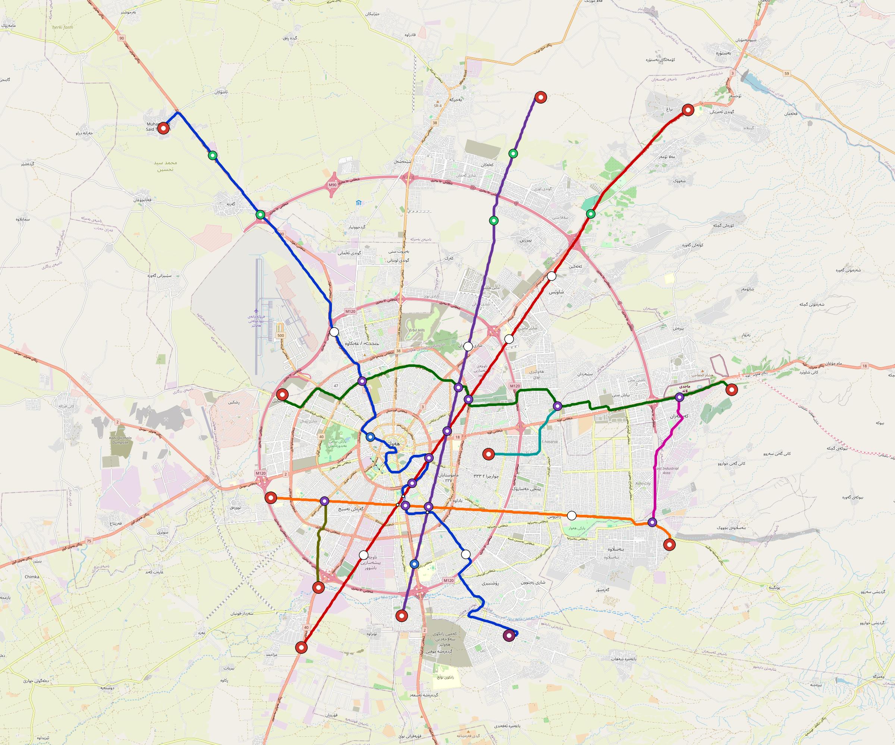

<!-- osr-maglev-primary:start -->
> **Primary v0.5 ferrite-maglev planning:** [Open the current city planning package](engineering/maglev/README.md). Formation, duty, fleet, charging, depot quantities and partial cost allowances are recomputed; physical acceptance remains open.
>
> The material below this notice is the retained v0.4 wheel/rail comparator. Its costs, fleet, geometry and acceptance do not transfer to maglev.
<!-- osr-maglev-primary:end -->

# Erbil — Urban Rail Network

**Country:** IQ · **Population:** 1,952,000 · [National brief](../NATIONAL-BRIEF.md)

This page contains only Erbil-specific results. Shared routing, service, energy, civil, cost, finance, QA and validation methods are defined once in the [deployment planning reference](../../../../../docs/deployment-planning-reference.md).

> [!IMPORTANT]
> **Foreign-capital advantage:** against the default equivalent foreign-turnkey sensitivity, this local plan avoids **$3.74 bn (88.4%) of external capital** and **$4.60 bn of external interest**. Capital plus saved interest totals **$8.34 bn**. See the common reference for interpretation and limitations.

**Population-led network revision (2026-10-12).** The controlled planning inventory contains **8 lines**, including **3 additional residential lines**. **29.8%** of retained 2020 bbox residents are within a 1 km circle of the actual emitted station coordinates. The working target is 80%; remaining areas and station/access alternatives remain in the review. These are distance screens, not current census, surveyed walksheds or fare demand. New common corridor cells have identified junction/structure and access design requirements; no track switch or site approval is inferred. Country fleet, depot, civil, energy, staffing and financing models use the regenerated inventory, with installed quotations and operating acceptance still open. [Line additions and priorities](engineering/alignment/residential-line-expansion.json) · [Actual station coverage and source receipts](engineering/alignment/residential-expansion-evaluation.json).

**Current alignment, depot and production basis.** Core corridors change from **103.830 km to 113.461 km**, with elevated land sections, water-aware radial routes and separately engineered bridge candidates at short water crossings. 0 core fragments retain raster geometry for further curve review. The centre is a design-centroid screen; survey, property, obstacles, foundations and geometry releases remain open. All **56 platform points** pass the retained water-mask screen; footprints, bank stability and access remain open. [Alignment controls](engineering/alignment/core-realignment.json) · [Before/after map](engineering/alignment/core-alignment-comparison.png) · [Water screen](engineering/alignment/station-water-screen.json).

**8 line-local depots** provide **261 full-fleet storage slots**, separate from workshop bays. Fleet length and workload set quantities; PV/storage is included once in depot capital. Site acceptance and installed/land/utility quotations remain open. [Depot costs](engineering/line-depots/README.md). The factory requires **261 metro-4car trainsets / 1044 cars**, with **18-month facility readiness**, then qualification and manufacture. Integrated openings wait for fleet readiness where production or test paths constrain them. Shared factory capital is counted once; concurrent national loading and supplier commitments remain open. [Factory and dates](engineering/factory/README.md).

Station staffing uses two posts, two normal eight-hour shifts, plus service-window, leave and training cover. Basic wages start at 1.5 times the retained country income proxy, with higher technical/management grades and employer allowances. [Staff](engineering/delivery/README.md) · [Finance](engineering/finance/summary.json). Finance retains country-specific fixed-price, steady-state assumptions; Baghdad’s indexed cashflows are separate.

Auto-planned by the OpenSourceRail design pipeline from the controlled city catalogue, source-locked geospatial inputs and shared templates. Population is counted once within the union of station circles; this is potential radial access, not a verified walkshed or fare-demand estimate. Reachable line pairs include transfers through intermediate lines. [Population radii, denominator and transfer paths](engineering/access/README.md) · [Viaduct beam, foundation and terrain checks](engineering/clearance/README.md). Capital figures are base planning allowances: route-search scores are excluded from money, while special structures and installed-price gaps remain open. [Cost boundary](../../../../../docs/finance/civil-allowance-boundary.md).

## Network



**Lines / unique stations / interchanges:** 8 / 56 / 12; **Route length:** 152.3 km double track; **Direct transfers / reachable line pairs:** 46.4% / 100.0%; **Residents within 800 m radial station catchments:** 250,544 (2020 raster; 20.3% of bbox).

**Service span / peak headway:** 05:30–02:00 / 3 min; **Fleet:** 261 × 4-car `metro-4car` trainsets (232 peak revenue); **Peak network throughput:** 153,600 passengers/hour; **Practical service capacity:** 1,428,480 passenger-trips/day.

**Annual paid-trip planning range:** 260.7–417.1 M.
### Lines

| Line | Length | Stations | Trainsets | Termini |
|---|---:|---:|---:|---|
| line-1 | 38.5 km | 13 | 64 | NW Outer ↔ S Mid |
| line-2 | 30.8 km | 12 | 51 | SW Mid ↔ NE Outer |
| line-3 | 25.8 km | 7 | 40 | W Mid ↔ E Outer |
| line-4 | 25.0 km | 10 | 41 | N Outer ↔ S Mid |
| line-5 | 18.0 km | 8 | 34 | W Mid ↔ SE Mid |
| line-6 |  4.4 km | 2 | 10 | E Inner ↔ SE Inner |
| line-7 |  5.8 km | 2 | 11 | E Mid ↔ SE Mid |
| line-8 |  4.0 km | 2 | 10 | SW Mid ↔ SW Mid |
| **Total** | **152.3 km** | **56 unique** | **261** | |

## Energy

**Scheduled service:** 3,720 one-way journeys / 70,819 train-km/day; **Annual traction demand:** 446.7 GWh; **Station/depot PV / storage:** 52.9 MW / 384.5 MWh; **Aggregate charging power:** 76.5 MW.

**Dedicated solar plant:** 173.7 MW; **Residual grid/PPA import:** 0.0 GWh/yr; **Worst powered-stop gap:** line-1: 13.5 km / 146 kWh; **Lowest traversal charging margin:** line-7: 78 kWh.
## Capital And Funding

| Local CAPEX bucket | Planning value |
|---|---:|
| Civil works | $1.29 bn |
| Stations | $314 M |
| Depots | $144 M |
| Rolling stock | $292 M |
| Dedicated solar plant | $139 M |
| Residual train control | $7.6 M |
| Charging microgrids | $16 M |
| EPC / project services | $145 M |
| **Total city programme** | **$2.35 bn** |

## Iraq funding

Proposed facilities and appropriations remain uncommitted. The conditional ledger calculates government capital and the extra support required for fees, interest, reserves and cash shortfalls; additional support is not a funding commitment.

| Capital source | Planning USD equivalent |
|---|---:|
| bank credit | $222 M |
| chinese export credit | $131 M |
| domestic bonds | $666 M |
| government | $1.33 bn |

The procurement schedule requires **41 calendar months** of capital cash under an assumed 260-working-day year. The resource-constrained full-network rollout needs review before a construction commitment.

Peak annual government cash: **$684 M**. This includes support required under the low capacity-use case; it is not a funded appropriation.

Chinese export buyer credit is allocated within existing imported budgets for solar equipment, bogies, batteries, windows and doors. City CAPEX excludes manufacturing tooling; the Baghdad-only programme separately funds one plant for Baghdad. IQD bonds assume a proposed Ministry of Finance programme; municipal borrowing authority is pending legal review.

The model includes actual scheduled draws, native-currency principal/interest, fees, revenue ramps, operating/debt support, reserve movements and downside cases. Short bullet bonds have explicit redemptions without assumed refinancing.

See [funding model](engineering/finance/FUNDING-MODEL.md), [monthly cashflow](engineering/finance/funding-monthly-cashflow.csv), [annual cashflow](engineering/finance/funding-annual-cashflow.csv) . This standalone city appraisal is outside the Baghdad-only funding programme.

Annual operating allowance: $64 M; demand remains capacity-led.

## Local Evidence

| Package | Current status | Evidence |
|---|---|---|
| Finance | pass | [`summary.json`](engineering/finance/summary.json) |
| Native simulation + degraded cases | pass | [`validation-summary.json`](engineering/simulation/validation-summary.json) |
| SUMO timetable | pass | [`summary.json`](engineering/sumo/summary.json) |
| Independent OSR/SUMO running-time cross-check | pass; junction/authority gate open | [`operations-crosscheck.md`](engineering/simulation/operations-crosscheck.md) |
| GIS package | pass | [`summary.json`](engineering/gis/summary.json) |
| Solar/storage snapshot (operating duty unverified) | pass; 0 findings; 7 grid-only diagnostics | [`summary.json`](engineering/energy/summary.json) |
| Operations, QA and maintenance | 593 assets / 3,353 tasks | [`erbil-operations-manifest.json`](operations/erbil-operations-manifest.json) |

## Local Files And Regeneration

| File | Local role |
|---|---|
| [`design.toml`](design.toml) | Authoritative generated city design |
| [`erbil.toml`](erbil.toml) | Expanded simulator scenario |
| [`erbil.corridor.geojson`](erbil.corridor.geojson) | GIS corridor and stations |
| [`erbil.design-quality.yaml`](erbil.design-quality.yaml) | Coverage, source and civil-quality gates |

```bash
tools/automation/regenerate-city.sh erbil
```
