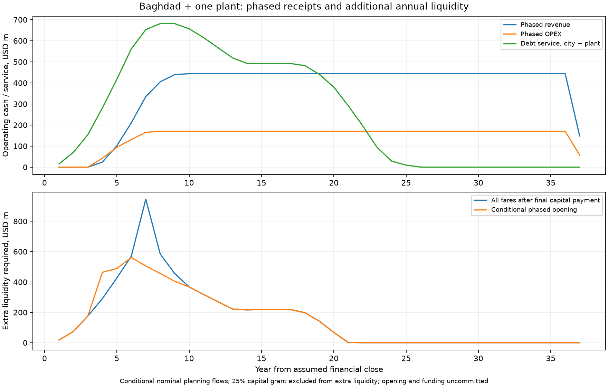

# Baghdad-only funding programme

<!-- OSR CURRENT SCOPE CONTEXT -->
> **Original catalogue or earlier scope reference.** The figures and policies below retain their original assumptions; they are not the latest Baghdad staffing, depot, procurement or funding basis. See the [current Baghdad recalculation](Baghdad/engineering/programme-recalculation/README.md) and [current city summary](Baghdad/README.md). National/portfolio totals have not been repriced with that conditional Baghdad option.
<!-- END OSR CURRENT SCOPE CONTEXT -->

Scope: [Baghdad](Baghdad/README.md) and one manufacturing plant sized for Baghdad. **Samawah, Mosul and every other city are excluded.** All funding is proposed and uncommitted.

## Independent reconciliation, priced gap finance and six-month tranches

Capital sources still total USD 7,515.079m. The independent pooled-cash reconstruction requires USD 5,609.724m of gross extra cash and retains USD 4,018.427m later, leaving a **USD 1,591.297m nominal net deficit before pricing additional gap finance**. These three amounts answer different questions. The original capital principal is repaid in the lifetime cash ledger, not added to CAPEX a second time. City EPC is now spread over direct works; the initial baseline-freeze task no longer receives the full programme overhead allowance.

[Detailed arithmetic and Iraqi financing routes](Baghdad/engineering/finance/FUNDING-RECONCILIATION.md) · [six-month reference bond/loan requirements](finance/baghdad-unfunded_reference-six-month-tranches.csv) · [six-month blended candidate](finance/baghdad-blended_candidate-six-month-tranches.csv) · [independent calculation](finance/baghdad-finance-reconciliation.json).

Green debt replaces qualified conventional borrowing; grants replace domestic capital debt; guarantees supply credit enhancement rather than cash. The new sensitivity charges supplemental IQD funding for interest and fees, sweeps later surplus to repayment, and exposes cash beyond its illustrative IQD 13tn cap and any unpaid terminal loan. The earlier gross cash-support figures below assume external contributions; they are not a priced bridge-loan requirement.

| Priced gap-finance sensitivity | Gross gap draws, IQD tn | Uncovered cash, IQD tn | Unpaid terminal loan, IQD tn |
|---|---:|---:|---:|
| unfunded reference | 0.000 | 7.293 | 0.000 |
| green label only | 0.000 | 7.293 | 0.000 |
| zero cost liquidity bound | 7.293 | 0.000 | 2.069 |
| commercial gap credit | 13.000 | 16.781 | 13.000 |
| concessional gap credit | 9.347 | 0.000 | 6.640 |
| blended candidate | 7.366 | 0.000 | 3.797 |
| green concessional only | 8.463 | 0.000 | 6.069 |
| fare 5pct flat costs fixed demand | 3.156 | 0.000 | 0.000 |
| fare 5pct flat costs elastic | 3.748 | 0.000 | 0.000 |
| fixed fare 5pct opex | 13.174 | 6.823 | 13.000 |
| fare 5pct opex 5pct | 3.945 | 0.000 | 0.000 |
| fare 5pct opex 7pct | 4.932 | 0.000 | 0.000 |
| fare 5pct opex 5pct income 2pct | 4.833 | 0.000 | 0.000 |
| variable fare 5pct opex 5pct | 3.785 | 0.000 | 0.000 |
| fare 5pct opex 5pct rents indexed | 3.826 | 0.000 | 0.000 |

The candidate mix is uncommitted: eligible IQD green bonds at an assumed 4% plus enhancement fees; USD 25m equivalent climate capital grant; USD 300m equivalent net development-rights proceeds; and USD 25m equivalent annual new net local receipts at full opening. The grant, valuation, legal powers and IQD concessional facility need evidence. Existing rents/fare receipts cannot be counted again. With constant nominal fares and OPEX, a terminal unpaid loan means that sensitivity has not achieved self-financing.

## Additional pricing and OPEX inflation sensitivities

The requested paired sensitivity increases fares and OPEX **5% annually from financial close**, while testing income growth separately. At 5% income growth and assumed -0.30 real-price elasticity, the illustrative blended case peaks at **IQD 3.767tn** supplemental debt and ends with IQD 0.000tn unpaid. This can repay the priced facility under the assumptions, but still requires placed early financing, the candidate grant/rights receipts, fixed nominal debt terms and income growth. It is not a committed funding outcome.

Average nominal tickets move from IQD 1,525 at first opening to IQD 1,765 at full opening; 44 trips remain 11.7% of the indexed income proxy when incomes grow 5%. Separate cases test 2% income growth, 7% OPEX inflation, peak/off-peak tiers, fixed demand, and rental indexation. Capital escalation and future FX changes remain outside these sensitivities.

[Paired 5% six-month financing](finance/baghdad-fare_5pct_opex_5pct-six-month-tranches.csv) · [monthly tickets and affordability](finance/baghdad-fare_5pct_opex_5pct-monthly-prices.csv) · [variable-ticket six-month financing](finance/baghdad-variable_fare_5pct_opex_5pct-six-month-tranches.csv). The detailed report contains the NPV, all assumptions and downside cases.

## Surplus cash and early repayment

These cases use identical paired 5% fare/OPEX/income assumptions and the same conditional blended capital sources. Each pays OPEX, scheduled principal, interest and fees, then funds the debt-service reserve and a three-month current-OPEX buffer before voluntary repayment. Borrowed gap proceeds and uncovered external cash cannot fund early payments. The extra buffer remains cash held at the terminal horizon and earns no interest.

Compare strategies against **buffered gap-only**, rather than attributing the buffer change to repayment savings. Loans-first pays bank credit, Chinese credit and gap credit before bonds. Cost priority pays bank (9%), ordinary bonds (8%), Chinese credit (5%), green bonds (4% plus 0.5% annual guarantee), then gap credit (2%). It is an interest-rate heuristic, not a proof of the globally best strategy.

| Surplus strategy | All debt cleared, month from close | Finance cost saving vs buffered gap-only, USD equivalent m | Early-payment premiums, USD equivalent m | Peak gap debt, IQD tn | Terminal unrestricted cash, IQD tn |
|---|---:|---:|---:|---:|---:|
| gap only buffered | 365 | 0.000 | 0.000 | 3.886 | 17.838 |
| gap then core | 289 | 22.067 | 2.471 | 3.886 | 17.867 |
| loans then bonds | 288 | 111.154 | 7.977 | 3.843 | 17.983 |
| cost priority | 286 | 230.473 | 26.678 | 3.843 | 18.138 |
| cost priority zero premium | 285 | 265.185 | 0.000 | 3.840 | 18.183 |
| cost priority noncallable bonds | 365 | 87.961 | 5.559 | 3.843 | 17.953 |

Cost priority clears all debt in month **286**, compared with **365** for buffered gap-only. Net nominal financing savings are **USD 230.473m equivalent**, after USD 26.678m assumed early-payment premiums. Savings include core interest, annual green guarantee charges and supplemental interest/draw fees; they exclude principal, which is returned once. All cases retain IQD 0.321tn operating buffer separately from unrestricted cash. There is no additional government contribution above 25% of CAPEX in these cases.

Assumed premiums are 1% of bank/Chinese/green principal and 2% of ordinary bond principal. A minimum draw age of 6 months (bank), 12 (Chinese) and 24 (both bonds) prevents immediate issue-and-redemption. Eligible vintages are repaid oldest first; contractual instalments are kept and maturity shortens. Notice, issuer call rights, investor consent, buyback price, remaining-maturity compensation, tax and FX require actual agreements. Noncallable-bond sensitivity makes no voluntary bond payments; zero-premium sensitivity removes only the assumed premium, retaining minimum ages.

| Facility | Buffered gap-only final principal payment month | Cost-priority final principal payment month | Early principal, native currency | Premium, native currency |
|---|---:|---:|---:|---:|
| bank credit | 161 | 157 | IQD 184.052bn | IQD 1.841bn |
| domestic bonds | 281 | 221 | IQD 1,161.259bn | IQD 23.225bn |
| chinese export credit | 305 | 228 | USD 284.326m | USD 2.843m |
| green bonds | 365 | 236 | IQD 591.899bn | IQD 5.919bn |

The gap facility's final principal payment is in month 286. Later surplus remains unrestricted cash after debt retirement. Each month's native debt balance equals prior balance plus draws minus scheduled and early principal. Each six-month closing balance is its final month's balance; payments, premiums, interest and reserve movements are period sums. Contractual repayment windows in tranche files describe the original draw terms; the actual final-payment months above incorporate early repayment.

[Monthly cost-priority repayments](finance/baghdad-early-cost_priority-monthly.csv) · [six-month repayment tranches](finance/baghdad-early-cost_priority-six-month-tranches.csv) · [loans-first tranches](finance/baghdad-early-loans_then_bonds-six-month-tranches.csv) · [all six complete calculations](finance/baghdad-early-repayment.json)

Loan prepayment can carry redeployment/unwind charges: the [World Bank Treasury FAQ](https://treasury.worldbank.org/en/about/unit/treasury/ibrd-financial-products/financial-products-faqs) illustrates the concept, without establishing Chinese or Iraqi loan terms. The [US Treasury buyback FAQ](https://treasurydirect.gov/help-center/faqs/buyback-faqs/) and [published purchase results](https://treasurydirect.gov/auctions/announcements-data-results/buy-backs/) illustrate issuer authority and priced buybacks rather than automatic par redemption; they do not supply an Iraqi legal mandate.

This repayment allocation does not change the unlevered project NPV or validate demand. Nominal savings over several decades are not present-value gains. CAPEX escalation, FX, lifecycle replacement, floating-rate risk and the uncommitted early funding still require appraisal.

## Consolidated sources and uses

Government contributes **25% of total capital uses**, including the plant and EPC. Imported purchases are split **50% government USD cash and 50% proposed Chinese USD credit**, assuming the full imported basket can qualify. That USD government cash is inside the 25% total contribution; the rest of the government contribution is IQD. The remaining balance after those two sources is split 75% domestic IQD bonds and 25% IQD bank term credit.

| Proposed capital source | Currency | Native amount, billions | USD equivalent, million | Share of total capital |
|---|---|---:|---:|---:|
| chinese export credit | USD | 0.842 | 842.17 | 11.21% |
| government import cash | USD | 0.842 | 842.17 | 11.21% |
| government local cash | IQD | 1,347.579 | 1,036.60 | 13.79% |
| domestic bonds | IQD | 4,674.285 | 3,595.60 | 47.85% |
| bank credit | IQD | 1,558.095 | 1,198.53 | 15.95% |
| **Total capital uses** | Mixed | — | **7,515.08** | **100%** |

Baghdad city CAPEX is USD 7,168.53 million. The plant is counted **once** at USD 323.87 million plus USD 22.67 million EPC. Its sizing basis is 4,572 vehicle/car modules from Baghdad's controlled fleet and car count. Imported tooling receives proposed Chinese credit within that plant budget. The physical cell/floor/tooling envelope replaces the smaller module allowance where necessary; both remain unquoted engineering assumptions.

## Currency and USD capital intensity

**Only Chinese credit is USD-denominated debt:** USD 842.17 million. Government additionally provides USD 842.17 million cash for imports. Combined USD capital funding is 22.41% of uses; **the remaining 77.59% is IQD government cash, IQD bonds and IQD bank credit.** Revenue and local OPEX are also budgeted in IQD. At the historical planning conversion of 1,300 IQD/USD, the local government cash allowance is IQD 1.348 trillion, alongside its separate USD import cash. Together they equal 25% of total capital. USD columns are comparison equivalents, not a requirement to borrow or appropriate those domestic amounts in dollars.

Funding currency and procurement currency differ. Estimated imported purchases total USD 1,684.34 million (22.41% of capital), including plant imports. The government supplies half directly in USD cash; proposed Chinese credit supplies half as USD debt. The full import pool, including categories beyond the initially selected solar, bogies, batteries, windows, doors and tooling, is assumed lender-eligible pending origin qualification. If that expanded basket cannot qualify, its loan funding is uncovered; it is not automatically replaced by IQD bank credit or another grant. IQD borrowing reduces the revenue/debt currency mismatch; it does not remove Chinese debt-service FX risk, imported maintenance costs, domestic interest, inflation or placement constraints.

Eligibility sensitivity: the original named-component categories cover USD 799.28 million of invoices. At a 50% advance, they alone support USD 399.64 million of proposed credit. If the additional imported categories cannot qualify, **USD 442.53 million of planned capital loan proceeds remains uncovered**, in addition to the base support requirement below. Even the original categories remain unqualified; this screen is not a lender approval. No extra government contribution is assumed to replace that missing loan.

## What the 25% government limit leaves unfunded

The 25% capital contribution is **USD 1,878.77 million**. If that is also the limit on all public cash, the model leaves **USD 6,002.34 million of additional funding requirements** across the full construction, operating and debt horizon. These are interest, fees, reserve and operating/debt cash needs after modelled revenue; they are not additional approved government contributions.

Peak annual capital contribution is USD 397.77 million. Peak annual additional funding requirement is USD 945.43 million. If all additional support were provided publicly, conditional lifetime public cash would be USD 7,881.11 million, with a combined annual peak of USD 966.46 million. This exceeds the requested contribution and is shown only to expose the funding gap.

Across the 36.5-year nominal model horizon, additional requirements divide into USD 1,697.19 million before Baghdad's full-network opening, USD 3,851.84 million during Baghdad operations/debt tail, and USD 453.31 million for plant capital financing. Principal repayment before opening is part of the pre-opening requirement. This base withholds all fares until full-network completion; the separate phased sensitivity below tests earlier revenue. Gross additional support is a liquidity requirement over time, not net lifetime loss: later retained cash cannot repay earlier obligations without an approved bridge.

The programme CSVs distinguish the capped capital contribution, additional funding requirement and conditional payment requirements. Underlying city and factory ledgers calculate the support needed to pay scheduled obligations; their positive reserve balances and completed repayments are conditional on that support being raised. They are not a cash-solvent forecast under the public cash cap. No bridge, equity investor, rollover or extra appropriation is invented to close the gap.

## Cash and contractual structure

1. An Iraqi public sponsor seeks MoF authority for proposed sovereign IQD bonds through the established MoF/CBI issuance route, subject to legal review and placement. Municipal borrowing powers are not assumed. The 25% limit is the direct capital contribution, not a limit on sovereign bond liabilities, guarantees or lifetime public exposure.
2. Chinese export buyer credit is allocated to qualified Chinese invoices for solar equipment, bogies, batteries, windows, doors and Baghdad plant tooling. The requested 50% loan advance is matched by 50% government USD cash. All other imported categories also require Chinese supplier-origin and lender qualification before the full-basket financing assumption is valid. Noneligible imports still need foreign currency. Eligibility and origin require supplier evidence.
3. Government's 25% capital contribution covers the planned eligible downpayment; bonds and bank credit cover the remaining capital balance. Fees, construction interest and reserve funding are separate cash requirements, not silently capitalised or counted as capital-source proceeds.
4. Each draw starts its own grace and repayment clock. Planned receipts match procurement milestones; no actual payment or lender commitment is asserted. Chinese credit uses USD, bonds and bank credit IQD. Terms remain unconfirmed appraisal assumptions: 5%/48-month grace/180-month repayment, 8%/24/180, and 9%/0/84 respectively.
5. Revenue pays OPEX first and debt service next; subsidy is excluded from DSCR. Additional support shown by the city and plant models is an unfunded requirement under the cap. The factory model covers capital financing only; manufacturing income and factory OPEX need a separate business case.
6. Declined Chinese finance, delayed contributions, FX changes and bullet redemption are separately tested in the Baghdad appraisal. None creates an automatic facility or refinancing source.

## Rollout and financial close

Baghdad's current capital milestones span 78 calendar months. Full-network fare revenue begins after all budget milestones. Lowering the capital grant increases borrowing and cash-service needs; it does not shorten this schedule. The city-sized Baghdad plant becomes available after 390 working days (18 months from NTP), followed by the separately scheduled first-article series-release gate. The separate phased sensitivity uses this integrated planning schedule; actual plant and line acceptance and a commissioned operating baseline remain pending.

Required before financial close: approved sponsor and borrowing powers; appropriation limited to the agreed government contribution; a funded solution for the additional cash gap; supplier quotations and origin evidence; signed term sheets, guarantees and insurance; IQD placement/redemption plan; lender draw windows and FX access; surveyed demand/fare policy; tax, duty, land and utility pricing; accepted resource calendar and reserve covenants.

## Model and evidence

[Programme monthly cashflow](finance/baghdad-programme-monthly-cashflow.csv) · [annual cashflow](finance/baghdad-programme-annual-cashflow.csv) · [machine-readable programme](finance/baghdad-programme.json) · [Baghdad city appraisal](Baghdad/engineering/finance/FUNDING-MODEL.md) · [editable assumptions](../../../../lib/templates/iraq-funding.toml). Other Iraqi city appraisals remain standalone examples outside this programme.

[IMF 2025 Article IV](https://www.imf.org/en/news/articles/2025/07/08/pr-25243-iraq-imf-executive-board-concludes-2025-article-iv-consultation) supplies the historical 2024 FX anchor, not a current dealing rate. [CBI fiscal-agent description](https://www.cbi.iq/page/26) and [Injaz issue example](https://cbi.iq/news/view/2620) support sovereign-bond context. [China Exim export buyer credit](https://english.eximbank.gov.cn/Business/CreditB/SupportingFT/201810/t20181016_6965.html) supports the instrument concept; numeric terms and eligibility are unconfirmed assumptions.

## Recalculation: conditional phased opening

The earlier USD 9.890 billion result combined whole-fleet stage batching, no fares before the final capital payment and reserve deposits always funded with additional public cash. Ready-task dispatch now pipelines work within the same resource limits, gates train production on the new plant, and funds reserves from available project cash before seeking support. The full-network-only result above remains a conservative comparator.

With line openings tied to completed line and shared/depot work plus a 3-month commissioning allowance, first revenue begins in **month 40**, and all nine lines operate from **month 76** after financial close. These dates are conditional planning milestones, not authorisation to run trains.

Each line's controlled trainset share allocates revenue and variable OPEX; its own 50% / 75% / 100% ramp applies. From first opening, 25% of full-network OPEX is fixed and 75% scales with opened fleet. This proxy can misstate early demand, central staffing and transfer benefits; a surveyed phase-specific operating plan is required. The same nominal fares, capital total, debt terms and 25% grant apply in every case.

| Opening / demand scenario | Additional funding beyond 25% capital, USD bn | Conditional lifetime public cash, USD bn |
|---|---:|---:|
| All fares after final capital payment | 6.002 | 7.881 |
| Phased: commissioning delay two years | 6.157 | 8.036 |
| Phased: demand minus 40 percent | 8.367 | 10.246 |
| Phased: low demand | 5.610 | 7.489 |

| Line | Planned opening month | Fleet / variable-cost share |
|---|---:|---:|
| line-1 | 40 | 11.29% |
| line-2 | 45 | 13.25% |
| line-3 | 50 | 12.73% |
| line-4 | 55 | 10.50% |
| line-5 | 59 | 11.29% |
| line-6 | 65 | 13.12% |
| line-7 | 69 | 10.37% |
| line-8 | 74 | 11.81% |
| line-9 | 76 | 5.64% |

All these are gross nominal liquidity contributions, conditional on funding. Later operating surplus is retained and is not netted against earlier required injections. The phased city ledger ends with USD 4.018 billion of unrestricted cash; no distribution or return to the sponsor is assumed. The plant ledger has no manufacturing income/OPEX: it remains a capital-financing allowance. A 25% direct grant also does not cap sovereign IQD bond liabilities or guarantees.

[Phased programme monthly cashflow](finance/baghdad-programme-phased-monthly-cashflow.csv) · [phased programme annual cashflow](finance/baghdad-programme-phased-annual-cashflow.csv)

## Comparison with the historical 148 km third-party proposal

The [July 2024 report](https://www.aljazeera.net/ebusiness/2024/7/26/العراق-يختار-شركات-أجنبية-لتنفيذ), citing the prime minister's adviser, gives USD 18 billion, 148 km, seven lines and 64 stations. The [NIC procurement notice](https://investpromo.gov.iq/announcement-of-an-international-investment-opportunity-no-3-of-2024-metro-baghdad-dbomft/) describes DBOMFT and requires bidders to submit a funding plan. Neither establishes a final all-USD financing contract. The **100% USD foreign-loan/government-cash comparator below is the user's requested scenario**, not a verified split of debt and grants. The older USD estimate has not been restated to a common price date.

| Measure | Current OpenSourceRail Baghdad plan | Historical proposal / requested USD scenario |
|---|---:|---:|
| Route km (not track km) | 474.2 | 148 |
| Lines / stations | 9 / 164 | 7 / 64 |
| Capital uses, USD equivalent bn | 7.515, including one plant | 18.000, reported estimate |
| Capital intensity, USD equivalent m / route km | 15.85 | 121.62 |
| USD-denominated capital funding, USD bn | 1.684, half loan / half government cash | 18.000, assumed USD cash + loans |
| IQD-denominated capital funding, IQD tn | 7.580 | Zero in requested scenario |
| Imported-purchase FX exposure, USD bn | 1.684 | 18.000 only under all-USD purchase assumption |
| USD purchase intensity, USD m / route km | 3.55 | 121.62 under that assumption |
| Contracted fares / debt terms | Planning fare and uncommitted facilities | Not established by these sources |

The OSR plan has 3.20 times the route length and 2.56 times the stations. Its planning capital estimate is 58.2% below USD 18 billion. Under the requested all-USD funding scenario, USD-denominated capital funding is 90.6% lower; under an all-USD purchase scenario, imported-purchase exposure is 90.6% lower. These measure different exposures and are not interchangeable debt-service savings.

The planning comparison is not a like-for-like qualified bid: route geometry, tunnelling/structures, land, utilities, taxes/duties, contingency, escalation, supplier qualification and acceptance maturity differ or remain unresolved. The older report's four-year completion expectation also differs substantially from OSR's current 78-month capital schedule. A lower capital estimate does not establish an earlier or more sustainable delivered service.

## Fares, population access and financial sustainability

The modelled average paid-trip fare is **IQD 1,317** (USD 1.01 comparison equivalent), denominated in IQD rather than automatically indexed to the USD loan. It derives from the retained USD 380/month income proxy, equivalent to IQD 494,000/month at the planning anchor. Thirty paid trips consume 8.0% of that proxy income; 44 commuter trips cost IQD 57,963, or 11.7%. This is an average-trip yield assumption, not an adopted tariff or unlimited monthly pass; concessions, transfers and family affordability need an explicit tariff and household survey.

Low/high capacity-use cases assume 1,138,320 / 1,821,312 paid trips/day, not unique people or surveyed demand. Low-case steady annual revenue is IQD 576.8 billion; OPEX is IQD 221.4 billion. At that trip volume, the OPEX-only neutral fare is IQD 462, with nonfare receipts held constant. It excludes capital, debt and reserve funding.

In the first complete operating year, the 50% revenue ramp produces 207.7 million paid trips. Holding those trips and nonfare receipts fixed, covering OPEX, scheduled debt service and fees requires approximately **IQD 4,976 per paid trip**, excluding reserve deposits and factory debt. This is a cash threshold, not a recommended tariff; higher fares can reduce demand. Minimum annual operating DSCR before support is 0.04. Higher utilisation improves later cashflow but cannot fund the long pre-opening debt-service period. Neither this fare nor IQD denomination closes the additional funding gap shown above.

The design retains a planning population of 9,780,429. Its **38.9% anchor-weighted coverage score** gives an indicative proxy of 3,804,586 residents. That proxy is not measured population within a real 800 m walking network: survey, population grid, station access, river crossings and feeder coverage remain unvalidated. The older report's 80% city-coverage ambition uses no published comparable denominator or access method; it cannot establish that either plan reaches more residents. The 164 stations and 9 routes offer a larger network to test, not proof of superior population access.

## Direct Iraqi labour and industrial benefits

Approximately **USD 5.831 billion equivalent (77.6%)** of programme procurement is assigned to local suppliers under the editable origin assumptions. This is potential local expenditure, not wages, GDP added or guaranteed Iraqi content. City civil works alone allocate USD 3.306 billion locally; rolling stock allocates USD 832.10 million locally, with plant local expenditure separately counted.

Local train assembly and fabrication create work in body modules, fit-out, wiring, coatings, systems integration, inspection and maintenance while bogies, batteries, windows and doors remain imported inputs requiring supplier and process qualification. Infrastructure work supports Iraqi concrete/precast production, civil erection, stations, utilities, solar installation and supervision. Tooling, training, process qualification and supplier access can leave reusable industrial capacity, shorter repair chains and retained skills after construction. Local employment and supplier income circulate in IQD and can generate Iraqi tax receipts; no multiplier or tax recovery is booked without evidence.

The operating allowance supports **2,184 indicative FTE** with annual labour cost of IQD 18.13 billion. These are operating positions, not construction or manufacturing job counts. Construction employment requires validated work hours, productivity, wage rates, shift cover and local-content contracts; no fabricated job total is assigned. The third-party proposal may also use Iraqi civil labour, so its local share cannot be assumed zero.

A sustainable appraisal must demonstrate phased service before full-network completion, realistic paid demand and affordable tariffs, funded debt/interest/reserves within the public limit, placed IQD facilities, supplier and labour qualification, lifecycle replacement funding and an accepted environmental/physical design. Current software and ledger checks establish planning consistency, not those outcomes.
