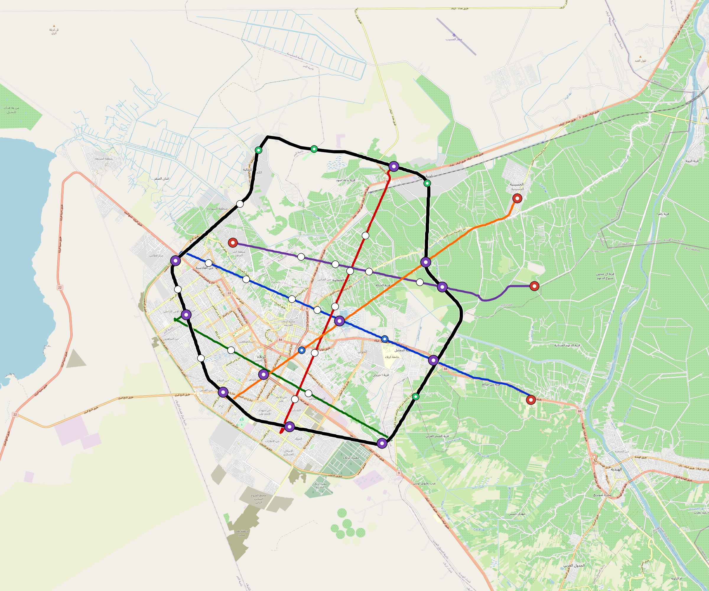

# Karbala — Urban Rail Network

**Country:** IQ · **Population:** 1,390,000 · [National brief](../NATIONAL-BRIEF.md)

This page contains only Karbala-specific results. Shared routing, service, energy, civil, cost, finance, QA and validation methods are defined once in the [deployment planning reference](../../../../../docs/deployment-planning-reference.md).

> [!IMPORTANT]
> **Foreign-capital advantage:** against the default equivalent foreign-turnkey sensitivity, this local plan avoids **$2.15 bn (87.1%) of external capital** and **$2.65 bn of external interest**. Capital plus saved interest totals **$4.80 bn**. See the common reference for interpretation and limitations.

Auto-planned by the OpenSourceRail design pipeline from the controlled city catalogue, source-locked geospatial inputs and shared templates.

## Network



| Local measure | Value |
|---|---:|
| Lines / unique stations / interchanges | 6 / 56 / 10 |
| Route length | 168.5 km double track |
| Coverage / transfer reachability | 60.0% / 60% |
| Estimated station catchment | 834,000 residents |
| Service span / peak headway | 05:30–02:00 / 3 min |
| Fleet | 198 × 4-car `metro-4car` trainsets (177 peak revenue) |
| Peak network throughput | 115,200 passengers/hour |
| Practical service capacity | 982,080 passenger-trips/day |
| Annual paid-trip planning range | 179.2–286.8 M |

### Lines

| Line | Length | Stations | Trainsets | Termini |
|---|---:|---:|---:|---|
| line-1 | 25.3 km | 11 | 43 | SE Outer ↔ W Outer |
| line-2 | 20.1 km | 9 | 36 | S Mid ↔ NE Mid |
| line-3 | 18.1 km | 6 | 28 | SE Mid ↔ W Outer |
| line-4 | 20.1 km | 6 | 31 | E Outer ↔ NW Mid |
| line-5 | 23.0 km | 8 | 35 | SW Mid ↔ NE Outer |
| line-6 | 61.8 km | 16 | 25 | W Outer ↔ W Outer |
| **Total** | **168.5 km** | **56 unique** | **198** | |

## Energy

| Local measure | Value |
|---|---:|
| Scheduled service | 2,558 one-way journeys / 63,961 train-km/day |
| Annual traction demand | 403.4 GWh |
| Station/depot PV / storage | 19.7 MW / 113.5 MWh |
| Aggregate charging power | 75.0 MW |
| Dedicated solar plant | 189.2 MW |
| Residual grid/PPA import | 0.0 GWh/yr |
| Worst powered-stop gap | line-6: 12.6 km / 135 kWh |
| Lowest traversal charging margin | line-4: 93 kWh |

## Capital And Funding

| Local CAPEX bucket | Planning value |
|---|---:|
| Civil works | $572 M |
| Stations | $315 M |
| Depots | $8.0 M |
| Rolling stock | $222 M |
| Dedicated solar plant | $151 M |
| Residual train control | $8.4 M |
| Charging microgrids | $17 M |
| EPC / project services | $80 M |
| **Total city programme** | **$1.37 bn** |

## Iraq funding

Proposed facilities and appropriations remain uncommitted. The conditional ledger calculates government capital and the extra support required for fees, interest, reserves and cash shortfalls; additional support is not a funding commitment.

| Capital source | Planning USD equivalent |
|---|---:|
| bank credit | $126 M |
| chinese export credit | $118 M |
| domestic bonds | $377 M |
| government | $753 M |

The procurement schedule requires **91 calendar months** of capital cash under an assumed 260-working-day year. The resource-constrained full-network rollout needs review before a construction commitment.

Peak annual government cash: **$356 M**. This includes support required under the low capacity-use case; it is not a funded appropriation.

Chinese export buyer credit is allocated within existing imported budgets for solar equipment, bogies, batteries, windows and doors. City CAPEX excludes manufacturing tooling; the Baghdad-only programme separately funds one plant for Baghdad. IQD bonds assume a proposed Ministry of Finance programme; municipal borrowing authority is pending legal review.

The model includes actual scheduled draws, native-currency principal/interest, fees, revenue ramps, operating/debt support, reserve movements and downside cases. Short bullet bonds have explicit redemptions without assumed refinancing.

See [funding model](engineering/finance/FUNDING-MODEL.md), [monthly cashflow](engineering/finance/funding-monthly-cashflow.csv), [annual cashflow](engineering/finance/funding-annual-cashflow.csv) . This standalone city appraisal is outside the Baghdad-only funding programme.

Annual operating allowance: $34 M; demand remains capacity-led.

## Local Evidence

**Evidence refresh required.** Retained passing results below are unverified.
The strict README generator rejected the evidence: engineering/simulation/validation-summary.json describes scenario SHA-256 a069dd34393232c1a23b5cb1e9530008db82544dc0fd5fb45aa4815aad316adc, but karbala.toml is 3cf64c3f0987c93c387a7a32aef86e898565efede1f9925af15985eaae259bca; rerun and update the validation evidence. This audit view does not accept or replace the retained solver results.

| Package | Current status | Evidence |
|---|---|---|
| Finance | unverified | [`summary.json`](engineering/finance/summary.json) |
| Native simulation + degraded cases | unverified | [`validation-summary.json`](engineering/simulation/validation-summary.json) |
| SUMO timetable | unverified | [`summary.json`](engineering/sumo/summary.json) |
| Independent OSR/SUMO running-time cross-check | unverified; junction/authority gate open | [`operations-crosscheck.md`](engineering/simulation/operations-crosscheck.md) |
| GIS package | unverified | [`summary.json`](engineering/gis/summary.json) |
| Solar/storage snapshot (operating duty unverified) | unverified; 0 findings; 17 grid-only diagnostics | [`summary.json`](engineering/energy/summary.json) |
| Operations, QA and maintenance | 513 assets / 2,791 tasks | [`karbala-operations-manifest.json`](operations/karbala-operations-manifest.json) |

## Local Files And Regeneration

| File | Local role |
|---|---|
| [`design.toml`](design.toml) | Authoritative generated city design |
| [`karbala.toml`](karbala.toml) | Expanded simulator scenario |
| [`karbala.corridor.geojson`](karbala.corridor.geojson) | GIS corridor and stations |
| [`karbala.design-quality.yaml`](karbala.design-quality.yaml) | Coverage, source and civil-quality gates |

```bash
tools/automation/regenerate-city.sh karbala
```
