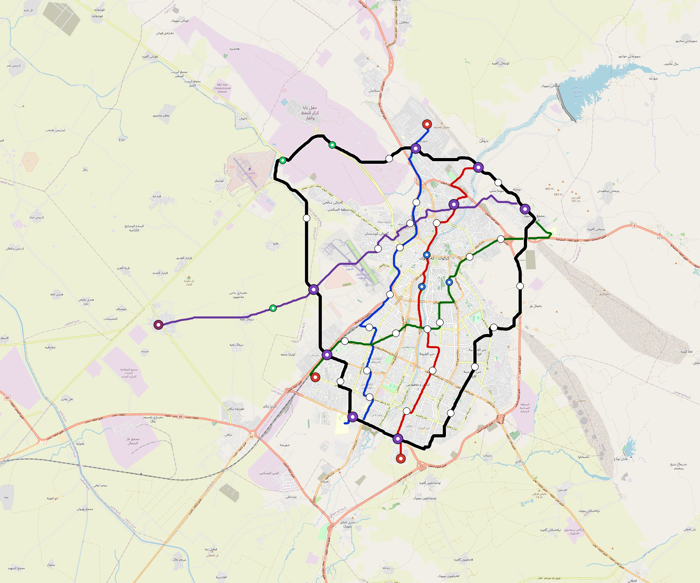

# Kirkuk — Urban Rail Network

**Country:** IQ · **Population:** 1,780,000 · [National brief](../NATIONAL-BRIEF.md)

This page contains only Kirkuk-specific results. Shared routing, service, energy, civil, cost, finance, QA and validation methods are defined once in the [deployment planning reference](../../../../../docs/deployment-planning-reference.md).

> [!IMPORTANT]
> **Foreign-capital advantage:** against the default equivalent foreign-turnkey sensitivity, this local plan avoids **$1.83 bn (87.0%) of external capital** and **$2.25 bn of external interest**. Capital plus saved interest totals **$4.07 bn**. See the common reference for interpretation and limitations.

Auto-planned by the OpenSourceRail design pipeline from the controlled city catalogue, source-locked geospatial inputs and shared templates.

## Network



| Local measure | Value |
|---|---:|
| Lines / unique stations / interchanges | 5 / 52 / 8 |
| Route length | 143.9 km double track |
| Coverage / transfer reachability | 61.2% / 60% |
| Estimated station catchment | 1,089,360 residents |
| Service span / peak headway | 05:30–02:00 / 3 min |
| Fleet | 179 × 4-car `metro-4car` trainsets (160 peak revenue) |
| Peak network throughput | 96,000 passengers/hour |
| Practical service capacity | 803,520 passenger-trips/day |
| Annual paid-trip planning range | 146.6–234.6 M |

### Lines

| Line | Length | Stations | Trainsets | Termini |
|---|---:|---:|---:|---|
| line-1 | 23.2 km | 9 | 40 | S Mid ↔ N Mid |
| line-2 | 21.5 km | 10 | 40 | S Outer ↔ NE Mid |
| line-3 | 20.4 km | 9 | 38 | SW Mid ↔ NE Mid |
| line-4 | 23.7 km | 7 | 38 | NE Mid ↔ W Outer |
| line-5 | 55.1 km | 17 | 23 | NW Outer ↔ NW Mid |
| **Total** | **143.9 km** | **52 unique** | **179** | |

## Energy

| Local measure | Value |
|---|---:|
| Scheduled service | 2,092 one-way journeys / 54,113 train-km/day |
| Annual traction demand | 341.3 GWh |
| Station/depot PV / storage | 19.4 MW / 112.0 MWh |
| Aggregate charging power | 73.5 MW |
| Dedicated solar plant | 156.9 MW |
| Residual grid/PPA import | 0.0 GWh/yr |
| Worst powered-stop gap | line-5: 11.5 km / 124 kWh |
| Lowest traversal charging margin | line-4: 136 kWh |

## Capital And Funding

| Local CAPEX bucket | Planning value |
|---|---:|
| Civil works | $475 M |
| Stations | $266 M |
| Depots | $8.0 M |
| Rolling stock | $200 M |
| Dedicated solar plant | $126 M |
| Residual train control | $7.2 M |
| Charging microgrids | $16 M |
| EPC / project services | $68 M |
| **Total city programme** | **$1.17 bn** |

| Local funding measure | Planning value |
|---|---:|
| Imported / external capital | $273 M (23.4%) |
| Domestic / local capital | $894 M (76.6%) |
| Annual public construction commitment | $109 M / yr for 5 years |
| Annual post-grace debt service | $80 M / yr |
| External capital saved vs default turnkey sensitivity | $1.83 bn |
| Capital + lifetime external interest saved | $4.07 bn |
| Annual OPEX | $30 M / yr |

## Local Evidence

| Package | Current status | Evidence |
|---|---|---|
| Finance | pass | [`summary.json`](engineering/finance/summary.json) |
| Native simulation + degraded cases | pass | [`validation-summary.json`](engineering/simulation/validation-summary.json) |
| SUMO timetable | pass | [`summary.json`](engineering/sumo/summary.json) |
| GIS package | pass | [`summary.json`](engineering/gis/summary.json) |
| Grid/charging/solar | pass | [`summary.json`](engineering/energy/summary.json) |
| Operations, QA and maintenance | 471 assets / 2,042 tasks | [`kirkuk-operations-manifest.json`](operations/kirkuk-operations-manifest.json) |

## Local Files And Regeneration

| File | Local role |
|---|---|
| [`design.toml`](design.toml) | Authoritative generated city design |
| [`kirkuk.toml`](kirkuk.toml) | Expanded simulator scenario |
| [`kirkuk.corridor.geojson`](kirkuk.corridor.geojson) | GIS corridor and stations |
| [`kirkuk.design-quality.yaml`](kirkuk.design-quality.yaml) | Coverage, source and civil-quality gates |

```bash
tools/automation/regenerate-city.sh kirkuk
```
