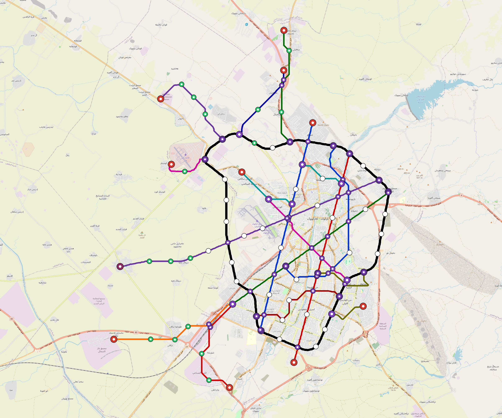

# Kirkuk — Urban Rail Network

**Country:** IQ · **Population:** 1,780,000 · [National brief](../NATIONAL-BRIEF.md)

This page contains only Kirkuk-specific results. Shared routing, service, energy, civil, cost, finance, QA and validation methods are defined once in the [deployment planning reference](../../../../../docs/deployment-planning-reference.md).

> [!IMPORTANT]
> **Foreign-capital advantage:** against the default equivalent foreign-turnkey sensitivity, this local plan avoids **$6.45 bn (88.7%) of external capital** and **$7.94 bn of external interest**. Capital plus saved interest totals **$14.39 bn**. See the common reference for interpretation and limitations.

**Population-led network revision (2026-10-09).** The controlled planning inventory contains **18 lines**, including **13 additional residential lines**. **78.0%** of retained 2020 bbox residents are within a 1 km circle of the actual emitted station coordinates. The working target is 80%; remaining areas and station/access alternatives remain in the review. These are distance screens, not current census, surveyed walksheds or fare demand. New common corridor cells have identified junction/structure and access design requirements; no track switch or site approval is inferred. Country fleet, depot, civil, energy, staffing and financing models use the regenerated inventory, with installed quotations and operating acceptance still open. [Line additions and priorities](engineering/alignment/residential-line-expansion.json) · [Actual station coverage and source receipts](engineering/alignment/residential-expansion-evaluation.json).

**Current alignment, depot and production basis.** Core corridors change from **134.111 km to 187.023 km**, with elevated land sections, water-aware radial routes and separately engineered bridge candidates at short water crossings. 0 core fragments retain raster geometry for further curve review. The centre is a design-centroid screen; survey, property, obstacles, foundations and geometry releases remain open. All **150 platform points** pass the retained water-mask screen; footprints, bank stability and access remain open. [Alignment controls](engineering/alignment/core-realignment.json) · [Before/after map](engineering/alignment/core-alignment-comparison.png) · [Water screen](engineering/alignment/station-water-screen.json).

**18 line-local depots** provide **428 full-fleet storage slots**, separate from workshop bays. Fleet length and workload set quantities; PV/storage is included once in depot capital. Site acceptance and installed/land/utility quotations remain open. [Depot costs](engineering/line-depots/README.md). The factory requires **428 metro-4car trainsets / 1712 cars**, with **18-month facility readiness**, then qualification and manufacture. Integrated openings wait for fleet readiness where production or test paths constrain them. Shared factory capital is counted once; concurrent national loading and supplier commitments remain open. [Factory and dates](engineering/factory/README.md).

Station staffing uses two posts, two normal eight-hour shifts, plus service-window, leave and training cover. Basic wages start at 1.5 times the retained country income proxy, with higher technical/management grades and employer allowances. [Staff](engineering/delivery/README.md) · [Finance](engineering/finance/summary.json). Finance retains country-specific fixed-price, steady-state assumptions; Baghdad’s indexed cashflows are separate.

Auto-planned by the OpenSourceRail design pipeline from the controlled city catalogue, source-locked geospatial inputs and shared templates. Population is counted once within the union of station circles; this is potential radial access, not a verified walkshed or fare-demand estimate. Reachable line pairs include transfers through intermediate lines. [Population radii, denominator and transfer paths](engineering/access/README.md) · [Viaduct beam, foundation and terrain checks](engineering/clearance/README.md). Capital figures are base planning allowances: route-search scores are excluded from money, while special structures and installed-price gaps remain open. [Cost boundary](../../../../../docs/finance/civil-allowance-boundary.md).

## Network



| Local measure | Value |
|---|---:|
| Lines / unique stations / interchanges | 18 / 150 / 37 |
| Route length | 219.4 km double track |
| Direct transfers / reachable line pairs | 25.5% / 100.0% |
| Residents within 800 m radial station catchments | 680,250 (2020 raster; 60.0% of bbox) |
| Service span / peak headway | 05:30–02:00 / 3 min |
| Fleet | 428 × 4-car `metro-4car` trainsets (379 peak revenue) |
| Peak network throughput | 345,600 passengers/hour |
| Practical service capacity | 3,124,800 passenger-trips/day |
| Annual paid-trip planning range | 570.3–912.4 M |

### Lines

| Line | Length | Stations | Trainsets | Termini |
|---|---:|---:|---:|---|
| line-1 | 17.5 km | 13 | 43 | S Mid ↔ N Mid |
| line-2 | 17.3 km | 13 | 43 | S Mid ↔ NE Mid |
| line-3 | 16.2 km | 10 | 37 | SW Mid ↔ E Mid |
| line-4 | 22.6 km | 14 | 48 | NE Mid ↔ W Outer |
| line-5 | 52.4 km | 35 | 30 | NW Mid ↔ NW Mid |
| line-6 |  3.5 km | 3 | 11 | N Mid ↔ NE Mid |
| line-7 |  8.6 km | 7 | 24 | SE Mid ↔ NW Inner |
| line-8 |  2.9 km | 2 | 9 | SE Mid ↔ SE Mid |
| line-9 |  6.1 km | 5 | 16 | NW Mid ↔ N Outer |
| line-10 |  8.0 km | 6 | 21 | SE Mid ↔ S Mid |
| line-11 | 14.9 km | 10 | 36 | S Inner ↔ NE Mid |
| line-12 |  8.6 km | 5 | 17 | SW Mid ↔ S Outer |
| line-13 |  8.9 km | 6 | 20 | N Mid ↔ N Outer |
| line-14 |  7.3 km | 5 | 16 | NW Mid ↔ NW Outer |
| line-15 |  9.9 km | 6 | 19 | SW Mid ↔ SW Outer |
| line-16 |  4.7 km | 3 | 12 | N Inner ↔ NW Mid |
| line-17 |  4.3 km | 3 | 11 | NW Mid ↔ NW Mid |
| line-18 |  5.4 km | 4 | 15 | SE Mid ↔ SE Inner |
| **Total** | **219.4 km** | **150 unique** | **428** | |

## Energy

| Local measure | Value |
|---|---:|
| Scheduled service | 8,138 one-way journeys / 89,823 train-km/day |
| Annual traction demand | 566.5 GWh |
| Station/depot PV / storage | 124.8 MW / 894.0 MWh |
| Aggregate charging power | 201.0 MW |
| Dedicated solar plant | 154.0 MW |
| Residual grid/PPA import | 0.0 GWh/yr |
| Worst powered-stop gap | line-15: 7.5 km / 81 kWh |
| Lowest traversal charging margin | line-14: 60 kWh |

## Capital And Funding

| Local CAPEX bucket | Planning value |
|---|---:|
| Civil works | $2.02 bn |
| Stations | $825 M |
| Depots | $292 M |
| Rolling stock | $479 M |
| Dedicated solar plant | $123 M |
| Residual train control | $11 M |
| Charging microgrids | $41 M |
| EPC / project services | $256 M |
| **Total city programme** | **$4.04 bn** |

## Iraq funding

Proposed facilities and appropriations remain uncommitted. The conditional ledger calculates government capital and the extra support required for fees, interest, reserves and cash shortfalls; additional support is not a funding commitment.

| Capital source | Planning USD equivalent |
|---|---:|
| bank credit | $386 M |
| chinese export credit | $179 M |
| domestic bonds | $1.16 bn |
| government | $2.32 bn |

The procurement schedule requires **55 calendar months** of capital cash under an assumed 260-working-day year. The resource-constrained full-network rollout needs review before a construction commitment.

Peak annual government cash: **$826 M**. This includes support required under the low capacity-use case; it is not a funded appropriation.

Chinese export buyer credit is allocated within existing imported budgets for solar equipment, bogies, batteries, windows and doors. City CAPEX excludes manufacturing tooling; the Baghdad-only programme separately funds one plant for Baghdad. IQD bonds assume a proposed Ministry of Finance programme; municipal borrowing authority is pending legal review.

The model includes actual scheduled draws, native-currency principal/interest, fees, revenue ramps, operating/debt support, reserve movements and downside cases. Short bullet bonds have explicit redemptions without assumed refinancing.

See [funding model](engineering/finance/FUNDING-MODEL.md), [monthly cashflow](engineering/finance/funding-monthly-cashflow.csv), [annual cashflow](engineering/finance/funding-annual-cashflow.csv) . This standalone city appraisal is outside the Baghdad-only funding programme.

Annual operating allowance: $115 M; demand remains capacity-led.

## Local Evidence

| Package | Current status | Evidence |
|---|---|---|
| Finance | pass | [`summary.json`](engineering/finance/summary.json) |
| Native simulation + degraded cases | pass | [`validation-summary.json`](engineering/simulation/validation-summary.json) |
| SUMO timetable | pass | [`summary.json`](engineering/sumo/summary.json) |
| Independent OSR/SUMO running-time cross-check | pass; junction/authority gate open | [`operations-crosscheck.md`](engineering/simulation/operations-crosscheck.md) |
| GIS package | pass | [`summary.json`](engineering/gis/summary.json) |
| Solar/storage snapshot (operating duty unverified) | pass; 0 findings; 28 grid-only diagnostics | [`summary.json`](engineering/energy/summary.json) |
| Operations, QA and maintenance | 1,262 assets / 6,497 tasks | [`kirkuk-operations-manifest.json`](operations/kirkuk-operations-manifest.json) |

## Local Files And Regeneration

| File | Local role |
|---|---|
| [`design.toml`](design.toml) | Authoritative generated city design |
| [`kirkuk.toml`](kirkuk.toml) | Expanded simulator scenario |
| [`kirkuk.corridor.geojson`](kirkuk.corridor.geojson) | GIS corridor and stations |
| [`kirkuk.design-quality.yaml`](kirkuk.design-quality.yaml) | Coverage, source and civil-quality gates |

```bash
tools/automation/regenerate-city.sh kirkuk
```
