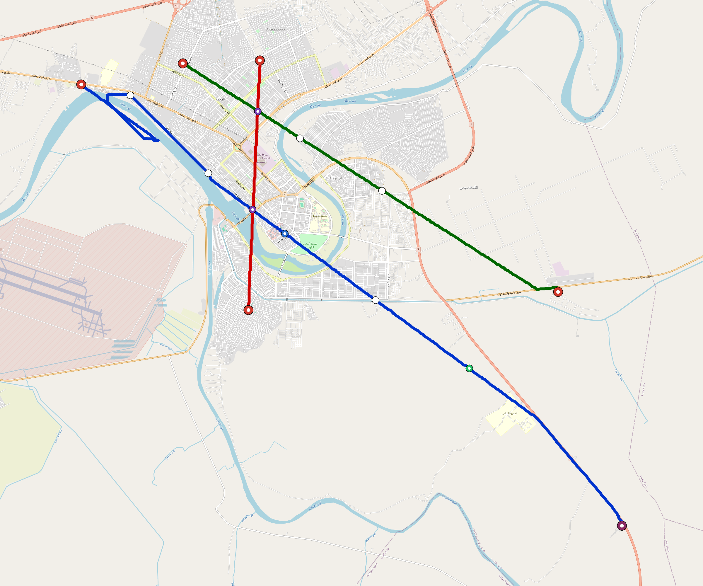

# Kut — Urban Rail Network

**Country:** IQ · **Population:** 410,000 · [National brief](../NATIONAL-BRIEF.md)

This page contains only Kut-specific results. Shared routing, service, energy, civil, cost, finance, QA and validation methods are defined once in the [deployment planning reference](../../../../../docs/deployment-planning-reference.md).

> [!IMPORTANT]
> **Foreign-capital advantage:** against the default equivalent foreign-turnkey sensitivity, this local plan avoids **$670 M (87.2%) of external capital** and **$824 M of external interest**. Capital plus saved interest totals **$1.49 bn**. See the common reference for interpretation and limitations.

Auto-planned by the OpenSourceRail design pipeline from the controlled city catalogue, source-locked geospatial inputs and shared templates.

## Network



| Local measure | Value |
|---|---:|
| Lines / unique stations / interchanges | 3 / 17 / 1 |
| Route length | 46.4 km double track |
| Coverage / transfer reachability | 60.1% / 100% |
| Estimated station catchment | 246,410 residents |
| Service span / peak headway | 05:30–02:00 / 3 min |
| Fleet | 101 × 3-car `light-metro-3car` trainsets (90 peak revenue) |
| Peak network throughput | 43,200 passengers/hour |
| Practical service capacity | 401,760 passenger-trips/day |
| Annual paid-trip planning range | 73.3–117.3 M |

### Lines

| Line | Length | Stations | Trainsets | Termini |
|---|---:|---:|---:|---|
| line-1 | 22.4 km | 7 | 48 | NW Mid ↔ SE Outer |
| line-2 |  9.4 km | 5 | 23 | N Inner ↔ SW Inner |
| line-3 | 14.6 km | 5 | 30 | E Mid ↔ NW Mid |
| **Total** | **46.4 km** | **17 unique** | **101** | |

## Energy

| Local measure | Value |
|---|---:|
| Scheduled service | 1,395 one-way journeys / 21,583 train-km/day |
| Annual traction demand | 102.1 GWh |
| Station/depot PV / storage | 9.5 MW / 47.5 MWh |
| Aggregate charging power | 8.0 MW |
| Dedicated solar plant | 42.7 MW |
| Residual grid/PPA import | 0.0 GWh/yr |
| Worst powered-stop gap | line-1: 11.9 km / 96 kWh |
| Lowest traversal charging margin | line-3: 33 kWh |

## Capital And Funding

| Local CAPEX bucket | Planning value |
|---|---:|
| Civil works | $194 M |
| Stations | $70 M |
| Depots | $8.0 M |
| Rolling stock | $91 M |
| Dedicated solar plant | $34 M |
| Residual train control | $2.3 M |
| Charging microgrids | $1.8 M |
| EPC / project services | $26 M |
| **Total city programme** | **$427 M** |

## Iraq funding

Proposed facilities and appropriations remain uncommitted. The conditional ledger calculates government capital and the extra support required for fees, interest, reserves and cash shortfalls; additional support is not a funding commitment.

| Capital source | Planning USD equivalent |
|---|---:|
| bank credit | $39 M |
| chinese export credit | $36 M |
| domestic bonds | $117 M |
| government | $234 M |

The procurement schedule requires **50 calendar months** of capital cash under an assumed 260-working-day year. The resource-constrained full-network rollout needs review before a construction commitment.

Peak annual government cash: **$212 M**. This includes support required under the low capacity-use case; it is not a funded appropriation.

Chinese export buyer credit is allocated within existing imported budgets for solar equipment, bogies, batteries, windows and doors. City CAPEX excludes manufacturing tooling; the Baghdad-only programme separately funds one plant for Baghdad. IQD bonds assume a proposed Ministry of Finance programme; municipal borrowing authority is pending legal review.

The model includes actual scheduled draws, native-currency principal/interest, fees, revenue ramps, operating/debt support, reserve movements and downside cases. Short bullet bonds have explicit redemptions without assumed refinancing.

See [funding model](engineering/finance/FUNDING-MODEL.md), [monthly cashflow](engineering/finance/funding-monthly-cashflow.csv), [annual cashflow](engineering/finance/funding-annual-cashflow.csv) . This standalone city appraisal is outside the Baghdad-only funding programme.

Annual operating allowance: $12 M; demand remains capacity-led.

## Local Evidence

**Evidence refresh required.** Retained passing results below are unverified.
The strict README generator rejected the evidence: engineering/simulation/validation-summary.json describes scenario SHA-256 203360396c313a63c02abef055077da469a777e767229567cf68b6b4a3a8ef2e, but kut.toml is d6ac4717f60a2702a932310fe60712de136ce0092d5b1772268b798c935f0268; rerun and update the validation evidence. This audit view does not accept or replace the retained solver results.

| Package | Current status | Evidence |
|---|---|---|
| Finance | unverified | [`summary.json`](engineering/finance/summary.json) |
| Native simulation + degraded cases | unverified | [`validation-summary.json`](engineering/simulation/validation-summary.json) |
| SUMO timetable | unverified | [`summary.json`](engineering/sumo/summary.json) |
| Independent OSR/SUMO running-time cross-check | unverified; junction/authority gate open | [`operations-crosscheck.md`](engineering/simulation/operations-crosscheck.md) |
| GIS package | unverified | [`summary.json`](engineering/gis/summary.json) |
| Solar/storage snapshot (operating duty unverified) | unverified; 0 findings; 7 grid-only diagnostics | [`summary.json`](engineering/energy/summary.json) |
| Operations, QA and maintenance | 204 assets / 1,216 tasks | [`kut-operations-manifest.json`](operations/kut-operations-manifest.json) |

## Local Files And Regeneration

| File | Local role |
|---|---|
| [`design.toml`](design.toml) | Authoritative generated city design |
| [`kut.toml`](kut.toml) | Expanded simulator scenario |
| [`kut.corridor.geojson`](kut.corridor.geojson) | GIS corridor and stations |
| [`kut.design-quality.yaml`](kut.design-quality.yaml) | Coverage, source and civil-quality gates |

```bash
tools/automation/regenerate-city.sh kut
```
