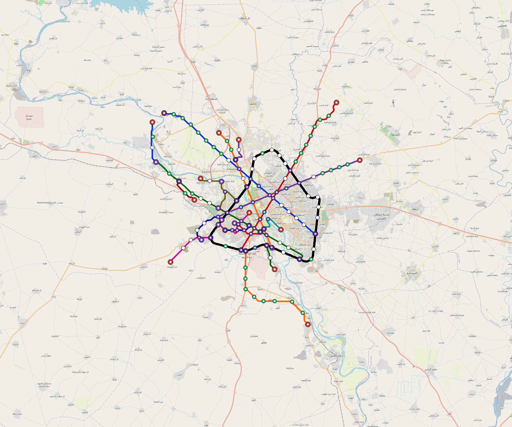

# Mosul — Urban Rail Network

**Country:** IQ · **Population:** 1,940,000 · [National brief](../NATIONAL-BRIEF.md)

This page contains only Mosul-specific results. Shared routing, service, energy, civil, cost, finance, QA and validation methods are defined once in the [deployment planning reference](../../../../../docs/deployment-planning-reference.md).

> [!IMPORTANT]
> **Foreign-capital advantage:** against the default equivalent foreign-turnkey sensitivity, this local plan avoids **$3.04 bn (87.6%) of external capital** and **$3.73 bn of external interest**. Capital plus saved interest totals **$6.77 bn**. See the common reference for interpretation and limitations.

Auto-planned by the OpenSourceRail design pipeline from the controlled city catalogue, source-locked geospatial inputs and shared templates.

## Network



| Local measure | Value |
|---|---:|
| Lines / unique stations / interchanges | 6 / 69 / 12 |
| Route length | 207.3 km double track |
| Coverage / transfer reachability | 61.7% / 80% |
| Estimated station catchment | 1,196,980 residents |
| Service span / peak headway | 05:30–02:00 / 3 min |
| Fleet | 256 × 4-car `metro-4car` trainsets (229 peak revenue) |
| Peak network throughput | 115,200 passengers/hour |
| Practical service capacity | 982,080 passenger-trips/day |
| Annual paid-trip planning range | 179.2–286.8 M |

### Lines

| Line | Length | Stations | Trainsets | Termini |
|---|---:|---:|---:|---|
| line-1 | 34.5 km | 11 | 56 | SE Mid ↔ NW Outer |
| line-2 | 31.1 km | 11 | 51 | S Mid ↔ NE Outer |
| line-3 | 29.4 km | 10 | 45 | SE Mid ↔ W Outer |
| line-4 | 25.4 km | 10 | 40 | E Outer ↔ SW Mid |
| line-5 | 23.9 km | 10 | 40 | S Mid ↔ NW Mid |
| line-6 | 63.0 km | 17 | 24 | N Inner ↔ NW Inner |
| **Total** | **207.3 km** | **69 unique** | **256** | |

## Energy

| Local measure | Value |
|---|---:|
| Scheduled service | 2,558 one-way journeys / 81,756 train-km/day |
| Annual traction demand | 515.7 GWh |
| Station/depot PV / storage | 22.4 MW / 127.0 MWh |
| Aggregate charging power | 88.5 MW |
| Dedicated solar plant | 245.0 MW |
| Residual grid/PPA import | 0.0 GWh/yr |
| Worst powered-stop gap | line-1: 16.0 km / 172 kWh |
| Lowest traversal charging margin | line-4: 140 kWh |

## Capital And Funding

| Local CAPEX bucket | Planning value |
|---|---:|
| Civil works | $949 M |
| Stations | $344 M |
| Depots | $8.0 M |
| Rolling stock | $287 M |
| Dedicated solar plant | $196 M |
| Residual train control | $10 M |
| Charging microgrids | $19 M |
| EPC / project services | $113 M |
| **Total city programme** | **$1.93 bn** |

## Iraq funding

Proposed facilities and appropriations remain uncommitted. Government funds eligible-invoice downpayments, its capital share, fees, interest, restricted reserves and cash shortfalls.

| Capital source | Planning USD equivalent |
|---|---:|
| bank credit | $177 M |
| chinese export credit | $152 M |
| domestic bonds | $532 M |
| government | $1.06 bn |

The procurement schedule requires **116 calendar months** of capital cash under an assumed 260-working-day year. The resource-constrained full-network rollout needs review before a construction commitment.

Peak annual government cash: **$465 M**. This includes support required under the low capacity-use case; it is not a funded appropriation.

Chinese export buyer credit is allocated within existing imported budgets for solar equipment, bogies, batteries, windows and doors. Shared national manufacturing tooling is funded once at programme level. IQD bonds assume a proposed Ministry of Finance programme; municipal borrowing authority is pending legal review.

The model includes actual scheduled draws, native-currency principal/interest, fees, revenue ramps, operating/debt support, reserve movements and downside cases. Short bullet bonds have explicit redemptions without assumed refinancing.

See [funding model](engineering/finance/FUNDING-MODEL.md), [monthly cashflow](engineering/finance/funding-monthly-cashflow.csv), [annual cashflow](engineering/finance/funding-annual-cashflow.csv) and [three-city funding programme](../IRAQ-FUNDING-PROGRAMME.md).

Annual operating allowance: $47 M; demand remains capacity-led.

## Local Evidence

| Package | Current status | Evidence |
|---|---|---|
| Finance | pass | [`summary.json`](engineering/finance/summary.json) |
| Native simulation + degraded cases | pass | [`validation-summary.json`](engineering/simulation/validation-summary.json) |
| SUMO timetable | pass | [`summary.json`](engineering/sumo/summary.json) |
| Independent OSR/SUMO running-time cross-check | pass; junction/authority gate open | [`operations-crosscheck.md`](engineering/simulation/operations-crosscheck.md) |
| GIS package | pass | [`summary.json`](engineering/gis/summary.json) |
| Solar/storage snapshot (operating duty unverified) | pass; 0 findings; 26 grid-only diagnostics | [`summary.json`](engineering/energy/summary.json) |
| Operations, QA and maintenance | 638 assets / 3,534 tasks | [`mosul-operations-manifest.json`](operations/mosul-operations-manifest.json) |

## Local Files And Regeneration

| File | Local role |
|---|---|
| [`design.toml`](design.toml) | Authoritative generated city design |
| [`mosul.toml`](mosul.toml) | Expanded simulator scenario |
| [`mosul.corridor.geojson`](mosul.corridor.geojson) | GIS corridor and stations |
| [`mosul.design-quality.yaml`](mosul.design-quality.yaml) | Coverage, source and civil-quality gates |

```bash
tools/automation/regenerate-city.sh mosul
```
